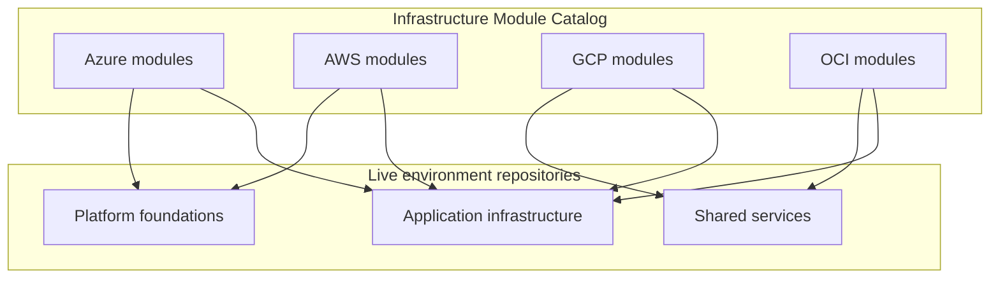
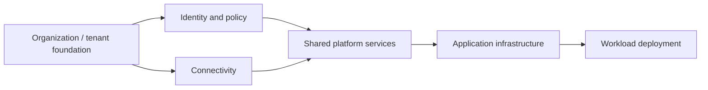
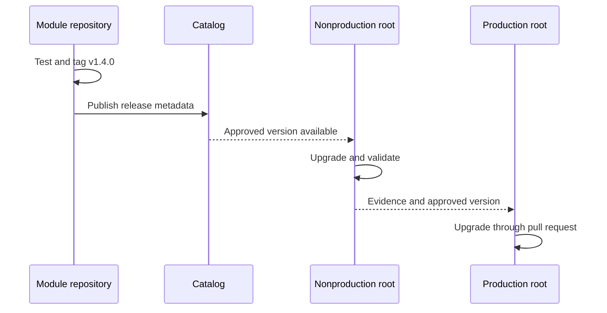

# Terraform Repository and Module Structure

## Purpose

This standard defines how Terraform repositories are organized so that teams can locate code, understand state boundaries, review changes, apply consistent controls, and promote infrastructure safely across Azure, AWS, GCP, and OCI.

Repository structure is an operational control. Poor structure produces oversized state, unclear ownership, accidental cross-environment change, duplicated modules, and weak review boundaries.

## Repository classes

The enterprise uses four repository classes.

| Class | Contains | Publishes a reusable artifact | Owns deployed state |
|---|---|---:|---:|
| Module repository | One reusable child module | Yes | No |
| Live environment repository | Root modules for deployed environments | No | Yes |
| Blueprint repository | Opinionated composition examples or scaffolding | Sometimes | Usually no |
| Policy/tooling repository | Linters, policies, pipelines, generators | Tool or policy package | No |

A repository MUST declare its class in its README and catalog metadata.

## Selection: monorepo or multirepo

Neither model is universally correct.

### Multirepo is preferred when

- Modules have independent owners and release cycles.
- Access restrictions differ.
- Teams need registry-compatible release tags.
- A root configuration has an independent state and deployment pipeline.
- Changes should not trigger validation across unrelated systems.

### Monorepo is acceptable when

- A platform team owns a tightly integrated family of modules.
- Atomic changes across modules are common and tested together.
- Tooling can detect affected paths and maintain independent versions.
- Access and retention requirements are identical.

A monorepo MUST NOT imply one shared state. State boundaries remain explicit at root-module directories.

## Recommended enterprise topology



Reusable code is released from module repositories. Live repositories consume immutable module versions and own state.

## Module repository structure

```text
terraform-azurerm-private-storage/
├── README.md
├── CHANGELOG.md
├── LICENSE
├── CODEOWNERS
├── versions.tf
├── main.tf
├── variables.tf
├── locals.tf
├── outputs.tf
├── checks.tf
├── tests/
│   ├── unit.tftest.hcl
│   └── integration.tftest.hcl
├── examples/
│   ├── basic/
│   │   ├── main.tf
│   │   ├── versions.tf
│   │   └── variables.tf
│   └── complete/
├── docs/
│   ├── architecture.md
│   └── migration.md
├── scripts/
└── .github/ or .azuredevops/
```

### Standard Terraform files

| File | Intended content |
|---|---|
| `versions.tf` | Terraform and provider requirements |
| `providers.tf` | Root-module provider configuration only; usually absent in child modules |
| `backend.tf` | Root-module backend declaration only |
| `main.tf` | Primary resources and module calls |
| `variables.tf` | Public input variables |
| `locals.tf` | Shared local values |
| `outputs.tf` | Public outputs |
| `data.tf` | Data sources when a separate file improves clarity |
| `checks.tf` | Cross-resource checks and assertions |
| `moved.tf` | Temporary or durable moved blocks for address migration |
| `import.tf` | Import blocks for controlled adoption or migration |

Terraform merges `.tf` files in a directory. File naming is for humans, review tooling, and maintainability. Teams SHOULD avoid arbitrary file proliferation.

## Live environment repository structure

The recommended live repository separates cloud, organization scope, region, environment, and deployable component.

```text
cloud-live/
├── README.md
├── CODEOWNERS
├── pipelines/
├── policies/
├── azure/
│   └── corp-platform/
│       ├── canada-central/
│       │   ├── prod/
│       │   │   ├── connectivity/
│       │   │   ├── identity/
│       │   │   └── shared-services/
│       │   └── nonprod/
│       └── east-us/
├── aws/
│   └── organization-a/
│       ├── ca-central-1/
│       │   ├── prod/
│       │   └── nonprod/
├── gcp/
│   └── organization-a/
│       ├── northamerica-northeast1/
│       │   ├── prod/
│       │   └── nonprod/
└── oci/
    └── tenancy-a/
        ├── ca-montreal-1/
        │   ├── prod/
        │   └── nonprod/
```

Each leaf deployable directory is a root module with its own backend key or workspace and its own plan/apply unit.

## Root-module baseline

```text
connectivity/
├── README.md
├── backend.tf
├── versions.tf
├── providers.tf
├── main.tf
├── variables.tf
├── locals.tf
├── outputs.tf
├── checks.tf
├── environment.tfvars.example
├── tests/
└── .terraform.lock.hcl
```

Rules:

- Root modules MUST declare a backend but MUST NOT hardcode backend credentials.
- `.terraform.lock.hcl` MUST be committed in root modules.
- Real secret values MUST NOT be committed in `.tfvars` files.
- Environment-specific non-secret values MAY be stored in version control when ownership and review are clear.
- A root directory MUST map to one state boundary.
- Nested root modules MUST not depend on being executed from a parent directory.

## Environment organization patterns

### Directory-per-environment

Preferred for production when environments require strong isolation, independent approvals, or materially different topology.

```text
service/
├── dev/
├── test/
└── prod/
```

Advantages: explicit state and code boundaries, clear access control, simple audit trail. Cost: repeated composition code unless common behavior is moved into modules.

### Shared root plus variable files

Acceptable when environments are structurally identical and deployment tooling reliably binds each variable set to a separate backend key.

```text
service/
├── main.tf
├── env/
│   ├── dev.tfvars
│   ├── test.tfvars
│   └── prod.tfvars
└── backend/
    ├── dev.hcl
    ├── test.hcl
    └── prod.hcl
```

The pipeline MUST prove that `prod.tfvars` cannot be combined with a nonproduction state key or identity.

### CLI workspaces

CLI workspaces MAY be used for homogeneous ephemeral environments or repeated instances. They SHOULD NOT be the default isolation mechanism for production environments requiring different credentials, approval rules, or blast radii.

## Cloud scope hierarchy

Repository paths SHOULD expose the cloud control-plane boundary that determines identity and policy.

| Cloud | Recommended hierarchy elements |
|---|---|
| Azure | tenant or platform, management group, subscription, region, environment, component |
| AWS | organization, organizational unit or account, region, environment, component |
| GCP | organization, folder, project, region, environment, component |
| OCI | tenancy, compartment, region, environment, component |

Do not encode every hierarchy level when it adds no decision value. The path MUST remain unambiguous to operators.

## Dependency direction



Dependencies SHOULD flow from stable foundation layers toward higher-level workloads. Circular dependencies between states are prohibited.

When one root module consumes another layer's outputs, teams SHOULD prefer a published service-discovery mechanism, parameter store, DNS, resource tags, or controlled catalog API over direct full-state access. `terraform_remote_state` requires access to the complete state snapshot and MUST be used only after security review.

## Ownership and review boundaries

- Every repository MUST contain `CODEOWNERS` or equivalent ownership rules.
- Path ownership MUST align with cloud and platform responsibility.
- Changes to identity, organization hierarchy, network transit, security controls, or state backends SHOULD require domain-owner approval.
- Shared pipeline templates MUST be centrally maintained; repository-local extensions MUST not bypass mandatory gates.
- Archived or deprecated repositories MUST be marked read-only and removed from scheduled apply workflows.

## Naming conventions

### Repository names

- Reusable modules: `terraform-<provider>-<capability>`.
- Live repositories: `<domain>-infra-live` or `<platform>-terraform-live`.
- Policy repositories: `terraform-policy-<engine>` or `iac-governance`.
- Blueprint repositories: `terraform-blueprint-<capability>`.

Use lowercase kebab-case. Avoid internal acronyms that are not broadly understood.

### Terraform identifiers

Use lowercase snake_case for resources, variables, locals, outputs, and module labels. Use `this` only when the module manages one primary instance and a more descriptive local name would add no value.

## Generated and ignored content

The following MUST NOT be committed:

```text
.terraform/
*.tfstate
*.tfstate.*
crash.log
crash.*.log
*.tfplan
override.tf
override.tf.json
*_override.tf
*_override.tf.json
```

The dependency lock file SHOULD be committed for root modules. For reusable child modules, the repository MAY omit the lock file because the consuming root configuration selects provider versions; however, test harness root modules SHOULD commit their own lock files when reproducibility is required.

## Promotion model

Infrastructure code is promoted through immutable versions, not by copying edited files between environment branches.



Long-lived environment branches are discouraged because they conceal drift and complicate promotion. Prefer one mainline plus explicit environment directories or configuration.

## Repository manifest and execution mapping

Each live repository SHOULD include a machine-readable manifest that maps deployable directories to their execution controls. The manifest is not a substitute for Terraform configuration; it is an inventory used by pipelines, catalogs, access reviews, and drift services.

```yaml
roots:
  - path: azure/corp-platform/canada-central/prod/connectivity
    state_id: azure-corp-prod-connectivity
    owner: network-platform
    risk_tier: critical
    apply_identity: tf-connectivity-prod
    approval_group: network-architecture
    schedule: weekly-drift
```

The manifest SHOULD identify, at minimum, the root path, state identifier, owner, environment, cloud scope, risk tier, apply identity, approval policy, and scheduled validation policy. Pipelines MUST validate that every deployable root is represented exactly once and that no manifest entry points to a missing or non-root directory.

For module repositories, equivalent metadata SHOULD identify the registry source, release channel, supported Terraform and provider versions, and integration-test scopes. This allows repository discovery without inferring lifecycle data from directory names.

## Path-aware CI and change impact

Large repositories require deterministic path filtering. A change-impact stage SHOULD classify modified paths before expensive validation begins.

| Changed path | Minimum response |
|---|---|
| Shared pipeline or policy files | Revalidate every affected root or module |
| Root-module directory | Validate and plan that root |
| Shared local module | Validate every root that consumes it |
| Documentation only | Run documentation and link checks; skip cloud apply tests unless generated contracts changed |
| Ownership or manifest file | Revalidate ownership, catalog, and execution mappings |

Path filtering MUST fail safe. When the dependency graph cannot be resolved confidently, the pipeline SHOULD run the broader test set rather than assume a change is isolated. Generated dependency maps MUST be refreshed whenever module sources or local module references change.

Repository-local tooling MAY calculate affected roots, but mandatory policy, identity, and approval controls MUST remain centrally enforced. A path filter MUST NOT allow a production root to bypass a required plan merely because a shared-file dependency was omitted from the filter logic.

## Architecture decisions and generated documentation

Repositories SHOULD retain concise architecture decision records for choices that materially affect state boundaries, provider aliases, environment topology, backend design, or module ownership.

```text
docs/
├── adr/
│   ├── 0001-state-boundaries.md
│   ├── 0002-provider-alias-model.md
│   └── 0003-environment-promotion.md
├── dependency-map.md
└── operations.md
```

Generated input/output documentation, dependency diagrams, and root inventories SHOULD be produced by automation and checked for drift. Generated content MUST be clearly marked and MUST NOT overwrite hand-written operational guidance. Reviewers should be able to distinguish authoritative configuration, generated reference material, and explanatory documentation.

## Anti-patterns

- One repository and one state for the entire enterprise.
- Reusable modules stored inside application environment directories without versioning.
- Backend configuration inside child modules.
- Different environments distinguished only by manually selected credentials.
- Copying a production directory to create a new environment and allowing permanent divergence.
- Circular remote-state dependencies.
- Generated provider files that differ unpredictably between pipeline runs.
- Environment branches with uncontrolled cherry-picking.
- Root modules that download modules from mutable Git branches.

## Validation

A repository conforms when:

- Its repository class and owner are declared.
- Root and child modules are clearly separated.
- Each root directory maps to one remote state boundary.
- Cloud and environment scope are unambiguous.
- Required files, tests, examples, and documentation are present.
- Secrets and local state are excluded.
- Dependencies are acyclic and explicitly documented.
- Promotion uses released versions and reviewed pull requests.

## Related topics

- [Engineering Reusable Terraform Modules](iac-engineering-reusable-terraform-modules.md)
- [Inputs, Outputs, Dependencies, and Composition](iac-inputs-outputs-dependencies-and-composition.md)
- [Module Versioning and Release Management](iac-module-versioning-and-release-management.md)

## References

- HashiCorp files and configuration structure: https://developer.hashicorp.com/terraform/language/files
- HashiCorp style guide: https://developer.hashicorp.com/terraform/language/style
- GCP general style and structure: https://cloud.google.com/docs/terraform/best-practices/general-style-structure
- AWS codebase structure guidance: https://docs.aws.amazon.com/prescriptive-guidance/latest/terraform-aws-provider-best-practices/structure.html
