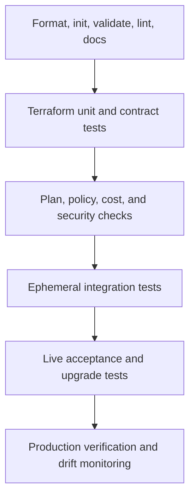
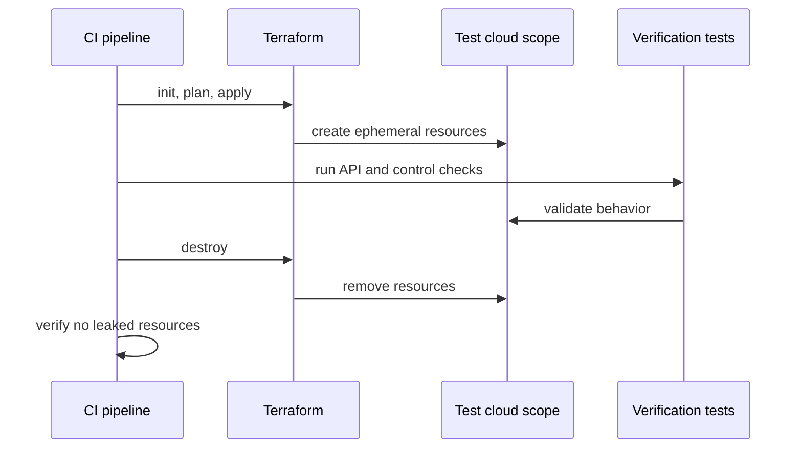

# Terraform 测试和验证

## 目的

该标准定义了 Terraform 模块和根配置的最低测试和验证控制。测试必须在生产部署之前识别语法错误、无效契约、策略违规、不安全计划、提供程序回归和运行时故障。

单一测试层是不够的。 `terraform validate`既不能证明云的正确性，也不能证明策略的合规性。成功的应用既不能证明升级安全性，也不能证明运营就绪。

## 测试金字塔

较低层运行频繁且成本低廉。较高层有选择性地运行，因为它们需要真正的云资源、特权身份、时间和成本。

## 所需的测试阶段

|舞台|模块 PR |根 PR |发布 |预定 |
|---|---:|---:|---:|---:|
|格式检查|必填 |必填 |必填 |可选|
|无后端初始化 |必填 |必填 |必填 |可选|
|验证 |必填 |必填 |必填 |可选|
|棉绒 |必填 |必填 |必填 |可选|
|文件检查|必填 |必填 |必填 |可选|
|使用模拟进行 Terraform 测试 |应用时需要 |推荐|必填 |可选|
|安全扫描 |必填 |必填 |必填 |必填 |
|策略评估|必填 |必填 |必填 |必填 |
|投机计划|示例或夹具 |必填 |必填 |漂移所需|
|实时集成测试|必填 |由于风险需要 |必填 |预定回归|
|升级测试|有状态模块 |由于风险需要 |需要进行重大/次要变更 |预定 |
|应用后验证 |集成环境|必填 |必填 |必填 |

## 静态验证

最少命令：
```bash
terraform fmt -check -recursive
terraform init -backend=false
terraform validate
terraform test
```
额外需要的检查：

- 批准的 Terraform linter。
- 维护特定于提供程序的 lint 规则。
- IaC 安全扫描仪。
- 机密扫描仪。
- 自述文件和生成的输入/输出文档的一致性。
- 仓库元数据和许可证检查。
- 禁止的模式检查，包括本地状态、配置工具滥用、无限制版本和凭据。

`terraform init -backend=false` MUST 在隔离的工作区中运行，并且仅使用经过批准的提供程序或模块注册表和镜像。

## Terraform 测试框架

Terraform 测试属于 `.tftest.hcl` 文件，通常位于 `tests/` 下。
```hcl
mock_provider "azurerm" {}

run "defaults_disable_public_access" {
  command = plan

  variables {
    name = "example"
  }

  assert {
    condition     = azurerm_storage_account.this.public_network_access_enabled == false
    error_message = "Public network access must be disabled by default."
  }
}
```
模拟提供程序应用于：

- 变量标准化。
——有条件的资源。
- 默认安全行为。
- 输出形状。
- 资源计数和地址逻辑。
- 前提条件和断言。

模拟并不能证明提供程序接受配置或者云 API 的行为符合预期。对于已发布的模块，实时集成测试仍然是强制性的。

## 契约测试

模块契约测试 SHOULD 验证：

- 必需的变量拒绝遗漏或无效值。
- 可选属性产生记录在案的默认值。
- 敏感输出仍然标记为敏感。
- 输出类型和键保持兼容。
- 提供程序别名已正确声明。
- 资源地址对于支持的升级保持稳定。
- 禁用的可选功能不会创建任何资源。
- 启用的功能可创建预期的图表。

对于跨云功能系列，契约测试 SHOULD 验证共享功能配置文件，同时保留特定于提供程序的差异。

## 计划验证

根模块的拉取请求 MUST 生成推测计划。流水线 SHOULD 解析计划 JSON 进行分类：

- 创建、更新、替换和删除。
- IAM 添加和权限升级。
- 公共端点或防火墙更改。
- 加密或密钥更改。
- 禁用日志记录。
- 地区或位置发生变化。
- 不可变属性导致的资源替换。
- 成本变化较大。
- 策略豁免。
```bash
terraform plan -out=tfplan
terraform show -json tfplan > tfplan.json
```
保存的计划和计划 JSON MUST 被视为敏感制品。

## 策略和安全测试

策略检查 MUST 在两个层面上运行：

1. **在评估提供程序之前对已知的不安全模式进行配置扫描**。
2. **针对已解决的值、资源变更和组织特定的控制进行计划评估**。

典型的强制控制：

- 除非获取批准，否则不得使用公共对象存储。
- 启用加密。
- 仅限经批准的地区。
- 所需的日志记录和诊断导出。
- 强制性标签或标签。
- 受限制的 IAM 通配符。
- 受监管服务的私有端点。
- 没有禁止的资源类型或 SKU。
- 关键数据的备份和保留。
- 未经高级批准，不得进行高风险删除。

策略测试 MUST 包括积极和消极的固定装置。没有失败的测试用例的策略没有被充分证明。

## 集成测试

集成测试在专用测试范围内创建真正的基础设施。

### 隔离

单独使用：

- Azure 订阅或资源组。
- AWS 账户或受限测试角色。
- GCP 项目。
- OCI 隔间或测试租户。

测试 MUST 使用独特的确定性前缀、有限权限、配额、预算和自动清理。

### 集成流程

直到清理得到验证后，测试才算完成。销毁失败 MUST 创建可操作的清理事件或自动重试。

### 现场断言

验证实际行为，而不仅仅是资源存在：

- 私有端点私下解析。
- 公共访问被拒绝。
- 工作负载身份只能执行所需的操作，仅此而已。
- 日志到达批准的目的地。
- 加密密钥关联有效。
- 备份策略处于活动状态。
- 网络路径允许预期流量并拒绝禁止流量。

## 提供程序和云测试矩阵

模块 MUST 声明支持的矩阵。示例：

|尺寸|最低策略|
|---|---|
|Terraform |最旧和最新受支持的次要版本 |
|提供程序|最低支持和最新兼容版本 |
|地区 |主要企业区域加上一个结构独特的区域（如果相关）|
|模式 |默认、私有、客户管理的加密、可选功能组合 |
|升级|以前支持的模块版本到候选版本 |

云系列模块 SHOULD 在 Azure、AWS、GCP 和 OCI 中使用等效场景，但测试 MUST 覆盖服务特定语义。

## 升级测试

当更改可能影响资源地址、默认值、提供程序架构或状态时，需要进行升级测试。

流程：

1. 部署之前发布的模块版本。
2. 采集操作检查。
3. 升级到候选版本。
4. 制定计划。
5. 断言预期的就地变更和明确批准的替换。
6. 应用。
7. 重新运行操作检查。
8. 使用候选版本进行销毁。

当出现未记录的替换时，发布 MUST 被阻止。

## 测试破坏性行为

破坏测试 SHOULD 在一次性环境中运行。生产销毁工作流程需要单独的控制。

测试 SHOULD 证明：

- 删除保护的行为如记录在案的那样。
- 保留的数据会根据要求保留。
- 以正确的顺序删除依赖项。
- 软删除的对象可以根据策略恢复或清除。
- 模块销毁不会删除外部管理的资源。

## 测试数据和机密

- 测试凭证 MUST 使用工作负载身份或短期令牌。
- 每次运行生成的测试机密 MUST 仅存储在批准的机密服务中。
- 生产数据 MUST NOT 复制到测试环境中。
- 计划、状态和日志 MUST 清理并实施访问控制。
- 测试资源 MUST 使用非生产 DNS 区域、证书和身份。

## 片状测试

片状测试是一种缺陷。重新运行直至成功并不是有效的测试策略。

团队 MUST 对失败原因进行分类：

- 最终一致性。
- 配额或容量。
- API 节流。
- 命名冲突。
- 区域特征方差。
- 提供程序错误。
- 清理比赛。
- 真实模块缺陷。

重试 MAY 仅用于记录在案的具有有限尝试和可观测性的瞬态操作。

## 释放门

在以下情况下，模块发布 MUST 失败：

- 静态检查失败。
- 文档已过时。
- 违反安全或策略的行为未经批准。
- 集成清理失败。
- 升级测试显示未记录的更换。
- 支持的矩阵测试失败。
- 提供程序锁定或依赖项更改无法解释。
- 高严重性漏洞影响发布制品。

## 根模块验收测试

应用后，根流水线 SHOULD 验证：

- 所需的资源和服务健康状况。
- 网络和 DNS 行为。
- 身份权限。
- 日志记录和监控。
- 策略合规性。
- 备份注册。
- 发布到预期集成机制的关键输出。

这些测试 SHOULD 是幂等的并且可以安全地重新运行。

## 测试装置和证据管理

测试夹具是受控资产。它们 SHOULD 很小、确定性、不敏感，并且通过使用它们的测试进行版本控制。夹具 MUST NOT 依赖于维护者个人云范围内未记录的资源。

发布证据包 SHOULD 保留：

- Terraform 和提供程序版本。
- 提交并发布候选标识符。
- 静态、单元、策略、集成和升级测试结果。
- 清理计划摘要和预期的更换决策。
- 实时测试使用的云范围标识符。
- 清理确认和任何泄漏资源事件参考。

证据保留 MUST 符合发布和审核策略。保留原始状态、保存的计划、凭据和详细的提供程序跟踪 SHOULD NOT 只是为证明作业已运行。存储确定测试内容、测试版本、测试范围以及测试结果所需的最少证据。

## 计划风险分类

计划审查 SHOULD 对变更风险进行一致的分类，而不是仅仅依赖于逐行的人工检查。

|风险等级 |示例 |必填回复 |
|---|---|---|
|低|标签修正、非功能性元数据、附加输出 |标准审核 |
|中等|就地服务配置、扩展、诊断更改 |域名审核及针对性验证 |
|高|替换、删除、IAM 扩展、公开曝光、加密或区域更改 |提高批准和明确的恢复计划|
|关键|状态迁移、组织策略、中转网络、身份信任、生产数据服务销毁 |变更记录、专家批准、受控窗口、回滚或前向恢复决策 |

自动分类 SHOULD 使用计划 JSON，但未知或部分解析的值 MUST 保守处理。策略引擎 MUST NOT 仅仅因为敏感属性未知而将计划标记为安全。分类结果和任何评审者推翻 SHOULD 均应与应用证据一起保留。

## 测试并发、配额和运行时控制

集成套件 MUST 负责云配额、命名约束、API 限制和最终一致性。每个账户、订阅、项目、隔间、区域和服务系列的并发 SHOULD 受到限制。

测试运行器 SHOULD 公开队列时间、应用时间、验证时间、销毁时间、重试计数和泄漏资源的指标。不断增长的销毁持续时间或重试率是提供程序回归、配额压力或脆弱的清理逻辑的早期指标。

长期运行的套件 SHOULD 按风险和触发因素划分：

- 对每个拉取请求进行快速契约和策略测试。
- 合并或发布之前的代表性现场测试。
- 候选版本或计划回归运行的完整支持矩阵和升级套件。

仅当风险得到明确管理时，降低测试频率才是可接受的；沉默地排除昂贵的场景则不然。

## 反模式

- 将 `terraform validate` 视为完整测试。
- 生产中的实时测试。
- 需要长期静态凭据的测试。
- 永远不会应用或破坏实际资源的测试套件。
- 仅对资源计数进行断言。
- 忽略清理失败。
- 将测试固定在一个旧的提供程序版本上，同时声称获取广泛支持。
- 接受更换，因为该计划在技术上是有效的。
- 没有组织策略评估的安全扫描。
- 在没有根本原因分析的情况下重试片状测试。

## 验证

- 仓库有一个记录在案的测试矩阵。
- 所需的静态、单元、策略和集成层自动运行。
- 关键控制存在负面测试。
- 集成环境是隔离的并且成本受控。
- 清理已验证。
- 升级兼容性已测试。
- 计划制品被分类和保护。
- 验证应用后行为。

## 相关主题

- [可复用 Terraform 模块工程](iac-engineering-reusable-terraform-modules.md)
- [环境配置和状态管理](iac-environment-configuration-and-state-management.md)
- [输入、输出、依赖关系和组合](iac-inputs-outputs-dependencies-and-composition.md)

## 参考文档

- Terraform 测试：https://developer.hashicorp.com/terraform/language/tests
- Terraform 提供程序模拟：https://developer.hashicorp.com/terraform/language/tests/mocking
- 编写 Terraform 测试教程：https://developer.hashicorp.com/terraform/tutorials/configuration-language/test
- Microsoft Terraform 集成测试：https://learn.microsoft.com/azure/developer/terraform/best-practices-integration-testing
- AWS Terraform 质量工具：https://docs.aws.amazon.com/prescriptive-guidance/latest/terraform-aws-provider-best-practices/resources.html
