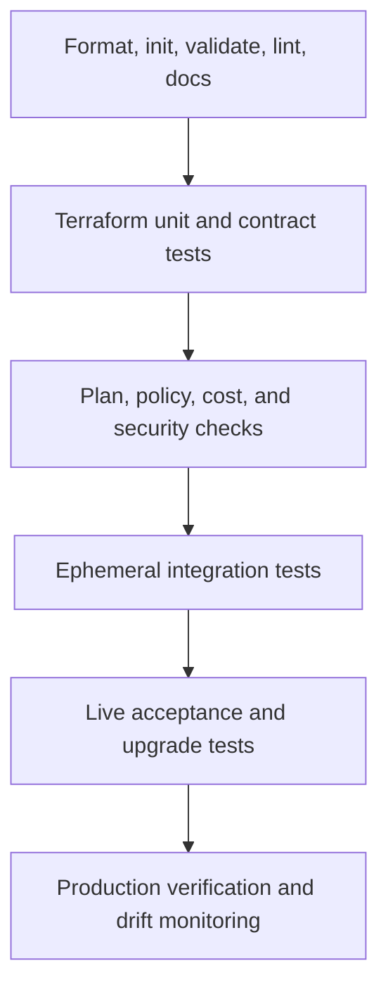
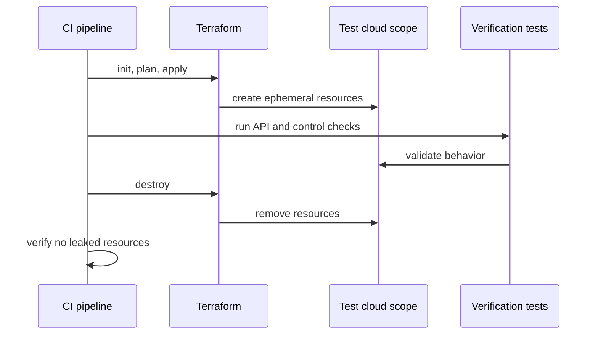

# Terraform Testing and Validation

## Purpose

This standard defines the minimum test and validation controls for Terraform modules and root configurations. Testing must identify syntax errors, invalid contracts, policy violations, unsafe plans, provider regressions, and runtime failures before production deployment.

No single test layer is sufficient. `terraform validate` proves neither cloud correctness nor policy compliance. A successful apply proves neither upgrade safety nor operational readiness.

## Test pyramid



Lower layers run frequently and cheaply. Higher layers run selectively because they require real cloud resources, privileged identities, time, and cost.

## Required test stages

| Stage | Module PR | Root PR | Release | Scheduled |
|---|---:|---:|---:|---:|
| Format check | Required | Required | Required | Optional |
| Init without backend | Required | Required | Required | Optional |
| Validate | Required | Required | Required | Optional |
| Lint | Required | Required | Required | Optional |
| Documentation check | Required | Required | Required | Optional |
| Terraform test with mocks | Required where applicable | Recommended | Required | Optional |
| Security scan | Required | Required | Required | Required |
| Policy evaluation | Required | Required | Required | Required |
| Speculative plan | Example or fixture | Required | Required | Required for drift |
| Live integration test | Required | As risk requires | Required | Scheduled regression |
| Upgrade test | Stateful modules | As risk requires | Required for major/minor change | Scheduled |
| Post-apply verification | Integration environment | Required | Required | Required |

## Static validation

Minimum commands:

```bash
terraform fmt -check -recursive
terraform init -backend=false
terraform validate
terraform test
```

Additional required checks:

- Approved Terraform linter.
- Provider-specific lint rules where maintained.
- IaC security scanner.
- Secret scanner.
- README and generated input/output documentation consistency.
- Repository metadata and license checks.
- Forbidden pattern checks, including local state, provisioner misuse, unbounded versions, and credentials.

`terraform init -backend=false` MUST run in an isolated workspace and use only approved provider or module registries and mirrors.

## Terraform test framework

Terraform tests belong in `.tftest.hcl` files, normally under `tests/`.

```hcl
mock_provider "azurerm" {}

run "defaults_disable_public_access" {
  command = plan

  variables {
    name = "example"
  }

  assert {
    condition     = azurerm_storage_account.this.public_network_access_enabled == false
    error_message = "Public network access must be disabled by default."
  }
}
```

Mock providers are appropriate for:

- Variable normalization.
- Conditional resources.
- Default security behavior.
- Output shape.
- Resource count and address logic.
- Preconditions and assertions.

Mocks do not prove that a provider accepts the configuration or that the cloud API behaves as expected. Live integration tests remain mandatory for released modules.

## Contract tests

A module contract test SHOULD verify:

- Required variables reject omission or invalid values.
- Optional attributes produce the documented default.
- Sensitive outputs remain marked sensitive.
- Output types and keys remain compatible.
- Provider aliases are declared correctly.
- Resource addresses remain stable for supported upgrades.
- Disabled optional capabilities create no resources.
- Enabled capabilities create the intended graph.

For cross-cloud capability families, contract tests SHOULD validate the shared capability profile while preserving provider-specific differences.

## Plan validation

A speculative plan MUST be generated for root-module pull requests. The pipeline SHOULD parse plan JSON to classify:

- Creates, updates, replacements, and deletes.
- IAM additions and privilege escalation.
- Public endpoint or firewall changes.
- Encryption or key changes.
- Logging disablement.
- Region or location changes.
- Resource replacement caused by immutable attributes.
- Large cost changes.
- Policy exemptions.

```bash
terraform plan -out=tfplan
terraform show -json tfplan > tfplan.json
```

Saved plans and plan JSON MUST be treated as sensitive artifacts.

## Policy and security testing

Policy checks MUST operate at two levels:

1. **Configuration scanning** for known insecure patterns before provider evaluation.
2. **Plan evaluation** for resolved values, resource changes, and organization-specific controls.

Typical mandatory controls:

- No public object storage unless approved.
- Encryption enabled.
- Approved regions only.
- Required logging and diagnostic export.
- Mandatory tags or labels.
- Restricted IAM wildcards.
- Private endpoints for regulated services.
- No prohibited resource types or SKUs.
- Backup and retention for critical data.
- No high-risk deletion without elevated approval.

Policy tests MUST include positive and negative fixtures. A policy with no failing test case is not adequately proven.

## Integration testing

Integration tests create real infrastructure in dedicated test scopes.

### Isolation

Use separate:

- Azure subscriptions or resource groups.
- AWS accounts or restricted test roles.
- GCP projects.
- OCI compartments or test tenancies.

Tests MUST use unique deterministic prefixes, bounded permissions, quotas, budgets, and automated cleanup.

### Integration flow



A test is not complete until cleanup is verified. Failed destroys MUST create an actionable cleanup incident or automated retry.

### Live assertions

Validate actual behavior, not only resource existence:

- Private endpoints resolve privately.
- Public access is denied.
- Workload identity can perform required actions and no more.
- Logs arrive at the approved destination.
- Encryption key associations are effective.
- Backup policies are active.
- Network paths allow intended traffic and reject prohibited traffic.

## Provider and cloud test matrix

Modules MUST declare the supported matrix. Example:

| Dimension | Minimum policy |
|---|---|
| Terraform | Oldest and newest supported minor version |
| Provider | Lowest supported and latest compatible version |
| Regions | Primary enterprise region plus one structurally distinct region when relevant |
| Modes | Default, private, customer-managed encryption, optional feature combinations |
| Upgrade | Previous supported module release to candidate release |

Cloud-family modules SHOULD use equivalent scenarios across Azure, AWS, GCP, and OCI, but tests MUST account for service-specific semantics.

## Upgrade testing

Upgrade tests are required when a change can affect resource addresses, defaults, provider schemas, or state.

Flow:

1. Deploy the previous released module version.
2. Capture operational checks.
3. Upgrade to the candidate version.
4. Generate a plan.
5. Assert expected in-place changes and explicitly approved replacements.
6. Apply.
7. Re-run operational checks.
8. Destroy using the candidate version.

A release MUST be blocked when an undocumented replacement appears.

## Testing destructive behavior

Destroy testing SHOULD run in disposable environments. Production destroy workflows require separate controls.

Tests SHOULD prove:

- Deletion protection behaves as documented.
- Retained data remains when requested.
- Dependencies are removed in the correct order.
- Soft-deleted objects can be recovered or purged according to policy.
- Module destroy does not remove externally owned resources.

## Test data and secrets

- Test credentials MUST use workload identity or short-lived tokens.
- Test secrets MUST be generated per run and stored only in approved secret services.
- Production data MUST NOT be copied into test environments.
- Plan, state, and logs MUST be sanitized and access controlled.
- Test resources MUST use nonproduction DNS zones, certificates, and identities.

## Flaky tests

A flaky test is a defect. Re-running until success is not a valid test strategy.

Teams MUST classify failure causes:

- Eventual consistency.
- Quota or capacity.
- API throttling.
- Naming collision.
- Region feature variance.
- Provider bug.
- Cleanup race.
- Real module defect.

Retries MAY be used only for documented transient operations with bounded attempts and observability.

## Release gates

A module release MUST fail when:

- Static checks fail.
- Documentation is stale.
- A security or policy violation is unapproved.
- Integration cleanup fails.
- Upgrade testing shows undocumented replacement.
- Supported matrix tests fail.
- Provider lock or dependency changes are unexplained.
- A high-severity vulnerability affects the release artifact.

## Root-module acceptance tests

After apply, root pipelines SHOULD validate:

- Required resources and service health.
- Network and DNS behavior.
- Identity permissions.
- Logging and monitoring.
- Policy compliance.
- Backup enrollment.
- Critical outputs published to the expected integration mechanism.

These tests SHOULD be idempotent and safe to rerun.

## Test fixtures and evidence management

Test fixtures are controlled assets. They SHOULD be small, deterministic, non-sensitive, and versioned with the test that consumes them. Fixtures MUST NOT depend on undocumented resources in a maintainer's personal cloud scope.

A release evidence bundle SHOULD retain:

- Terraform and provider versions.
- Commit and release candidate identifiers.
- Static, unit, policy, integration, and upgrade-test results.
- Sanitized plan summaries and expected replacement decisions.
- Cloud scope identifiers used by live tests.
- Cleanup confirmation and any leaked-resource incident reference.

Evidence retention MUST match the release and audit policy. Raw state, saved plans, credentials, and verbose provider traces SHOULD NOT be retained merely to prove that a job ran. Store the minimum evidence needed to establish what was tested, under which versions, in which scope, and with what result.

## Plan risk classification

Plan review SHOULD classify change risk consistently rather than rely only on line-by-line human inspection.

| Risk class | Examples | Required response |
|---|---|---|
| Low | Tag correction, nonfunctional metadata, additive output | Standard review |
| Moderate | In-place service configuration, scaling, diagnostic changes | Domain review and targeted verification |
| High | Replacement, deletion, IAM expansion, public exposure, encryption or region change | Elevated approval and explicit recovery plan |
| Critical | State migration, organization policy, transit network, identity trust, production data service destruction | Change record, specialist approval, controlled window, rollback or forward-recovery decision |

Automated classification SHOULD use plan JSON, but unknown or partially resolved values MUST be treated conservatively. A policy engine MUST not label a plan safe merely because a sensitive attribute is unknown. The classification result and any reviewer override SHOULD be retained with the apply evidence.

## Test concurrency, quotas, and runtime control

Integration suites MUST account for cloud quotas, naming constraints, API throttling, and eventual consistency. Concurrency SHOULD be capped per account, subscription, project, compartment, region, and service family.

Test runners SHOULD expose metrics for queue time, apply time, verification time, destroy time, retry count, and leaked resources. A growing destroy duration or retry rate is an early indicator of provider regressions, quota pressure, or brittle cleanup logic.

Long-running suites SHOULD be divided by risk and trigger:

- Fast contract and policy tests on every pull request.
- Representative live tests before merge or release.
- Full supported-matrix and upgrade suites on release candidates or scheduled regression runs.

Reducing test frequency is acceptable only when risk is explicitly managed; silent exclusion of expensive scenarios is not.

## Anti-patterns

- Treating `terraform validate` as complete testing.
- Live tests in production.
- Tests that require long-lived static credentials.
- A test suite that never applies or destroys real resources.
- Assertions only on resource count.
- Ignoring cleanup failure.
- Pinning tests to one old provider version while claiming broad support.
- Accepting replacements because the plan is technically valid.
- Security scanning with no organization policy evaluation.
- Retrying flaky tests without root-cause analysis.

## Validation

- The repository has a documented test matrix.
- Required static, unit, policy, and integration layers run automatically.
- Negative tests exist for critical controls.
- Integration environments are isolated and cost controlled.
- Cleanup is verified.
- Upgrade compatibility is tested.
- Plan artifacts are classified and protected.
- Post-apply behavior is verified.

## Related topics

- [Engineering Reusable Terraform Modules](iac-engineering-reusable-terraform-modules.md)
- [Environment Configuration and State Management](iac-environment-configuration-and-state-management.md)
- [Inputs, Outputs, Dependencies, and Composition](iac-inputs-outputs-dependencies-and-composition.md)

## References

- Terraform tests: https://developer.hashicorp.com/terraform/language/tests
- Terraform provider mocking: https://developer.hashicorp.com/terraform/language/tests/mocking
- Write Terraform tests tutorial: https://developer.hashicorp.com/terraform/tutorials/configuration-language/test
- Microsoft Terraform integration testing: https://learn.microsoft.com/azure/developer/terraform/best-practices-integration-testing
- AWS Terraform quality tools: https://docs.aws.amazon.com/prescriptive-guidance/latest/terraform-aws-provider-best-practices/resources.html
