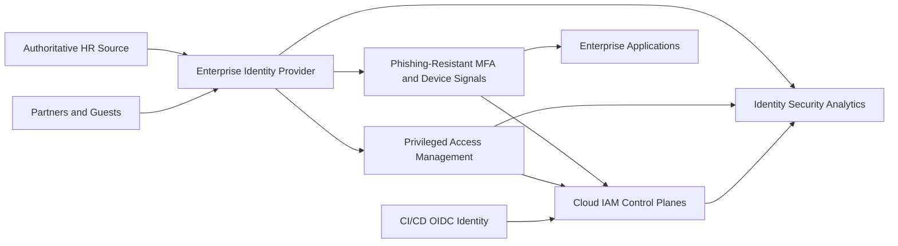
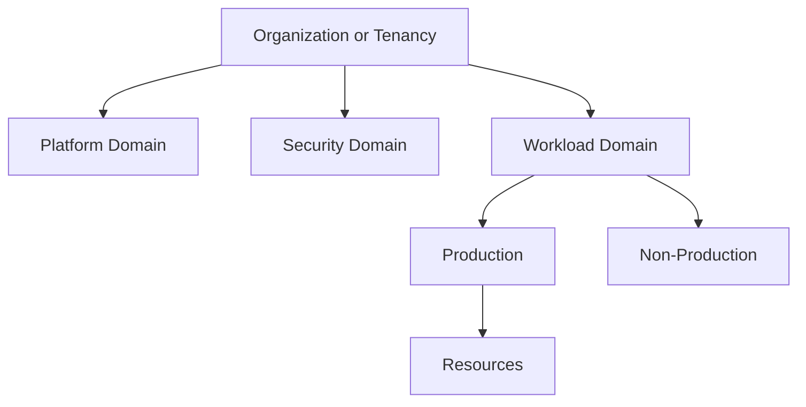
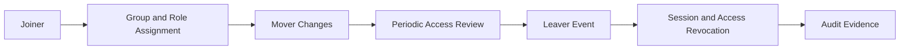

# 云身份和访问架构

## 规范语言

术语 **MUST**、**MUST NOT**、**SHOULD**、**SHOULD NOT** 和 **MAY** 是规范性的。强制性控制在无法实施时需要获取批准的例外情况。

## 常见工程要求

- 持久配置 MUST 通过批准的基础设施即代码进行部署，并通过版本控制进行审查。
- 每个资源、策略、路由、身份、端点、证书和异常 MUST 有所有者和生命周期状态。
- 生产和非生产信任边界 MUST 保持独立，除非明确的共享服务接口得到批准。
- 当满足安全性、弹性、可移植性和操作模型要求时，提供商原生功能 SHOULD 是首选。
- 日志和配置更改 MUST 发送到批准的监控和证据保留平台。
- 设计 MUST 考虑提供商配额、故障域、控制平面行为、数据处理费用和操作恢复。

## 目的

该标准定义了身份源、联合、身份验证、授权、特权访问、生命周期、外部协作、紧急访问和审计要求。身份是主要的控制平面；网络位置 MUST NOT 替代身份验证和显式授权。

## 身份域

该架构区分员工、特权管理员、外部协作者、客户、工作负载、紧急情况和自动化身份。这些身份类型 MUST NOT 在未经批准的设计下混合使用。

## 参考架构

## 提供商映射

|能力|Azure|AWS | GCP |OCI |
|---|---|---|---|---|
|身份/IAM 控制平面 | Microsoft Entra ID 和 Azure RBAC | IAM Identity Center、IAM、Organizations |Cloud Identity / Workspace 和 Cloud IAM |具有身份域的 IAM |
|人类联邦| SAML/OIDC 和租户协作 | IAM Identity Center federation |Workforce Identity Federation|Identity-domain federation |
|资源层次结构|管理组到资源|Organization/OU/account/resource |Organization/folder/project/resource |租户/隔间/资源 |
|特权访问 |Privileged Identity Management|权限集和临时会话；需要时使用 PAM 工具 |Privileged Access Manager and time-bound IAM |有时限的治理和身份域控制|
|工作负载访问 |托管身份和联合凭证 | IAM 角色和 STS |服务账户和工作负载身份联合|Instance、resource、and workload principals |

## 身份源和联合

企业身份提供商 MUST 是员工身份验证的权威。禁止云本地用户进行正常的员工访问。例外情况包括提供商根/租户身份、紧急账户、隔离恢复或记录在案的服务限制。

联合 MUST 使用受支持的标准，例如 SAML 2.0 或 OpenID Connect。密码型旧版身份验证 MUST 被禁用。

## 认证基线

- 特权访问 MUST 在支持的情况下使用防网络钓鱼 MFA。
- 身份验证策略 SHOULD 评估身份风险、设备状态、位置上下文和应用敏感性。
- 来自非托管设备的管理访问 MUST 被阻止或限制。
- 会话生命周期 MUST 反映特权和风险。
- 根或租户所有者凭据 MUST 受硬件保护且很少使用。
- 紧急访问 MUST NOT 依赖于正常的联合路径。

## 授权模型

通过工作职能，以最低的实际资源范围和权限时间限制，将 访问权 SHOULD 分配给组。直接的个人分配需要理由和审查。

广泛的父级角色会传播重大风险。权限 SHOULD 在生产、非生产、项目、账户、订阅、隔间或更低级别分配，除非平台功能需要更广泛的范围。

当内置角色过于宽泛时，MAY 使用自定义角色。它们 MUST 有所有者、版本、测试和审查周期。

## 特权访问

常设特权 MUST 被最小化。特权角色 SHOULD 使用即时激活、批准、激活时的 MFA、短期、票证/原因、访问审查、私有管理员身份、托管设备以及命令或会话日志记录。

管理员 SHOULD 具有独立的生产力和管理身份。禁止共享管理员账户。

## 访问生命周期

生命周期 MUST 与权威的员工数据集成。终止和高风险暂停事件 MUST 立即撤销会话和特权访问。系统 MUST 自动检测休眠账户和未使用的凭据。

## 外部合作

外部用户 MUST 具有内部发起人、到期或审核日期、最低角色、强身份验证以及关系结束时的删除。访客访问 MUST NOT 绕过第三方风险或数据共享控制。

## 紧急访问

每个主要身份系统 SHOULD 在提供商指南支持的情况下维护至少两个受控紧急身份。使用紧急身份 MUST 触发即时告警。证书和程序 MUST 至少每季度进行一次测试，并在使用后轮换。

## CI/CD 和自动化

CI/CD MUST 使用工作负载身份联合或短期凭证。除非正式例外，否则禁止使用长期访问密钥、服务账户密钥、客户端机密或用户凭据。

生产部署身份 SHOULD 受到仓库、受保护分支或标签、工作流程、环境审批和资源范围的约束。

## 日志记录和检测

收集登录、风险、MFA 更改、角色分配和激活、访问策略更改、联合更改、应用凭据、令牌异常、root 使用、紧急账户使用和审核结果。

针对异常权限授予、MFA 禁用、新凭据、休眠特权访问、有风险的登录和失败的紧急访问发出告警。

## 访问审核频率

|访问 |最低审查 |
|---|---|
|根/全局/组织管理员|每月 |
|常任或符合资格的特权角色 |季刊 |
|外部合作者 |每季度或赞助商到期时|
|标准生产准入|每半年一次 |
|非生产访问 |每年 |
|紧急账户 |至少每季度进行一次测试 |

## 反模式

- 云本地员工用户。
- 永久的全球管理。
- 权限直接分配给许多人。
- 在不相关的系统中重复使用一种服务标识。
- 流水线中的长期密钥。
- 没有赞助商或到期的外部用户。
- 不受监控的条件访问排除。
- 紧急账户从未测试过。

## 验证

- [ ] 员工访问是联合的。
- [ ] 特权访问使用强大的 MFA 和时间限制。
- [ ] 角色基于组且范围最低。
- [ ] 外部用户有赞助商和到期日。
- [ ] CI/CD 使用短期联合。
- [ ] 紧急访问是独立的、受监控和测试的。
- [ ] 身份事件被集中和审查。

## 治理和运营模式

云卓越中心负责该标准和参考模块。平台团队操作共享控制。安全性定义了强制性策略和监控要求。工作负载团队负责特定于应用的配置、数据流声明、测试和修复。

例外情况 MUST 包括被放弃的控制权、业务理由、补偿性控制权、风险责任人、到期日和修复计划。禁止永久例外；它们必须定期更新或关闭。

## 相关主题
- [企业云网络架构](nis-enterprise-cloud-network-architecture.md)
- [托管身份和工作负载身份联合](nis-managed-identities-and-workload-federation.md)
- [零信任和私有访问设计](nis-zero-trust-and-private-access-design.md)

## 参考文档

- [Microsoft Entra 架构](https://learn.microsoft.com/entra/architecture/)
- [Azure 身份最佳实践](https://learn.microsoft.com/azure/security/fundamentals/identity-management-best-practices)
- [AWS IAM 安全最佳实践](https://docs.aws.amazon.com/IAM/latest/UserGuide/best-practices.html)
- [GCP IAM](https://cloud.google.com/iam/docs/overview)
- [GCP 员工身份联合](https://cloud.google.com/iam/docs/workforce-identity-federation)
- [OCI IAM](https://docs.oracle.com/iaas/Content/Identity/home.htm)
