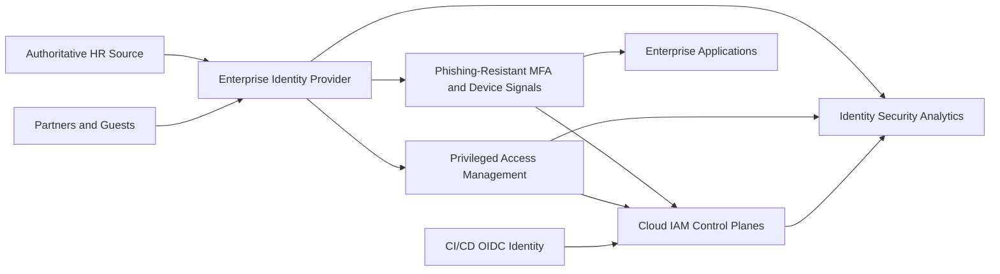
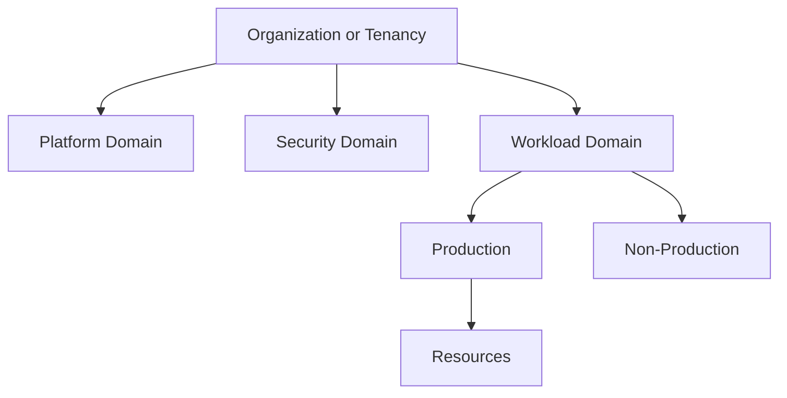
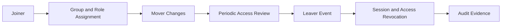

# Cloud Identity and Access Architecture

## Normative language

The terms **MUST**, **MUST NOT**, **SHOULD**, **SHOULD NOT**, and **MAY** are normative. Mandatory controls require an approved exception when they cannot be implemented.

## Common engineering requirements

- Persistent configuration MUST be deployed through approved infrastructure-as-code and reviewed through version control.
- Every resource, policy, route, identity, endpoint, certificate, and exception MUST have an owner and lifecycle state.
- Production and non-production trust boundaries MUST remain separate unless an explicit shared-service interface is approved.
- Provider-native capabilities SHOULD be preferred when they meet security, resilience, portability, and operating-model requirements.
- Logs and configuration changes MUST be sent to approved monitoring and evidence-retention platforms.
- Designs MUST account for provider quotas, failure domains, control-plane behavior, data-processing charges, and operational recovery.

## Purpose

This standard defines identity sources, federation, authentication, authorization, privileged access, lifecycle, external collaboration, emergency access, and audit requirements. Identity is the primary control plane; network location MUST NOT substitute for authenticated identity and explicit authorization.

## Identity domains

The architecture distinguishes workforce, privileged administrator, external collaborator, customer, workload, emergency, and automation identities. These identity types MUST NOT be mixed without an approved design.

## Reference architecture

## Provider mapping

| Capability | Azure | AWS | GCP | OCI |
|---|---|---|---|---|
| Identity/IAM control plane | Microsoft Entra ID and Azure RBAC | IAM Identity Center, IAM, Organizations | Cloud Identity / Workspace and Cloud IAM | IAM with identity domains |
| Human federation | SAML/OIDC and tenant collaboration | IAM Identity Center federation | Workforce Identity Federation | Identity-domain federation |
| Resource hierarchy | Management group to resource | Organization/OU/account/resource | Organization/folder/project/resource | Tenancy/compartment/resource |
| Privileged access | Privileged Identity Management | Permission sets and temporary sessions; PAM tooling where needed | Privileged Access Manager and time-bound IAM | Time-bound governance and identity-domain controls |
| Workload access | Managed identities and federated credentials | IAM roles and STS | Service accounts and Workload Identity Federation | Instance, resource, and workload principals |

## Identity source and federation

The enterprise identity provider MUST be authoritative for workforce authentication. Cloud-local users are prohibited for normal workforce access. Exceptions are provider root/tenancy identities, emergency accounts, isolated recovery, or documented service limitations.

Federation MUST use supported standards such as SAML 2.0 or OpenID Connect. Password-based legacy authentication MUST be disabled.

## Authentication baseline

- Privileged access MUST use phishing-resistant MFA where supported.
- Authentication policy SHOULD evaluate identity risk, device posture, location context, and application sensitivity.
- Administrative access from unmanaged devices MUST be blocked or constrained.
- Session lifetime MUST reflect privilege and risk.
- Root or tenancy-owner credentials MUST be hardware-protected and rarely used.
- Emergency access MUST not depend on the normal federation path.

## Authorization model

Access SHOULD be assigned to groups, through job functions, at the lowest practical resource scope, and with time bounds for privilege. Direct individual assignment requires justification and review.

Broad parent-scope roles propagate significant risk. Permissions SHOULD be assigned at production, non-production, project, account, subscription, compartment, or lower unless a platform function requires broader scope.

Custom roles MAY be used when built-in roles are materially excessive. They MUST have an owner, version, tests, and review cycle.

## Privileged access

Standing privilege MUST be minimized. Privileged roles SHOULD use just-in-time activation, approval, MFA at activation, short duration, ticket/reason, access reviews, dedicated administrator identities, managed devices, and command or session logging.

Administrators SHOULD have separate productivity and administrative identities. Shared administrator accounts are prohibited.

## Access lifecycle

Lifecycle MUST integrate with authoritative workforce data. Termination and high-risk suspension events MUST revoke sessions and privileged access promptly. Dormant accounts and unused credentials MUST be detected automatically.

## External collaboration

External users MUST have an internal sponsor, expiry or review date, minimum role, strong authentication, and removal when the relationship ends. Guest access MUST NOT bypass third-party risk or data-sharing controls.

## Emergency access

Each primary identity system SHOULD maintain at least two controlled emergency identities where provider guidance supports it. Use MUST trigger immediate alerts. Credentials and procedures MUST be tested at least quarterly and rotated after use.

## CI/CD and automation

CI/CD MUST use workload federation or short-lived credentials. Long-lived access keys, service-account keys, client secrets, or user credentials are prohibited unless formally excepted.

Production deployment identities SHOULD be constrained by repository, protected branch or tag, workflow, environment approval, and resource scope.

## Logging and detection

Collect sign-ins, risk, MFA changes, role assignments and activations, access-policy changes, federation changes, application credentials, token anomalies, root use, emergency-account use, and review outcomes.

Alert on unusual privilege grants, MFA disablement, new credentials, dormant privileged access, risky sign-ins, and failed emergency access.

## Access review frequency

| Access | Minimum review |
|---|---|
| Root/global/organization administrator | Monthly |
| Standing or eligible privileged roles | Quarterly |
| External collaborators | Quarterly or at sponsor expiry |
| Standard production access | Semi-annually |
| Non-production access | Annually |
| Emergency accounts | Test at least quarterly |

## Anti-patterns

- Cloud-local workforce users.
- Permanent global administration.
- Permissions assigned directly to many individuals.
- One service identity reused across unrelated systems.
- Long-lived keys in pipelines.
- External users without sponsors or expiry.
- Unmonitored conditional-access exclusions.
- Emergency accounts never tested.

## Validation

- [ ] Workforce access is federated.
- [ ] Privileged access uses strong MFA and time bounds.
- [ ] Roles are group-based and lowest-scope.
- [ ] External users have sponsors and expiry.
- [ ] CI/CD uses short-lived federation.
- [ ] Emergency access is independent, monitored, and tested.
- [ ] Identity events are centralized and reviewed.

## Governance and operating model

The Cloud Center of Excellence owns this standard and the reference modules. Platform teams operate shared controls. Security defines mandatory policy and monitoring requirements. Workload teams own application-specific configuration, data-flow declarations, testing, and remediation.

Exceptions MUST include the control being waived, business justification, compensating controls, risk owner, expiry date, and remediation plan. Permanent exceptions are prohibited; they must be periodically renewed or closed.

## Related topics

- [Enterprise Cloud Network Architecture](nis-enterprise-cloud-network-architecture.md)
- [Managed Identities and Workload Federation](nis-managed-identities-and-workload-federation.md)
- [Zero-Trust and Private-Access Design](nis-zero-trust-and-private-access-design.md)

## References

- [Microsoft Entra architecture](https://learn.microsoft.com/entra/architecture/)
- [Azure identity best practices](https://learn.microsoft.com/azure/security/fundamentals/identity-management-best-practices)
- [AWS IAM security best practices](https://docs.aws.amazon.com/IAM/latest/UserGuide/best-practices.html)
- [GCP IAM](https://cloud.google.com/iam/docs/overview)
- [GCP Workforce Identity Federation](https://cloud.google.com/iam/docs/workforce-identity-federation)
- [OCI IAM](https://docs.oracle.com/iaas/Content/Identity/home.htm)
