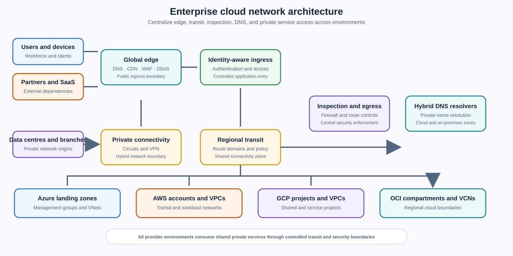
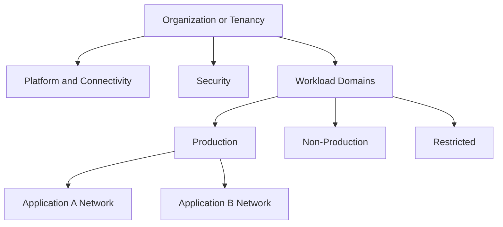

# 企业云网络架构

## 规范语言

术语 **MUST**、**MUST NOT**、**SHOULD**、**SHOULD NOT** 和 **MAY** 是规范性的。强制性控制在无法实施时需要获取批准的例外情况。

## 常见工程要求

- 持久配置 MUST 通过批准的基础设施即代码进行部署，并通过版本控制进行审查。
- 每个资源、策略、路由、身份、端点、证书和异常 MUST 有所有者和生命周期状态。
- 生产和非生产信任边界 MUST 保持独立，除非明确的共享服务接口得到批准。
- 当满足安全性、弹性、可移植性和操作模型要求时，提供商原生功能 SHOULD 是首选。
- 日志和配置更改 MUST 发送到批准的监控和证据保留平台。
- 设计 MUST 考虑提供商配额、故障域、控制平面行为、数据处理费用和操作恢复。

## 目的和范围

该标准定义了 Azure、AWS、GCP 和 Oracle Cloud Infrastructure 的企业网络架构。它涵盖 Cloud Landing Zone、网络层次结构、地址管理、混合和多云连接、传输、分段、入口、出口、私有服务、DNS、弹性和可观测性。

目标状态不是旧数据中心网络的云副本。它是一个受管理的连接结构，具有明确的信任边界、自动化策略、可测量的可用性和工作负载自主权。

## 架构原则

1. **将共享连接与工作负载分开。** 传输、DNS、检查、私有访问和混合网关 MUST 驻留在专用平台域中。
2. **可达性不是授权。** 网络连接 MUST 与工作负载身份、服务 IAM 和应用授权相结合。
3. **首选服务级别公开。** 私有端点、服务附件、API 网关和代理 SHOULD 取代仅需要服务的广泛路由连接。
4. **集中策略和证据。** 中央策略不需要集中每个数据包。流量检查 MUST 通过威胁模型来证明其合理性。
5. **按故障域进行设计。** 区域、可用区、电路、运营商、解析器和管理依赖性 MUST 独立考虑。
6. **生命周期自动化。** 网络资源和日志 MUST NOT 依赖于手动门户配置。

## 企业参考架构

## 架构平面

|飞机|责任|所需特性|
|---|---|---|
|组织与策略|等级制度、护栏、所有权委托|继承、最小权限、不可变审计 |
|连接性|混合、云到云、合作伙伴访问 |冗余路径、确定性路由、加密 |
|交通 |网络间路由和共享服务|路由域隔离，传播受控|
|安全| DDoS、WAF、检查、分段 |策略即代码、高可用性、受监控的执行 |
|私有服务|托管服务访问和服务发布|显式生产者-消费者授权和 DNS |
|工作负载|应用网络和端点|默认拒绝、最少可达性、工作负载所有权 |
|可观测性|流量、DNS、路由、防火墙、健康遥测 |中心关联、保留、告警 |

## 多云能力映射

|能力|Azure|AWS | GCP |OCI |
|---|---|---|---|---|
|隔离网络|虚拟网络|专有网络|专有网络|维网|
|企业中转|Virtual WAN 或中心 VNet |Transit Gateway 或 Cloud WAN |Network Connectivity Center|Dynamic Routing Gateway|
|专用电路|ExpressRoute |Direct Connect |Cloud Interconnect|FastConnect|
|私有托管服务访问|私有链接/私有端点| PrivateLink / VPC 端点 |私有服务连接 |私有端点或服务网关，依赖于服务 |
|混合 DNS | DNS Private Resolver | Route 53 Resolver |Cloud DNS forwarding| VCN resolver endpoints |
|网络防火墙| Azure Firewall | AWS Network Firewall |Cloud NGFW | OCI Network Firewall|
| L7 入口 |Front Door/Application Gateway| CloudFront / ALB / API Gateway |Application Load Balancer |Load Balancer / WAF |
| L4 入口 | Azure Load Balancer |Network Load Balancer|Network Load Balancer|Network Load Balancer|

这些服务的功能并不相同。该表是功能图，而不是可移植性证明。

## 网络层次结构和分段

企业层次结构 MUST 区分平台、安全、连接、生产、非生产、沙箱、合作伙伴、恢复和监管域。工作负载 MUST NOT 放置在共享连接账户或订阅中。

分段 MUST 存在于多个层：资源层次结构、网络边界、子网或服务层、安全组或标签、工作负载身份、应用授权和数据分类。

## 地址管理

权威 IPAM 进程 MUST 分配不重叠的 IPv4 和 IPv6 空间。它 MUST 为增长、私有端点、容器、托管服务、中转附件和恢复区域保留容量。禁止在批准的自动化之外进行手动地址分配。

地址重叠 MUST 通过重新寻址、服务发布、代理或受控 NAT 解决。企业域之间的广泛永久 NAT SHOULD NOT 被视为正常架构。

## 连接标准

关键混合连接 MUST 使用冗余客户设备、云终端点、提供商边缘位置和可用的运营商路径。共享一个设施或载波路径的两个逻辑电路不是独立的。

BGP SHOULD 用于动态路由。前缀广告和接受 MUST 被过滤。云到云访问 SHOULD 按以下顺序选择：服务端点、Application Proxy/API、私有运营商连接、加密 VPN，然后是安全公共端点。

每个工作负载 MUST 声明其入口、出口、东西向、混合和托管服务路径。组织策略 MUST 拒绝不受控制的公共 IP 分配。

## DNS 架构

DNS 是第 0 层依赖项。设计 MUST 定义公共权限、私有权限、混合转发、水平分割行为、私有端点区域、DNS 记录所有权、日志、恢复和变更控制。每个私有命名空间 MUST 有一个权威目的地。禁止转发循环和重复的提供商服务区。

## 弹性模型

|等级 |示例 |最低期望|
|---|---|---|
| 0 级 |身份、DNS、传输、安全控制平面 |多可用区、独立恢复路径、区域恢复方案 |
| 1 级 |关键生产|区域弹性、冗余混合路径、经过测试的区域故障转移 |
| 2 级 |标准生产|在支持、记录恢复的情况下实现区域弹性 |
|第 3 级 |发展|成本适当的尽力而为|

恢复能力 MUST 通过测试得到证明。冗余的图表不是证据。

## 安全基线

- 禁止公共管理访问。
- 入站策略 MUST 默认拒绝。
- 受监管的出口 MUST 使用显式允许规则或策略中介网关。
- 公共 HTTP(S) 服务 MUST 使用适当的 DDoS 保护和 WAF，除非正式例外。
- 敏感托管服务 MUST 在分类支持和要求时使用私有访问。
- IPv6 控制 MUST 与 IPv4 控制匹配。
- 流、DNS、防火墙、负载均衡器、路由和配置日志 MUST 集中。

## 禁止的模式

- 作为企业中转的全网状对等互连。
- 一个扁平的共享网络用于不相关的工作负载。
- 生产和非生产之间的自动路由传播。
- 手动防火墙和路由更改，无需与代码协调。
- 策略要求私有访问的公共托管服务暴露。
- 引入非对称路由或未经测试的单点故障的集中检查。
- 无主的 DNS 解析器、私有区域、路由、对等互连或公共地址。

## 验证

- [ ] 资源和网络层次结构与信任边界匹配。
- [ ] 地址分配具有权威性且不重叠。
- [ ] 所有流量路径和路由域均已日志记录。
- [ ] 私有 DNS 从每个所需环境中进行一致解析。
- [ ] 公开曝光是合理且受控制的。
- [ ] 故障和恢复行为已经过测试。
- [ ] 日志、告警和配置证据是集中的。
- [ ] 基础设施即代码是事实来源。

## 治理和运营模式

云卓越中心负责该标准和参考模块。平台团队操作共享控制。安全性定义了强制性策略和监控要求。工作负载团队负责特定于应用的配置、数据流声明、测试和修复。

例外情况 MUST 包括被放弃的控制权、业务理由、补偿性控制权、风险责任人、到期日和修复计划。禁止永久例外；它们必须定期更新或关闭。

## 相关主题

- [云身份与访问架构](nis-cloud-identity-and-access-architecture.md)
- [防火墙、路由和网络安全控制](nis-firewalls-routing-and-network-security-controls.md)
- [中心辐射式及中转网络设计](nis-hub-and-spoke-and-transit-network-design.md)

## 参考文档

- [Azure Architecture Center](https://learn.microsoft.com/azure/architecture/)
- [Azure 中心辐射式拓扑](https://learn.microsoft.com/azure/cloud-adoption-framework/ready/azure-best-practices/hub-spoke-network-topology)
- [AWS Transit Gateway](https://docs.aws.amazon.com/vpc/latest/tgw/)
- [GCP Landing Zone 网络设计](https://cloud.google.com/architecture/landing-zones/decide-network-design)
- [OCI 工作负载网络最佳实践](https://docs.oracle.com/en/solutions/oci-best-practices-networking/)
- [NIST SP 800-207](https://csrc.nist.gov/pubs/sp/800/207/final)
