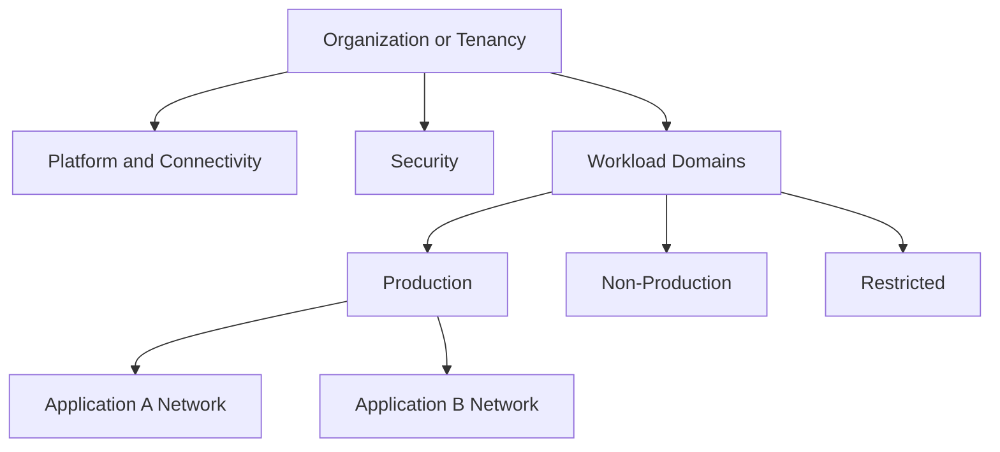

# Enterprise Cloud Network Architecture

## Normative language

The terms **MUST**, **MUST NOT**, **SHOULD**, **SHOULD NOT**, and **MAY** are normative. Mandatory controls require an approved exception when they cannot be implemented.

## Common engineering requirements

- Persistent configuration MUST be deployed through approved infrastructure-as-code and reviewed through version control.
- Every resource, policy, route, identity, endpoint, certificate, and exception MUST have an owner and lifecycle state.
- Production and non-production trust boundaries MUST remain separate unless an explicit shared-service interface is approved.
- Provider-native capabilities SHOULD be preferred when they meet security, resilience, portability, and operating-model requirements.
- Logs and configuration changes MUST be sent to approved monitoring and evidence-retention platforms.
- Designs MUST account for provider quotas, failure domains, control-plane behavior, data-processing charges, and operational recovery.

## Purpose and scope

This standard defines the enterprise network architecture for Azure, AWS, GCP, and Oracle Cloud Infrastructure. It covers cloud landing zones, network hierarchy, address management, hybrid and multi-cloud connectivity, transit, segmentation, ingress, egress, private services, DNS, resilience, and observability.

The target state is not a cloud copy of the legacy data-centre network. It is a governed connectivity fabric with explicit trust boundaries, automated policy, measurable availability, and workload autonomy.

## Architecture principles

1. **Separate shared connectivity from workloads.** Transit, DNS, inspection, private access, and hybrid gateways MUST reside in dedicated platform domains.
2. **Reachability is not authorization.** Network connectivity MUST be combined with workload identity, service IAM, and application authorization.
3. **Prefer service-level exposure.** Private endpoints, service attachments, API gateways, and proxies SHOULD replace broad routed connectivity where only a service is required.
4. **Centralize policy and evidence.** Central policy does not require centralizing every packet. Traffic inspection MUST be justified by the threat model.
5. **Design by failure domain.** Zones, regions, circuits, carriers, resolvers, and administrative dependencies MUST be considered independently.
6. **Automate the lifecycle.** Network resources and records MUST NOT depend on manual portal configuration.

## Enterprise reference architecture

## Architecture planes

| Plane | Responsibility | Required characteristics |
|---|---|---|
| Organization and policy | Hierarchy, guardrails, delegated ownership | Inheritance, least privilege, immutable audit |
| Connectivity | Hybrid, cloud-to-cloud, partner access | Redundant paths, deterministic routing, encryption |
| Transit | Inter-network routing and shared services | Route-domain isolation, controlled propagation |
| Security | DDoS, WAF, inspection, segmentation | policy-as-code, high availability, monitored enforcement |
| Private service | Managed-service access and service publishing | Explicit producer-consumer authorization and DNS |
| Workload | Application networks and endpoints | Default deny, least reachability, workload ownership |
| Observability | Flow, DNS, route, firewall, health telemetry | Central correlation, retention, alerting |

## Multi-cloud capability mapping

| Capability | Azure | AWS | GCP | OCI |
|---|---|---|---|---|
| Isolated network | Virtual Network | VPC | VPC network | VCN |
| Enterprise transit | Virtual WAN or hub VNet | Transit Gateway or Cloud WAN | Network Connectivity Center | Dynamic Routing Gateway |
| Private circuit | ExpressRoute | Direct Connect | Cloud Interconnect | FastConnect |
| Private managed-service access | Private Link / Private Endpoint | PrivateLink / VPC endpoints | Private Service Connect | Private endpoints or service gateway, service-dependent |
| Hybrid DNS | DNS Private Resolver | Route 53 Resolver | Cloud DNS forwarding | VCN resolver endpoints |
| Network firewall | Azure Firewall | AWS Network Firewall | Cloud NGFW | OCI Network Firewall |
| L7 ingress | Front Door / Application Gateway | CloudFront / ALB / API Gateway | Application Load Balancer | Load Balancer / WAF |
| L4 ingress | Azure Load Balancer | Network Load Balancer | Network Load Balancer | Network Load Balancer |

The services are not feature-equivalent. The table is a capability map, not proof of portability.

## Network hierarchy and segmentation

The enterprise hierarchy MUST distinguish platform, security, connectivity, production, non-production, sandbox, partner, recovery, and regulated domains. Workloads MUST NOT be placed in shared connectivity accounts or subscriptions.

Segmentation MUST exist at multiple layers: resource hierarchy, network boundary, subnet or service tier, security group or tag, workload identity, application authorization, and data classification.

## Address management

An authoritative IPAM process MUST allocate non-overlapping IPv4 and IPv6 space. It MUST reserve capacity for growth, private endpoints, containers, managed services, transit attachments, and recovery regions. Manual address allocation outside approved automation is prohibited.

Overlaps MUST be resolved through readdressing, service publishing, proxying, or controlled NAT. Broad permanent NAT between enterprise domains SHOULD NOT be treated as a normal architecture.

## Connectivity standards

Critical hybrid connectivity MUST use redundant customer devices, cloud termination points, provider edge locations, and carrier paths where available. Two logical circuits sharing one facility or carrier path are not independent.

BGP SHOULD be used for dynamic routing. Prefix advertisements and acceptance MUST be filtered. Cloud-to-cloud access SHOULD be selected in this order: service endpoint, application proxy/API, private carrier connectivity, encrypted VPN, then secured public endpoint.

Every workload MUST declare its ingress, egress, east-west, hybrid, and managed-service paths. Uncontrolled public IP assignment MUST be denied by organization policy.

## DNS architecture

DNS is a Tier-0 dependency. The design MUST define public authority, private authority, hybrid forwarding, split-horizon behavior, private endpoint zones, record ownership, logging, recovery, and change control. Each private namespace MUST have one authoritative destination. Forwarding loops and duplicate provider service zones are prohibited.

## Resilience model

| Tier | Examples | Minimum expectation |
|---|---|---|
| Tier 0 | Identity, DNS, transit, security control plane | Multi-zone, independent recovery path, regional recovery plan |
| Tier 1 | Critical production | Zone-resilient, redundant hybrid path, tested regional failover |
| Tier 2 | Standard production | Zone-resilient where supported, documented restore |
| Tier 3 | Development | Cost-appropriate best effort |

Resilience MUST be demonstrated through tests. A redundant diagram is not evidence.

## Security baseline

- Public administrative access is prohibited.
- Inbound policy MUST be default deny.
- Regulated egress MUST use explicit allow rules or a policy-mediated gateway.
- Public HTTP(S) services MUST use appropriate DDoS protection and WAF unless formally excepted.
- Sensitive managed services MUST use private access when supported and required by classification.
- IPv6 controls MUST match IPv4 controls.
- Flow, DNS, firewall, load-balancer, route, and configuration logs MUST be centralized.

## Prohibited patterns

- Full-mesh peering as enterprise transit.
- One flat shared network for unrelated workloads.
- Automatic route propagation between production and non-production.
- Manual firewall and route changes without reconciliation to code.
- Public managed-service exposure where policy requires private access.
- Central inspection that introduces asymmetric routing or an untested single point of failure.
- Unowned DNS resolvers, private zones, routes, peerings, or public addresses.

## Validation

- [ ] Resource and network hierarchy matches trust boundaries.
- [ ] Address allocations are authoritative and non-overlapping.
- [ ] All traffic paths and route domains are documented.
- [ ] Private DNS resolves consistently from each required environment.
- [ ] Public exposure is justified and controlled.
- [ ] Failure and recovery behavior has been tested.
- [ ] Logging, alerting, and configuration evidence are centralized.
- [ ] Infrastructure-as-code is the system of record.

## Governance and operating model

The Cloud Center of Excellence owns this standard and the reference modules. Platform teams operate shared controls. Security defines mandatory policy and monitoring requirements. Workload teams own application-specific configuration, data-flow declarations, testing, and remediation.

Exceptions MUST include the control being waived, business justification, compensating controls, risk owner, expiry date, and remediation plan. Permanent exceptions are prohibited; they must be periodically renewed or closed.

## Related topics

- [Cloud Identity and Access Architecture](nis-cloud-identity-and-access-architecture.md)
- [Firewalls, Routing, and Network Security Controls](nis-firewalls-routing-and-network-security-controls.md)
- [Hub-and-Spoke and Transit Network Design](nis-hub-and-spoke-and-transit-network-design.md)

## References

- [Azure Architecture Center](https://learn.microsoft.com/azure/architecture/)
- [Azure hub-spoke topology](https://learn.microsoft.com/azure/cloud-adoption-framework/ready/azure-best-practices/hub-spoke-network-topology)
- [AWS Transit Gateway](https://docs.aws.amazon.com/vpc/latest/tgw/)
- [GCP landing-zone network design](https://cloud.google.com/architecture/landing-zones/decide-network-design)
- [OCI workload networking best practices](https://docs.oracle.com/en/solutions/oci-best-practices-networking/)
- [NIST SP 800-207](https://csrc.nist.gov/pubs/sp/800/207/final)
