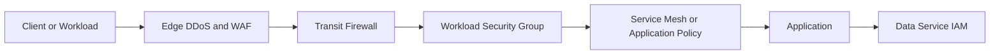
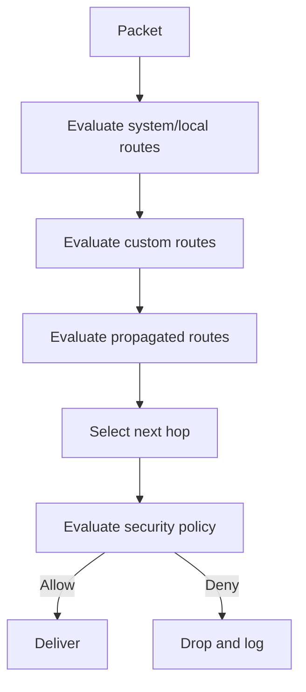
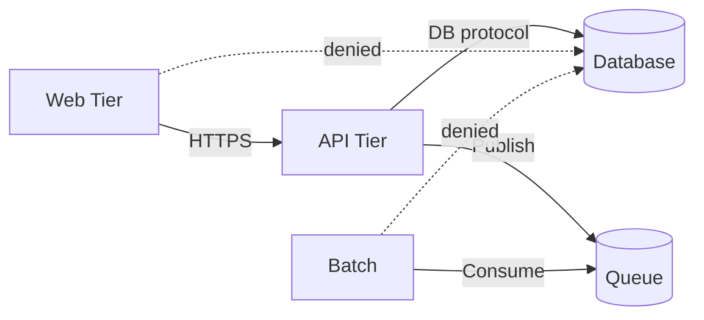

# 防火墙、路由和网络安全控制

## 规范语言

术语 **MUST**、**MUST NOT**、**SHOULD**、**SHOULD NOT** 和 **MAY** 是规范性的。强制性控制在无法实施时需要获取批准的例外情况。

## 常见工程要求

- 持久配置 MUST 通过批准的基础设施即代码进行部署，并通过版本控制进行审查。
- 每个资源、策略、路由、身份、端点、证书和异常 MUST 有所有者和生命周期状态。
- 生产和非生产信任边界 MUST 保持独立，除非明确的共享服务接口得到批准。
- 当满足安全性、弹性、可移植性和操作模型要求时，提供商原生功能 SHOULD 是首选。
- 日志和配置更改 MUST 发送到批准的监控和证据保留平台。
- 设计 MUST 考虑提供商配额、故障域、控制平面行为、数据处理费用和操作恢复。

## 目的

该标准定义了数据包过滤、状态检测、路由治理、分段、出口控制、DDoS、WAF 和网络遥测要求。

## 分层控制模型

没有单一的防火墙是安全边界。组织护栏、边缘控制、传输检查、分布式工作负载策略、主机控制、应用授权和数据平面 IAM MUST 协同工作。

## 提供商映射

|能力|Azure|AWS | GCP |OCI |
|---|---|---|---|---|
|状态网络防火墙| Azure Firewall | AWS Network Firewall |Cloud NGFW | OCI Network Firewall|
|分布式过滤 | NSG / ASG |安全组| VPC 防火墙策略和安全标签 |NSG/安全列表 |
|分级管理| Azure Policy/Firewall Manager |组织/Firewall Manager|分层防火墙策略| IAM、Security Zones、集中策略|
| WAF | Azure WAF | AWS WAF |Cloud Armor| OCI WAF |
|路由|路由表、BGP、Virtual WAN | VPC/TGW 路由表 | VPC 路由、Cloud Router、NCC | VCN/DRG 路由表 |

## 策略模型

防火墙策略 MUST 以策略即代码形式表示，分为企业护栏、环境策略、工作负载策略、临时例外和紧急控制。更高级别的规则 MUST 保留优先级范围，因此工作负载策略无法覆盖强制控制。

每个持久规则 MUST 记录所有者、目的、来源、目的地、协议、端口、环境、批准参考、审核日期、临时到期以及记录操作。 `any`、默认路由、通配符 FQDN 和广泛的端口范围需要明确的风险批准。

## 默认策略

- 默认拒绝入站流量和跨信任区域流量 MUST 启用。
- 管理端口 MUST NOT 可通过互联网访问。
- 受监管的出口 MUST 使用允许列表或调解策略。
- IPv6 策略 MUST 与 IPv4 策略匹配。
- 使用工作负载身份、安全标签或托管组 SHOULD 代替不稳定的 IP 地址。
- 紧急规则 MUST 自动失效。

## 路由安全

路由是一种安全控制。防火墙无法强制绕过它的流量。

确切的优先级因提供商而异。设计 MUST 使用当前的提供商文档，而不是假设。

路由创建 MUST 使用认可的模块。默认路由需要安全性和可用性所有者。学习到的混合前缀 MUST 被过滤。更具体、可绕过检查的路由 MUST 被阻止或发出告警。路由和防火墙修改 MUST 具有关联性。

## 集中式和分布式巡检

集中检查应用于受控的互联网出口、混合边界、常见威胁情报和受监管的跨界流量。它带来的风险是：瓶颈、路由不对称、成本集中、跨区处理、更大的爆炸半径。

分布式策略应用于微分段、本地故障隔离、较低延迟和基于身份/标签的控制。首选模型通常将分布式默认拒绝工作负载控制与对选定的南北向和跨域流量的集中检查相结合。

状态检查 MUST 专为区域冗余、基于运行状况的路由、维护、规模事件、路由收敛和生存容量而设计。除非明确批准，否则高风险边界禁止故障开放行为。

## 出口安全

目的地 MUST 被分类为提供商服务、软件仓库、企业 SaaS、合作伙伴、一般互联网或被禁止。控制 MAY 包括 FQDN 策略、安全 Web 网关、DNS 策略、TLS 检查、代理身份验证和威胁情报。

TLS 检查需要法律、隐私、证书信任、性能和兼容性审查。它 MUST NOT 被任意启用。

## 入口安全

公共 HTTP(S) 服务 MUST 使用 DDoS 保护、WAF、TLS 1.2 或更高版本（除非例外）、证书自动化、来源限制、运行状况探测、请求日志记录和滥用控制。非 HTTP 公共入口需要威胁模型和明确的批准。

## 微分段

策略 SHOULD 使用应用、层、环境、数据分类、服务标识、安全标签、命名空间和服务账户。广泛的子网到子网规则不如特定的工作负载到服务规则。

## 日志记录和检测

收集允许和拒绝的防火墙流量、WAF 事件、路由更改、策略更改、流日志、DNS 查询、DDoS 事件、运行状况、容量和威胁情报匹配。

针对公共管理暴露、广泛的新规则、禁用日志、路由绕过、异常出口、扫描、WAF 禁用和容量饱和发出告警。

## 故障排除顺序

按数据包路径顺序进行诊断：DNS、源路由、源策略、中转路由和检查、目标路由、目标策略、负载均衡器、主机防火墙、应用侦听器、返回路径。不要同时更改多个控件，因为这会破坏证据。

## 反模式

- 企业 RFC1918 范围的一项广泛允许规则。
- 没有所有者、审查或过期的规则。
- 手动门户更改与代码不符。
- 具有非对称路由的有状态防火墙。
- 所有东西向流量都在未经分析的情况下发生发夹。
- WAF 永久处于检测模式。
- 没有治理的 TLS 检查。
- 禁用流日志以降低成本。

## 验证

- [ ] 强制执行默认拒绝。
- [ ] 路由无法绕过强制检查。
- [ ] 公共入口具有 WAF、DDoS、TLS、日志记录和来源限制。
- [ ] 出口目的地已分类。
- [ ] 状态检查具有区域弹性并经过测试。
- [ ] 规则具有所有权、审查和到期元数据。
- [ ] IPv4 和 IPv6 控制是等效的。
- [ ] 路由和策略更改会生成告警和证据。

## 治理和运营模式

云卓越中心负责该标准和参考模块。平台团队操作共享控制。安全性定义了强制性策略和监控要求。工作负载团队负责特定于应用的配置、数据流声明、测试和修复。

例外情况 MUST 包括被放弃的控制权、业务理由、补偿性控制权、风险责任人、到期日和修复计划。禁止永久例外；它们必须定期更新或关闭。

## 相关主题

- [中心辐射式和中转网络设计](nis-hub-and-spoke-and-transit-network-design.md)
- [私有端点和私有 DNS](nis-private-endpoints-and-private-dns.md)
- [零信任和私有访问设计](nis-zero-trust-and-private-access-design.md)

## 参考文档

- [Azure 安全架构](https://learn.microsoft.com/azure/architecture/security/security-get-started)
- [Azure Firewall 和 Application Gateway](https://learn.microsoft.com/azure/architecture/example-scenario/gateway/firewall-application-gateway)
- [AWS Network Firewall](https://docs.aws.amazon.com/network-firewall/latest/developerguide/)
- [GCP 分层防火墙策略](https://cloud.google.com/firewall/docs/firewall-policies)
- [OCI 网络安全](https://docs.oracle.com/iaas/Content/Security/Reference/networking_security.htm)
