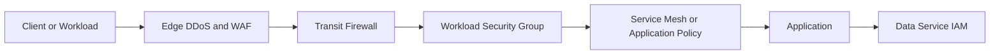
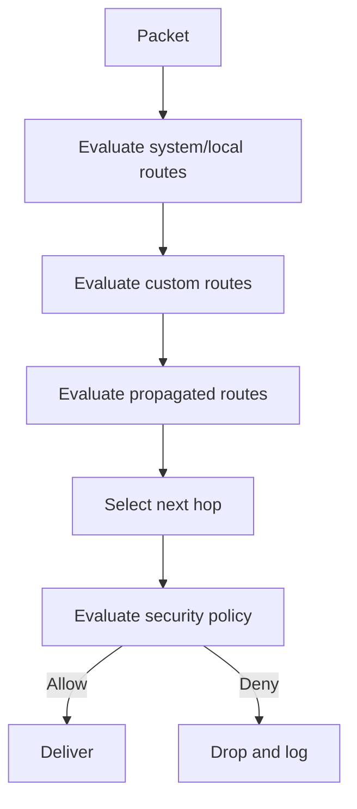
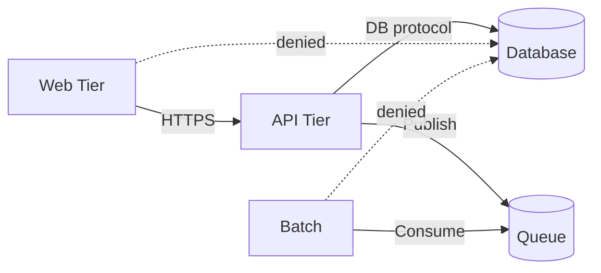

# Firewalls, Routing, and Network Security Controls

## Normative language

The terms **MUST**, **MUST NOT**, **SHOULD**, **SHOULD NOT**, and **MAY** are normative. Mandatory controls require an approved exception when they cannot be implemented.

## Common engineering requirements

- Persistent configuration MUST be deployed through approved infrastructure-as-code and reviewed through version control.
- Every resource, policy, route, identity, endpoint, certificate, and exception MUST have an owner and lifecycle state.
- Production and non-production trust boundaries MUST remain separate unless an explicit shared-service interface is approved.
- Provider-native capabilities SHOULD be preferred when they meet security, resilience, portability, and operating-model requirements.
- Logs and configuration changes MUST be sent to approved monitoring and evidence-retention platforms.
- Designs MUST account for provider quotas, failure domains, control-plane behavior, data-processing charges, and operational recovery.

## Purpose

This standard defines packet filtering, stateful inspection, route governance, segmentation, egress control, DDoS, WAF, and network telemetry requirements.

## Layered control model

No single firewall is the security boundary. Organization guardrails, edge controls, transit inspection, distributed workload policy, host controls, application authorization, and data-plane IAM MUST work together.

## Provider mapping

| Capability | Azure | AWS | GCP | OCI |
|---|---|---|---|---|
| Stateful network firewall | Azure Firewall | AWS Network Firewall | Cloud NGFW | OCI Network Firewall |
| Distributed filtering | NSGs / ASGs | Security groups | VPC firewall policies and secure tags | NSGs / security lists |
| Hierarchical management | Azure Policy / Firewall Manager | Organizations / Firewall Manager | Hierarchical firewall policies | IAM, security zones, centralized policy |
| WAF | Azure WAF | AWS WAF | Cloud Armor | OCI WAF |
| Routing | Route tables, BGP, Virtual WAN | VPC/TGW route tables | VPC routes, Cloud Router, NCC | VCN/DRG route tables |

## Policy model

Firewall policy MUST be represented as code and separated into enterprise guardrails, environment policy, workload policy, temporary exceptions, and emergency controls. Higher-level rules MUST reserve priority ranges so workload policy cannot override mandatory controls.

Every persistent rule MUST record owner, purpose, source, destination, protocol, port, environment, approval reference, review date, expiry when temporary, and logging action. `any`, default routes, wildcard FQDNs, and broad port ranges require explicit risk approval.

## Default policy

- Inbound and cross-trust-zone traffic MUST be denied by default.
- Administrative ports MUST NOT be internet-accessible.
- Regulated egress MUST use allow-list or mediated policy.
- IPv6 policy MUST match IPv4 policy.
- Workload identity, security tags, or managed groups SHOULD be used instead of unstable IP addresses.
- Emergency rules MUST expire automatically.

## Routing security

Routing is a security control. A firewall cannot enforce traffic that bypasses it.

The exact precedence differs by provider. Designs MUST use current provider documentation, not assumptions.

Route creation MUST use approved modules. Default routes require a security and availability owner. Learned hybrid prefixes MUST be filtered. More-specific routes that bypass inspection MUST be blocked or alerted. Route and firewall changes MUST be correlated.

## Centralized and distributed inspection

Centralized inspection is appropriate for controlled internet egress, hybrid boundaries, common threat intelligence, and regulated crossings. It carries risks: bottlenecks, asymmetric routing, cost concentration, cross-zone processing, and larger blast radius.

Distributed policy is appropriate for microsegmentation, local failure isolation, lower latency, and identity/tag-based controls. The preferred model generally combines distributed default-deny workload controls with centralized inspection for selected north-south and cross-domain traffic.

Stateful inspection MUST be designed for zonal redundancy, health-based routing, maintenance, scale events, route convergence, and surviving capacity. Fail-open behavior is prohibited for high-risk boundaries unless explicitly approved.

## Egress security

Destinations MUST be classified as provider services, software repositories, enterprise SaaS, partners, general internet, or prohibited. Controls MAY include FQDN policy, secure web gateways, DNS policy, TLS inspection, proxy authentication, and threat intelligence.

TLS inspection requires legal, privacy, certificate-trust, performance, and compatibility review. It MUST NOT be enabled indiscriminately.

## Ingress security

Public HTTP(S) services MUST use DDoS protection, WAF, TLS 1.2 or later unless excepted, certificate automation, origin restrictions, health probes, request logging, and abuse controls. Non-HTTP public ingress requires a threat model and explicit approval.

## Microsegmentation

Policy SHOULD use application, tier, environment, data classification, service identity, security tag, namespace, and service account. A broad subnet-to-subnet rule is inferior to a specific workload-to-service rule.

## Logging and detection

Collect allowed and denied firewall traffic, WAF events, route changes, policy changes, flow logs, DNS queries, DDoS events, health, capacity, and threat-intelligence matches.

Alert on public administrative exposure, broad new rules, disabled logging, route bypass, anomalous egress, scanning, WAF disablement, and capacity saturation.

## Troubleshooting sequence

Diagnose in packet-path order: DNS, source route, source policy, transit route and inspection, destination route, destination policy, load balancer, host firewall, application listener, return path. Do not change multiple controls simultaneously because it destroys evidence.

## Anti-patterns

- One broad allow rule for enterprise RFC1918 ranges.
- Rules without owner, review, or expiry.
- Manual portal changes not reconciled to code.
- Stateful firewall with asymmetric routes.
- All east-west traffic hairpinned without analysis.
- WAF left permanently in detection mode.
- TLS inspection without governance.
- Disabled flow logs to reduce cost.

## Validation

- [ ] Default deny is enforced.
- [ ] Routes cannot bypass mandatory inspection.
- [ ] Public ingress has WAF, DDoS, TLS, logging, and origin restrictions.
- [ ] Egress destinations are classified.
- [ ] Stateful inspection is zone-resilient and tested.
- [ ] Rules have ownership, review, and expiry metadata.
- [ ] IPv4 and IPv6 controls are equivalent.
- [ ] Route and policy changes generate alerts and evidence.

## Governance and operating model

The Cloud Center of Excellence owns this standard and the reference modules. Platform teams operate shared controls. Security defines mandatory policy and monitoring requirements. Workload teams own application-specific configuration, data-flow declarations, testing, and remediation.

Exceptions MUST include the control being waived, business justification, compensating controls, risk owner, expiry date, and remediation plan. Permanent exceptions are prohibited; they must be periodically renewed or closed.

## Related topics

- [Hub-and-Spoke and Transit Network Design](nis-hub-and-spoke-and-transit-network-design.md)
- [Private Endpoints and Private DNS](nis-private-endpoints-and-private-dns.md)
- [Zero-Trust and Private-Access Design](nis-zero-trust-and-private-access-design.md)

## References

- [Azure security architecture](https://learn.microsoft.com/azure/architecture/security/security-get-started)
- [Azure Firewall and Application Gateway](https://learn.microsoft.com/azure/architecture/example-scenario/gateway/firewall-application-gateway)
- [AWS Network Firewall](https://docs.aws.amazon.com/network-firewall/latest/developerguide/)
- [GCP hierarchical firewall policies](https://cloud.google.com/firewall/docs/firewall-policies)
- [OCI network security](https://docs.oracle.com/iaas/Content/Security/Reference/networking_security.htm)
