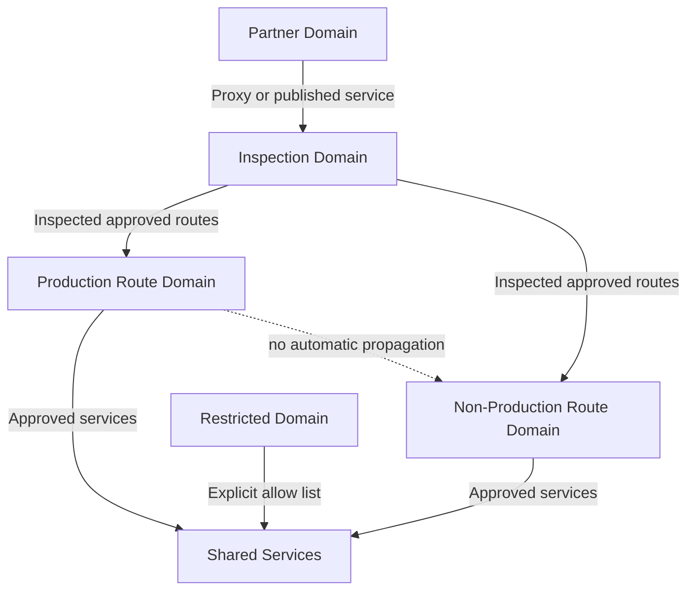

# 中心辐射式和中转网络设计

## 规范语言

术语 **MUST**、**MUST NOT**、**SHOULD**、**SHOULD NOT** 和 **MAY** 是规范性的。强制性控制在无法实施时需要获取批准的例外情况。

## 常见工程要求

- 持久配置 MUST 通过批准的基础设施即代码进行部署，并通过版本控制进行审查。
- 每个资源、策略、路由、身份、端点、证书和异常 MUST 有所有者和生命周期状态。
- 生产和非生产信任边界 MUST 保持独立，除非明确的共享服务接口得到批准。
- 当满足安全性、弹性、可移植性和操作模型要求时，提供商原生功能 SHOULD 是首选。
- 日志和配置更改 MUST 发送到批准的监控和证据保留平台。
- 设计 MUST 考虑提供商配额、故障域、控制平面行为、数据处理费用和操作恢复。

## 目的和设计立场

该标准定义了经批准的中心辐射式和托管中转模式。 Hub-and-spoke 是一种路由和服务共享的架构；不允许强制所有流量通过中央设备。

当提供商管理的中转 SHOULD 降低路由表复杂性、提高附件规模或提供受控路由域时，应选择该中转。自管理中心 MAY 用于不支持的路由、强制设备或专用协议，但 MUST 包括规模限制和迁移触发器。

## 批准的拓扑

## 提供商映射

|设计元素|Azure|AWS | GCP |OCI |
|---|---|---|---|---|
|托管中转 |Virtual WAN 虚拟中心|Transit Gateway/Cloud WAN |Network Connectivity Center| DRG v2 |
|自管理 Hub |Hub VNet |中转/检查 VPC |中转或共享 VPC 设计 |Hub VCN |
|路由分段|中心路由表和标签| Transit Gateway 路由表 | NCC 路由表/策略和 VPC 路由 | DRG 路由表/分发 |
|动态设备路由|Route Server| Transit Gateway Connect 或 BGP 设备 |Cloud Router| DRG 路由和虚拟电路|
|专用电路|ExpressRoute |Direct Connect |Cloud Interconnect|FastConnect|

## 拓扑选择

当环境具有许多网络、账户、项目、区域或混合连接时，使用托管中转；当需要路由域隔离时；或者当网络运营需要中央路由可见性时。

仅当托管中转缺乏所需功能时才使用自管理 Hub。对于一个孤立的网络或者私有服务发布满足要求且暴露较少的情况下，不要部署 Hub。

## 路由域架构

路由域 MUST 反映信任和操作边界。至少，评估生产、非生产、共享服务、安全检查、合作伙伴/外联网、沙箱、受限和恢复域。

路由传播 MUST 默认被拒绝。默认路由需要指定的下一跳所有者和经过测试的故障转移。更具体、可绕过检查的路由 MUST 被阻止或发出告警。本地获悉的路由 MUST 被过滤为批准的前缀。

## 路由对称和服务链

有状态防火墙需要对称路径。设计 MUST 定义并验证转发和返回路由选择、ECMP 行为、跨区域路由、SNAT、运行状况探测、路由收敛以及单个设备实例的故障。

每个服务链 MUST 按顺序记录，例如：

`workload -> transit -> network firewall -> secure web gateway -> NAT -> internet`

多个有状态跃点会增加故障和故障排除的复杂性。每个跃点必须具有必要的功能。

## 共享中心服务

中心 MAY 托管混合网关、路由服务、DNS 解析器、堡垒/私有管理、网络检查、安全出口集成和数据包故障排除服务。

应用数据库、运行时和产品中间件 MUST NOT 放置在连接中心。共享应用服务属于单独的共享服务网络，并且必须通过显式接口公开。

## 集中式和分布式巡检

中央检查应用于受监管的边界、混合边界或公共出口控制。中央检查 MUST 具有区域弹性，并且可根据一次故障后的剩余容量进行调整。

分布式执行更适合低延迟的东西向流、工作负载微分段、区域自治和故障隔离。分布式策略仍然需要中央治理和日志记录。

默认架构 SHOULD 将分布式默认拒绝工作负载控制与仅针对选定的跨域、互联网或混合流量的集中检查相结合。

## 混合连接

|要求 |标准|
|---|---|
|物理多样性|单独的设施或提供商边缘（如果有）|
|设备多样性 |独立的客户边缘设备和电源域|
|路由| BGP 优先；前缀过滤器强制 |
|加密|当电路控制不满足数据保护时需要 |
|容量 |一次故障后幸存路径承载所有关键流量 |
|验证 |至少每年并在重大更改后进行故障转移测试 |
|监控| BGP 状态、路由计数、隧道状态、延迟、丢失、利用率 |

## 多区域设计

区域 MUST 保持运行隔离。区域间中转 SHOULD 仅限于恢复复制、批准的应用依赖性和共享控制平面服务。默认互联网出口 SHOULD 仍然是区域性的。

全球中转结构 MUST NOT 默默地将区域故障变为企业故障。当区域间连接不可用时，路由表和 DNS 必须保留区域操作。

## 共享服务访问

首选模式，按顺序：

1. 消费者网络中的私有端点；
2.内部负载均衡器后面的私有服务发布；
3. API 或 Application Proxy；
4. 具有明确安全控制的路由共享服务网络；
5. 仅当服务级别模式不合适时才使用广泛的中转路由。
## 操作控制

平台网络 MUST 维护附件清单、路由域定义、静态和传播路由清单、BGP 过滤器、服务链、电路依赖性、容量预测和经过测试的恢复程序。

自动检查 SHOULD 可检测重叠前缀、孤立附件、非预期默认路由、检查旁路、禁用流日志、单区域设备和无所有者的资源。

## 失败场景

|场景|所需结果 |
|---|---|
|一个电路出现故障 |路由撤回，剩余的已批准路径承载关键流量 |
|一个防火墙区域出现故障 |流量使用正常运行的区域，没有不对称返回路径 |
| DNS 解析器失败 |冗余解析器路径回答查询|
|跨区域链路失败 |各地区继续本地运营|
|发生路由泄漏 |护栏阻止传播或立即触发告警 |
|配额接近上限 |网络附件或路由创建失败之前发生容量告警 |

## 反模式

- 全网状对等互连。
- 每个附件都有一个路由表。
- 自动生产到非生产的传播。
- 正常流量的跨区域发夹。
- 无故障能力的中央出口。
- 没有所有权的静态路由。
- 无需基于运行状况的路由的设备插入。
- 服务发布就足够的广泛路由访问。

## 验证

- [ ] 拓扑选择合理。
- [ ] 路由域与信任边界匹配。
- [ ] 默认情况下拒绝传播。
- [ ] 测试路由对称性。
- [ ] 混合路径在物理上和逻辑上都是不同的。
- [ ] 生存能力充足。
- [ ] 区域可以独立运作。
- [ ] 监控附件和路由漂移。

## 治理和运营模式

云卓越中心负责该标准和参考模块。平台团队操作共享控制。安全性定义了强制性策略和监控要求。工作负载团队负责特定于应用的配置、数据流声明、测试和修复。

例外情况 MUST 包括被放弃的控制权、业务理由、补偿性控制权、风险责任人、到期日和修复计划。禁止永久例外；它们必须定期更新或关闭。

## 相关主题

- [防火墙、路由和网络安全控制](nis-firewalls-routing-and-network-security-controls.md)
- [零信任和私有访问设计](nis-zero-trust-and-private-access-design.md)
- [私有端点和私有 DNS](nis-private-endpoints-and-private-dns.md)

## 参考文档

- [Azure Virtual WAN 中心辐射架构](https://learn.microsoft.com/azure/architecture/networking/architecture/hub-spoke-virtual-wan-architecture)
- [AWS Transit Gateway 路由](https://docs.aws.amazon.com/vpc/latest/tgw/how-transit-gateways-work.html)
- [GCP Network Connectivity Center](https://cloud.google.com/network-connectivity/docs/network-connectivity-center)
- [OCI Dynamic Routing Gateway](https://docs.oracle.com/iaas/Content/Network/Tasks/managingDRGs.htm)
