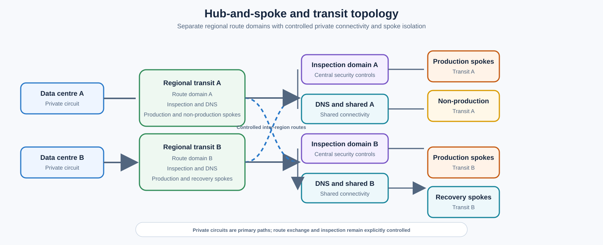
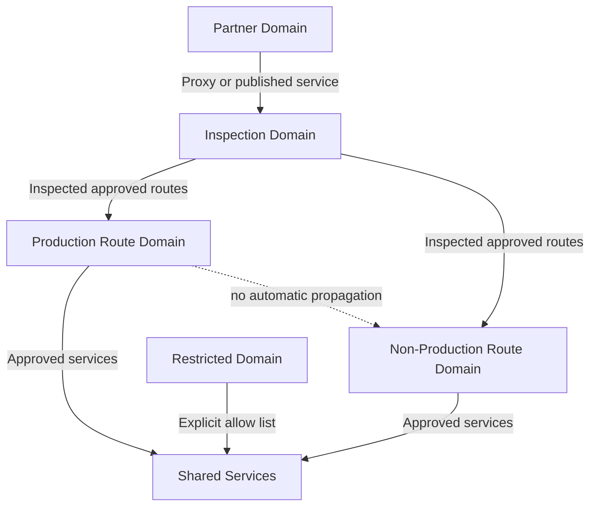

# Hub-and-Spoke and Transit Network Design

## Normative language

The terms **MUST**, **MUST NOT**, **SHOULD**, **SHOULD NOT**, and **MAY** are normative. Mandatory controls require an approved exception when they cannot be implemented.

## Common engineering requirements

- Persistent configuration MUST be deployed through approved infrastructure-as-code and reviewed through version control.
- Every resource, policy, route, identity, endpoint, certificate, and exception MUST have an owner and lifecycle state.
- Production and non-production trust boundaries MUST remain separate unless an explicit shared-service interface is approved.
- Provider-native capabilities SHOULD be preferred when they meet security, resilience, portability, and operating-model requirements.
- Logs and configuration changes MUST be sent to approved monitoring and evidence-retention platforms.
- Designs MUST account for provider quotas, failure domains, control-plane behavior, data-processing charges, and operational recovery.

## Purpose and design position

This standard defines approved hub-and-spoke and managed transit patterns. Hub-and-spoke is a route and service-sharing architecture; it is not permission to force all traffic through a central appliance.

Provider-managed transit SHOULD be selected when it reduces route-table complexity, improves attachment scale, or provides controlled route domains. A self-managed hub MAY be used for unsupported routing, mandatory appliances, or specialized protocols, but it MUST include scale limits and a migration trigger.

## Approved topology

## Provider mapping

| Design element | Azure | AWS | GCP | OCI |
|---|---|---|---|---|
| Managed transit | Virtual WAN virtual hub | Transit Gateway / Cloud WAN | Network Connectivity Center | DRG v2 |
| Self-managed hub | Hub VNet | Transit/inspection VPC | Transit or Shared VPC design | Hub VCN |
| Route segmentation | Hub route tables and labels | Transit Gateway route tables | NCC route tables/policies and VPC routes | DRG route tables/distributions |
| Dynamic appliance routing | Route Server | Transit Gateway Connect or BGP appliance | Cloud Router | DRG routing and virtual circuits |
| Private circuit | ExpressRoute | Direct Connect | Cloud Interconnect | FastConnect |

## Topology selection

Use managed transit when the estate has many networks, accounts, projects, regions, or hybrid connections; when route-domain isolation is required; or when network operations need central route visibility.

Use a self-managed hub only when managed transit lacks a required feature. Do not deploy a hub for one isolated network or when private service publishing meets the requirement with less exposure.

## Route-domain architecture

Route domains MUST reflect trust and operational boundaries. At minimum, evaluate production, non-production, shared services, security inspection, partner/extranet, sandbox, restricted, and recovery domains.

Route propagation MUST be deny-by-default. Default routes require a named next-hop owner and tested failover. More-specific routes that bypass inspection MUST be blocked or alerted. On-premises learned routes MUST be filtered to approved prefixes.

## Routing symmetry and service chaining

Stateful firewalls require symmetric paths. Designs MUST validate forward and return route selection, ECMP behavior, cross-zone routing, SNAT, health probes, route convergence, and failure of individual appliance instances.

Every service chain MUST be documented in order, for example:

`workload -> transit -> network firewall -> secure web gateway -> NAT -> internet`

Multiple stateful hops increase failure and troubleshooting complexity. Each hop must have a necessary function.

## Shared hub services

A hub MAY host hybrid gateways, route services, DNS resolvers, bastion/private administration, network inspection, secure egress integration, and packet troubleshooting services.

Application databases, runtimes, and product middleware MUST NOT be placed in the connectivity hub. Shared application services belong in a separate shared-service network and must be exposed through explicit interfaces.

## Centralized and distributed inspection

Central inspection is appropriate for regulated boundaries, hybrid perimeters, or common egress controls. It MUST be zone-resilient and sized for surviving capacity after one failure.

Distributed enforcement is preferable for low-latency east-west flows, workload microsegmentation, regional autonomy, and failure isolation. Distributed policy still requires central governance and logging.

The default architecture SHOULD combine distributed default-deny workload controls with centralized inspection only for selected cross-domain, internet, or hybrid traffic.

## Hybrid connectivity

| Requirement | Standard |
|---|---|
| Physical diversity | Separate facilities or provider edges where available |
| Device diversity | Independent customer edge devices and power domains |
| Routing | BGP preferred; prefix filters mandatory |
| Encryption | Required when circuit controls do not satisfy data protection |
| Capacity | Surviving path carries all critical traffic after one failure |
| Validation | Failover tested at least annually and after material changes |
| Monitoring | BGP state, route count, tunnel state, latency, loss, utilization |

## Multi-region design

Regions MUST remain operationally isolated. Inter-region transit SHOULD be limited to recovery replication, approved application dependencies, and shared control-plane services. Default internet egress SHOULD remain regional.

A global transit fabric MUST NOT silently turn a regional failure into an enterprise failure. Route tables and DNS must preserve regional operation when the inter-region connection is unavailable.

## Shared-service access

Preferred patterns, in order:

1. private endpoint in the consumer network;
2. private service publishing behind an internal load balancer;
3. API or application proxy;
4. routed shared-service network with explicit security controls;
5. broad transit routing only when service-level patterns are unsuitable.

## Operational controls

Platform networking MUST maintain an attachment inventory, route-domain definitions, static and propagated route inventories, BGP filters, service chains, circuit dependencies, capacity forecasts, and tested recovery procedures.

Automated checks SHOULD detect overlapping prefixes, orphaned attachments, unintended default routes, inspection bypass, disabled flow logs, single-zone appliances, and resources without owners.

## Failure scenarios

| Scenario | Required result |
|---|---|
| One circuit fails | Routes withdraw and surviving approved path carries critical traffic |
| One firewall zone fails | Traffic uses a healthy zone without asymmetric return paths |
| DNS resolver fails | Redundant resolver path answers queries |
| Inter-region link fails | Each region continues local operation |
| Route leak occurs | Guardrail blocks propagation or alert fires immediately |
| Quota approaches limit | Capacity alert occurs before attachment or route creation fails |

## Anti-patterns

- Full-mesh peering.
- One route table for every attachment.
- Automatic production-to-non-production propagation.
- Cross-region hairpinning for normal traffic.
- Central egress without failure capacity.
- Static routes without ownership.
- Appliance insertion without health-based routing.
- Broad routed access where service publishing is sufficient.

## Validation

- [ ] Topology choice is justified.
- [ ] Route domains match trust boundaries.
- [ ] Propagation is deny-by-default.
- [ ] Route symmetry is tested.
- [ ] Hybrid paths are physically and logically diverse.
- [ ] Surviving capacity is sufficient.
- [ ] Regions can operate independently.
- [ ] Attachment and route drift is monitored.

## Governance and operating model

The Cloud Center of Excellence owns this standard and the reference modules. Platform teams operate shared controls. Security defines mandatory policy and monitoring requirements. Workload teams own application-specific configuration, data-flow declarations, testing, and remediation.

Exceptions MUST include the control being waived, business justification, compensating controls, risk owner, expiry date, and remediation plan. Permanent exceptions are prohibited; they must be periodically renewed or closed.

## Related topics

- [Firewalls, Routing, and Network Security Controls](nis-firewalls-routing-and-network-security-controls.md)
- [Zero-Trust and Private-Access Design](nis-zero-trust-and-private-access-design.md)
- [Private Endpoints and Private DNS](nis-private-endpoints-and-private-dns.md)

## References

- [Azure Virtual WAN hub-spoke architecture](https://learn.microsoft.com/azure/architecture/networking/architecture/hub-spoke-virtual-wan-architecture)
- [AWS Transit Gateway routing](https://docs.aws.amazon.com/vpc/latest/tgw/how-transit-gateways-work.html)
- [GCP Network Connectivity Center](https://cloud.google.com/network-connectivity/docs/network-connectivity-center)
- [OCI Dynamic Routing Gateway](https://docs.oracle.com/iaas/Content/Network/Tasks/managingDRGs.htm)
