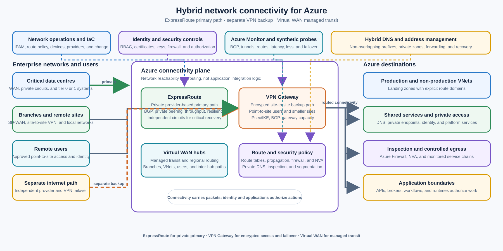

> **Document class:** Enterprise architecture reference model
> **Normative terms:** **MUST**, **MUST NOT**, **SHOULD**, **SHOULD NOT**, and **MAY** are requirements levels.
> **Applicability:** Hybrid connectivity between Azure, enterprise networks, branches, remote users, and connected virtual networks.
> **Exception process:** Deviations require a documented risk assessment, compensating controls, named risk owner, and expiry date.

| Control field | Value |
|---|---|
| Document ID | `NIS-10` |
| Owner | Cloud Center of Excellence |
| Review cycle | At least annually and after material circuit, carrier, gateway, WAN, route-domain, addressing, or network-security changes |
| Evidence | Connectivity inventory, circuit and tunnel contracts, BGP and route policy, topology, failure tests, monitoring dashboards, and operational runbooks |

# Hybrid Network Connectivity — ExpressRoute, VPN Gateway and Virtual WAN

## Purpose and design position

This architecture defines the approved selection and resilience patterns for connecting Azure to data centres, branches, remote users, and other virtual networks. Azure ExpressRoute, VPN Gateway, and Virtual WAN solve network connectivity, routing, and transit concerns. They do **not** implement application integration logic, business workflows, API mediation, message processing, data transformation, or authorization for a business operation.

Use ExpressRoute for private provider-based connectivity where a critical enterprise workload needs a more consistent network path, latency profile, and reliability model than connectivity over the public internet can provide. Use VPN Gateway for encrypted site-to-site or point-to-site connectivity over the public internet, especially for smaller deployments, initial connectivity, remote administration, or a separately engineered ExpressRoute backup path. Use Virtual WAN for centralized, Microsoft-managed connectivity and routing across many branches, virtual networks, hubs, and remote users.

For critical environments, the default resilience pattern SHOULD be ExpressRoute as the primary path with site-to-site VPN as a separate failover path. The paths MUST be independent enough to provide meaningful protection: separate customer edge devices, providers or circuits where practical, termination resources, power and facility dependencies, route policy, monitoring, and tested failover. Two logical connections that share one unmonitored device, carrier, or physical facility are not independent recovery paths.

## Scope and design outcomes

Use this model when a workload or platform needs to:

- connect an enterprise WAN or data centre to Azure privately;
- establish encrypted site-to-site connectivity over the public internet;
- provide point-to-site access for approved remote users or administrators;
- connect many branches, virtual networks, regions, and remote users through centrally managed transit;
- carry traffic between on-premises networks and Azure landing zones;
- create a primary and separately engineered backup path for critical hybrid workloads;
- apply route-domain, prefix, inspection, and propagation controls across hybrid paths; or
- expose a private network path to a service that still requires workload identity and application authorization.

The target outcomes are:

- every circuit, tunnel, gateway, hub, attachment, route domain, and customer edge has an owner and lifecycle state;
- address space, BGP advertisements, route propagation, next hops, and failure behavior are explicit and tested;
- critical traffic has a surviving path that can carry the required load after a declared failure;
- ExpressRoute, VPN Gateway, and Virtual WAN are selected for distinct connectivity needs rather than treated as interchangeable products;
- connectivity is separated from application integration and does not become a hidden business-processing layer;
- private DNS, firewalls, security groups, identity, and application authorization remain part of the end-to-end access design; and
- monitoring and runbooks make route, tunnel, circuit, gateway, latency, loss, capacity, and failover state actionable.

## Context and decision drivers

Hybrid traffic often carries dependencies that are more sensitive to reachability, latency, packet loss, route convergence, and outage duration than ordinary internet access. A network path may connect a client to a workload, but it does not prove that the client is authorized to invoke the workload or that the application can safely process the request.

The decision is driven by:

- **Path privacy:** Whether traffic must use a private provider or encrypted tunnel path rather than a public service endpoint.
- **Consistency and performance:** Required latency, jitter, throughput, packet-loss tolerance, and route stability across the WAN and Azure.
- **Resilience:** Failure domains for carrier, facility, edge device, gateway, circuit, region, provider, and route control plane.
- **Scale:** Number of branches, virtual networks, remote users, regions, route prefixes, and security domains.
- **Operations:** Whether the organization can operate customer-premises equipment, BGP, tunnels, certificates, gateways, and route policy.
- **Security:** Encryption, inspection, prefix filtering, private DNS, default-deny segmentation, logging, and least-privilege administration.
- **Locality:** Whether traffic must remain near a region, branch, data centre, private cloud, or regulated boundary.
- **Cost and time to value:** Provider circuit lead time and recurring cost compared with VPN setup, bandwidth, gateway, hub, and egress costs.

## Service selection

| Requirement | Preferred service or pattern | Why | Important boundary |
|---|---|---|---|
| Critical private enterprise WAN connectivity | ExpressRoute | Provider-based private connection with a more controlled path and high-throughput options | It still depends on the customer WAN, provider, peering location, gateway, routing, and workload controls |
| Smaller deployment or initial hybrid connection | VPN Gateway site-to-site | Encrypted IPsec/IKE connectivity over the public internet with lower setup friction | Internet path performance and carrier availability are variable; size the gateway and test MTU, latency, loss, and failover |
| Approved remote user access | VPN Gateway point-to-site | Encrypted remote access from individual client devices using supported protocols and identity options | P2S access is not a substitute for application authorization, device posture, or privileged-access controls |
| ExpressRoute protection or sites not on the private circuit | Coexisting ExpressRoute and site-to-site VPN | Separate gateways and paths can provide backup or reach sites outside the ExpressRoute WAN | Route preference, tunnel health, BGP, device diversity, and failover behavior MUST be engineered and tested |
| Many branches, VNets, regions, or remote users | Virtual WAN | Microsoft-managed hubs and routing reduce self-managed transit complexity | Route tables, propagation, security inspection, hub capacity, and traffic paths still require governance |
| Application-to-application workflow | API, Service Bus, Logic Apps, Functions, or an application runtime | Provides contracts, mediation, durability, orchestration, or custom code | Network reachability is only a dependency; it does not implement application integration |

## Reference architecture

The primary path enters Azure through ExpressRoute. A separate site-to-site VPN path uses an independent customer edge and internet connection and remains available for failover or for sites that are not part of the private WAN. Virtual WAN can provide the managed transit fabric when the estate has many branch, VNet, ExpressRoute, VPN, or point-to-site attachments. A self-managed hub VNet remains appropriate when a required routing, inspection, or appliance capability is not available in the managed transit design.

The connectivity plane attaches to workload VNets, shared services, security inspection, and private service access. Route reachability MUST be constrained by route domains and policy. Network access MUST be combined with identity, security controls, private DNS, and application authorization. The diagram intentionally stops at network boundaries: no service in this architecture performs application integration logic.

The [Hub-spoke network topology that uses Azure Virtual WAN](https://learn.microsoft.com/en-us/azure/architecture/networking/architecture/hub-spoke-virtual-wan-architecture) reference architecture shows ExpressRoute or VPN entering a Virtual WAN hub, with the hub providing routing between on-premises networks, spokes, and other hubs. The topology should be adapted to the organization’s failure domains, inspection requirements, route domains, and operational ownership.

## ExpressRoute

### Appropriate use

ExpressRoute provides a private connection between an enterprise WAN and Microsoft cloud services through a connectivity provider, cloud exchange, or supported direct model. Use it when a workload or platform requires a private path, consistent provider-managed connectivity, high throughput, or a stronger resiliency and performance model than an internet-based VPN can normally provide.

Typical uses include:

- Tier 0 or Tier 1 data-centre connectivity to production landing zones;
- private access from a corporate WAN to Azure platform and workload networks;
- high-throughput hybrid dependencies with measured bandwidth and latency requirements;
- regulated or sensitive environments where public internet transport is not an accepted primary path;
- regional or multi-region connectivity designed around independent peering locations; and
- the primary path in an ExpressRoute plus site-to-site VPN resilience pattern.

ExpressRoute does not guarantee an application SLO by itself. The effective path includes the customer LAN and WAN, customer edge routers, provider or exchange, ExpressRoute circuit, Azure gateway, Virtual WAN hub or VNet, route policy, firewalls, DNS, and the workload. Measure the entire path and size the surviving path for declared failure scenarios.

### Routing and resiliency

Use BGP for dynamic route exchange where supported and appropriate. Prefix advertisements and acceptance MUST be filtered by route domain, environment, region, and trust boundary. Document private peering, route limits, local preference, AS path behavior, default route handling, route summarization, and failover preference.

An ExpressRoute circuit includes redundant connections to Microsoft Enterprise Edge routers at the provider or peering location, but customer-side resilience still requires independent edge devices, links, power, facilities, and provider paths as appropriate. For critical or disaster-recovery requirements, evaluate two circuits in different peering locations and separate regional gateway dependencies. A second connection at one location may not protect against a facility, carrier, or regional failure.

ExpressRoute’s secondary connection is a redundancy mechanism. Do not plan sustained additional traffic on a path that is reserved for failure unless the capacity and service terms explicitly support that operating model. Test the circuit, BGP sessions, gateway, route convergence, and workload behavior under circuit, edge, carrier, gateway, and region failure.

### Security and operations

Private connectivity is not encryption in every threat model. Determine whether the circuit, provider, data classification, and regulatory controls satisfy the required protection; add application-layer or network-layer encryption where necessary. Apply route filtering, firewall inspection, network security groups, private DNS, identity-based access, and logging independently.

The network platform team MUST maintain circuit IDs, provider contacts, peering location, bandwidth, BGP parameters, IP allocations, gateway SKU and zone configuration, maintenance windows, renewal dates, route policy, owner, and escalation path. Monitor circuit state, BGP state, route count, route changes, throughput, latency, packet loss, errors, gateway health, and provider incidents.

## VPN Gateway

### Site-to-site VPN

Use a site-to-site VPN for encrypted IPsec/IKE connectivity between an on-premises or branch VPN device and an Azure VPN gateway over the public internet. It is appropriate for smaller deployments, initial migration, temporary or low-volume sites, sites without ExpressRoute coverage, and a separately engineered backup path.

The customer VPN device MUST have a supported configuration, externally reachable address, compatible IPsec/IKE parameters, stable time synchronization, and a documented owner. Prefer active-active and zone-resilient configurations where the gateway SKU and design support them. Use BGP for dynamic route exchange where it improves convergence and route control; otherwise, static routes MUST be versioned, filtered, and monitored.

Site-to-site VPN performance depends on the internet path, customer device, gateway SKU, tunnel count, encryption, packet size, and concurrent traffic. Establish measured limits for throughput, latency, jitter, packet loss, MTU, rekey behavior, and failover time. Do not treat a successful tunnel state as proof that every application path is healthy.

### Point-to-site VPN

Use point-to-site VPN for approved remote users or individual client devices that need private network access. Integrate authentication with approved identity and privileged-access controls. Define device posture, user group, route scope, DNS behavior, split tunneling, session duration, logging, revocation, and support boundaries.

Point-to-site access SHOULD be limited to the resources and administration paths required for the user’s role. It MUST NOT provide broad reachability merely because a user has connected to the network. Prefer application-aware private access when the user needs one application rather than a routed network segment.

### ExpressRoute and VPN coexistence

For a critical environment, deploy ExpressRoute and site-to-site VPN as coexisting connections with separate ExpressRoute and VPN gateway resources. The VPN path should use an independent customer edge, internet provider, address path, and operational ownership where practical. Configure and test route preference so normal traffic uses the intended ExpressRoute path and traffic moves to the VPN path only when the defined ExpressRoute health and route conditions are met.

Do not rely on a single manually changed static route to perform failover. Define the health signal, BGP or route withdrawal behavior, convergence budget, asymmetric-routing controls, firewall state behavior, application retry behavior, and restoration procedure. Planned failback MUST avoid route flapping and must confirm that the primary path is stable before traffic is returned.

## Virtual WAN

Virtual WAN is a Microsoft-managed networking service for centralized connectivity and routing across branches, virtual networks, ExpressRoute circuits, VPN sites, point-to-site users, and regional virtual hubs. Use it when the estate has enough attachments or route domains that self-managed hub-and-spoke transit would create unnecessary peering, route-table, or operational complexity.

Virtual WAN can provide:

- regional virtual hubs with managed routing;
- connectivity from ExpressRoute and VPN sites into the hub;
- point-to-site or remote-user connectivity;
- virtual network connections for workload and shared-service spokes;
- inter-hub and branch-to-branch transit where the route policy allows it;
- centralized security with Azure Firewall or approved network virtual appliances; and
- a common framework for multi-region branch and VNet connectivity.

Virtual WAN is not an authorization service, application gateway, message broker, API management layer, or workflow runtime. Its managed routing does not remove the need for route domains, prefix filters, security inspection, private DNS, workload identity, application authorization, logging, capacity planning, and incident runbooks.

### Route tables and propagation

Define a route-domain model before attaching networks. At minimum, consider production, non-production, shared services, security inspection, partner or extranet, restricted, sandbox, and recovery domains. Route propagation MUST be deny-by-default between domains unless a documented business path is approved.

Document each connection’s associated and propagated route tables, static routes, next hops, default-route behavior, security-provider insertion, branch-to-branch behavior, inter-hub behavior, and failover preference. Prevent accidental production-to-non-production reachability, inspection bypass, default-route leaks, and transitive paths that were not approved.

### Security and scale

Use secured hubs and Azure Firewall or approved network virtual appliances when centralized inspection is required by the threat model. Confirm whether east-west, branch-to-branch, inter-hub, internet egress, and spoke traffic traverse the intended inspection path. Stateful inspection requires symmetric routing and enough surviving capacity after a component failure.

Capacity planning MUST include hub count, VNet and branch attachments, route count, throughput, concurrent flows, inter-hub traffic, firewall capacity, gateway capacity, point-to-site users, and failure-mode load. Validate current Azure limits and pricing before committing to a hub topology. A managed control plane reduces implementation work; it does not eliminate design or operations work.

## Addressing, DNS, and routing

Use authoritative IPAM for all Azure, on-premises, branch, VPN, and partner prefixes. Overlapping address space MUST be resolved through readdressing, controlled NAT, proxying, or service publishing. Do not make broad permanent NAT the default enterprise design.

Hybrid DNS is a Tier-0 dependency. Define public authority, private authority, forwarding, split-horizon behavior, private endpoint zones, resolver locations, conditional forwarders, logging, and recovery. A route that works by IP address but fails by name is not a healthy application path.

BGP and route tables MUST be treated as security policy. Filter learned and advertised prefixes, prevent route leaks, define default-route ownership, monitor route count and changes, and alert on unexpected propagation. Document the intended path for every critical traffic class, including the return path.

## Security controls

- Keep connectivity resources, gateways, hubs, route policies, DNS resolvers, firewalls, and shared network services in dedicated platform domains.
- Apply least-privilege RBAC to circuit, gateway, hub, connection, route, firewall, and diagnostic administration.
- Protect VPN certificates, shared keys, device credentials, and automation secrets in an approved secret-management service.
- Use network security groups, Azure Firewall or approved inspection, private endpoints, and workload identity as separate controls.
- Encrypt application payloads where the data classification or protocol requires protection beyond the network path.
- Restrict management-plane access to approved administrative paths and monitor configuration changes.
- Redact sensitive data from flow, VPN, gateway, firewall, and packet-troubleshooting logs while retaining enough evidence for diagnosis.
- Document customer-managed encryption, regulatory, data-residency, provider, and lawful-intercept requirements before selecting a circuit or transport.

Network reachability MUST NOT be treated as business authorization. Application teams remain responsible for authentication, authorization, input validation, tenant isolation, and safe handling of retries or duplicate requests.

## Resilience and failure handling

The primary and backup paths MUST be modeled as a dependency graph, not just drawn as two lines. Identify failure domains for:

- customer edge devices, power, facilities, and local LAN;
- WAN provider, internet service, carrier, exchange, and peering location;
- ExpressRoute circuit and Microsoft Enterprise Edge connection;
- VPN device, tunnel, gateway, public IP, and certificate;
- Virtual WAN hub, inter-hub path, route table, and security provider;
- Azure region, availability zone, subscription, resource group, and control plane;
- DNS resolver, private zone, firewall, network virtual appliance, and route policy; and
- workload, application gateway, private endpoint, identity provider, and dependent service.

For each critical traffic class, define:

- the normal path and expected route preference;
- the backup path and the failure signal that activates it;
- the maximum convergence and recovery time;
- the capacity available after the declared failure;
- the expected behavior of stateful firewalls and NAT;
- the impact on DNS and service discovery;
- application timeout, retry, and connection-pool behavior; and
- the restoration, failback, reconciliation, and evidence procedure.

Do not declare resilience from gateway status alone. Perform controlled circuit, carrier, edge, tunnel, gateway, route, firewall, DNS, region, and workload tests. Test at representative load and confirm that the surviving path does not overload a dependency or create asymmetric routing.

## Performance and cost

Measure end-to-end latency, jitter, packet loss, throughput, MTU, connection establishment, route convergence, and application response time. ExpressRoute may provide a more consistent path than public-internet VPN, but the application outcome still depends on every segment and dependency. VPN performance varies with internet conditions and gateway or device capacity. Virtual WAN adds managed transit and hub routing that can simplify operations, but it introduces hub, gateway, firewall, inter-hub, and data-processing cost drivers.

Cost estimates MUST include circuits, provider or exchange fees, VPN gateway SKUs, ExpressRoute and VPN gateway resources, Virtual WAN hubs and connections, firewall or NVA capacity, public IPs, egress, inter-region traffic, monitoring, support, customer edge devices, licenses, carrier diversity, and operational staffing. Do not choose a path solely from monthly infrastructure price when outage cost, provider lead time, or criticality requires stronger resilience.

## Operations and lifecycle

The network platform team owns the connectivity baseline, address allocation, circuit and tunnel inventory, gateway and hub lifecycle, route policy, private DNS integration, security inspection, monitoring, provider coordination, and recovery runbooks. Workload teams own their declared traffic paths, application health checks, identity and authorization, dependency limits, and validation evidence. Security and governance teams define encryption, segmentation, logging, data-protection, and exception requirements.

Every production connection should have an operational record containing:

- service, circuit, tunnel, hub, gateway, and customer-edge identifiers;
- owner, business purpose, environments, regions, route domains, and data classification;
- provider, facility, carrier, bandwidth, IP ranges, BGP ASN, peer addresses, and maintenance windows;
- gateway SKU, zone configuration, tunnel or circuit redundancy, firewall path, and DNS dependencies;
- expected latency, throughput, loss, route count, convergence, and SLO thresholds;
- credentials, certificates, keys, rotation, renewal, and emergency access procedures;
- monitoring dashboards, alert thresholds, provider contacts, escalation, and support path; and
- planned changes, renewal date, decommission date, and tested recovery evidence.

Monitor at least:

- ExpressRoute circuit, connection, BGP session, route count, route change, bandwidth, and packet metrics;
- VPN tunnel state, IKE/IPsec negotiation, rekey, packet loss, throughput, gateway health, and point-to-site sessions;
- Virtual WAN hub, connection, route-table propagation, inter-hub, branch-to-branch, and gateway health;
- firewall or NVA throughput, flow count, drops, asymmetric-path indicators, and surviving capacity;
- DNS query success, latency, forwarding failures, private-zone changes, and resolver health;
- latency, jitter, loss, MTU, connection establishment, and application synthetic probes across critical paths;
- unauthorized route, prefix, gateway, circuit, tunnel, firewall, DNS, and RBAC changes; and
- provider maintenance, certificate expiry, subscription or quota pressure, and incident state.

Runbooks should cover ExpressRoute circuit loss, provider outage, BGP withdrawal, VPN tunnel failure, certificate or key expiry, gateway degradation, Virtual WAN route propagation error, route leak, DNS failure, firewall capacity exhaustion, asymmetric routing, overlapping prefixes, public IP exposure, and controlled failover or failback.

## Validation

- [ ] Connectivity is distinguished from application integration logic, workflow orchestration, API mediation, messaging, and business authorization.
- [ ] ExpressRoute, VPN Gateway, Virtual WAN, or a self-managed hub is selected from documented privacy, performance, scale, resilience, locality, cost, and operations requirements.
- [ ] Critical environments have an ExpressRoute primary path and a separately engineered site-to-site VPN backup path, or an approved alternative with equivalent evidence.
- [ ] Primary and backup paths have independent customer edges, providers, facilities, power, addressing, termination resources, and operational dependencies where practical.
- [ ] ExpressRoute circuit, peering location, provider, BGP, gateway, route limits, bandwidth, and failure domains are documented.
- [ ] VPN site-to-site or point-to-site configuration, device, IPsec/IKE policy, identity, certificates or keys, gateway SKU, and client or site scope are documented.
- [ ] Virtual WAN hubs, attachments, route tables, propagation, inter-hub paths, branch-to-branch behavior, firewall insertion, and capacity are documented.
- [ ] IPAM is authoritative, prefixes do not overlap, and BGP or static routes are filtered and monitored.
- [ ] Private DNS, forwarding, private endpoint zones, firewall paths, route symmetry, and return paths are tested from every required environment.
- [ ] Network reachability is combined with workload identity, application authorization, tenant isolation, and data-protection controls.
- [ ] Critical-path latency, jitter, loss, throughput, MTU, route convergence, gateway health, and application synthetic probes have thresholds.
- [ ] Circuit, provider, edge, tunnel, gateway, route, firewall, DNS, region, and workload failures have been tested at representative load.
- [ ] The surviving path can carry the declared critical traffic without exhausting gateway, firewall, route, or downstream capacity.
- [ ] Configuration is deployed through infrastructure as code, changes are audited, and provider, certificate, key, renewal, and decommission evidence is current.
- [ ] Dashboards, alerts, provider contacts, escalation paths, failover, failback, and reconciliation runbooks are ready before production use.

## Related topics

- [Enterprise Cloud Network Architecture](nis-enterprise-cloud-network-architecture.md)
- [Hub-and-Spoke and Transit Network Design](nis-hub-and-spoke-and-transit-network-design.md)
- [Firewalls, Routing, and Network Security Controls](nis-firewalls-routing-and-network-security-controls.md)
- [Private Endpoints and Private DNS](nis-private-endpoints-and-private-dns.md)
- [Zero-Trust and Private-Access Design](nis-zero-trust-and-private-access-design.md)

## References

- [Azure ExpressRoute overview](https://learn.microsoft.com/en-us/azure/expressroute/expressroute-introduction)
- [Design and architect Azure ExpressRoute for resiliency](https://learn.microsoft.com/en-us/azure/expressroute/design-architecture-for-resiliency)
- [About Azure VPN Gateway](https://learn.microsoft.com/en-us/azure/vpn-gateway/vpn-gateway-about-vpngateways)
- [Azure VPN Gateway topologies and design](https://learn.microsoft.com/en-us/azure/vpn-gateway/design)
- [Hub-spoke network topology that uses Azure Virtual WAN](https://learn.microsoft.com/en-us/azure/architecture/networking/architecture/hub-spoke-virtual-wan-architecture)
- [Architecture best practices for Azure Virtual WAN](https://learn.microsoft.com/en-us/azure/well-architected/service-guides/azure-virtual-wan)
- [Azure networking architecture design](https://learn.microsoft.com/en-us/azure/architecture/networking/)
