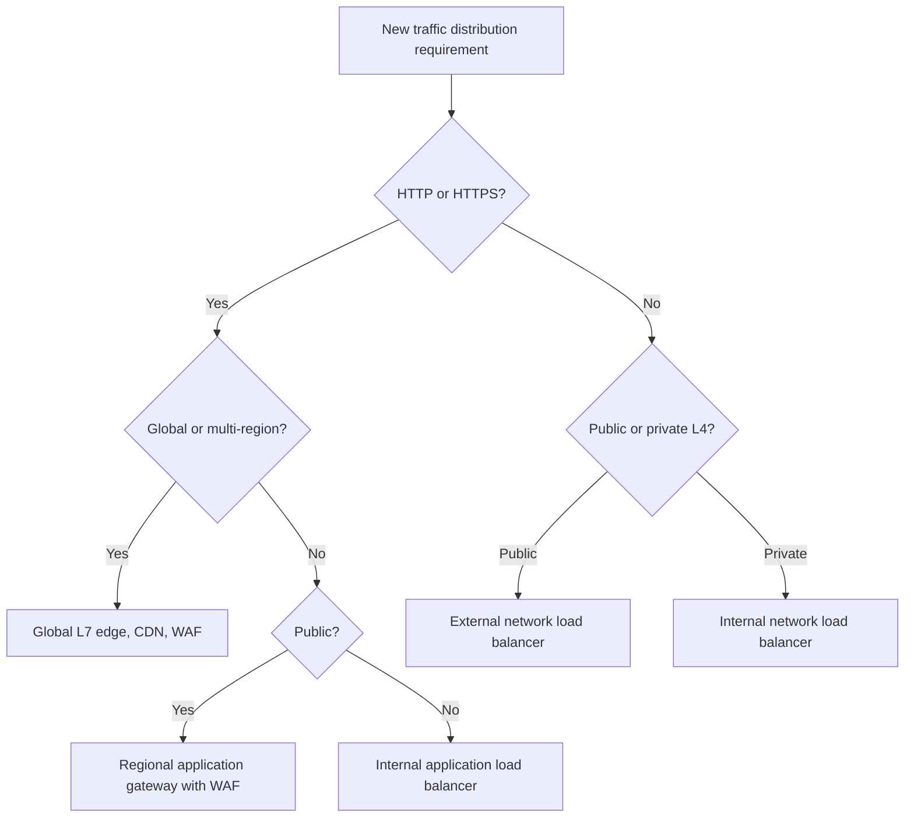
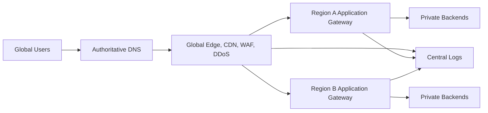

# 负载均衡和 Application Gateway 模式

## 规范语言

术语 **MUST**、**MUST NOT**、**SHOULD**、**SHOULD NOT** 和 **MAY** 是规范性的。强制性控制在无法实施时需要获取批准的例外情况。

## 常见工程要求

- 持久配置 MUST 通过批准的基础设施即代码进行部署，并通过版本控制进行审查。
- 每个资源、策略、路由、身份、端点、证书和异常 MUST 有所有者和生命周期状态。
- 生产和非生产信任边界 MUST 保持独立，除非明确的共享服务接口得到批准。
- 当满足安全性、弹性、可移植性和操作模型要求时，提供商原生功能 SHOULD 是首选。
- 日志和配置更改 MUST 发送到批准的监控和证据保留平台。
- 设计 MUST 考虑提供商配额、故障域、控制平面行为、数据处理费用和操作恢复。

## 目的

该标准定义了如何选择和操作全球和区域负载均衡器、Application Gateway、网络负载均衡器、WAF、API 网关和私有入口服务。

## 选择标准

选择 依据 MUST 包括协议、第 4 层或第 7 层、内部或外部暴露、区域或全球范围、代理或直通行为、TLS 终止、WAF 要求、源 IP 保留、后端位置、会话状态和故障转移模型。

## 提供商映射

|模式|Azure|AWS | GCP |OCI |
|---|---|---|---|---|
|全球 L7 优势|Front Door | CloudFront 的源站；相关的 Global Accelerator |Global external Application Load Balancer |边缘/WAF 服务加上区域负载均衡器或 DNS 控制 |
| L7 区域 |Application Gateway|Application Load Balancer |Regional Application Load Balancer | OCI Load Balancer |
|区域 L4 | Azure Load Balancer |Network Load Balancer|Network Load Balancer| OCI Network Load Balancer |
| WAF | Azure WAF | AWS WAF |Cloud Armor| OCI WAF |
| API 入口 | API Management| API Gateway| API Gateway 或 Apigee | OCI API Gateway |
| DNS 转向 |Traffic Manager| Route 53 策略 |Cloud DNS policies | OCI Traffic Management |

## 全球公共网络模式

Origins MUST 在支持的情况下拒绝直接互联网访问。边缘到源访问 MUST 使用私有连接、签名请求、受限地址或其他提供商支持的源控制。区域和多区域故障转移 MUST 得到测试。

## 批准的模式

### 区域私有应用

对内部 HTTP(S) 使用内部第 7 层负载均衡器。当消费者不应该接收网络范围的访问时，通过私有服务连接发布服务。

### 第 4 层服务

使用网络负载均衡器实现 TCP、UDP、TLS 直通、低延迟、高吞吐量或源地址保留。第 4 层平衡器不提供应用层 WAF 保护。

### API 入口

当身份验证、授权、配额、架构验证、转换、开发人员入驻、版本控制和 API 分析是主要要求时，请使用 API 网关。应用负载均衡器和 API 网关解决不同的问题；组合代理必须各自具有记录在案的功能。

## TLS 架构

客户端到边缘、边缘到区域网关、网关到后端以及服务到服务的 TLS 分段 MUST 明确。敏感流量 SHOULD 对后端保持加密状态。重新加密 MUST 验证后端证书和主机名。

证书 MUST 使用批准的颁发者、自动续订、受限私钥访问和过期监控。仅当每个端点都有已定义的路由或安全目的时，才允许使用多个端点。

## 健康探测

探针 MUST 使用私有端点，当实例无法提供流量时失败，避免昂贵的事务，验证适合故障转移范围的依赖项，使用正确的主机/TLS 设置，并避免波动。

当应用无法访问其关键数据存储时，仅进程的运行状况检查不足以进行区域故障转移。

## 会话状态

应用 SHOULD 是无状态的。在负载均衡器粘性之前优先选择标记化状态、共享会话存储或重新设计。在扩展和故障转移期间，MUST 测试持久性；若保留负载均衡器粘性，必须记录为遗留异常。

## 源地址和标头

只有受信任的代理 MAY 设置客户端地址标头。应用 MUST 拒绝或覆盖欺骗的外部值。完整的代理链 SHOULD 记录日志。在支持和需要的情况下使用代理协议 MAY。

## WAF 基线

除非正式例外，公共 HTTP(S) 应用 MUST 使用 WAF。策略 MUST 包括托管规则、缩小排除范围、速率限制、自定义应用控制、分阶段执行、集中日志记录和紧急阻止。

排除 范围 MUST 仅限于特定规则、参数、路径和审核日期。为一个应用缺陷禁用整个规则组是不可接受的。

## 可用性

|范围 |最小设计 |
|---|---|
|区域 |跨区域的健康后端 |
|区域 |区域弹性前端和后端容量 |
|主被动多区域 |健康指导、数据恢复、经过测试的故障转移 |
|双活多区域|全球指导、冲突安全数据架构、区域能力 |
|私有服务|冗余内部前端和服务发现|
故障转移时间包括检测、控制平面更新、DNS 缓存、连接重用、后端预热、数据准备和客户端重试行为。

## 可观测性

监控请求和连接计数、延迟、状态分布、后端运行状况、TLS 错误、WAF 操作、重置、饱和度、故障转移状态、证书过期和配置更改。关联标识符 SHOULD 连接边缘、网关和应用日志。

## 常见故障

|症状|可能的原因 |
|---|---|
|健康后端降价 |探测路径、主机标头、TLS 或安全规则不匹配 |
|重定向循环| HTTP 到 HTTPS 或主机重写规则冲突 |
| 502/503 鞋钉 |超时不匹配、饱和、目标不健康、连接重用 |
|缺少客户端 IP |没有可信标头或代理协议的代理模式 |
|缓慢的故障转移|健康阈值、DNS 缓存、后端预热、数据准备 |
|直达绕行|后端接受批准的边缘路径之外的流量 |

## 反模式

- DNS 循环作为唯一的健康机制。
- 公共网关后面公开暴露的后端。
- 用于保证正确性的粘性会话。
- 始终返回成功的健康端点。
- 跨不受信任网段的明文后端流量。
- 具有单区域数据依赖性的全局主动-主动应用。
- 广泛的 WAF 排除。

## 验证

- [ ] 层、范围、暴露和代理模式是合理的。
- [ ] 后端是私有的或明确批准的。
- [ ] WAF 针对公共 HTTP(S) 强制实施。
- [ ] 记录了 TLS 段和证书所有权。
- [ ] 探针代表真正的准备情况。
- [ ] 防止原点旁路。
- [ ] 测试故障转移和会话行为。
- [ ] 日志、指标和证书告警已启用。

## 治理和运营模式

云卓越中心负责该标准和参考模块。平台团队操作共享控制。安全性定义了强制性策略和监控要求。工作负载团队负责特定于应用的配置、数据流声明、测试和修复。

例外情况 MUST 包括被放弃的控制权、业务理由、补偿性控制权、风险责任人、到期日和修复计划。禁止永久例外；它们必须定期更新或关闭。

## 相关主题

- [云身份与访问架构](nis-cloud-identity-and-access-architecture.md)
- [企业云网络架构](nis-enterprise-cloud-network-architecture.md)
- [防火墙、路由和网络安全控制](nis-firewalls-routing-and-network-security-controls.md)

## 参考文档

- [Azure 负载均衡选项](https://learn.microsoft.com/azure/architecture/guide/technology-choices/load-balancing-overview)
- [AWS Elastic Load Balancing](https://docs.aws.amazon.com/elasticloadbalancing/)
- [AWS WAF](https://docs.aws.amazon.com/waf/)
- [GCP 负载均衡](https://cloud.google.com/load-balancing/docs/load-balancing-overview)
- [GCP Cloud Armor](https://cloud.google.com/armor/docs/cloud-armor-overview)
- [OCI Load Balancer](https://docs.oracle.com/iaas/Content/Balance/Concepts/balanceoverview.htm)
