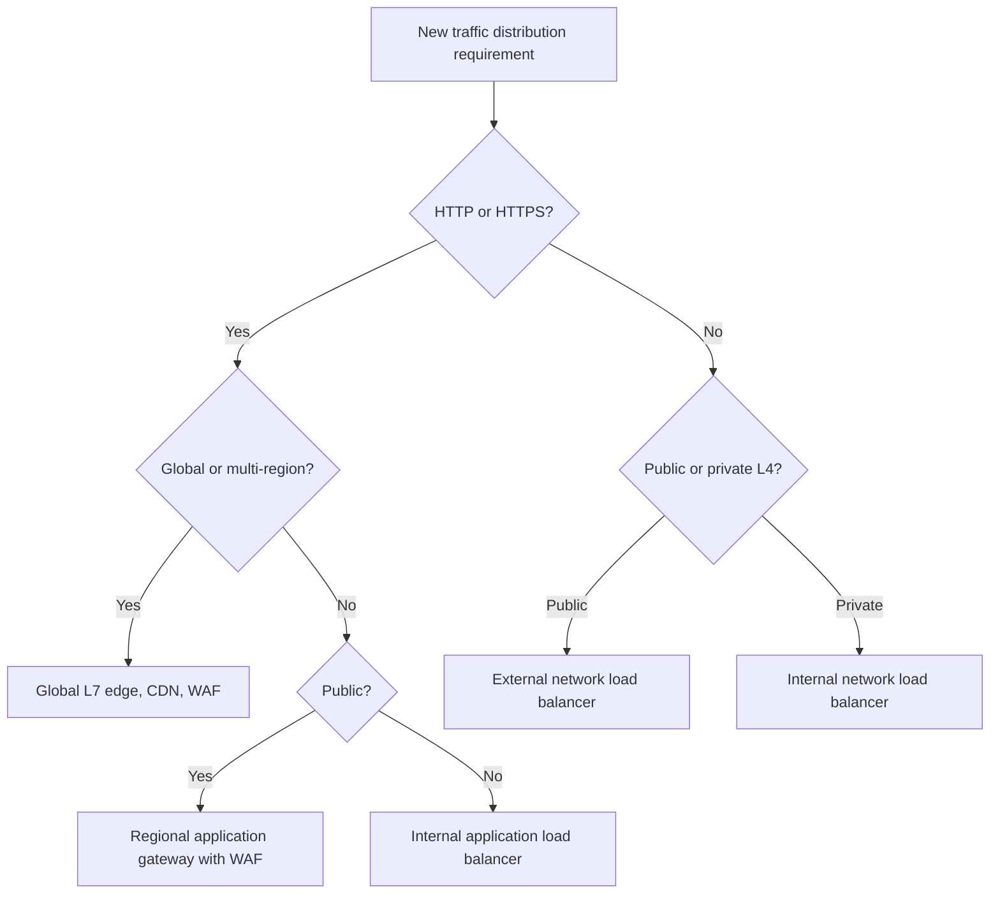
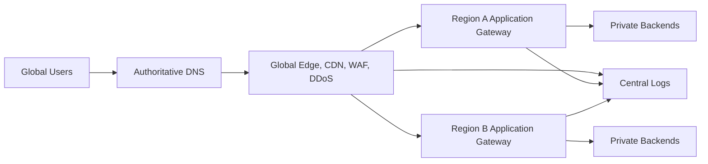

# Load Balancing and Application Gateway Patterns

## Normative language

The terms **MUST**, **MUST NOT**, **SHOULD**, **SHOULD NOT**, and **MAY** are normative. Mandatory controls require an approved exception when they cannot be implemented.

## Common engineering requirements

- Persistent configuration MUST be deployed through approved infrastructure-as-code and reviewed through version control.
- Every resource, policy, route, identity, endpoint, certificate, and exception MUST have an owner and lifecycle state.
- Production and non-production trust boundaries MUST remain separate unless an explicit shared-service interface is approved.
- Provider-native capabilities SHOULD be preferred when they meet security, resilience, portability, and operating-model requirements.
- Logs and configuration changes MUST be sent to approved monitoring and evidence-retention platforms.
- Designs MUST account for provider quotas, failure domains, control-plane behavior, data-processing charges, and operational recovery.

## Purpose

This standard defines how to select and operate global and regional load balancers, application gateways, network load balancers, WAFs, API gateways, and private ingress services.

## Selection criteria

Selection MUST be based on protocol, Layer 4 or Layer 7, internal or external exposure, regional or global scope, proxy or passthrough behavior, TLS termination, WAF requirement, source-IP preservation, backend location, session state, and failover model.

## Provider mapping

| Pattern | Azure | AWS | GCP | OCI |
|---|---|---|---|---|
| Global L7 edge | Front Door | CloudFront with origins; Global Accelerator where relevant | Global external Application Load Balancer | Edge/WAF services plus regional load balancers or DNS steering |
| Regional L7 | Application Gateway | Application Load Balancer | Regional Application Load Balancer | OCI Load Balancer |
| Regional L4 | Azure Load Balancer | Network Load Balancer | Network Load Balancer | OCI Network Load Balancer |
| WAF | Azure WAF | AWS WAF | Cloud Armor | OCI WAF |
| API ingress | API Management | API Gateway | API Gateway or Apigee | OCI API Gateway |
| DNS steering | Traffic Manager | Route 53 policies | Cloud DNS policies | OCI Traffic Management |

## Global public web pattern

Origins MUST reject direct internet access where supported. Edge-to-origin access MUST use private connectivity, signed requests, restricted addresses, or another provider-supported origin control. Regional and multi-region failover MUST be tested.

## Approved patterns

### Regional private application

Use an internal Layer 7 load balancer for internal HTTP(S). When consumers should not receive network-wide access, publish the service through private service connectivity.

### Layer 4 service

Use a network load balancer for TCP, UDP, TLS passthrough, low latency, high throughput, or source-address preservation. A Layer 4 balancer does not provide application-layer WAF protection.

### API ingress

Use an API gateway when authentication, authorization, quotas, schema validation, transformations, developer onboarding, versioning, and API analytics are primary requirements. An application load balancer and an API gateway solve different problems; combined proxies must each have a documented function.

## TLS architecture

The design MUST identify client-to-edge, edge-to-regional gateway, gateway-to-backend, and service-to-service TLS segments. Sensitive traffic SHOULD remain encrypted to the backend. Re-encryption MUST validate the backend certificate and hostname.

Certificates MUST use approved issuers, automated renewal, restricted private-key access, and expiry monitoring. Multiple termination points are allowed only when each has a defined routing or security purpose.

## Health probes

Probes MUST use a dedicated endpoint, fail when the instance cannot serve traffic, avoid expensive transactions, validate dependencies appropriate to the failover scope, use correct host/TLS settings, and avoid flapping.

A process-only health check is insufficient for regional failover when the application cannot reach its critical data store.

## Session state

Applications SHOULD be stateless. Prefer tokenized state, a shared session store, or redesign before load-balancer stickiness. Persistence as a legacy exception MUST be tested during scaling and failover.

## Source address and headers

Only trusted proxies MAY set client-address headers. Applications MUST reject or overwrite spoofed external values. The complete proxy chain SHOULD be logged. Proxy protocol MAY be used where supported and required.

## WAF baseline

Public HTTP(S) applications MUST use WAF unless formally excepted. Policy MUST include managed rules, narrow exclusions, rate limiting, custom application controls, staged enforcement, central logging, and emergency blocking.

Exclusions MUST be scoped to a specific rule, parameter, path, and review date. Disabling an entire rule group for one application defect is unacceptable.

## Availability

| Scope | Minimum design |
|---|---|
| Zonal | Healthy backends across zones |
| Regional | Zone-resilient frontend and backend capacity |
| Active-passive multi-region | Health steering, data recovery, tested failover |
| Active-active multi-region | Global steering, conflict-safe data architecture, regional capacity |
| Private service | Redundant internal frontend and service discovery |

Failover time includes detection, control-plane update, DNS caching, connection reuse, backend warm-up, data readiness, and client retry behavior.

## Observability

Monitor request and connection count, latency, status distribution, backend health, TLS errors, WAF actions, resets, saturation, failover state, certificate expiry, and configuration changes. A correlation identifier SHOULD connect edge, gateway, and application logs.

## Common failures

| Symptom | Likely cause |
|---|---|
| Healthy backend marked down | Probe path, host header, TLS, or security rule mismatch |
| Redirect loop | Conflicting HTTP-to-HTTPS or host rewrite rules |
| 502/503 spikes | Timeout mismatch, saturation, unhealthy targets, connection reuse |
| Missing client IP | Proxy mode without trusted header or proxy protocol |
| Slow failover | Health thresholds, DNS cache, backend warm-up, data readiness |
| Direct-origin bypass | Backend accepts traffic outside approved edge path |

## Anti-patterns

- DNS round-robin as the only health mechanism.
- Publicly exposed backends behind a public gateway.
- Sticky sessions used for correctness.
- Health endpoints that always return success.
- Cleartext backend traffic across an untrusted segment.
- Global active-active application with a single-region data dependency.
- Broad WAF exclusions.

## Validation

- [ ] Layer, scope, exposure, and proxy mode are justified.
- [ ] Backends are private or explicitly approved.
- [ ] WAF is enforced for public HTTP(S).
- [ ] TLS segments and certificate ownership are documented.
- [ ] Probes represent real readiness.
- [ ] Origin bypass is prevented.
- [ ] Failover and session behavior are tested.
- [ ] Logs, metrics, and certificate alerts are enabled.

## Governance and operating model

The Cloud Center of Excellence owns this standard and the reference modules. Platform teams operate shared controls. Security defines mandatory policy and monitoring requirements. Workload teams own application-specific configuration, data-flow declarations, testing, and remediation.

Exceptions MUST include the control being waived, business justification, compensating controls, risk owner, expiry date, and remediation plan. Permanent exceptions are prohibited; they must be periodically renewed or closed.

## Related topics

- [Cloud Identity and Access Architecture](nis-cloud-identity-and-access-architecture.md)
- [Enterprise Cloud Network Architecture](nis-enterprise-cloud-network-architecture.md)
- [Firewalls, Routing, and Network Security Controls](nis-firewalls-routing-and-network-security-controls.md)

## References

- [Azure load-balancing options](https://learn.microsoft.com/azure/architecture/guide/technology-choices/load-balancing-overview)
- [AWS Elastic Load Balancing](https://docs.aws.amazon.com/elasticloadbalancing/)
- [AWS WAF](https://docs.aws.amazon.com/waf/)
- [GCP Load Balancing](https://cloud.google.com/load-balancing/docs/load-balancing-overview)
- [GCP Armor](https://cloud.google.com/armor/docs/cloud-armor-overview)
- [OCI Load Balancer](https://docs.oracle.com/iaas/Content/Balance/Concepts/balanceoverview.htm)
