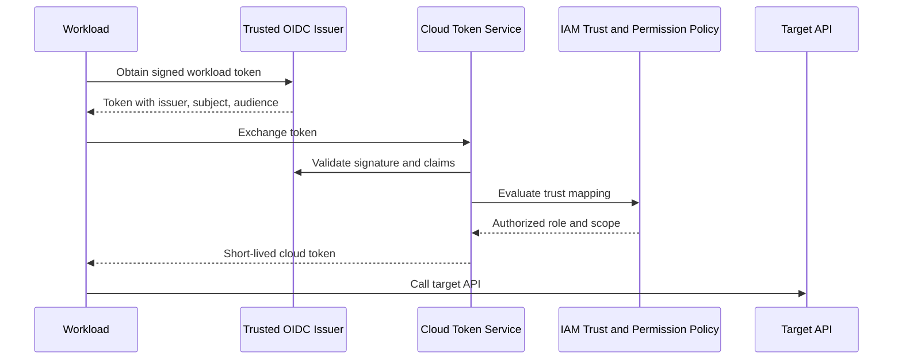
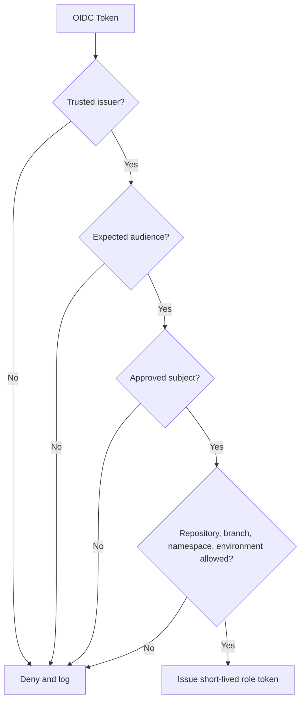
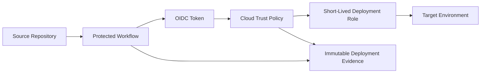

# 托管身份和工作负载身份联合

## 规范语言

术语 **MUST**、**MUST NOT**、**SHOULD**、**SHOULD NOT** 和 **MAY** 是规范性的。强制性控制在无法实施时需要获取批准的例外情况。

## 常见工程要求

- 持久配置 MUST 通过批准的基础设施即代码进行部署，并通过版本控制进行审查。
- 每个资源、策略、路由、身份、端点、证书和异常 MUST 有所有者和生命周期状态。
- 生产和非生产信任边界 MUST 保持独立，除非明确的共享服务接口得到批准。
- 当满足安全性、弹性、可移植性和操作模型要求时，提供商原生功能 SHOULD 是首选。
- 日志和配置更改 MUST 发送到批准的监控和证据保留平台。
- 设计 MUST 考虑提供商配额、故障域、控制平面行为、数据处理费用和操作恢复。

## 目的

该标准定义了虚拟机、容器、无服务器函数、应用、流水线和云服务如何在没有存储凭据的情况下进行身份验证。默认值是通过提供商管理的身份或基于标准的联合发布的短暂的、受受众限制的令牌。

## 凭证层次结构

按以下顺序使用机制：

1. 附加到计算的提供商管理的工作负载身份；
2. 使用 OIDC 或支持的令牌交换的工作负载身份联合；
3. 通过可信代理承担短期角色；
4.自动轮换机密或证书；
5. 静态凭证仅在经批准的例外情况下使用。

## 联邦流程

## 提供商映射

|模式|Azure|AWS | GCP |OCI |
|---|---|---|---|---|
|虚拟机身份|托管身份| EC2 实例配置文件/IAM 角色 |附加服务账户|实例主体 |
|Kubernetes | AKS 的内部工作负载 ID | IRSA 或 EKS Pod 身份 | GKE 的工作负载身份联合 | OKE 工作负载身份 |
|无服务器|支持的托管身份 |执行角色 |运行时服务账户|资源主体 |
|外部联盟|联邦身份凭证 | OIDC/SAML 信任和 STS |工作负载身份联合|支持的身份域/令牌交换模式 |
|持续集成/持续交付 | OIDC 至 Entra | OIDC 到 IAM 角色 | OIDC 到工作负载身份池 | OIDC/联合到 OCI IAM（如果支持）|

## 身份粒度

每个可部署工作负载 SHOULD 在每个环境中都有不同的标识。当所有权、数据访问、生命周期、信任策略或事件遏制不同时，需要单独的身份。

禁止整个集群、子网、平台或应用组合共享单一身份，除非提供商无法支持更细的粒度并且补偿控制得到批准。

## 信任策略

联合 MUST 约束发布者、受众、主题、仓库、组织、分支或标签、工作流、环境、集群、命名空间和服务账户（如果支持）。

通配符主题 SHOULD 避免使用。对于生产而言，信任每个仓库或每个 Kubernetes 服务账户都太过分了。

## 授权

身份验证识别工作负载；权限仍然需要最低权限授权。权限 MUST 使用最低的实际范围、单独的读/写/管理/委托操作、限制敏感数据平面操作，并在支持的情况下使用资源条件。

流水线部署标识和运行时应用标识 MUST 是分开的。

## Kubernetes 标准

Kubernetes 工作负载 MUST 使用映射到云工作负载身份的服务账户。节点标识 MUST NOT 成为默认的应用标识。

所需的控制包括每个信任单元一个服务账户、命名空间控制、显式 OIDC 信任、受众验证、短令牌生命周期、不需要时禁用令牌安装、身份注释的准入策略以及映射审核。

## CI/CD 模式

生产信任 MUST 绑定到受保护的环境、分支或签名标签。来自不受信任分叉的拉取请求工作流程 MUST NOT 接收生产凭证。

## 本地开发

开发人员 SHOULD 使用自己的联合员工身份并模拟或委托给开发服务身份。将生产服务账户密钥和应用机密 MUST NOT 下载到工作站。

## 元数据端点保护

提供商身份端点是安全敏感的。防止不受信任的代码查询它们，缓解 SSRF，限制 pod 对节点元数据的访问，使用提供商推荐的元数据保护，避免令牌日志记录，并通过支持的 SDK 进行刷新。

## 撤销和生命周期

过程 MUST 支持禁用身份、删除联合凭证、更改颁发者信任、使受损流水线失效、删除集群映射、减少权限以及检测残留会话。

监控令牌发布、角色假设、失败的声明验证、新的信任日志、意外仓库或集群的使用、静态密钥的创建以及工作负载退役后的使用。

## 从机密迁移

1. 盘点静态凭证。
2. 确定工作负载和目标 API。
3. 创建托管或联邦身份。
4. 授予最低限度的权限。
5. 更新代码，通过支持的 SDK 获取 token。
6. 测试允许和拒绝的操作。
7. 从运行时和流水线中删除机密。
8. 撤销旧凭证。
9. 扫描历史记录和制品是否存在泄漏。
10. 监控新身份。

## 反模式

- CI/CD 变量中的云密钥。
- 不相关工作负载共享一个身份。
- 通配符生产信任声明。
- 使用广泛节点角色的 Pod。
- 运行时和部署共享一个角色。
- 容器镜像中的关键文件。
- 授予所有者/管理员的托管身份。
- 未经受众验证就接受令牌。

## 验证

- [ ] 使用最安全的受支持凭证机制。
- [ ] 工作负载标识是细粒度的且特定于环境的。
- [ ] 发布者、受众、主题和背景受到限制。
- [ ] 运行时和部署标识是分开的。
- [ ] Kubernetes 不继承节点权限。
- [ ] 静态凭证被删除和撤销。
- [ ] 监控令牌使用和信任变化。

## 治理和运营模式

云卓越中心负责该标准和参考模块。平台团队操作共享控制。安全性定义了强制性策略和监控要求。工作负载团队负责特定于应用的配置、数据流声明、测试和修复。

例外情况 MUST 包括被放弃的控制权、业务理由、补偿性控制权、风险责任人、到期日和修复计划。禁止永久例外；它们必须定期更新或关闭。

## 相关主题

- [云身份与访问架构](nis-cloud-identity-and-access-architecture.md)
- [防火墙、路由和网络安全控制](nis-firewalls-routing-and-network-security-controls.md)
- [中心辐射式及中转网络设计](nis-hub-and-spoke-and-transit-network-design.md)

## 参考文档
- [Microsoft Entra 工作负载身份联合](https://learn.microsoft.com/entra/workload-id/workload-identity-federation)
- [AKS 的 Microsoft Entra 工作负载 ID](https://learn.microsoft.com/azure/aks/workload-identity-overview)
- [AWS IAM 角色](https://docs.aws.amazon.com/IAM/latest/UserGuide/id_roles.html)
- [GCP 工作负载身份联合](https://cloud.google.com/iam/docs/workload-identity-federation)
- [OCI dynamic groups](https://docs.oracle.com/iaas/Content/Identity/Tasks/managingdynamicgroups.htm)
- [OCI OKE 工作负载身份](https://docs.oracle.com/iaas/Content/ContEng/Tasks/contenggrantingworkloadaccesstoresources.htm)
