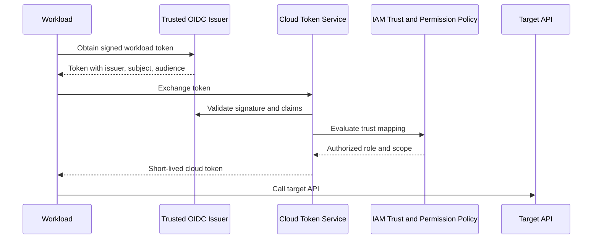
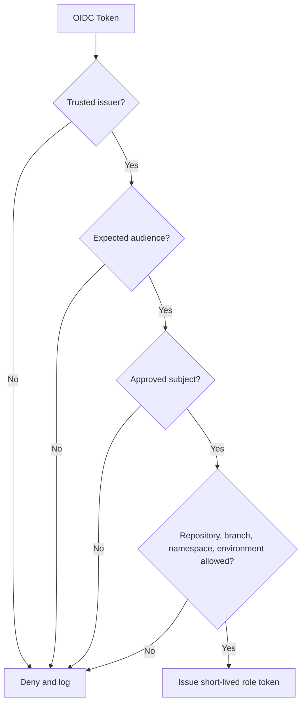
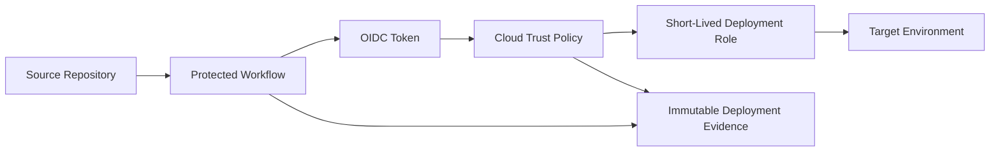

# Managed Identities and Workload Federation

## Normative language

The terms **MUST**, **MUST NOT**, **SHOULD**, **SHOULD NOT**, and **MAY** are normative. Mandatory controls require an approved exception when they cannot be implemented.

## Common engineering requirements

- Persistent configuration MUST be deployed through approved infrastructure-as-code and reviewed through version control.
- Every resource, policy, route, identity, endpoint, certificate, and exception MUST have an owner and lifecycle state.
- Production and non-production trust boundaries MUST remain separate unless an explicit shared-service interface is approved.
- Provider-native capabilities SHOULD be preferred when they meet security, resilience, portability, and operating-model requirements.
- Logs and configuration changes MUST be sent to approved monitoring and evidence-retention platforms.
- Designs MUST account for provider quotas, failure domains, control-plane behavior, data-processing charges, and operational recovery.

## Purpose

This standard defines how virtual machines, containers, serverless functions, applications, pipelines, and cloud services authenticate without stored credentials. The default is a short-lived, audience-bound token issued through provider-managed identity or standards-based federation.

## Credential hierarchy

Use mechanisms in this order:

1. provider-managed workload identity attached to compute;
2. workload identity federation using OIDC or supported token exchange;
3. short-lived role assumption through a trusted broker;
4. automatically rotated secret or certificate;
5. static credential only by approved exception.

## Federation flow

## Provider mapping

| Pattern | Azure | AWS | GCP | OCI |
|---|---|---|---|---|
| VM identity | Managed identity | EC2 instance profile / IAM role | Attached service account | Instance principal |
| Kubernetes | Entra Workload ID for AKS | IRSA or EKS Pod Identity | Workload Identity Federation for GKE | OKE workload identity |
| Serverless | Managed identity where supported | Execution role | Runtime service account | Resource principal |
| External federation | Federated identity credential | OIDC/SAML trust and STS | Workload Identity Federation | Supported identity-domain/token exchange patterns |
| CI/CD | OIDC to Entra | OIDC to IAM role | OIDC to workload identity pool | OIDC/federation to OCI IAM where supported |

## Identity granularity

Each deployable workload SHOULD have a distinct identity per environment. Separate identities are required when ownership, data access, lifecycle, trust policy, or incident containment differs.

A single identity shared by an entire cluster, subnet, platform, or application portfolio is prohibited unless the provider cannot support finer granularity and compensating controls are approved.

## Trust policy

Federation MUST constrain issuer, audience, subject, repository, organization, branch or tag, workflow, environment, cluster, namespace, and service account where supported.

Wildcard subjects SHOULD be avoided. Trusting every repository or every Kubernetes service account is excessive for production.

## Authorization

Authentication identifies the workload; permissions still require least-privilege authorization. Permissions MUST use the lowest practical scope, separate read/write/admin/delegate actions, restrict sensitive data-plane operations, and use resource conditions where supported.

Pipeline deployment identity and runtime application identity MUST be separate.

## Kubernetes standard

Kubernetes workloads MUST use a service account mapped to a cloud workload identity. Node identity MUST NOT be the default application identity.

Required controls include one service account per trust unit, namespace controls, explicit OIDC trust, audience validation, short token lifetime, disabled token mounting when not needed, admission policy for identity annotations, and mapping audits.

## CI/CD pattern

Production trust MUST bind to protected environments, branches, or signed tags. Pull-request workflows from untrusted forks MUST NOT receive production credentials.

## Local development

Developers SHOULD use their own federated workforce identity and impersonate or delegate to a development service identity. Production service-account keys and application secrets MUST NOT be downloaded to workstations.

## Metadata endpoint protection

Provider identity endpoints are security-sensitive. Prevent untrusted code from querying them, mitigate SSRF, restrict pod access to node metadata, use provider-recommended metadata protections, avoid token logging, and refresh through supported SDKs.

## Revocation and lifecycle

Procedures MUST support disabling an identity, removing a federated credential, changing issuer trust, invalidating a compromised pipeline, removing cluster mappings, reducing permissions, and detecting residual sessions.

Monitor token issuance, role assumption, failed claim validation, new trust records, use from unexpected repositories or clusters, creation of static keys, and use after workload retirement.

## Migration from secrets

1. Inventory static credentials.
2. Identify workload and target API.
3. Create managed or federated identity.
4. Grant minimal permission.
5. Update code to obtain tokens through supported SDKs.
6. Test allowed and denied actions.
7. Remove secret from runtime and pipeline.
8. Revoke the old credential.
9. Scan history and artifacts for leakage.
10. Monitor the new identity.

## Anti-patterns

- Cloud keys in CI/CD variables.
- One identity shared by unrelated workloads.
- Wildcard production trust claims.
- Pods using a broad node role.
- Runtime and deployment sharing one role.
- Key files in container images.
- Managed identity granted owner/administrator.
- Tokens accepted without audience validation.

## Validation

- [ ] Safest supported credential mechanism is used.
- [ ] Workload identity is granular and environment-specific.
- [ ] Issuer, audience, subject, and context are constrained.
- [ ] Runtime and deployment identities are separate.
- [ ] Kubernetes does not inherit node privilege.
- [ ] Static credentials are removed and revoked.
- [ ] Token use and trust changes are monitored.

## Governance and operating model

The Cloud Center of Excellence owns this standard and the reference modules. Platform teams operate shared controls. Security defines mandatory policy and monitoring requirements. Workload teams own application-specific configuration, data-flow declarations, testing, and remediation.

Exceptions MUST include the control being waived, business justification, compensating controls, risk owner, expiry date, and remediation plan. Permanent exceptions are prohibited; they must be periodically renewed or closed.

## Related topics

- [Cloud Identity and Access Architecture](nis-cloud-identity-and-access-architecture.md)
- [Firewalls, Routing, and Network Security Controls](nis-firewalls-routing-and-network-security-controls.md)
- [Hub-and-Spoke and Transit Network Design](nis-hub-and-spoke-and-transit-network-design.md)

## References

- [Microsoft Entra workload identity federation](https://learn.microsoft.com/entra/workload-id/workload-identity-federation)
- [Microsoft Entra Workload ID for AKS](https://learn.microsoft.com/azure/aks/workload-identity-overview)
- [AWS IAM roles](https://docs.aws.amazon.com/IAM/latest/UserGuide/id_roles.html)
- [GCP Workload Identity Federation](https://cloud.google.com/iam/docs/workload-identity-federation)
- [OCI dynamic groups](https://docs.oracle.com/iaas/Content/Identity/Tasks/managingdynamicgroups.htm)
- [OCI OKE workload identity](https://docs.oracle.com/iaas/Content/ContEng/Tasks/contenggrantingworkloadaccesstoresources.htm)
