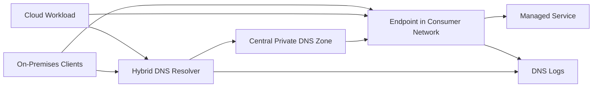
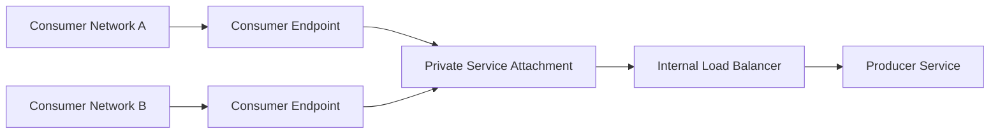
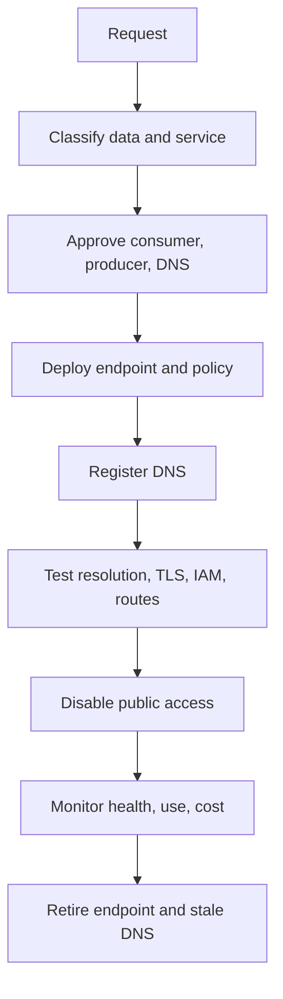

# 私有端点和私有 DNS

## 规范语言

术语 **MUST**、**MUST NOT**、**SHOULD**、**SHOULD NOT** 和 **MAY** 是规范性的。强制性控制在无法实施时需要获取批准的例外情况。

## 常见工程要求

- 持久配置 MUST 通过批准的基础设施即代码进行部署，并通过版本控制进行审查。
- 每个资源、策略、路由、身份、端点、证书和异常 MUST 有所有者和生命周期状态。
- 生产和非生产信任边界 MUST 保持独立，除非明确的共享服务接口得到批准。
- 当满足安全性、弹性、可移植性和操作模型要求时，提供商原生功能 SHOULD 是首选。
- 日志和配置更改 MUST 发送到批准的监控和证据保留平台。
- 设计 MUST 考虑提供商配额、故障域、控制平面行为、数据处理费用和操作恢复。

## 目的

该标准定义了托管服务的私有消费和内部服务的私有发布。私有连接和 DNS MUST 一起设计；没有确定性名称解析的端点是不完整的。

## 强制性结果

- 敏感服务 MUST 在分类支持和要求时使用私有访问。
- 私有访问验证后，公共网络访问 MUST 被禁用，除非明确批准双重访问。
- 应用 MUST 使用支持的服务 FQDN，而不是硬编码的专用 IP 地址。
- 私有 DNS 区域 MUST 指定一个权威所有者和自动化的日志生命周期。
- 端点创建、授权、DNS 注册、验证、监控和删除 MUST 实现自动化。
- 私有连接不会取代 IAM 或应用授权。

## 解析和连接流程

## 提供商映射

|模式|Azure|AWS | GCP |OCI |
|---|---|---|---|---|
|消费者端点|私有端点/私有链接|接口 VPC 端点；支持服务的网关端点|私有服务连接；特定模型的私有服务访问|特定于服务的私有端点或服务网关|
|服务发布|私有链接服务 | VPC 端点服务| Private Service Connect 服务附件 |专用负载均衡器或特定于服务的私有端点模式 |
|私有 DNS |私有 DNS 区域 | Route 53 private hosted zones |Cloud DNS private zones | OCI Private DNS zones |
|混合 DNS | DNS Private Resolver | Route 53 Resolver endpoints |Cloud DNS inbound/outbound forwarding | VCN resolver endpoints |

## 端点放置

当使用场景特定于工作负载时，将端点放置在工作负载网络中。仅当路由暴露、DNS 耦合、配额、成本分配、延迟和爆炸半径可接受时，集中式端点 MAY 用于多个消费者。
生产和非生产端点 MUST 保持独立。地址空间 MUST 为端点网络接口和服务增长保留容量。

## DNS 设计

- 应用 MUST NOT 取决于端点 IP 地址。
- 提供商生成的别名和规范名称 MUST 在 TLS 需要时保留。
- 水平分割行为 MUST 记录和测试。
- 每个命名空间 MUST 有一个权威目的地。
- 禁止重复的提供商私有区域，因为它们可能会产生不完整的答案。
- TTL MUST 平衡故障转移、缓存和查询负载。
- 混合转发 MUST 可防止循环和不一致的解析器链。

平台团队 SHOULD 负责自己的提供商服务区。工作负载团队 MAY 通过模块创建批准的日志记录，但 MUST NOT 创建共享命名空间的独立副本。

## 私有服务发布

私有服务发布 SHOULD 公开服务而不是生产者网络。生产者 MUST 定义批准的消费者、协议、端口、健康检查、TLS 所有权、DNS 名称、配额、日志、版本控制和弃用。

对于受限服务，生产者与消费者的接受行为 MUST 明确定义。SHOULD 避免组织范围内的自动接受。

## 安全控制

- 在可行的情况下禁用公共服务访问。
- 将端点创建限制为批准的网络和身份。
- 实施服务 IAM 和资源策略。
- 使用服务主机名验证 TLS。
- 监控端点、策略和 DNS 更改。
- 审查跨账户、跨项目、跨订阅和跨租户消费者。
- 在支持的情况下记录接受和拒绝的访问。

私有端点流量可能不遵循正常的用户定义路由。设计 MUST 在要求防火墙检查之前验证提供商行为。当强制进行内容检查时，请使用受支持的 Application Proxy、API 网关、生产者端控制、服务网格或经过检查的发布架构。

## 生命周期

退役操作 MUST 删除端点资源、策略和托管 DNS 记录。在允许删除之前，系统 MUST 记录共享端点依赖关系。

## 验证测试

测试来自预期和非预期消费者的解析、返回的 IP 分类、路由路径、TLS 主机名、服务授权、公共端点行为、端点故障、DNS 重新创建和日志传送。

## 常见故障

|症状|可能的原因 |
|---|---|
|公共地址返回 |缺少区域链接或转发规则 |
| NX 域 |重复或不完整的私有区域 |
| TLS 不匹配 |客户端使用的 IP 或不支持的别名 |
|云工作正常，本地失败 |混合解析器或路由缺失 |
|连接成功但访问被拒绝 | IAM、资源策略或端点策略 |
|间歇性响应 |解析器转发不一致 |
|删除中断 |共享端点在没有依赖项清单的情况下被删除 |

## 反模式

- 具有不受限制的公共访问的私有端点。
- 硬编码的私有 IP 地址。
- 重复的私有 DNS 区域。
- 一个端点在所有环境中共享，无需分析。
- 广泛的对等互连，服务发布就足够了。
- 假设私有连接等于授权。
- 不支持强制端点流量通过防火墙的路由。

## 验证

- [ ] 端点放置和地址容量合理。
- [ ] 定义 DNS 权限和混合转发。
- [ ] TLS 使用预期的服务主机名。
- [ ] IAM 和资源策略强制执行最小权限。
- [ ] 公共访问被禁用或合理。
- [ ] 端点和 DNS 删除是自动的。
- [ ] 日志和告警已启用。

## 治理和运营模式

云卓越中心负责该标准和参考模块。平台团队操作共享控制。安全性定义了强制性策略和监控要求。工作负载团队负责特定于应用的配置、数据流声明、测试和修复。

例外情况 MUST 包括被放弃的控制权、业务理由、补偿性控制权、风险责任人、到期日和修复计划。禁止永久例外；它们必须定期更新或关闭。

## 相关主题

- [零信任和私有访问设计](nis-zero-trust-and-private-access-design.md)
- [防火墙、路由和网络安全控制](nis-firewalls-routing-and-network-security-controls.md)
- [中心辐射式及中转网络设计](nis-hub-and-spoke-and-transit-network-design.md)

## 参考文档

- [中心辐射网络中的 Azure Private Link](https://learn.microsoft.com/azure/architecture/networking/guide/private-link-hub-spoke-network)
- [Azure DNS Private Resolver](https://learn.microsoft.com/azure/architecture/networking/architecture/azure-dns-private-resolver)
- [AWS PrivateLink 概念](https://docs.aws.amazon.com/vpc/latest/privatelink/concepts.html)
- [Route 53 Resolver](https://docs.aws.amazon.com/Route53/latest/DeveloperGuide/resolver.html)
- [GCP Private Service Connect](https://cloud.google.com/vpc/docs/private-service-connect)
- [应用于混合云和多云的 OCI 私有 DNS](https://docs.oracle.com/en/solutions/oci-best-practices-networking/private-dns-oci-and-premises-or-third-party-cloud.html)
