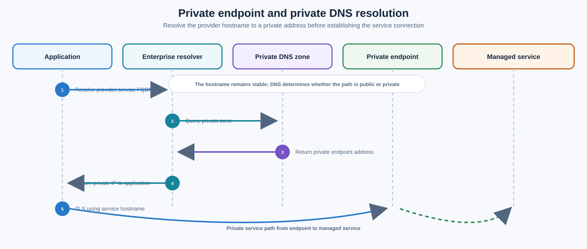
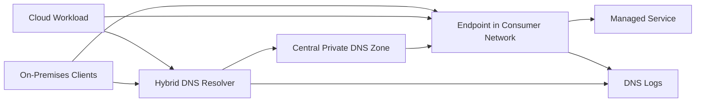
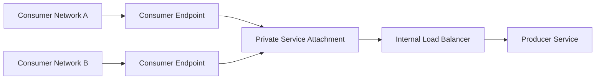
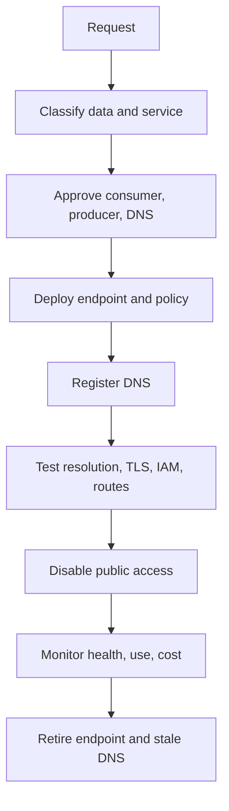

# Private Endpoints and Private DNS

## Normative language

The terms **MUST**, **MUST NOT**, **SHOULD**, **SHOULD NOT**, and **MAY** are normative. Mandatory controls require an approved exception when they cannot be implemented.

## Common engineering requirements

- Persistent configuration MUST be deployed through approved infrastructure-as-code and reviewed through version control.
- Every resource, policy, route, identity, endpoint, certificate, and exception MUST have an owner and lifecycle state.
- Production and non-production trust boundaries MUST remain separate unless an explicit shared-service interface is approved.
- Provider-native capabilities SHOULD be preferred when they meet security, resilience, portability, and operating-model requirements.
- Logs and configuration changes MUST be sent to approved monitoring and evidence-retention platforms.
- Designs MUST account for provider quotas, failure domains, control-plane behavior, data-processing charges, and operational recovery.

## Purpose

This standard defines private consumption of managed services and private publishing of internal services. Private connectivity and DNS MUST be designed together; an endpoint without deterministic name resolution is incomplete.

## Mandatory outcomes

- Sensitive services MUST use private access when supported and required by classification.
- Public network access MUST be disabled after private access is validated, unless dual access is explicitly approved.
- Applications MUST use the supported service FQDN rather than hard-coded private IP addresses.
- Private DNS zones MUST have one authoritative owner and automated record lifecycle.
- Endpoint creation, authorization, DNS registration, validation, monitoring, and deletion MUST be automated.
- Private connectivity does not replace IAM or application authorization.

## Resolution and connection flow

## Provider mapping

| Pattern | Azure | AWS | GCP | OCI |
|---|---|---|---|---|
| Consumer endpoint | Private Endpoint / Private Link | Interface VPC endpoint; gateway endpoint for supported services | Private Service Connect; private services access for specific models | Service-specific private endpoints or service gateway |
| Service publishing | Private Link Service | VPC endpoint service | Private Service Connect service attachment | Private load balancer or service-specific private endpoint pattern |
| Private DNS | Private DNS zones | Route 53 private hosted zones | Cloud DNS private zones | OCI private DNS zones |
| Hybrid DNS | DNS Private Resolver | Route 53 Resolver endpoints | Cloud DNS inbound/outbound forwarding | VCN resolver endpoints |

## Endpoint placement

Place the endpoint in the workload network when consumption is workload-specific. A centralized endpoint MAY be used for multiple consumers only when route exposure, DNS coupling, quotas, cost allocation, latency, and blast radius are acceptable.

Production and non-production endpoints MUST remain separate. Address space MUST reserve capacity for endpoint network interfaces and service growth.

## DNS design

- Applications MUST NOT depend on endpoint IP addresses.
- Provider-generated aliases and canonical names MUST be preserved when required for TLS.
- Split-horizon behavior MUST be documented and tested.
- Each namespace MUST have one authoritative destination.
- Duplicate provider private zones are prohibited because they can produce incomplete answers.
- TTLs MUST balance failover, caching, and query load.
- Hybrid forwarding MUST prevent loops and inconsistent resolver chains.

The platform team SHOULD own provider service zones. Workload teams MAY create approved records through modules but MUST NOT create independent copies of shared namespaces.

## Private service publishing

Private service publishing SHOULD expose a service rather than the producer network. The producer MUST define approved consumers, protocols, ports, health checks, TLS ownership, DNS name, quotas, logging, versioning, and deprecation.

Producer-consumer acceptance MUST be explicit for restricted services. Organization-wide automatic acceptance SHOULD be avoided.

## Security controls

- Disable public service access where feasible.
- Restrict endpoint creation to approved networks and identities.
- Enforce service IAM and resource policies.
- Validate TLS with the service hostname.
- Monitor endpoint, policy, and DNS changes.
- Review cross-account, cross-project, cross-subscription, and cross-tenancy consumers.
- Log accepted and denied access where supported.

Private endpoint traffic may not follow normal user-defined routes. Designs MUST verify provider behavior before claiming firewall inspection. When content inspection is mandatory, use a supported application proxy, API gateway, producer-side control, service mesh, or inspected publishing architecture.

## Lifecycle

Deletion MUST remove endpoint resources, policy, and managed DNS records. Shared endpoint dependencies MUST be recorded before deletion is permitted.

## Validation tests

Test resolution from intended and unintended consumers, returned IP classification, route path, TLS hostname, service authorization, public endpoint behavior, endpoint failure, DNS recreation, and log delivery.

## Common failures

| Symptom | Likely cause |
|---|---|
| Public address returned | Missing zone link or forwarding rule |
| NXDOMAIN | Duplicate or incomplete private zone |
| TLS mismatch | Client used IP or unsupported alias |
| Cloud works, on-premises fails | Hybrid resolver or route missing |
| Connection succeeds but access denied | IAM, resource policy, or endpoint policy |
| Intermittent answers | Inconsistent resolver forwarding |
| Deletion outage | Shared endpoint removed without dependency inventory |

## Anti-patterns

- Private endpoint with unrestricted public access.
- Hard-coded private IP addresses.
- Duplicate private DNS zones.
- One endpoint shared across all environments without analysis.
- Broad peering where service publishing is sufficient.
- Assuming private connectivity equals authorization.
- Unsupported routing to force endpoint traffic through a firewall.

## Validation

- [ ] Endpoint placement and address capacity are justified.
- [ ] DNS authority and hybrid forwarding are defined.
- [ ] TLS uses the intended service hostname.
- [ ] IAM and resource policy enforce least privilege.
- [ ] Public access is disabled or justified.
- [ ] Endpoint and DNS deletion is automated.
- [ ] Logs and alerts are enabled.

## Governance and operating model

The Cloud Center of Excellence owns this standard and the reference modules. Platform teams operate shared controls. Security defines mandatory policy and monitoring requirements. Workload teams own application-specific configuration, data-flow declarations, testing, and remediation.

Exceptions MUST include the control being waived, business justification, compensating controls, risk owner, expiry date, and remediation plan. Permanent exceptions are prohibited; they must be periodically renewed or closed.

## Related topics

- [Zero-Trust and Private-Access Design](nis-zero-trust-and-private-access-design.md)
- [Firewalls, Routing, and Network Security Controls](nis-firewalls-routing-and-network-security-controls.md)
- [Hub-and-Spoke and Transit Network Design](nis-hub-and-spoke-and-transit-network-design.md)

## References

- [Azure Private Link in hub-spoke networks](https://learn.microsoft.com/azure/architecture/networking/guide/private-link-hub-spoke-network)
- [Azure DNS Private Resolver](https://learn.microsoft.com/azure/architecture/networking/architecture/azure-dns-private-resolver)
- [AWS PrivateLink concepts](https://docs.aws.amazon.com/vpc/latest/privatelink/concepts.html)
- [Route 53 Resolver](https://docs.aws.amazon.com/Route53/latest/DeveloperGuide/resolver.html)
- [GCP Private Service Connect](https://cloud.google.com/vpc/docs/private-service-connect)
- [OCI private DNS for hybrid and multicloud](https://docs.oracle.com/en/solutions/oci-best-practices-networking/private-dns-oci-and-premises-or-third-party-cloud.html)
