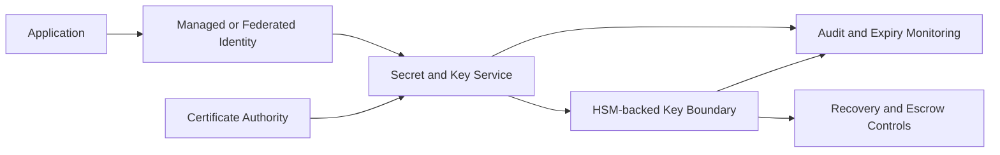
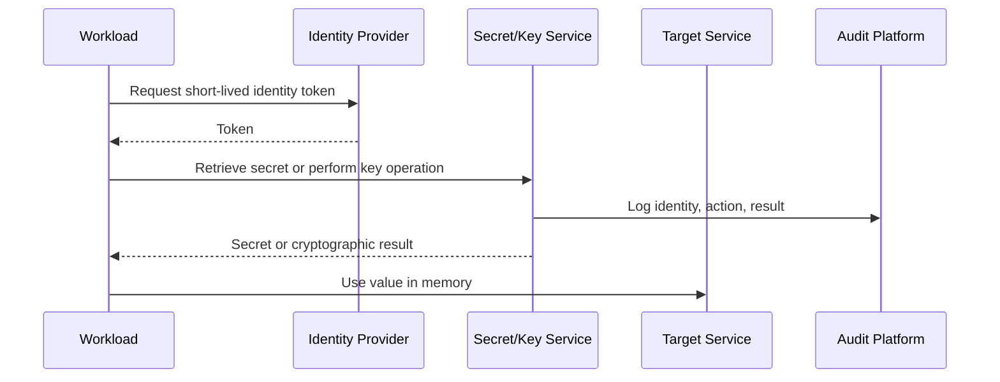

# 机密、证书和密钥管理

## 规范语言

术语 **MUST**、**MUST NOT**、**SHOULD**、**SHOULD NOT** 和 **MAY** 是规范性的。强制性控制在无法实施时需要获取批准的例外情况。

## 常见工程要求

- 持久配置 MUST 通过批准的基础设施即代码进行部署，并通过版本控制进行审查。
- 每个资源、策略、路由、身份、端点、证书和异常 MUST 有所有者和生命周期状态。
- 生产和非生产信任边界 MUST 保持独立，除非明确的共享服务接口得到批准。
- 当满足安全性、弹性、可移植性和操作模型要求时，提供商原生功能 SHOULD 是首选。
- 日志和配置更改 MUST 发送到批准的监控和证据保留平台。
- 设计 MUST 考虑提供商配额、故障域、控制平面行为、数据处理费用和操作恢复。

## 目的

该标准定义了机密、证书、私钥、加密密钥、信任锚和恢复材料的创建、存储、分发、使用、轮换、监控、恢复和销毁。

第一个控制是消除：存在可以由托管身份或工作负载身份联合 SHOULD NOT 替换的凭证。

## 资产类别

|资产|示例 |主要风险 |
|---|---|---|
|机密|密码、API 令牌、连接字符串 |泄露和未经授权的使用 |
|证书| TLS 服务器/客户端或签名证书 |过期、冒充、信任失败 |
|私钥| TLS、SSH、签名、加密密钥 |不可逆的密钥泄露|
|加密密钥|对称或非对称数据密钥 |泄露或永久数据丢失 |
|信任锚|根/中间 CA |系统性模仿|
|恢复材料|托管或紧急凭证 |高影响力的滥用|

## 提供商映射

|能力|Azure|AWS | GCP |OCI |
|---|---|---|---|---|
|机密存储| Key Vault 的机密 | Secrets Manager / Parameter Store（如果适用）|Secrets Manager| OCI Vault 中的机密 |
|密钥管理| Key Vault / 托管 HSM | KMS / Cloud HSM |Cloud KMS/Cloud HSM | OCI Vault / HSM 支持的密钥 |
|证书 | Key Vault 证书和托管服务证书 |Certificate Manager / Private CA |Certificate Manager / CA Service | OCI Certificates |
|工作负载访问 |托管身份| IAM 角色 |服务账户/工作负载身份 |资源/工作负载主体 |

## 参考架构

## 所有权和清单

每项资产 MUST 记录企业所有者、技术所有者、应用、环境、分类、允许使用者、轮换期、到期日、回收要求、销毁要求。禁止共享无主机密。

## 机密消除

在创建机密之前，请评估托管身份、工作负载身份联合、双向 TLS、短期签名令牌、角色假设和动态颁发的凭据。架构日志 MUST 解释为什么仍然需要存储的机密。

## 存储要求

机密和私钥 MUST NOT 存储在源代码、容器镜像、票证、聊天、CI/CD 日志、未加密文件、浏览器存储或通用配置存储中。包含敏感值的 Terraform 状态 MUST 使用批准的加密、访问控制和状态隔离。

批准的存储 MUST 提供适合资产的加密、访问控制、审计日志、生命周期/版本控制和恢复。

## 运行时访问

应用 SHOULD 在运行时检索机密，并仅在必要时将其保留在内存中。记录机密值 MUST NOT。加密操作 SHOULD 发生在托管服务内部，因此私钥仍然不可导出。

## 密钥管理

信封加密 SHOULD 使用受密钥加密密钥保护的数据加密密钥。 MUST 明确决定使用提供商管理的密钥还是客户管理的密钥，以及软件保护还是 HSM 保护、区域范围、轮换、导入与提供商生成、备份、恢复和职责分离。

客户管理的密钥增加了操作风险。选择 MUST NOT 只是为显得更安全。

任何单一角色 SHOULD 都无法管理密钥、授予自己密钥使用权、解密受保护的数据、禁用日志记录和销毁密钥。关键删除需要等待期、影响审查和多方批准。

## 证书管理

在支持的情况下，证书 MUST 自动颁发和更新。清单 MUST 包括名称、发布者、序列/指纹、所有者、部署位置、可导出性、到期、续订、撤销和信任链依赖性。

公共服务 MUST 使用公共信任的证书，除非客户端信任模型明确支持私有 PKI。内部服务 SHOULD 使用企业私有 PKI 或托管私有 CA 服务。

典型的到期告警包括 60 天警告、30 天高级告警、14 天严重告警和 7 天事件告警；短期证书需要比例阈值。

应用 MUST NOT 禁用 TLS 验证。根和中间信任变更 MUST 进行集中管理。

## 旋转

|资产|默认期望 |
|---|---|
|联合令牌 |分钟到小时 |
|动态数据库凭证 |分钟到小时 |
| API 机密 | 90 天或更短时间，除非受到服务限制 |
|服务账户密钥 |默认禁止 |
| TLS 证书 |到期前自动续订 |
|加密密钥|提供商支持的自动或策略轮换 |
|紧急证件 |使用后按受控时间表轮换 |

轮换 MUST 在无需停机的情况下测试。当消费者无法自动切换时，双版本推出 SHOULD 在消费者无法自动切换时使用。

## 备份与恢复

恢复设计 MUST 区分机密版本恢复、软删除、密钥备份、不可导出的 HSM 密钥、副本、证书重新颁发和不可逆销毁。恢复测试 MUST 证明受保护的数据是可用的。没有所需密钥的密文备份是没有用的。

## 日志记录和告警

收集机密读取、加密/解密/签名操作、权限更改、凭证版本、证书颁发、密钥禁用/删除、私钥导出、网络策略更改、记录更改、故障和异常访问量。

立即发出有关关键密钥删除、私钥导出、公共 Vault 访问、异常读取、证书过期、新的长期密钥和恢复策略更改的告警。

## 事件响应

可疑的泄露需要撤销、替换、消费者更新、审计审查、下游影响分析、从仓库历史记录和制品中删除以及预防性修复。未经调查的轮换是不完整的。
## 反模式

- 源代码控制的机密。
- 长期服务账户密钥。
- 跨应用共享一个凭证。
- 手动证书更新。
- 禁用 TLS 验证。
- 客户管理的密钥，无需恢复。
- 应用管理员能够删除加密密钥。
- 导出的私钥在服务器之间复制。

## 验证

- [ ] 凭证无法删除。
- [ ] 记录所有权和消费者。
- [ ] 使用经批准的托管存储。
- [ ] 工作负载访问是最低权限。
- [ ] 在可行的情况下，私钥仍然不可导出。
- [ ] 轮换和更新是自动的。
- [ ] 恢复已测试。
- [ ] 密钥管理与数据使用分开。
- [ ] 日志和事件程序已启用。

## 治理和运营模式

云卓越中心负责该标准和参考模块。平台团队操作共享控制。安全性定义了强制性策略和监控要求。工作负载团队负责特定于应用的配置、数据流声明、测试和修复。

例外情况 MUST 包括被放弃的控制权、业务理由、补偿性控制权、风险责任人、到期日和修复计划。禁止永久例外；它们必须定期更新或关闭。

## 相关主题

- [防火墙、路由和网络安全控制](nis-firewalls-routing-and-network-security-controls.md)
- [中心辐射式中转网络设计](nis-hub-and-spoke-and-transit-network-design.md)
- [托管身份和工作负载身份联合](nis-managed-identities-and-workload-federation.md)

## 参考文档

- [Azure Key Vault](https://learn.microsoft.com/azure/key-vault/)
- [AWS Secrets Manager](https://docs.aws.amazon.com/secretsmanager/)
- [AWS KMS](https://docs.aws.amazon.com/kms/)
- [GCP Secret Manager](https://cloud.google.com/secret-manager/docs)
- [GCP KMS](https://cloud.google.com/kms/docs)
- [OCI Vault](https://docs.oracle.com/iaas/Content/KeyManagement/home.htm)
- [OCI Certificates](https://docs.oracle.com/iaas/Content/certificates/home.htm)
