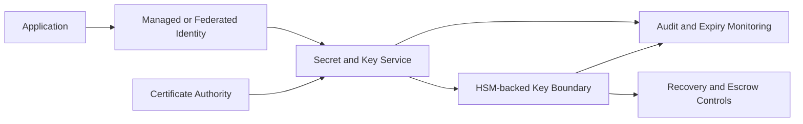
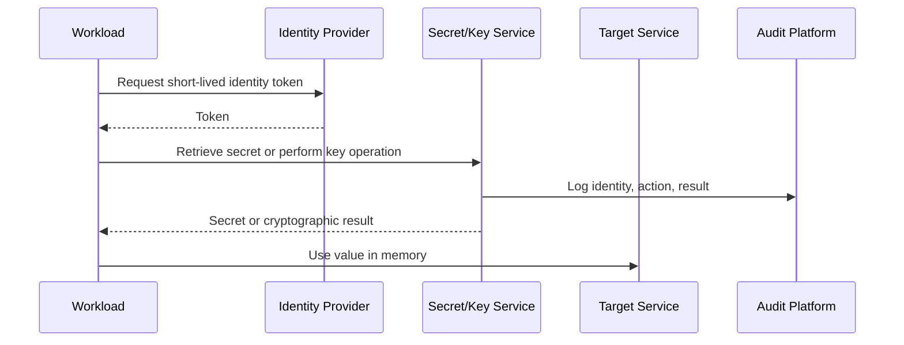

# Secrets, Certificates, and Key Management

## Normative language

The terms **MUST**, **MUST NOT**, **SHOULD**, **SHOULD NOT**, and **MAY** are normative. Mandatory controls require an approved exception when they cannot be implemented.

## Common engineering requirements

- Persistent configuration MUST be deployed through approved infrastructure-as-code and reviewed through version control.
- Every resource, policy, route, identity, endpoint, certificate, and exception MUST have an owner and lifecycle state.
- Production and non-production trust boundaries MUST remain separate unless an explicit shared-service interface is approved.
- Provider-native capabilities SHOULD be preferred when they meet security, resilience, portability, and operating-model requirements.
- Logs and configuration changes MUST be sent to approved monitoring and evidence-retention platforms.
- Designs MUST account for provider quotas, failure domains, control-plane behavior, data-processing charges, and operational recovery.

## Purpose

This standard defines creation, storage, distribution, use, rotation, monitoring, recovery, and destruction of secrets, certificates, private keys, encryption keys, trust anchors, and recovery material.

The first control is elimination: a credential that can be replaced by managed identity or workload federation SHOULD NOT exist.

## Asset classes

| Asset | Examples | Primary risk |
|---|---|---|
| Secret | Password, API token, connection string | Leakage and unauthorized use |
| Certificate | TLS server/client or signing certificate | Expiry, impersonation, trust failure |
| Private key | TLS, SSH, signing, encryption key | Irrecoverable compromise |
| Encryption key | Symmetric or asymmetric data key | Disclosure or permanent data loss |
| Trust anchor | Root/intermediate CA | Systemic impersonation |
| Recovery material | Escrow or emergency credential | High-impact abuse |

## Provider mapping

| Capability | Azure | AWS | GCP | OCI |
|---|---|---|---|---|
| Secret store | Key Vault secrets | Secrets Manager / Parameter Store where appropriate | Secret Manager | OCI Vault secrets |
| Key management | Key Vault / Managed HSM | KMS / CloudHSM | Cloud KMS / Cloud HSM | OCI Vault / HSM-backed keys |
| Certificates | Key Vault certificates and managed service certificates | Certificate Manager / Private CA | Certificate Manager / CA Service | OCI Certificates |
| Workload access | Managed identity | IAM role | Service account/workload identity | Resource/workload principal |

## Reference architecture

## Ownership and inventory

Every asset MUST record business owner, technical owner, application, environment, classification, allowed consumers, rotation period, expiry, recovery requirement, and destruction requirement. Shared unowned secrets are prohibited.

## Secret elimination

Before creating a secret, evaluate managed identity, workload federation, mutual TLS, short-lived signed tokens, role assumption, and dynamically issued credentials. The architecture record MUST explain why a stored secret remains necessary.

## Storage requirements

Secrets and private keys MUST NOT be stored in source code, container images, tickets, chat, CI/CD logs, unencrypted files, browser storage, or general configuration stores. Terraform state containing sensitive values MUST use approved encryption, access control, and state isolation.

Approved stores MUST provide encryption, access control, audit logging, lifecycle/versioning, and recovery appropriate to the asset.

## Runtime access

Applications SHOULD retrieve secrets at runtime and retain them in memory only as long as necessary. Secret values MUST NOT be logged. Cryptographic operations SHOULD occur inside the managed service so private keys remain non-exportable.

## Key management

Envelope encryption SHOULD use data-encryption keys protected by key-encryption keys. The design MUST decide provider-managed versus customer-managed keys, software versus HSM protection, regional scope, rotation, import versus provider generation, backup, recovery, and separation of duties.

Customer-managed keys add operational risk. They MUST NOT be selected merely to appear more secure.

No single role SHOULD be able to administer a key, grant itself key use, decrypt protected data, disable logging, and destroy the key. Critical deletion requires waiting periods, impact review, and multi-party approval.

## Certificate management

Certificates MUST be automatically issued and renewed where supported. Inventory MUST include names, issuer, serial/thumbprint, owner, deployment locations, exportability, expiry, renewal, revocation, and trust-chain dependencies.

Public services MUST use publicly trusted certificates unless the client trust model explicitly supports private PKI. Internal services SHOULD use enterprise private PKI or managed private CA services.

Typical expiry alerts are 60 days warning, 30 days elevated, 14 days critical, and 7 days incident; short-lived certificates require proportional thresholds.

Applications MUST NOT disable TLS validation. Root and intermediate trust changes MUST be centrally governed.

## Rotation

| Asset | Default expectation |
|---|---|
| Federated token | Minutes to hours |
| Dynamic database credential | Minutes to hours |
| API secret | 90 days or less unless limited by service |
| Service-account key | Prohibited by default |
| TLS certificate | Automatic renewal before expiry |
| Encryption key | Provider-supported automatic or policy rotation |
| Emergency credential | Rotate after use and on controlled schedule |

Rotation MUST be tested without downtime. Dual-version rollout SHOULD be used when consumers cannot switch atomically.

## Backup and recovery

Recovery design MUST distinguish secret version recovery, soft delete, key backup, non-exportable HSM keys, replicas, certificate reissuance, and irreversible destruction. Recovery tests MUST prove that protected data is usable. Ciphertext backups without the required keys are useless.

## Logging and alerts

Collect secret reads, encrypt/decrypt/sign operations, permission changes, credential versions, certificate issuance, key disablement/deletion, private-key export, network-policy changes, logging changes, failures, and unusual access volume.

Alert immediately on critical key deletion, private-key export, public vault access, anomalous reads, certificate expiry, new long-lived keys, and recovery-policy changes.

## Incident response

A suspected compromise requires credential revocation, replacement, consumer update, audit review, downstream impact analysis, removal from repository history and artifacts, and preventive remediation. Rotation without investigation is incomplete.

## Anti-patterns

- Secrets in source control.
- Long-lived service-account keys.
- One credential shared across applications.
- Manual certificate renewal.
- Disabled TLS validation.
- Customer-managed keys without recovery.
- Application administrators able to delete encryption keys.
- Exported private keys copied between servers.

## Validation

- [ ] The credential cannot be eliminated.
- [ ] Ownership and consumers are recorded.
- [ ] An approved managed store is used.
- [ ] Workload access is least privilege.
- [ ] Private keys remain non-exportable where feasible.
- [ ] Rotation and renewal are automated.
- [ ] Recovery is tested.
- [ ] Key administration is separated from data use.
- [ ] Logs and incident procedures are enabled.

## Governance and operating model

The Cloud Center of Excellence owns this standard and the reference modules. Platform teams operate shared controls. Security defines mandatory policy and monitoring requirements. Workload teams own application-specific configuration, data-flow declarations, testing, and remediation.

Exceptions MUST include the control being waived, business justification, compensating controls, risk owner, expiry date, and remediation plan. Permanent exceptions are prohibited; they must be periodically renewed or closed.

## Related topics

- [Firewalls, Routing, and Network Security Controls](nis-firewalls-routing-and-network-security-controls.md)
- [Hub-and-Spoke and Transit Network Design](nis-hub-and-spoke-and-transit-network-design.md)
- [Managed Identities and Workload Federation](nis-managed-identities-and-workload-federation.md)

## References

- [Azure Key Vault](https://learn.microsoft.com/azure/key-vault/)
- [AWS Secrets Manager](https://docs.aws.amazon.com/secretsmanager/)
- [AWS KMS](https://docs.aws.amazon.com/kms/)
- [GCP Secret Manager](https://cloud.google.com/secret-manager/docs)
- [GCP KMS](https://cloud.google.com/kms/docs)
- [OCI Vault](https://docs.oracle.com/iaas/Content/KeyManagement/home.htm)
- [OCI Certificates](https://docs.oracle.com/iaas/Content/certificates/home.htm)
