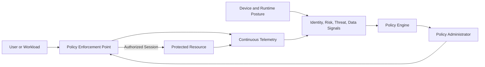
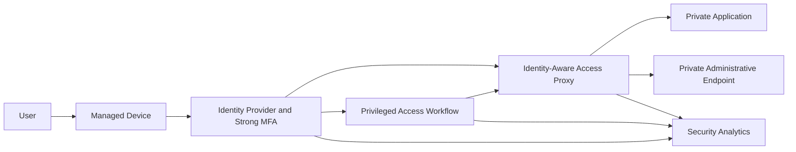
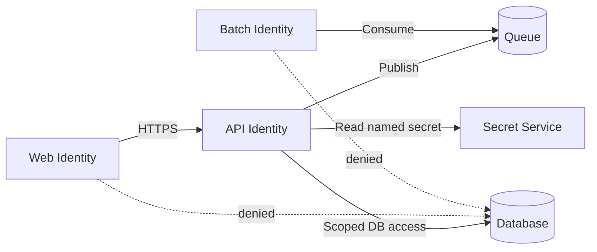

# 零信任和私有访问设计

## 规范语言

术语 **MUST**、**MUST NOT**、**SHOULD**、**SHOULD NOT** 和 **MAY** 是规范性的。强制性控制在无法实施时需要获取批准的例外情况。

## 常见工程要求

- 持久配置 MUST 通过批准的基础设施即代码进行部署，并通过版本控制进行审查。
- 每个资源、策略、路由、身份、端点、证书和异常 MUST 有所有者和生命周期状态。
- 生产和非生产信任边界 MUST 保持独立，除非明确的共享服务接口得到批准。
- 当满足安全性、弹性、可移植性和操作模型要求时，提供商原生功能 SHOULD 是首选。
- 日志和配置更改 MUST 发送到批准的监控和证据保留平台。
- 设计 MUST 考虑提供商配额、故障域、控制平面行为、数据处理费用和操作恢复。

## 目的

该标准定义了云和混合访问的零信任实施。零信任需要显式验证、最小特权、持续评估、假设违规和以资源为中心的保护。它不是产品，也不等同于私有 IP 寻址。

## 核心原则

1. 明确验证身份、设备、工作负载、资源、会话、风险和上下文。
2. 在最短的时间内授予最小的范围。
3. 假设已遭入侵并最小化爆炸半径。
4. 直接保护资源而不是信任网络位置。
5. 当风险或环境发生变化时重新评估访问权限。
6. 在可行的情况下实现策略、证据和响应的自动化。

## 逻辑架构

策略引擎决定，策略管理员建立或终止会话，执行点调解访问。

## 提供商能力映射

|能力|Azure|AWS | GCP |OCI |
|---|---|---|---|---|
|有条件的身份访问 | Entra 条件访问和身份保护 | IAM Identity Center 和外部 IdP 上下文；服务控制|Context-Aware Access / Access Context Manager |Identity Domains sign-in 和自适应策略|
|身份感知私有应用访问 |内部私有访问/Application Proxy| AWS Verified Access |身份感知代理/BeyondCorp 功能| OCI IAM/网关模式和合作伙伴 ZTNA（如果需要）|
|工作负载身份|托管身份/工作负载 ID | IAM 角色/STS |工作负载身份联合|实例、资源、工作负载主体 |
|微分段| NSG、ASG、防火墙策略 |安全组、网络防火墙|防火墙策略和安全标签| NSG、网络防火墙、零信任数据包路由 |
|私有服务接入 |私有链接 |私有链接 |私有服务连接 |私有端点/服务网关模式 |

## 私有访问架构

私有访问 MUST 授权特定应用或管理服务。它 SHOULD NOT 将用户广泛放置在网络上。

## 员工访问

评估身份、MFA 强度、设备合规性、风险、应用敏感性、请求的权限和会话上下文。高风险访问 SHOULD 要求加强身份验证、缩短会话或拒绝。

一般 VPN 访问 SHOULD 被减少，有利于特定于应用的访问。 VPN MAY 仍然用于传统协议、网络工程或恢复，但 MUST 仅公开所需的路由并使用强大的设备和身份控制。

## 管理权限

管理接口 MUST NOT 成为公共的。批准的方法包括身份识别私有访问、没有公共工作负载地址的堡垒、特权工作站、与特权角色相结合的即时网络访问、记录在案的会话代理和受控的紧急路径。

管理访问 SHOULD 使用单独的身份和托管设备。禁止对管理子网进行常设访问。

## 工作负载到工作负载的访问

工作负载 MUST 通过托管身份、联合、双向 TLS、签名令牌或同等方式进行身份验证。网络策略限制可达性；服务或应用策略授权该请求。

对于云原生系统，请考虑服务网格、API 网关、私有服务发布、SPIFFE 兼容身份、命名空间/服务账户策略和出口网关。

## 微分段

微分段 MUST 反映应用和数据流，而不是任意子网计数。

策略 SHOULD 识别源工作负载、目标服务、协议/API、环境、数据类、风险或时间条件以及记录操作。

## 数据周界

敏感数据 SHOULD 使用分层资源 IAM、私有服务访问、组织策略、网络限制、加密、批准的身份、渗透控制和监控。外围必须考虑受损但有效的凭据，并限制可以使用令牌的位置。

## 持续评估

当设备状态发生变化、身份风险增加、权限发生变化、凭证被撤销、工作负载身份发生变化、上下文发生变化或威胁情报表明存在威胁时，重新评估访问权限。如果连续评估不可用，请使用较短的令牌/会话生命周期和更强的初始控制。

## 加密

流量 MUST 在不可信或共享网络上进行加密。敏感的东西向流量 SHOULD 使用相互身份验证或等效工作负载身份。私有连接并不能消除 TLS 要求。证书验证 MUST NOT 被禁用。

## 监控

关联登录、设备状态、策略决策、私有访问会话、特权激活、防火墙和 DNS 日志、工作负载令牌颁发、应用授权、数据访问和威胁检测。

企业 SHOULD 能够重建谁或什么访问哪个资源、在哪个策略下、从哪个设备或工作负载以及发生什么操作。

## 成熟度模型

|舞台|特点 |
|---|---|
|传统|广泛的 VPN、位置信任、常设特权、有限遥测 |
|初始|强大的 MFA、基本分段、私有管理、中央日志|
|高级|条件访问、工作负载身份、特定于应用的访问、自动化策略 |
|最佳 |持续评估、数据边界、自适应响应、普遍自动化 |

成熟度声称 MUST 得到控制覆盖范围和证据的支持，而不是产品数量的支持。

## 实施路线图

1. 盘点身份、设备、应用、数据和流。
2. 消除公共行政暴露。
3. 实施强大的 MFA 和特权访问控制。
4. 部署特定于应用的私有访问。
5. 实施托管工作负载身份。
6.细分高价值资源。
7. 建立私有服务和数据边界。
8. 将遥测和策略决策关联起来。
9. 自动响应。
10. 测试入侵和撤销场景。

## 反模式

- 称私有网络零信任。
- 用授予整个子网访问权限的代理替换 VPN。
- 永久管理员角色。
- 共享工作负载账户。
- 没有设备姿态评估。
- 仅 IP 微分段。
- 没有资源 IAM 的私有端点。
- 禁用 TLS 验证。
- 没有策略决策相关性的日志。

## 验证

- [ ] 访问验证身份和上下文。
- [ ] 特权是有时间限制的。
- [ ] 用户接收特定于应用的访问权限。
- [ ] 管理端点是私有的。
- [ ] 工作负载使用托管或联邦身份。
- [ ] 细分反映应用流程。
- [ ] 敏感数据具有分层边界。
- [ ] 策略决策和访问事件是相关的。
- [ ] 入侵和撤销场景经过测试。

## 治理和运营模式

云卓越中心负责该标准和参考模块。平台团队操作共享控制。安全性定义了强制性策略和监控要求。工作负载团队负责特定于应用的配置、数据流声明、测试和修复。

例外情况 MUST 包括被放弃的控制权、业务理由、补偿性控制权、风险责任人、到期日和修复计划。禁止永久例外；它们必须定期更新或关闭。

## 相关主题

- [中心辐射式和中转网络设计](nis-hub-and-spoke-and-transit-network-design.md)
- [私有端点和私有 DNS](nis-private-endpoints-and-private-dns.md)
- [防火墙、路由和网络安全控制](nis-firewalls-routing-and-network-security-controls.md)

## 参考文档

- [NIST SP 800-207](https://csrc.nist.gov/pubs/sp/800/207/final)
- [NIST SP 800-207A](https://csrc.nist.gov/pubs/sp/800/207/a/final)
- [NIST SP 1800-35](https://csrc.nist.gov/pubs/sp/1800/35/final)
- [CISA 零信任成熟度模型](https://www.cisa.gov/resources-tools/resources/zero-trust-maturity-model)
- [Azure 中的零信任安全](https://learn.microsoft.com/azure/security/fundamentals/zero-trust)
- [AWS Verified Access](https://docs.aws.amazon.com/verified-access/latest/ug/what-is-verified-access.html)
- [GCP 零信任指南](https://cloud.google.com/architecture/framework/security/implement-zero-trust)
- [OCI 零信任数据包路由](https://docs.oracle.com/iaas/Content/zero-trust-packet-routing/home.htm)
