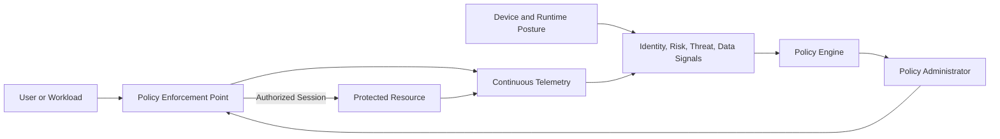
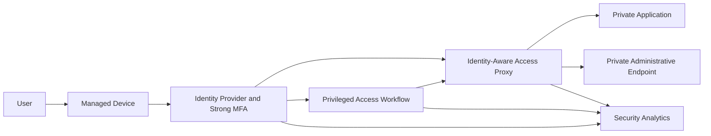
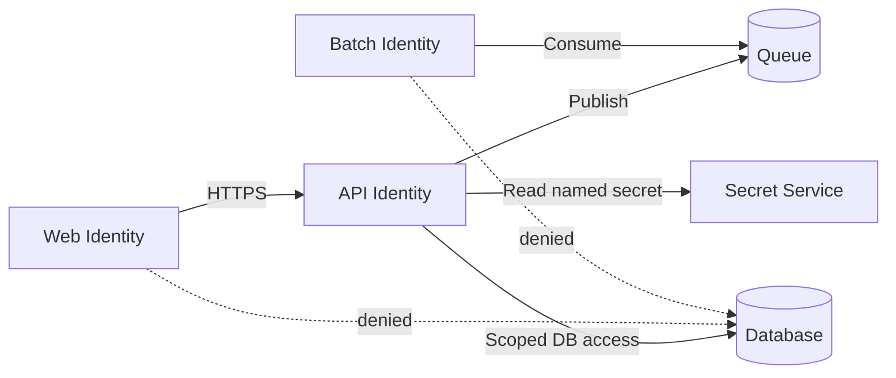

# Zero-Trust and Private-Access Design

## Normative language

The terms **MUST**, **MUST NOT**, **SHOULD**, **SHOULD NOT**, and **MAY** are normative. Mandatory controls require an approved exception when they cannot be implemented.

## Common engineering requirements

- Persistent configuration MUST be deployed through approved infrastructure-as-code and reviewed through version control.
- Every resource, policy, route, identity, endpoint, certificate, and exception MUST have an owner and lifecycle state.
- Production and non-production trust boundaries MUST remain separate unless an explicit shared-service interface is approved.
- Provider-native capabilities SHOULD be preferred when they meet security, resilience, portability, and operating-model requirements.
- Logs and configuration changes MUST be sent to approved monitoring and evidence-retention platforms.
- Designs MUST account for provider quotas, failure domains, control-plane behavior, data-processing charges, and operational recovery.

## Purpose

This standard defines zero-trust implementation for cloud and hybrid access. Zero trust requires explicit verification, least privilege, continuous evaluation, assumed breach, and resource-centric protection. It is not a product and is not equivalent to private IP addressing.

## Core principles

1. Verify identity, device, workload, resource, session, risk, and context explicitly.
2. Grant the smallest scope for the shortest period.
3. Assume compromise and minimize blast radius.
4. Protect resources directly rather than trusting network location.
5. Reevaluate access when risk or context changes.
6. Automate policy, evidence, and response where practical.

## Logical architecture

The policy engine decides, the policy administrator establishes or terminates the session, and the enforcement point mediates access.

## Provider capability mapping

| Capability | Azure | AWS | GCP | OCI |
|---|---|---|---|---|
| Conditional identity access | Entra Conditional Access and Identity Protection | IAM Identity Center and external IdP context; service controls | Context-Aware Access / Access Context Manager | Identity-domain sign-on and adaptive policies |
| Identity-aware private application access | Entra Private Access / Application Proxy | AWS Verified Access | Identity-Aware Proxy / BeyondCorp capabilities | OCI IAM/gateway patterns and partner ZTNA where required |
| Workload identity | Managed identities / Workload ID | IAM roles / STS | Workload Identity Federation | Instance, resource, workload principals |
| Microsegmentation | NSGs, ASGs, Firewall Policy | Security groups, Network Firewall | Firewall policies and secure tags | NSGs, Network Firewall, Zero Trust Packet Routing |
| Private service access | Private Link | PrivateLink | Private Service Connect | Private endpoint/service gateway patterns |

## Private access architecture

Private access MUST authorize a specific application or administrative service. It SHOULD NOT place a user broadly on the network.

## Workforce access

Evaluate identity, MFA strength, device compliance, risk, application sensitivity, requested privilege, and session context. High-risk access SHOULD require step-up authentication, shortened sessions, or denial.

General VPN access SHOULD be reduced in favor of application-specific access. VPN MAY remain for legacy protocols, network engineering, or recovery, but it MUST expose only required routes and use strong device and identity controls.

## Administrative access

Administrative interfaces MUST NOT be public. Approved methods include identity-aware private access, bastion without public workload addresses, privileged workstations, just-in-time network access combined with privileged roles, recorded session proxies, and controlled emergency paths.

Administrative access SHOULD use separate identities and managed devices. Standing access to management subnets is prohibited.

## Workload-to-workload access

Workloads MUST authenticate through managed identity, federation, mutual TLS, signed tokens, or equivalent. Network policy limits reachability; service or application policy authorizes the request.

For cloud-native systems, consider service mesh, API gateway, private service publishing, SPIFFE-compatible identity, namespace/service-account policy, and egress gateways.

## Microsegmentation

Microsegmentation MUST reflect application and data flows, not arbitrary subnet counts.

Policy SHOULD identify source workload, destination service, protocol/API, environment, data class, risk or time conditions, and logging action.

## Data perimeter

Sensitive data SHOULD use layered resource IAM, private service access, organization policy, network restrictions, encryption, approved identities, exfiltration controls, and monitoring. The perimeter must consider compromised but valid credentials and restrict where tokens can be used.

## Continuous evaluation

Reevaluate access when device posture changes, identity risk increases, privilege changes, credentials are revoked, workload identity changes, context changes, or threat intelligence indicates compromise. Where continuous evaluation is unavailable, use shorter token/session lifetimes and stronger initial controls.

## Encryption

Traffic MUST be encrypted across untrusted or shared networks. Sensitive east-west traffic SHOULD use mutual authentication or equivalent workload identity. Private connectivity does not eliminate TLS requirements. Certificate validation MUST NOT be disabled.

## Monitoring

Correlate sign-ins, device posture, policy decisions, private-access sessions, privileged activations, firewall and DNS logs, workload token issuance, application authorization, data access, and threat detections.

The enterprise SHOULD be able to reconstruct who or what accessed which resource, under which policy, from which device or workload, and what action occurred.

## Maturity model

| Stage | Characteristics |
|---|---|
| Traditional | Broad VPN, location trust, standing privilege, limited telemetry |
| Initial | Strong MFA, basic segmentation, private administration, central logs |
| Advanced | Conditional access, workload identity, app-specific access, automated policy |
| Optimal | Continuous evaluation, data perimeters, adaptive response, pervasive automation |

Maturity claims MUST be supported by control coverage and evidence, not product counts.

## Implementation roadmap

1. Inventory identities, devices, applications, data, and flows.
2. Eliminate public administrative exposure.
3. Enforce strong MFA and privileged access controls.
4. Deploy application-specific private access.
5. Implement managed workload identities.
6. Segment high-value resources.
7. Establish private service and data perimeters.
8. Correlate telemetry and policy decisions.
9. Automate response.
10. Test compromise and revocation scenarios.

## Anti-patterns

- Calling a private network zero trust.
- Replacing VPN with a proxy that grants whole-subnet access.
- Permanent administrator roles.
- Shared workload accounts.
- No device posture evaluation.
- IP-only microsegmentation.
- Private endpoints without resource IAM.
- Disabled TLS validation.
- Logs without policy-decision correlation.

## Validation

- [ ] Access verifies identity and context.
- [ ] Privilege is time-bound.
- [ ] Users receive application-specific access.
- [ ] Administrative endpoints are private.
- [ ] Workloads use managed or federated identity.
- [ ] Segmentation reflects application flows.
- [ ] Sensitive data has a layered perimeter.
- [ ] Policy decisions and access events are correlated.
- [ ] Compromise and revocation scenarios are tested.

## Governance and operating model

The Cloud Center of Excellence owns this standard and the reference modules. Platform teams operate shared controls. Security defines mandatory policy and monitoring requirements. Workload teams own application-specific configuration, data-flow declarations, testing, and remediation.

Exceptions MUST include the control being waived, business justification, compensating controls, risk owner, expiry date, and remediation plan. Permanent exceptions are prohibited; they must be periodically renewed or closed.

## Related topics

- [Hub-and-Spoke and Transit Network Design](nis-hub-and-spoke-and-transit-network-design.md)
- [Private Endpoints and Private DNS](nis-private-endpoints-and-private-dns.md)
- [Firewalls, Routing, and Network Security Controls](nis-firewalls-routing-and-network-security-controls.md)

## References

- [NIST SP 800-207](https://csrc.nist.gov/pubs/sp/800/207/final)
- [NIST SP 800-207A](https://csrc.nist.gov/pubs/sp/800/207/a/final)
- [NIST SP 1800-35](https://csrc.nist.gov/pubs/sp/1800/35/final)
- [CISA Zero Trust Maturity Model](https://www.cisa.gov/resources-tools/resources/zero-trust-maturity-model)
- [Zero Trust security in Azure](https://learn.microsoft.com/azure/security/fundamentals/zero-trust)
- [AWS Verified Access](https://docs.aws.amazon.com/verified-access/latest/ug/what-is-verified-access.html)
- [GCP zero-trust guidance](https://cloud.google.com/architecture/framework/security/implement-zero-trust)
- [OCI Zero Trust Packet Routing](https://docs.oracle.com/iaas/Content/zero-trust-packet-routing/home.htm)
