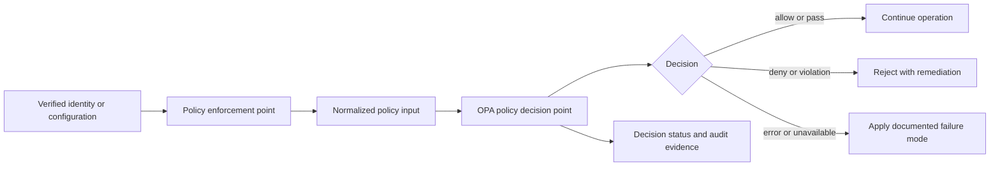
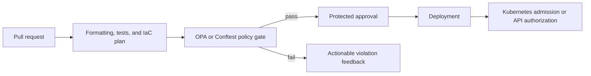
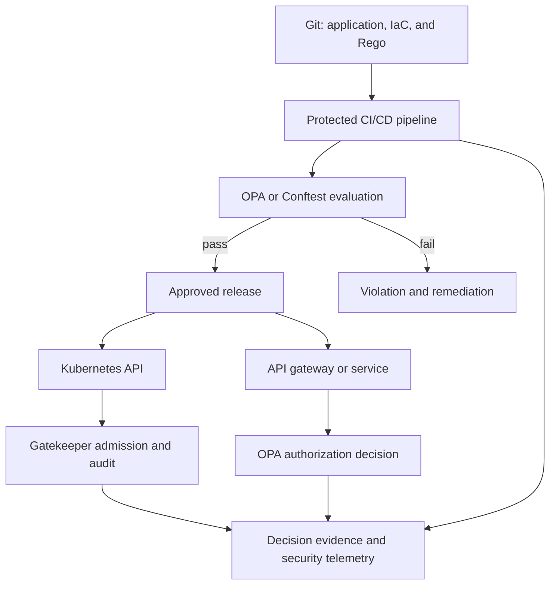

> **Document class:** Networking, Identity & Security implementation guide
> **Normative terms:** **MUST**, **MUST NOT**, **SHOULD**, **SHOULD NOT**, and **MAY** are requirements levels.
> **Applicability:** Authorization, Kubernetes admission, Terraform and template validation, delivery pipelines, and least-privilege enforcement across Azure, AWS, GCP, and OCI.
> **Exception process:** Deviations require a documented risk assessment, compensating controls, named risk owner, and expiry date.

| Control field | Value |
|---|---|
| Document ID | `NIS-11` |
| Owner | Cloud Center of Excellence |
| Review cycle | At least annually and after material OPA, Kubernetes, provider, identity, or delivery-platform changes |
| Evidence | Policy source and tests, pipeline results, admission decisions, authorization outcomes, exceptions, and rollback records |

# Open Policy Agent for Cloud, Kubernetes, Terraform, and CI/CD

> **Decision in brief:** Use OPA as a policy decision point for custom and cross-platform decisions, with explicit enforcement points, trusted inputs, tested policies, and observable failure behavior.

## Purpose

Cloud platforms need consistent authorization and security decisions across APIs, Kubernetes, Infrastructure as Code, and delivery pipelines. Open Policy Agent (OPA) evaluates structured input against Rego policy and returns a decision; the surrounding platform supplies identity, trusted data, enforcement, and evidence.

This guide explains how to apply OPA to common cloud delivery and runtime scenarios without treating it as an identity provider, a cloud control plane, or a replacement for effective native controls. For the broader enterprise policy lifecycle, guardrails, evidence, and centralized governance model, see [Open Policy Agent for Enterprise Cloud Governance](../cloud-foundations-governance/open-policy-agent-for-enterprise-cloud-governance.md).

## Document conventions

This article uses the following terms consistently:

- **Policy decision point (PDP):** The component that evaluates input and returns a policy result. OPA is a PDP.
- **Policy enforcement point (PEP):** The component that applies the result, such as an API gateway, application, pipeline, or Kubernetes admission controller.
- **Authentication:** Establishing the identity of a user, workload, or service.
- **Authorization:** Deciding whether an authenticated subject may perform an action on a resource in a specific context.
- **Policy input:** The structured, schema-versioned data provided to the policy engine.

Authentication and authorization are separate controls. OPA MUST receive verified identity and resource context from an authoritative integration; it MUST NOT be used to infer identity from untrusted request fields.

## OPA decision model

OPA evaluates structured input against policy and returns a defined decision. The application, proxy, pipeline, or Kubernetes API server remains responsible for interpreting and enforcing that decision.



The enforcement point MUST validate the input contract, check the returned decision, and define behavior for policy errors, stale bundles, and unavailable dependencies. An optional local command provides developer feedback; a required pipeline stage, admission check, gateway call, or application middleware provides enforceable control.

## Authorization

OPA is not an identity provider. Authentication establishes identity; authorization determines whether that identity may perform a specific action on a specific resource under current conditions.

```text
User or workload
      -> identity provider
      -> verified identity and claims
      -> application or API gateway
      -> OPA decision
      -> allow or deny
```

A useful authorization input identifies the subject, action, resource, and relevant context:

```json
{
  "subject": {"id": "alice", "role": "developer", "groups": ["platform-team"]},
  "action": "restart",
  "resource": {"id": "production-api", "environment": "production"},
  "context": {"region": "canadacentral"}
}
```

The input contract SHOULD be narrow, versioned, and explicit about authoritative fields. A policy consumer MUST NOT treat a missing attribute as an implicit allow.

## RBAC, ABAC, and least privilege

Role-based access control (RBAC) grants permissions through assigned roles. Attribute-based access control (ABAC) evaluates attributes of the subject, resource, action, and environment. Enterprise authorization commonly combines both models.

| Model | Decision basis | Strength | Limitation |
|---|---|---|---|
| RBAC | Assigned role and associated permissions | Simple to explain and administer | Role growth and weak contextual precision |
| ABAC | Subject, resource, action, and environmental attributes | Fine-grained and context aware | Requires reliable attributes and disciplined policy design |
| Combined | Role plus attributes and context | Balances usability with precision | Needs clear precedence and test coverage |

```rego
package authorization

default allow := false

allow if {
    input.subject.role == "developer"
    input.subject.department == input.resource.department
    input.resource.environment != "production"
}
```

Default-deny is a useful authorization baseline, but each decision schema must document its legitimate allow paths, error behavior, and emergency access path. Least privilege means limiting the subject, action, resource, environment, and duration to what the operation requires; it is not achieved by adding an OPA check without reducing permissions.

## Access control policy

Centralizing policy source reduces duplicated authorization logic, but it does not eliminate application responsibilities. Each service MUST provide trustworthy input, enforce the returned decision, and protect any local policy or data cache.

Authorization policy should answer:

- Who is making the request: user, workload, service, or tenant?
- What resource is being targeted and who owns it?
- Which action is requested: read, write, delete, deploy, or administer?
- Where does the action occur: development, staging, or production?
- Which context matters: claims, tenant, time, network, device, or risk signal?

```rego
package api.authz

default allow := false

allow if {
    input.method == "GET"
    input.subject.department == input.resource.department
}

allow if input.subject.role == "administrator"
```

Policies should use stable resource identifiers and verified claims. Request fields supplied by the caller must not be treated as authoritative ownership, group membership, or privilege data.

## Security enforcement

OPA can translate suitable security requirements into executable checks. The control is only as strong as the input data, enforcement path, and failure behavior.

Common security checks include:

- approved images, registries, module sources, and artifact provenance;
- non-root execution, restricted privileges, and prohibited host access;
- defined CPU and memory requests or limits;
- restricted regions, service tiers, and public connectivity;
- required ownership, environment, security, and data-classification labels;
- encryption, minimum TLS versions, and private connectivity;
- protected branches, environments, approvals, and separation of duties.

```rego
package kubernetes.security

deny contains msg if {
    input.spec.securityContext.runAsNonRoot != true
    msg := "Workloads must run as non-root"
}
```

Violation messages SHOULD identify the resource, rule, and expected correction. A generic denial increases remediation time and encourages unsafe bypasses.

## Kubernetes admission policy

Kubernetes admission can validate an object after authentication and authorization but before persistence. Gatekeeper provides Kubernetes-native policy objects and OPA-based evaluation patterns for admission and audit.

```text
kubectl apply
     -> Kubernetes API server
     -> admission processing
     -> Gatekeeper policy evaluation
        |-- compliant -> accept
        `-- violation -> deny, warn, dry-run, or audit result
```

Typical controls include:

- prohibit privileged containers and host networking;
- require `runAsNonRoot` and approved security settings;
- require resource requests and limits;
- allow images only from approved registries;
- prohibit mutable image tags such as `latest`;
- require labels and restrict storage classes.

```rego
package kubernetes.images

deny contains msg if {
    some container in input.review.object.spec.template.spec.containers
    endswith(container.image, ":latest")
    msg := sprintf("Container %s cannot use the latest tag", [container.name])
}
```

Admission policy is not retroactive by itself. Audit capabilities are required to identify existing resources that violate newly introduced or changed constraints. Policies also need an explicit path for system namespaces, platform controllers, emergency operations, and approved workload exceptions.

## API authorization

Applications can query OPA directly over its API, or a proxy such as Envoy can perform an external authorization check before forwarding a request to a service.

```text
Client -> API gateway or Envoy -> authentication
                           -> authorization request to OPA
                              |-- allow -> upstream service
                              `-- deny  -> reject request
```

```rego
package api.authz

default allow := false

allow if {
    input.method == "GET"
    "finance" in input.subject.groups
}

allow if {
    input.method == "DELETE"
    input.subject.role == "administrator"
}
```

API authorization must use stable resource identifiers and verified claims. The gateway or application must enforce timeouts, protect OPA communication, avoid logging unnecessary sensitive payloads, and define whether an evaluation error fails open, fails closed, or enters a controlled degraded mode.

## Terraform and Infrastructure as Code

Infrastructure policy is strongest when it evaluates the representation that most accurately reflects the intended deployment. For Terraform, policies may examine source configuration or the JSON representation of a generated plan. Plan evaluation usually provides better visibility into computed changes, but the policy must understand the Terraform plan schema and unknown values.

```text
Terraform configuration
       -> terraform plan
       -> terraform show -json
       -> Conftest or OPA
          |-- pass -> approval and apply
          `-- fail -> pipeline blocked
```

Common infrastructure controls include:

- prohibit public IP addresses or public service access where private connectivity is required;
- require encryption, minimum TLS versions, and approved regions;
- require ownership, environment, application, and cost tags;
- restrict VM sizes, service tiers, and cluster configuration;
- require private endpoints or network controls for protected data services.

```rego
package terraform.azure

deny contains msg if {
    some rc in input.resource_changes
    rc.type == "azurerm_storage_account"
    rc.change.after.public_network_access_enabled == true
    msg := sprintf("Storage account %s must disable public network access", [rc.address])
}
```

The exact Rego path depends on the input format. A policy written for raw HCL data is not interchangeable with one written for Terraform plan JSON.

## YAML and Kubernetes manifests

Conftest can validate structured configuration before it reaches a runtime enforcement point. Applying the same control objective in CI and at Kubernetes admission provides two distinct controls: early feedback and runtime enforcement.

```text
Git -> Conftest validation -> CI/CD -> Kubernetes -> Gatekeeper admission

Shift-left feedback                           Runtime enforcement
```

```rego
package manifests

deny contains msg if {
    input.kind == "Deployment"
    some container in input.spec.template.spec.containers
    endswith(container.image, ":latest")
    msg := "latest image tags are not permitted"
}
```

The CI input and admission input are not necessarily identical. Keep their schemas, policy package versions, and evidence paths explicit so that passing a pre-deployment check is not mistaken for proof of runtime compliance.

## Bicep and ARM templates

A reliable OPA workflow for Bicep is to compile Bicep into its ARM JSON representation and evaluate the resulting JSON. This avoids assuming that every policy tool has a native Bicep parser.

```text
main.bicep
   -> az bicep build --file main.bicep --outfile main.json
   -> Conftest or OPA evaluates main.json
   -> pass or fail
   -> Azure deployment
```

Policies can inspect resource types and properties such as storage accounts, Key Vaults, virtual networks, managed clusters, and virtual machines. The policy must match the generated ARM template structure rather than the original Bicep syntax. Deployment-time Azure Policy remains the native control for Azure Resource Manager resources when it provides the required coverage.

## CI/CD pipeline integration

Policy validation becomes enforceable when it is a required pipeline stage combined with protected branches and deployment controls. A manual or optional check does not provide the same assurance.



A Terraform-oriented pipeline can generate a plan and evaluate its JSON form:

```bash
terraform init
terraform validate
terraform plan -out=tfplan
terraform show -json tfplan > tfplan.json
conftest test --policy policies/ tfplan.json
```

A Bicep-oriented pipeline can compile to ARM JSON first:

```bash
az bicep build --file main.bicep --outfile main.json
conftest test --policy policies/ main.json
az deployment group create ...
```

Production pipelines also need pinned tool versions, controlled policy releases, protected policy repositories, representative fixtures, deterministic input generation, and an auditable exception mechanism. High-impact deny rules SHOULD start in report-only or shadow mode before canary and phased enforcement.

## End-to-end reference architecture



This architecture applies one policy-engineering discipline across several enforcement points. The policies do not need to be identical because each input schema and risk context differs, but they can share ownership, testing, release, exception, and evidence practices.

## OPA in an Azure security stack

| Capability | Primary role |
|---|---|
| Microsoft Entra ID | Authentication, identities, groups, tokens, and claims |
| Azure RBAC | Authorization for Azure resource operations |
| Azure Policy | Governance and compliance evaluation for Azure resources |
| OPA and Rego | Custom and cross-platform policy decisions |
| Conftest | Shift-left validation of structured configuration and IaC artifacts |
| Gatekeeper | Kubernetes admission governance and audit |
| CI/CD platform | Mandatory sequencing, enforcement, approval, and deployment |

These tools overlap in limited areas but are not interchangeable. Native controls SHOULD remain the default when they provide the required coverage and operational integration. OPA is justified when policy must be customized, shared across platforms, or evaluated outside a native cloud control plane.

## Operational considerations

For each OPA integration, document:

- the policy owner, service owner, and support boundary;
- the input schema, policy package version, and bundle freshness expectation;
- latency, timeout, retry, and availability requirements;
- fail-open, fail-closed, or controlled degraded behavior;
- alerts for evaluation errors, stale policy, schema mismatch, and enforcement bypass;
- rollback and emergency-access procedures;
- sensitive-data handling and decision-log retention;
- exception approval, compensating controls, and expiration.

Do not silently fail open for production authorization, privileged operations, or sensitive data. Where fail-closed behavior creates unacceptable availability risk, use a documented degraded mode with compensating controls, clear alerts, and a time-bound exception.

## Validation

- [ ] Authentication and authorization responsibilities are separated and authoritative identity data is verified.
- [ ] Each policy has a versioned input schema, owner, decision contract, severity, and remediation message.
- [ ] Tests cover allowed, denied, boundary, missing-data, malformed-input, and evaluation-error cases.
- [ ] Kubernetes admission and audit behavior is tested for both new and existing resources.
- [ ] Terraform and Bicep policies evaluate the intended plan or compiled template representation.
- [ ] OPA or Conftest is a required pipeline control where pre-deployment enforcement is intended.
- [ ] Runtime enforcement remains in place for changes that bypass CI/CD or occur after deployment.
- [ ] Tool and policy versions are pinned, bundles are integrity-protected, and rollback is tested.
- [ ] Decisions, violations, exceptions, and remediation outcomes are retained as protected evidence.

## Related topics

- [Cloud Identity and Access Architecture](nis-cloud-identity-and-access-architecture.md) (`NIS-06`) — identity boundaries, authentication, and authorization foundations.
- [Managed Identities and Workload Federation](nis-managed-identities-and-workload-federation.md) (`NIS-07`) — workload authentication and short-lived cloud access.
- [Zero-Trust and Private-Access Design](nis-zero-trust-and-private-access-design.md) (`NIS-09`) — explicit trust, private access, and least-privilege principles.
- [Infrastructure as Code Engineering Standards](../infrastructure-as-code/iac-infrastructure-as-code-engineering-standards.md) (`IAC-01`) — engineering controls for Terraform and infrastructure delivery.
- [Policy, Guardrails, and Compliance](../cloud-foundations-governance/policy-guardrails-and-compliance.md) (`CFG-07`) — preventive, detective, and corrective cloud controls.
- [Open Policy Agent for Enterprise Cloud Governance](../cloud-foundations-governance/open-policy-agent-for-enterprise-cloud-governance.md) (`CFG-15`) — enterprise policy ownership, distribution, lifecycle, and evidence.

## References

- [OPA policy language](https://www.openpolicyagent.org/docs/policy-language) — Rego policy concepts and syntax.
- [OPA REST API](https://www.openpolicyagent.org/docs/rest-api) — query and integration API reference.
- [OPA HTTP API authorization](https://www.openpolicyagent.org/docs/http-api-authorization) — authorization integration patterns.
- [OPA Envoy integration](https://www.openpolicyagent.org/docs/envoy) — external authorization with Envoy.
- [OPA security guidance](https://www.openpolicyagent.org/docs/security) — security considerations for OPA deployments.
- [Gatekeeper documentation](https://open-policy-agent.github.io/gatekeeper/website/docs/) — Kubernetes admission and audit integration.
- [Conftest documentation](https://www.conftest.dev/) — testing structured configuration with Rego.
- [Microsoft Bicep CLI documentation](https://learn.microsoft.com/azure/azure-resource-manager/bicep/bicep-cli) — compiling Bicep to ARM JSON.
