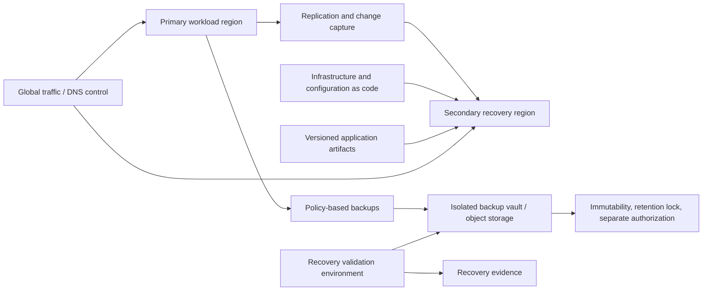
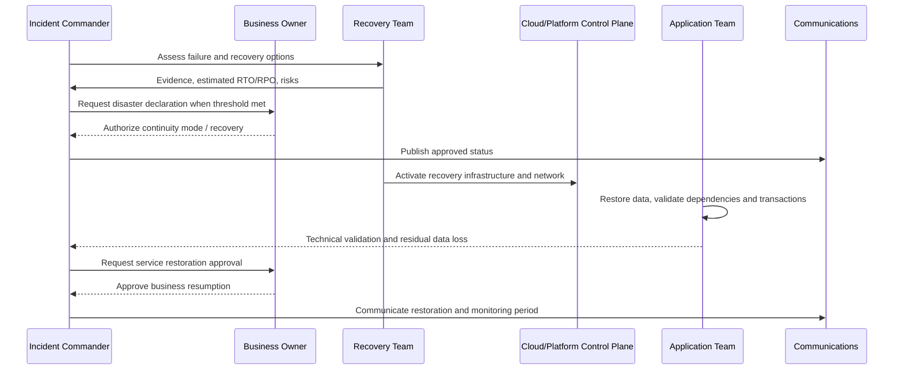

# 备份、恢复和业务连续性

## 目的

该标准定义了跨多云工作负载的备份、恢复、灾难恢复、网络恢复和业务连续性的要求。从未恢复过的备份是未经验证的副本，不具有恢复能力。恢复要求必须从业务影响中得出，并通过证据生成练习进行验证。

## 范围

该标准应用于结构化和非结构化数据、托管数据库、虚拟机、Kubernetes 状态、对象存储、文件系统、配置、机密、身份依赖项、基础设施即代码、应用版本、合同相关的 SaaS 数据以及操作文档。

高可用性和灾难恢复相关但又不同。高可用性减少了局部故障造成的中断；灾难恢复在严重或相关中断后恢复服务。备份保护可恢复状态；它本身并不提供服务连续性。

## 业务需求

每个生产服务 **MUST** 都有业务批准的恢复规范，其中包含：

- 服务关键性和最大可容忍中断；
- 按业务流程和数据集划分的 RTO 和 RPO；
- 连续模式期间的最低服务级别；
- 区域、提供商、身份、网络、人员和提供商故障假设；
- 法律、驻留、保留和删除要求；
- 恢复顺序和上游/下游依赖性；
- 沟通、决策和权限模型；
- 练习频率和证据要求。

RTO 和 RPO 必须在技术上可行并有资金支持。在没有架构和成本分析的情况下从另一个工作负载复制激进目标是无效的。

## 恢复策略模式

|模式|特点 |正确使用|
|---|---|---|
|备份与恢复|稳态成本最低；最长恢复时间|第 3 层，非关键系统，档案恢复 |
|Pilot light|维护核心数据/服务，在活动期间扩展容量 |成本可控的中等 RTO/RPO |
|温备|容量减少的辅助环境已准备好扩展|需要更快恢复的 1-2 级服务 |
|主动-被动|次要已满或接近满，流量开启失败 |严格的RTO；需要区域隔离|
|主动-主动 |多个站点同时提供流量 |最高连续性要求；复杂的数据一致性和操作|
|多云恢复 |二级提供商支持关键路径|仅当提供商集中带来的风险足以证明复杂性和冗余能力是合理的|

多云灾难恢复并不是自动就优越的。身份、数据语义、托管服务差异、网络、操作技能和测试复杂性可能使其不如一个提供商内精心设计的多区域恢复可靠。

## 参考架构

## 备份控件

- 备份策略 **MUST** 映射到 RPO、保留、法律和生命周期要求。
- 第 0/1 层系统的备份副本 **MUST** 与主要管理凭据和破坏性控制路径隔离。
- 关键备份 **MUST** 使用不变性、保留锁、一次写入控制或受支持且法律上适当的等效保护。
- 加密密钥和恢复凭证 **MUST** 可在紧急程序下恢复，而无需依赖于故障环境。
- 监控备份作业、错过的计划、容量、保留到期和删除事件 **MUST**。
- 备份范围**MUST**包括恢复所需的元数据和配置，而不仅仅是数据文件。
- 基础设施和应用部署定义 **MUST** 在运行时环境之外进行版本控制。
- 明确评估 SaaS 和托管服务备份责任 **MUST**；提供商的持久性并不等同于客户控制的恢复。

### 备份拓扑

使用 3-2-1 原则作为风险启发法，而不是字面上的通用规则：维护多个可恢复副本，使用故障隔离存储或技术，并保持至少一个副本与主要爆炸半径隔离。对于勒索软件敏感的系统，包括逻辑或物理隔离的恢复点和特权访问分离。

## 数据库和数据一致性

恢复设计必须定义：

- 崩溃一致备份与应用一致备份；
- 时间点恢复窗口；
- 跨多个数据库或服务的事务一致性；
- 消息驱动工作负载的重放、重复数据删除和幂等性；
- 复制滞后和故障转移数据丢失行为；
- 恢复或故障恢复后的协调；
- 处理加密密钥、模式、用户、权限和扩展。

如果恢复的数据无法与队列、对象存储、搜索索引、下游报告或外部合作伙伴协调，那么技术上成功的数据库恢复是不够的。

## Kubernetes 和云原生工作负载

Kubernetes 恢复必须区分：

1. **声明性状态：**集群配置、清单、Helm Chart、Operator、策略、入口和 GitOps 源。
2. **持久应用数据：** 卷、数据库、对象存储和外部托管服务。
3. **特定于集群的状态：** 机密、证书、准入配置、身份绑定和自定义资源。

在架构允许的情况下，从基础设施即代码重新创建集群比恢复不透明的控制平面状态更可取。持久数据保护和恢复顺序仍然是强制性的。

## 灾难恢复编排

恢复计划必须规定谁可以宣布灾难、启动故障转移、接受数据丢失、批准业务恢复和授权故障恢复。

## 验证

|测试类型|目标|最低限度的证据|
|---|---|---|
|备份完整性测试|确认备份可读且完整 |作业 ID、恢复点、验证结果 |
|组件恢复 |恢复一个数据库、文件集、卷或配置 |工期、数据检查、缺陷 |
|应用恢复 |在隔离环境中重建和验证服务 |实现 RTO/RPO、用户旅程测试 |
|区域故障转移 |验证流量、身份、网络、数据和操作 |时间表、决策日志、业务验证 |
|网络恢复演习|使用隔离凭据和洁净室假设进行恢复 |已遭入侵的假设、监管链、干净验证 |
|业务连续性演习|验证人员、流程、提供商、通信和手动解决方法 |出勤、决策、差距、修复计划 |

第 0 层和第 1 层服务必须至少每年进行一次端到端恢复演习，并更频繁地进行组件恢复。重大架构的变化需要重新测试。演练必须度量实际完成情况，而不是将程序标记为“已完成”。

## 多云服务映射

|能力|Azure|AWS | GCP |OCI |
|---|---|---|---|---|
|中央备份 | Azure Backup | AWS Backup |Backup and DR Service and service-native backups | OCI Backup services and service-native backups |
|虚拟机灾难恢复| Azure Site Recovery | AWS Elastic Disaster Recovery |备份和灾难恢复/镜像和复制模式| OCI Full Stack Disaster Recovery and block-volume replication patterns |
|对象不变性 |不可变的 Blob 存储 | S3 对象锁 |桶锁/对象保留策略|对象存储保留规则 |
|数据库恢复| Azure SQL、Cosmos DB、PostgreSQL 和其他原生 PITR/复制功能 | RDS/Aurora/DynamoDB 和原生备份/复制功能 | Cloud SQL/Spanner/Firestore 和原生备份/复制功能 |Autonomous Database/数据库系统/Data Guard 和原生备份功能 |
|恢复编排| Azure Automation、Site Recovery 计划、IaC | AWS Systems Manager、Step Functions、IaC |工作流程、Cloud Build/Cloud Deploy、IaC |Full Stack Disaster Recovery、Functions/DevOps、IaC |

必须在选定的区域和服务层中验证特定于服务的保留限制、跨区域行为、密钥管理和恢复约束。

## 连续性依赖

恢复计划必须明确包括身份、DNS、证书、机密、网络连接、源仓库、Artifact Registry、CI/CD、可观测性、ITSM、通信渠道、支持联系人和特权工作站。依赖于失败的身份或协作平台的计划是不完整的。

## 最低合规性清单

- [ ] 存在业务批准的 RTO、RPO 和最大可容忍中断。
- [ ] 备份范围涵盖数据、元数据、配置、密钥和部署制品。
- [ ] 关键备份被隔离并免受破坏性管理。
- [ ] 恢复测试产生证据并验证业务交易。
- [ ] 记录了区域/提供商/身份/网络故障假设。
- [ ] 恢复顺序和决策权限明确。
- [ ] Tier 0/1 服务至少每年完成一次端到端演习。
- [ ] 定义故障回切和恢复后协调。

## 术语

|术语 |定义 |
|---|---|
| SLI |服务行为的定量度量，例如成功请求率或延迟。 |
| SLO |定义的测量窗口内 SLI 的目标值或范围。 |
|服务级别协议 |可能包括合同修复措施的正式承诺。它不能替代内部 SLO。 |
|错误预算| SLO 隐含的允许的不可靠性。对于 99.9% 的可用性目标，同一窗口内的错误预算为 0.1%。 |
| RTO |中断后恢复服务的最大目标恢复时间。 |
|恢复点目标 |从中断开始向后测量的最大目标数据丢失间隔。 |
| MTTD/MTTA/MTTR |检测、确认和恢复的平均时间。定义必须固定在度量目录中。 |
|重复劳动|重复的、手动的、自动化的操作工作不会带来持久的服务改进。 |

## 相关主题

- [云成本管理和 FinOps](cloud-cost-management-and-finops.md)
- [事件响应和故障排除](incident-response-and-troubleshooting.md)
- [基础设施和应用健康监控](infrastructure-and-application-health-monitoring.md)

## 参考文档

以下来源定义了本标准使用的外部基线。在实施过程中必须验证提供商功能、区域可用性、许可和产品名称。

1. [Microsoft Azure Well-Architected Framework](https://learn.microsoft.com/azure/well-architected/)
2. [AWS Well-Architected Framework](https://docs.aws.amazon.com/wellarchitected/latest/framework/welcome.html)
3.[GCP Well-Architected Framework](https://cloud.google.com/architecture/framework)
4.[Oracle Cloud Infrastructure Architecture Center](https://docs.oracle.com/solutions/)
5. [OpenTelemetry 文档](https://opentelemetry.io/docs/)
6. [Google 站点可靠性工程资源](https://sre.google/)
7.[FinOps Framework](https://www.finops.org/framework/)
8. [NIST SP 800-61 Rev. 3：网络安全风险管理的事件响应建议和注意事项](https://csrc.nist.gov/pubs/sp/800/61/r3/final)
