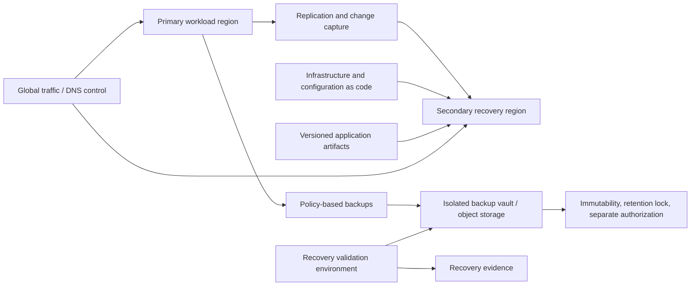
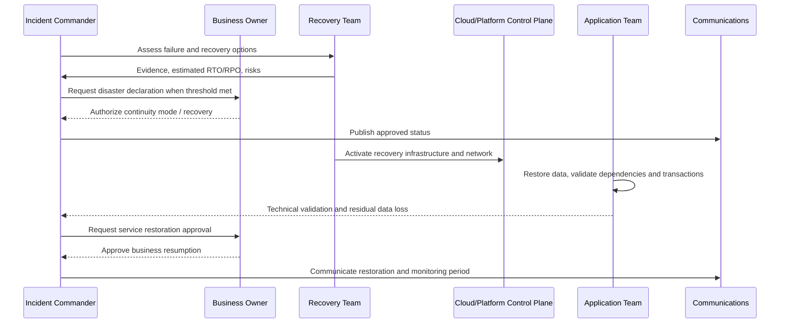

# Backup, Recovery, and Business Continuity

## Purpose

This standard defines requirements for backup, restore, disaster recovery, cyber-recovery, and business continuity across multi-cloud workloads. A backup that has never been restored is an unverified copy, not a recovery capability. Recovery requirements must be derived from business impact and validated through evidence-producing exercises.

## Scope

The standard applies to structured and unstructured data, managed databases, virtual machines, Kubernetes state, object storage, file systems, configuration, secrets, identity dependencies, infrastructure as code, application releases, SaaS data where contractually relevant, and operational documentation.

High availability and disaster recovery are related but distinct. High availability reduces interruption from localized failures; disaster recovery restores service after a severe or correlated disruption. Backup protects recoverable state; it does not by itself provide service continuity.

## Business requirements

Each production service **MUST** have a business-approved recovery specification containing:

- service criticality and maximum tolerable outage;
- RTO and RPO by business process and data set;
- minimum service level during continuity mode;
- regional, provider, identity, network, personnel, and supplier failure assumptions;
- legal, residency, retention, and deletion requirements;
- recovery sequence and upstream/downstream dependencies;
- communication, decision, and authority model;
- exercise frequency and evidence requirements.

RTO and RPO must be technically feasible and funded. Copying aggressive targets from another workload without architecture and cost analysis is invalid.

## Recovery strategy patterns

| Pattern | Characteristics | Appropriate use |
|---|---|---|
| Backup and restore | Lowest steady-state cost; longest recovery | Tier 3, non-critical systems, archival recovery |
| Pilot light | Core data/services maintained, capacity scaled during event | Moderate RTO/RPO with controlled cost |
| Warm standby | Reduced-capacity secondary environment ready to scale | Tier 1–2 services needing faster recovery |
| Active-passive | Full or near-full secondary, traffic switched on failure | Strict RTO; regional isolation required |
| Active-active | Multiple sites serve traffic concurrently | Highest continuity requirement; complex data consistency and operations |
| Multi-cloud recovery | Secondary provider supports critical path | Only where provider concentration risk justifies major complexity and duplicated capability |

Multi-cloud disaster recovery is not automatically superior. Identity, data semantics, managed-service differences, networking, operational skill, and testing complexity may make it less reliable than well-engineered multi-region recovery within one provider.

## Reference architecture

## Backup controls

- Backup policies **MUST** map to RPO, retention, legal, and lifecycle requirements.
- Backup copies for Tier 0/1 systems **MUST** be isolated from primary administrative credentials and destructive control paths.
- Critical backups **MUST** use immutability, retention lock, write-once controls, or equivalent protection where supported and legally appropriate.
- Encryption keys and recovery credentials **MUST** be recoverable under emergency procedures without depending on the failed environment.
- Backup jobs, missed schedules, capacity, retention expiry, and deletion events **MUST** be monitored.
- Backup scope **MUST** include metadata and configuration required for restoration, not only data files.
- Infrastructure and application deployment definitions **MUST** be versioned outside the runtime environment.
- SaaS and managed-service backup responsibility **MUST** be explicitly evaluated; provider durability is not equivalent to customer-controlled recovery.

### Backup topology

Use the 3-2-1 principle as a risk heuristic, not a literal universal rule: maintain multiple recoverable copies, use failure-isolated storage or technology, and keep at least one copy isolated from the primary blast radius. For ransomware-sensitive systems, include logically or physically isolated recovery points and privileged-access separation.

## Database and data consistency

Recovery design must define:

- crash-consistent versus application-consistent backups;
- point-in-time recovery window;
- transaction consistency across multiple databases or services;
- replay, deduplication, and idempotency for message-driven workloads;
- replication lag and failover data-loss behavior;
- reconciliation after restore or failback;
- handling of encryption keys, schema, users, permissions, and extensions.

A technically successful database restore is not sufficient if the restored data cannot be reconciled with queues, object stores, search indexes, downstream reports, or external partners.

## Kubernetes and cloud-native workloads

Kubernetes recovery must distinguish between:

1. **Declarative state:** cluster configuration, manifests, Helm charts, operators, policies, ingress, and GitOps sources.
2. **Persistent application data:** volumes, databases, object stores, and external managed services.
3. **Cluster-specific state:** secrets, certificates, admission configuration, identity bindings, and custom resources.

Recreating a cluster from infrastructure as code is preferable to restoring opaque control-plane state when architecture permits. Persistent data protection and restore ordering remain mandatory.

## Disaster-recovery orchestration

Recovery plans must state who can declare a disaster, initiate failover, accept data loss, approve business resumption, and authorize failback.

## Validation

| Test type | Objective | Minimum evidence |
|---|---|---|
| Backup integrity test | Confirm backup is readable and complete | Job ID, recovery point, validation result |
| Component restore | Restore one database, file set, volume, or configuration | Duration, data checks, defects |
| Application recovery | Rebuild and validate the service in an isolated environment | RTO/RPO attained, user journey tests |
| Regional failover | Validate traffic, identity, network, data, and operations | Timeline, decision log, business validation |
| Cyber-recovery exercise | Recover using isolated credentials and clean-room assumptions | Compromise assumptions, chain of custody, clean validation |
| Business continuity exercise | Validate people, process, supplier, communications, and manual workarounds | Attendance, decisions, gaps, remediation plan |

Tier 0 and Tier 1 services must conduct at least annual end-to-end recovery exercises, with more frequent component restores. Material architecture changes require retesting. Exercises must measure actual attainment, not mark a procedure as “completed.”

## Multi-cloud service mapping

| Capability | Azure | AWS | GCP | OCI |
|---|---|---|---|---|
| Central backup | Azure Backup | AWS Backup | Backup and DR Service plus service-native backups | OCI Backup services and service-native backups |
| VM disaster recovery | Azure Site Recovery | AWS Elastic Disaster Recovery | Backup and DR / image and replication patterns | OCI Full Stack Disaster Recovery and block-volume replication patterns |
| Object immutability | Immutable Blob Storage | S3 Object Lock | Bucket Lock / object retention policies | Object Storage retention rules |
| Database recovery | Azure SQL, Cosmos DB, PostgreSQL and other native PITR/replication features | RDS/Aurora/DynamoDB and native backup/replication features | Cloud SQL/Spanner/Firestore and native backup/replication features | Autonomous Database/DB Systems/Data Guard and native backup features |
| Recovery orchestration | Azure automation, Site Recovery plans, IaC | AWS Systems Manager, Step Functions, IaC | Workflows, Cloud Build/Deploy, IaC | Full Stack DR, Functions/DevOps, IaC |

Service-specific retention limits, cross-region behavior, key management, and restore constraints must be verified in the selected region and service tier.

## Continuity dependencies

Recovery plans must explicitly include identity, DNS, certificates, secrets, network connectivity, source repositories, artifact registries, CI/CD, observability, ITSM, communication channels, support contacts, and privileged workstations. A plan that depends on the failed identity or collaboration platform is incomplete.

## Minimum compliance checklist

- [ ] Business-approved RTO, RPO, and maximum tolerable outage exist.
- [ ] Backup scope covers data, metadata, configuration, keys, and deployment artifacts.
- [ ] Critical backups are isolated and protected from destructive administration.
- [ ] Restore tests produce evidence and validate business transactions.
- [ ] Regional/provider/identity/network failure assumptions are documented.
- [ ] Recovery sequence and decision authorities are explicit.
- [ ] Tier 0/1 services complete end-to-end exercises at least annually.
- [ ] Failback and post-recovery reconciliation are defined.

## Terminology

| Term | Definition |
|---|---|
| SLI | A quantitative measure of service behavior, such as successful request ratio or latency. |
| SLO | A target value or range for an SLI over a defined measurement window. |
| SLA | A formal commitment that may include contractual remedies. It is not a substitute for an internal SLO. |
| Error budget | The permitted unreliability implied by an SLO. For a 99.9% availability objective, the error budget is 0.1% over the same window. |
| RTO | Maximum targeted elapsed time to restore a service after disruption. |
| RPO | Maximum targeted data-loss interval measured backward from the disruption. |
| MTTD / MTTA / MTTR | Mean time to detect, acknowledge, and restore or recover. Definitions must be fixed in the metric catalog. |
| Toil | Repetitive, manual, automatable operational work that does not create durable service improvement. |

## Related topics

- [Cloud Cost Management and FinOps](cloud-cost-management-and-finops.md)
- [Incident Response and Troubleshooting](incident-response-and-troubleshooting.md)
- [Infrastructure and Application Health Monitoring](infrastructure-and-application-health-monitoring.md)

## References

The following sources define the external baseline used by this standard. Provider features, regional availability, licensing, and product names must be verified during implementation.

1. [Microsoft Azure Well-Architected Framework](https://learn.microsoft.com/azure/well-architected/)
2. [AWS Well-Architected Framework](https://docs.aws.amazon.com/wellarchitected/latest/framework/welcome.html)
3. [GCP Well-Architected Framework](https://cloud.google.com/architecture/framework)
4. [Oracle Cloud Infrastructure Architecture Center](https://docs.oracle.com/solutions/)
5. [OpenTelemetry documentation](https://opentelemetry.io/docs/)
6. [Google Site Reliability Engineering resources](https://sre.google/)
7. [FinOps Framework](https://www.finops.org/framework/)
8. [NIST SP 800-61 Rev. 3: Incident Response Recommendations and Considerations for Cybersecurity Risk Management](https://csrc.nist.gov/pubs/sp/800/61/r3/final)
