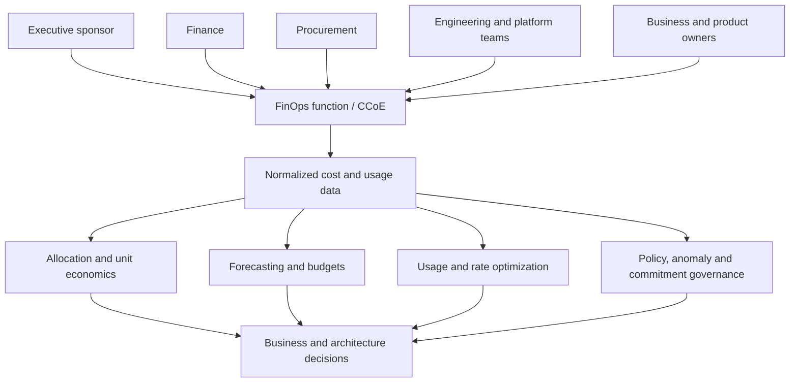
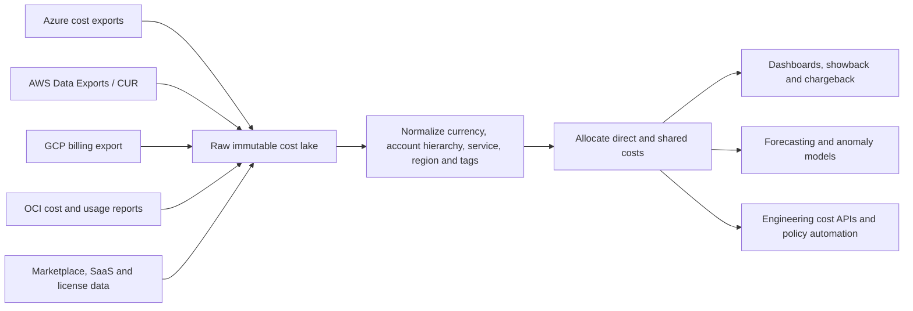

# 云成本管理和 FinOps

## 目的

该标准定义了企业 FinOps 运营模型和技术控制，用于理解、分配、预测、管理和优化云和云相关技术成本。成本优化并不意味着无差别地削减成本。目标是最大限度地提高业务价值，同时保持所需的可靠性、安全性、性能和交付速度。

## 范围

该标准应用于 Azure、AWS、GCP、OCI、市场服务、支持计划、数据传输、可观测性、托管数据库、Kubernetes、AI 消费、承诺使用工具、软件许可证和共享平台。它还应用于在云、SaaS、员工、风险和业务运营之间迁移成本的架构决策。

## FinOps 原则

1. 工程、财务、采购和企业负责人协作决策。
2、成本数据必须及时、完整、规范、可追溯。
3. 团队对他们可以影响的使用负责；共享成本使用明确的分配规则。
4. 优化决策考虑单位经济效益和业务成果，而不是单独考虑支出。
5. 通过“通知”、“优化”和“运营”周期持续管理可变云成本。
6. 承诺是投资组合风险决策，而不是孤立的折扣。
7. 成本控制不得默默降低可靠性、安全性或合规性。

## FinOps 运营模式

## 成本数据架构

原始提供商数据必须保留足够长的时间，以重现报告并解决发票争议。转换必须经过版本控制、测试并与提供商发票保持一致。

## 分配和元数据标准

每个可部署资源必须携带或继承提供商支持的以下元数据：

- 业务部门和成本中心；
- 产品/服务和应用 ID；
- 环境;
- 所有者/团队；
- 关键等级；
- 数据分类；
- 临时资源的生命周期或到期日期；
- 项目、计划或客户（如果适用）。

单独标记是不够的，因为某些费用是不可标记的、继承的、延迟的、共享的或在计费账户级别记录在案的。分配必须结合提供商层次结构、账户/订阅/项目/隔间结构、标签/标签、资源关系、Kubernetes 分配和记录在案的共享成本规则。

### 共享成本分配

|方法|正确使用|风险|
|---|---|---|
|直接分配 |资源唯一支持一项服务 |最低的歧义 |
|按比例使用 |可度量消费的共享平台 |需要值得信赖的使用度量 |
|固定百分比|稳定的共享服务，约定的分摊 |可能会偏离实际消费|
|平均分摊|精度不经济时的低价值成本 |可能会扭曲责任|
|中央管理开销|企业能力配置不合理|降低团队层面的激励；必须保持可见 |

当架构或使用方式发生变化时，分配规则必须经过批准、版本化和审查。

## 预算和预测

必须在产品组合、业务、产品、环境和主要共享平台级别制定预算。预测必须区分：

- 基线重复使用；
- 增长和季节性；
- 计划的启动、迁移和退役；
- 承诺和有效利率；
- 一次性迁移或恢复成本；
- 数据传输和可观测性增长；
- AI 令牌、加速器和推理可变性；
- 相关的货币和税收假设。

预算告警必须在违规之前通知负责任的所有者，并且必须包括差异驱动因素和建议的行动。没有所有者和决策过程的预算只是一个通知。

## 优化层次

使用此订单可以避免购买折扣造成浪费：

1. 消除未使用的、孤立的、重复的和过期的资源。
2.正确的架构和需求行为：缓存、调度、自动伸缩、数据生命周期、查询效率、存储分层。
3. 根据持续度量和绩效目标调整资源规模。
4. 使用预订、储蓄计划、承诺使用、抢占/现货容量或协商费率来改进购买模式。
5. 重新评估工作负载布置、托管服务选择和提供商经济效益。
6. 持续验证已实现的节约和运营影响。

来自提供商工具的建议是输入，而不是自动批准。他们可能会忽略业务日历、弹性利润、许可限制或即将到来的需求。

## 单位经济效益

团队应定义每个有意义单位的成本，例如：

- 每个客户或租户的成本；
- 每笔成功交易的成本；
- 每 1,000 个 API 请求的成本；
- 每处理太字节或流水线运行的成本；
- 每个模型推理、生成的令牌或已解决的支持案例的成本；
- 每个活跃用户或部署环境的成本。

单位指标必须包括足够的共享成本和平台成本来支持决策。单位成本下降，总成本上升，可能是健康增长；服务质量下降导致总成本下降可能是错误的优化。

## 承诺治理

承诺和保留必须：

- 合格的稳定基线分析；
- 服务、地区、家庭和灵活性限制；
- 使用和覆盖目标；
- 所有者和批准机构；
- 不利情况和退出限制；
- 购买时间和续订决定；
- 福利和未使用承诺的分配；
- 持续监测。

中央投资组合管理通常比不协调的团队采购更有效。仅提交持久基线；为不确定或下降的需求保持灵活性。

## FinOps 按生命周期进行控制

|生命周期阶段 |所需的控制|
|---|---|
|设计|成本估算、架构替代方案、单位度量、数据传输分析、弹性成本权衡 |
|构建|强制性元数据、预算、批准的 SKU、策略检查、临时资源到期 |
|部署 |预测更新、承诺兼容性、规模限制、可观测性成本估算 |
|操作|每日异常检测、每月分配、优化积压、实现节省验证 |
|改变 |变更记录中的成本影响；重大变化的负载和故障模式成本测试|
|退休 |退役清单、数据保留、承诺重新分配、DNS/IP/许可证清理 |

## 多云服务映射

|能力|Azure|AWS | GCP |OCI |
|---|---|---|---|---|
|成本分析|Microsoft Cost Management|Cost Explorer|Cloud Billing reports |Cost Analysis|
|出口详细|成本管理出口| AWS 数据导出/成本和使用报告 |结算导出至 BigQuery |成本和使用报告|
|预算| Azure budgets | AWS Budgets | Cloud Billing budgets | OCI Budgets |
|推荐 | Azure Advisor | Cost Optimization Hub / Compute Optimizer / Trusted Advisor | Recommender / FinOps Hub | Cloud Advisor |
|异常检测|支持的成本管理异常功能 |成本异常检测|计费异常和情报功能（如果可用）|使用情况报告、预算、通知和分析来实施 |
|承诺构建 |计算预订和节省计划 |预留实例和节省计划 |承诺使用折扣|预留容量/年度和每月弹性模型（如应用）|

具体产品和折扣条款发生变化。在做出决定之前必须验证当前的商业文件和合同条款。

## FinOps KPI

|结果|措施|
|---|---|
|成本可见性|分配覆盖范围、未分配成本、数据延迟、发票核对差异 |
|规划|预测准确性、预算差异、计划支出与计划外支出 |
|优化|消除浪费、调整采用规模、覆盖存储生命周期、实现节约 |
|价格 |承诺利用率和覆盖范围、有效储蓄率、未使用承诺|
|商业价值 |单位成本、毛利率贡献、服务成本、价值实现 |
|治理|元数据合规性、异常响应时间、过期资源删除、异常老化 |

节省的成本必须根据合理的基线以及迁移、工程和承诺成本的净值来度量。 “潜在节省”不是已实现的价值。

## 护栏和反模式

- 不要仅仅为了满足预算而关闭冗余或可观测性。
- 不要强迫每个团队无论适合与否都使用最便宜的服务。
- 不要根据短期峰值或未经验证的预测购买承诺。
- 不要将推荐总额报告为节省。
- 当成本分配数据存在重大错误时，请勿进行成本分摊。
- 当瓶颈是应用设计或数据传输时，不要单独优化资源。
- 不要将 FinOps 视为纯财务报告功能。

## 验证

- [ ] 导出、保留、规范化和发票核对提供商成本数据。
- [ ] 强制执行资源元数据和共享成本分配规则。
- [ ] 存在预算、预测、异常和责任所有者。
- [ ] 服务在可行的情况下定义有意义的单位成本指标。
- [ ] 优化遵循消除、架构、规模调整，然后是速率优化。
- [ ] 承诺受到集中管理和持续监控。
- [ ] 节约按已实现的、净的和可持续的来度量。
- [ ] 根据可靠性、安全性和性能评估成本变化。

## 术语

|术语 |定义 |
|---|---|
| SLI |服务行为的定量度量，例如成功请求率或延迟。 |
| SLO |定义的测量窗口内 SLI 的目标值或范围。 |
|服务级别协议 |可能包括合同修复措施的正式承诺。它不能替代内部 SLO。 |
|错误预算| SLO 隐含的允许的不可靠性。对于 99.9% 的可用性目标，同一窗口内的错误预算为 0.1%。 |
| RTO |中断后恢复服务的最大目标恢复时间。 |
|恢复点目标 |从中断开始向后测量的最大目标数据丢失间隔。 |
| MTTD/MTTA/MTTR |检测、确认和恢复的平均时间。定义必须固定在度量目录中。 |
|重复劳动|重复的、手动的、自动化的操作工作不会带来持久的服务改进。 |

## 相关主题

- [事件响应和故障排除](incident-response-and-troubleshooting.md)
- [备份、恢复和业务连续性](backup-recovery-and-business-continuity.md)
- [基础设施和应用健康监控](infrastructure-and-application-health-monitoring.md)

## 参考文档

以下来源定义了本标准使用的外部基线。在实施过程中必须验证提供商功能、区域可用性、许可和产品名称。

1. [Microsoft Azure Well-Architected Framework](https://learn.microsoft.com/azure/well-architected/)
2. [AWS Well-Architected Framework](https://docs.aws.amazon.com/wellarchitected/latest/framework/welcome.html)
3.[GCP Well-Architected Framework](https://cloud.google.com/architecture/framework)
4.[Oracle Cloud Infrastructure Architecture Center](https://docs.oracle.com/solutions/)
5. [OpenTelemetry 文档](https://opentelemetry.io/docs/)
6. [Google 站点可靠性工程资源](https://sre.google/)
7.[FinOps Framework](https://www.finops.org/framework/)
8. [NIST SP 800-61 Rev. 3：网络安全风险管理的事件响应建议和注意事项](https://csrc.nist.gov/pubs/sp/800/61/r3/final)
