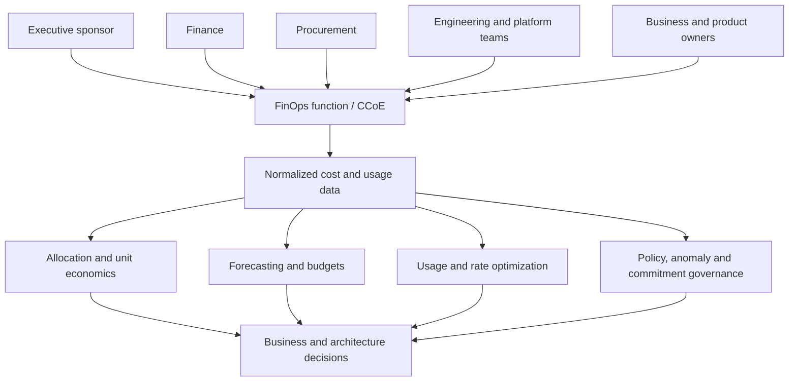
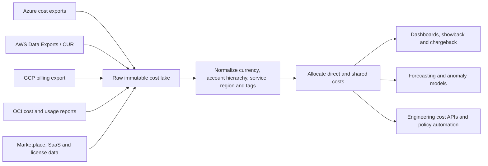

# Cloud Cost Management and FinOps

## Purpose

This standard defines the enterprise FinOps operating model and technical controls for understanding, allocating, forecasting, governing, and optimizing cloud and cloud-adjacent technology costs. Cost optimization does not mean indiscriminate cost cutting. The objective is to maximize business value while maintaining required reliability, security, performance, and delivery speed.

## Scope

The standard applies to Azure, AWS, GCP, OCI, marketplace services, support plans, data transfer, observability, managed databases, Kubernetes, AI consumption, committed-use instruments, software licenses, and shared platforms. It also applies to architecture decisions that shift cost between cloud, SaaS, labor, risk, and business operations.

## FinOps principles

1. Engineering, finance, procurement, and business owners collaborate on decisions.
2. Cost data must be timely, complete, normalized, and attributable.
3. Teams are accountable for usage they can influence; shared costs use explicit allocation rules.
4. Optimization decisions consider unit economics and business outcomes, not spend alone.
5. Variable cloud cost is managed continuously through the Inform, Optimize, and Operate cycle.
6. Commitments are portfolio risk decisions, not isolated discounts.
7. Cost controls must not silently reduce reliability, security, or compliance.

## FinOps operating model

## Cost data architecture

Raw provider data must be retained long enough to reproduce reports and resolve invoice disputes. Transformations must be versioned, tested, and reconcilable to provider invoices.

## Allocation and metadata standard

Every deployable resource must carry or inherit the following metadata where the provider supports it:

- business unit and cost center;
- product/service and application ID;
- environment;
- owner/team;
- criticality tier;
- data classification;
- lifecycle or expiration date for temporary resources;
- project, program, or customer where applicable.

Tagging alone is insufficient because some charges are untaggable, inherited, delayed, shared, or recorded at billing-account level. Allocation must combine provider hierarchy, account/subscription/project/compartment structure, tags/labels, resource relationships, Kubernetes allocation, and documented shared-cost rules.

### Shared-cost allocation

| Method | Appropriate use | Risk |
|---|---|---|
| Direct assignment | Resource uniquely supports one service | Lowest ambiguity |
| Proportional usage | Shared platform with measurable consumption | Requires trustworthy usage metering |
| Fixed percentage | Stable shared service with agreed split | Can drift from actual consumption |
| Even split | Low-value cost where precision is uneconomic | May distort accountability |
| Central overhead | Enterprise capability not reasonably allocable | Reduces team-level incentive; must remain visible |

Allocation rules must be approved, versioned, and reviewed when architecture or consumption changes.

## Budgeting and forecasting

Budgets must be established at portfolio, business, product, environment, and major shared-platform levels. Forecasts must distinguish:

- baseline recurring usage;
- growth and seasonality;
- planned launches, migrations, and retirements;
- commitments and effective rates;
- one-time migration or recovery costs;
- data transfer and observability growth;
- AI token, accelerator, and inference variability;
- currency and tax assumptions where relevant.

Budget alerts must notify accountable owners before breach and must include variance drivers and recommended action. A budget without an owner and decision process is merely a notification.

## Optimization hierarchy

Use this order to avoid buying discounts for waste:

1. Eliminate unused, orphaned, duplicate, and expired resources.
2. Correct architecture and demand behavior: caching, scheduling, autoscaling, data lifecycle, query efficiency, storage tiering.
3. Right-size resources based on sustained measurements and performance objectives.
4. Improve purchase model using reservations, savings plans, committed use, preemptible/spot capacity, or negotiated rates.
5. Reassess workload placement, managed-service selection, and provider economics.
6. Continuously verify realized savings and operational impact.

Recommendations from provider tools are inputs, not automatic approvals. They may ignore business calendars, resilience margins, licensing constraints, or upcoming demand.

## Unit economics

Teams should define cost per meaningful unit, such as:

- cost per customer or tenant;
- cost per successful transaction;
- cost per 1,000 API requests;
- cost per processed terabyte or pipeline run;
- cost per model inference, generated token, or resolved support case;
- cost per active user or deployed environment.

Unit metrics must include enough shared and platform cost to support decisions. Falling unit cost with rising total cost may be healthy growth; falling total cost with degraded service may be false optimization.

## Commitment governance

Commitments and reservations must have:

- eligible stable baseline analysis;
- service, region, family, and flexibility constraints;
- utilization and coverage targets;
- owner and approval authority;
- downside scenario and exit limitations;
- purchase timing and renewal decision;
- allocation of benefit and unused commitment;
- ongoing monitoring.

Central portfolio management is generally more effective than uncoordinated team purchases. Commit only the durable baseline; preserve flexibility for uncertain or declining demand.

## FinOps controls by lifecycle

| Lifecycle stage | Required controls |
|---|---|
| Design | Cost estimate, architecture alternatives, unit metric, data-transfer analysis, resilience-cost trade-off |
| Build | Mandatory metadata, budget, approved SKUs, policy checks, expiration for temporary resources |
| Deploy | Forecast update, commitment compatibility, scale limits, observability cost estimate |
| Operate | Daily anomaly detection, monthly allocation, optimization backlog, realized-savings validation |
| Change | Cost impact in change record; load and failure-mode cost tests for material changes |
| Retire | Decommission checklist, data retention, commitment reassignment, DNS/IP/license cleanup |

## Multi-cloud service mapping

| Capability | Azure | AWS | GCP | OCI |
|---|---|---|---|---|
| Cost analysis | Microsoft Cost Management | Cost Explorer | Cloud Billing reports | Cost Analysis |
| Detailed exports | Cost Management exports | AWS Data Exports / Cost and Usage Report | Billing export to BigQuery | Cost and Usage Reports |
| Budgets | Azure budgets | AWS Budgets | Cloud Billing budgets | OCI Budgets |
| Recommendations | Azure Advisor | Cost Optimization Hub / Compute Optimizer / Trusted Advisor | Recommender / FinOps Hub | Cloud Advisor |
| Anomaly detection | Cost Management anomaly capabilities where supported | Cost Anomaly Detection | Billing anomaly and intelligence capabilities where available | Implement using usage reports, budgets, notifications, and analytics |
| Commitment constructs | Reservations and savings plan for compute | Reserved Instances and Savings Plans | Committed use discounts | Reserved capacity / annual and monthly flex models as applicable |

Specific product and discount terms change. Current commercial documentation and contract terms must be validated before decisions.

## FinOps KPIs

| Outcome | Measures |
|---|---|
| Cost visibility | Allocation coverage, unallocated cost, data latency, invoice reconciliation variance |
| Planning | Forecast accuracy, budget variance, planned vs unplanned spend |
| Optimization | Waste removed, rightsizing adoption, storage lifecycle coverage, realized savings |
| Rates | Commitment utilization and coverage, effective savings rate, unused commitment |
| Business value | Unit cost, gross margin contribution, cost-to-serve, value realization |
| Governance | Metadata compliance, anomaly response time, expired-resource removal, exception aging |

Savings must be measured against a defensible baseline and net of migration, engineering, and commitment costs. “Potential savings” is not realized value.

## Guardrails and anti-patterns

- Do not shut down redundancy or observability solely to meet a budget.
- Do not force every team to use the cheapest service regardless of fit.
- Do not purchase commitments based on a short spike or unverified forecast.
- Do not report gross recommendation totals as savings.
- Do not use chargeback when allocation data is materially wrong.
- Do not optimize resources in isolation when the bottleneck is application design or data transfer.
- Do not treat FinOps as a finance-only reporting function.

## Validation

- [ ] Provider cost data is exported, retained, normalized, and invoice-reconciled.
- [ ] Resource metadata and shared-cost allocation rules are enforced.
- [ ] Budgets, forecasts, anomalies, and accountable owners exist.
- [ ] Services define meaningful unit-cost metrics where feasible.
- [ ] Optimization follows elimination, architecture, rightsizing, then rate optimization.
- [ ] Commitments are centrally governed and continuously monitored.
- [ ] Savings are measured as realized, net, and sustainable.
- [ ] Cost changes are evaluated against reliability, security, and performance.

## Terminology

| Term | Definition |
|---|---|
| SLI | A quantitative measure of service behavior, such as successful request ratio or latency. |
| SLO | A target value or range for an SLI over a defined measurement window. |
| SLA | A formal commitment that may include contractual remedies. It is not a substitute for an internal SLO. |
| Error budget | The permitted unreliability implied by an SLO. For a 99.9% availability objective, the error budget is 0.1% over the same window. |
| RTO | Maximum targeted elapsed time to restore a service after disruption. |
| RPO | Maximum targeted data-loss interval measured backward from the disruption. |
| MTTD / MTTA / MTTR | Mean time to detect, acknowledge, and restore or recover. Definitions must be fixed in the metric catalog. |
| Toil | Repetitive, manual, automatable operational work that does not create durable service improvement. |

## Related topics

- [Incident Response and Troubleshooting](incident-response-and-troubleshooting.md)
- [Backup, Recovery, and Business Continuity](backup-recovery-and-business-continuity.md)
- [Infrastructure and Application Health Monitoring](infrastructure-and-application-health-monitoring.md)

## References

The following sources define the external baseline used by this standard. Provider features, regional availability, licensing, and product names must be verified during implementation.

1. [Microsoft Azure Well-Architected Framework](https://learn.microsoft.com/azure/well-architected/)
2. [AWS Well-Architected Framework](https://docs.aws.amazon.com/wellarchitected/latest/framework/welcome.html)
3. [GCP Well-Architected Framework](https://cloud.google.com/architecture/framework)
4. [Oracle Cloud Infrastructure Architecture Center](https://docs.oracle.com/solutions/)
5. [OpenTelemetry documentation](https://opentelemetry.io/docs/)
6. [Google Site Reliability Engineering resources](https://sre.google/)
7. [FinOps Framework](https://www.finops.org/framework/)
8. [NIST SP 800-61 Rev. 3: Incident Response Recommendations and Considerations for Cybersecurity Risk Management](https://csrc.nist.gov/pubs/sp/800/61/r3/final)
