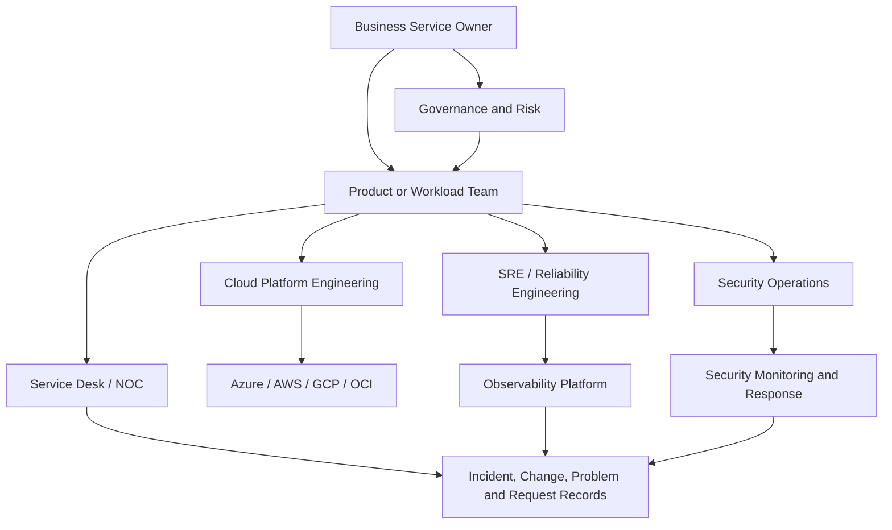
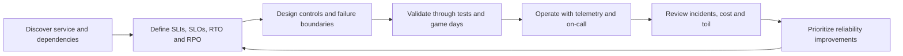

# 云运营和可靠性模型

## 目的

该标准定义了跨 Azure、AWS、GCP 和 Oracle Cloud Infrastructure 可靠运行云服务的企业运营模型。它建立了所有权、可靠性目标、支持层、服务管理接口、决策权和最低限度的操作控制。它故意保持提供商中立：云原生工具可以实现该模型，但没有提供商工具可以取代负责任的服务所有权。

## 范围

该标准应用于生产和生产相关工作负载、共享云平台、Landing Zone、网络和身份服务、数据平台、托管数据库、Kubernetes 平台、无服务器应用、AI 服务和外部使用的 API。仅当开发沙箱是隔离的、非敏感的、一次性的并且受到明确的成本和安全防护时，才可以使用减少的控制。

该标准涵盖**构建到运行的过渡**和稳态操作。它没有定义详细的应用架构、安全架构或软件交付标准，除非这些规则与可靠性相关。

## 运行原则

1. **一项服务必须有一个负责任的所有者。** 共同责任并不意味着共同承担模糊性。
2. **可靠性表示为可度量的服务成果。** 没有 SLI、SLO、测量窗口和排除的正常运行时间声明无效。
3. **运营工作是精心设计的，而不是临时凑合的。** 操作手册、自动化、测试和遥测是产品的一部分。
4. **控制平面被视为生产。** Landing Zone、身份、DNS、网络、CI/CD、策略、机密和可观测性平台需要与业务应用相同的规则。
5. **风险决定严格性。** 关键性、数据分类、用户影响、监管义务和依赖性集中度决定所需的支持模型。
6. **云提供商 SLA 是输入，而不是工作负载保证。** 端到端可靠性取决于架构、配置、操作、依赖性和恢复能力。
7. **团队针对可持续运营进行优化。** 长期重复劳动、不稳定的待命轮换、过多的告警量和无记录在案的英雄事迹都是可靠性缺陷。

## 目标运营模式

### 所需的服务角色

|角色 |问责制 |
|---|---|
|商业服务负责人|业务影响、服务关键性、风险接受度、资金和服务级别承诺。 |
|产品/工作负载所有者 |端到端技术服务、待办事项、架构、依赖性、运营就绪情况和生命周期。 |
|云平台所有者|Landing Zone、共享连接、身份集成、策略、护栏、平台 SLO 和提供商升级。 |
|可靠性工程| SLO 设计、错误预算策略、弹性工程、事件学习、自动化和减少工作负载。 |
|安全行动|安全检测、调查、遏制、证据处理和监管升级。 |
|服务台/NOC |接收、分类、通信、路由、状态跟踪和知识管理。 |
|FinOps |分配、预测、单位经济学、优化治理和财务责任。 |

一个人可以在一个小环境中扮演多个角色，但责任必须保持明确。

## 服务重要性和支持级别

通过记录在案的业务影响分析为每个生产服务 **MUST** 分配一个关键性层。

|等级 |典型影响 |最低支持模型|可靠性期望|
|---|---|---|---|
|第 0 层：基础 |故障会影响许多服务、租户或身份/网络控制平面 | 7x24 待命、经过测试的区域恢复、执行事件路径 |最高;显式依赖性 SLO 和容量储备 |
|第 1 层：关键任务 |重大安全、监管、收入、客户或运营影响 | 7x24 待命、正式 SLO、经过测试的 DR、快速升级 |严格的 SLO 和错误预算治理 |
|第 2 层：业务关键 |解决方案导致业务严重退化 |根据影响提供延长工作时间支持，或提供 24x7 支持；记录 SLO 和恢复目标 |严格的 SLO 和错误预算治理 |
|第 3 级：标准 |影响有限，延迟可容忍 |工作时间支持，除非合同另有要求 |基本监控、备份和所有者响应 |
|第 4 层：非生产 |无直接生产承诺|尽最大努力控制成本和安全护栏|一次性或可从代码/数据源恢复|

必须至少每年审查一次分层，并在重大架构、依赖性、数据或业务变更之后进行审查。

## 可靠性管理生命周期

### 所需的生命周期控制

- 服务 **MUST** 具有包含所有者、层、用户旅程、依赖项、数据分类、区域、支持时间、SLO、RTO、RPO、升级路径、运行手册、仪表板和仓库的服务日志记录。
- 可靠性目标 **MUST** 由业务服务所有者和技术服务所有者批准。
- SLO **MUST** 在技术可行的情况下度量用户可见的结果。基础设施利用率本身并不是服务级别指标。
- 错误预算策略 **MUST** 定义当服务过快消耗预算或耗尽预算时会发生什么。有效的操作包括发布限制、可靠性工作、容量更改、回滚或架构修复。
- 对第 0 层和第 1 层服务的更改**MUST** 使用渐进式交付、经过测试的回滚或等效的风险控制。
- 重复发生的事件 **MUST** 进入问题管理，并有负责任的修复负责人和截止日期。
- 运营异常 **MUST** 有时间限制、接受风险并跟踪直至结束。

## 标准服务制品

每个服务仓库或链接的服务日志记录必须包含：

1. 服务概述和架构图。
2. 依赖关系图，包括外部 SaaS 和组织依赖关系。
3. SLI/SLO 规范和误差预算策略。
4. 监控和告警目录。
5. 常见故障模式和特权操作的运行手册。
6.备份与恢复规范。
7. 事件升级和沟通计划。
8. 运行准备情况评估。
9. 成本所有权和分配元数据。
10. 已知风险、技术债务和可接受的例外情况。

过时的、在中断期间无法访问或依赖于故障系统的文档在操作上毫无用处。关键操作手册必须有可独立访问的副本。

## 多云实施映射

|能力|Azure|AWS | GCP |OCI |
|---|---|---|---|---|
|工作负载架构审查| Azure Well-Architected Review | AWS Well-Architected Tool |Well-Architected Framework review| OCI Architecture Center / Cloud Adoption Framework |
|提供商健康 | Azure Service Health 和 Resource Health | AWS Health |Personalized Service Health | OCI Console Announcements 和 service health communications |
|操作遥测| Azure Monitor |Amazon CloudWatch |Cloud Monitoring 和 Cloud Logging| OCI Monitoring 和 Logging |
|配置/合规性| Azure Policy 和 Resource Graph | AWS Config 和 Organizations controls |Organization Policy 和 Cloud Asset Inventory| OCI Cloud Guard、Security Zones、Search 和 IAM policies |
|支持升级 | Azure 支持计划 | AWS 支持 | GCP 客户服务 |Oracle 支持|

提供商本地服务应集成到企业事件、配置和证据流程中。没有标准化所有权和升级的单独控制台会产生盲点。

## 可靠性指标

可靠性记分卡必须区分服务成果和工程活动。

|尺寸|所需示例 |
|---|---|
|用户成果 |可用性、交易成功率、延迟、新鲜度、正确性、持久性 |
|事件表现| MTTD、MTTA、缓解时间、恢复时间、复发率、客户影响分钟数 |
|改变品质 |部署频率、变更失败率、回滚率、失控率 |
|运营可持续性|告警量、可操作告警率、每个值班班次的页数、工作时间、运行手册覆盖范围 |
|韧性|备份成功、恢复测试成功、DR 练习达到、依赖失败测试覆盖率 |
|改进|事件后行动结束、老化可靠性债务、SLO 合规趋势 |

指标必须有所有者、公式、数据源、刷新频率和解释指南。没有稳定定义的指标无法支持治理。

## 治理和审查节奏

- 第 0 级和第 1 级服务：每月可靠性审核和季度弹性审核。
- 第 2 级服务：季度可靠性审查和至少年度恢复演习。
- 第 3 级服务：半年审查和与风险成比例的恢复验证。
- 共享平台：向消费者发布服务运行状况、路线图、重大变更、SLO 实现情况和重大事件学习。
- 执行报告：重点关注业务影响、系统性风险、可靠性投资、趋势和未解决的决策，而不是原始基础设施计数器。

## 反模式

- 声明工作负载“高度可用”，因为一项托管服务具有 SLA。
- 在没有指定所有者或资助的待命模式的情况下运营关键服务。
- 使用票务量作为运营有效性的证明。
- 仅测量 CPU、内存和磁盘，而忽略用户旅程。
- 允许每个团队创建不兼容的严重程度和事件术语。
- 将事件后审查视为责任分配。
- 在自动化可行的情况下，需要手动控制台工作来进行日常恢复。

## 验证

- [ ] 命名服务所有者和业务所有者。
- [ ] 关键层和业务影响分析是最新的。
- [ ] SLI、SLO、RTO 和 RPO 已获批准且可度量。
- [ ] 依赖关系图和升级联系人是最新的。
- [ ] 待命和事件角色符合支持承诺。
- [ ] 运行手册、仪表板、备份、恢复和通信经过测试。
- [ ] 可靠性、安全性和成本审查已日志记录行动。
- [ ] 例外情况是有时间限制的并且接受风险。

## 术语

|术语 |定义 |
|---|---|
| SLI |服务行为的定量度量，例如成功请求率或延迟。 |
| SLO |定义的测量窗口内 SLI 的目标值或范围。 |
|服务级别协议 |可能包括合同修复措施的正式承诺。它不能替代内部 SLO。 |
|错误预算| SLO 隐含的允许的不可靠性。对于 99.9% 的可用性目标，同一窗口内的错误预算为 0.1%。 |
| RTO |中断后恢复服务的最大目标恢复时间。 |
|恢复点目标 |从中断开始向后测量的最大目标数据丢失间隔。 |
| MTTD/MTTA/MTTR |检测、确认和恢复的平均时间。定义必须固定在度量目录中。 |
|重复劳动|重复的、手动的、自动化的操作工作不会带来持久的服务改进。 |

## 相关主题

- [资源清单、报告和合规证据](resource-inventory-reporting-and-compliance-evidence.md)
- [云成本管理和 FinOps](cloud-cost-management-and-finops.md)
- [事件响应和故障排除](incident-response-and-troubleshooting.md)

## 参考文档

以下来源定义了本标准使用的外部基线。在实施过程中必须验证提供商功能、区域可用性、许可和产品名称。

1. [Microsoft Azure Well-Architected Framework](https://learn.microsoft.com/azure/well-architected/)
2. [AWS Well-Architected Framework](https://docs.aws.amazon.com/wellarchitected/latest/framework/welcome.html)
3.[GCP Well-Architected Framework](https://cloud.google.com/architecture/framework)
4.[Oracle Cloud Infrastructure Architecture Center](https://docs.oracle.com/solutions/)
5. [OpenTelemetry 文档](https://opentelemetry.io/docs/)
6. [Google 站点可靠性工程资源](https://sre.google/)
7.[FinOps Framework](https://www.finops.org/framework/)
8. [NIST SP 800-61 Rev. 3：网络安全风险管理的事件响应建议和注意事项](https://csrc.nist.gov/pubs/sp/800/61/r3/final)
