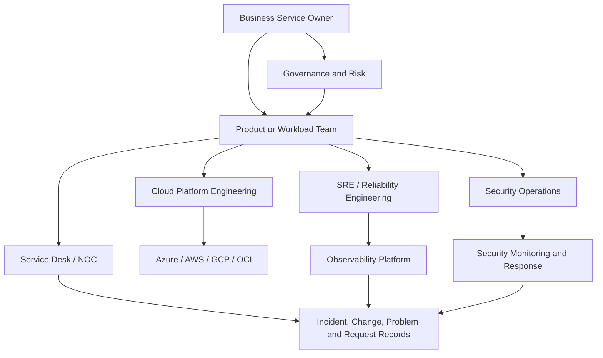
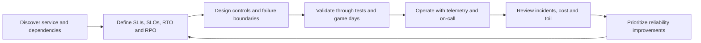

# Cloud Operations and Reliability Model

## Purpose

This standard defines the enterprise operating model for running cloud services reliably across Azure, AWS, GCP, and Oracle Cloud Infrastructure. It establishes ownership, reliability objectives, support tiers, service-management interfaces, decision rights, and minimum operational controls. It is deliberately provider-neutral: cloud-native tooling may implement the model, but no provider tool replaces accountable service ownership.

## Scope

This standard applies to production and production-adjacent workloads, shared cloud platforms, landing zones, network and identity services, data platforms, managed databases, Kubernetes platforms, serverless applications, AI services, and externally consumed APIs. Development sandboxes may use reduced controls only when they are isolated, non-sensitive, disposable, and subject to explicit cost and security guardrails.

The standard covers the **build-to-run transition** and steady-state operations. It does not define detailed application architecture, security architecture, or software delivery standards except where those disciplines intersect with reliability.

## Operating principles

1. **A service must have one accountable owner.** Shared responsibility does not mean shared ambiguity.
2. **Reliability is expressed as measurable service outcomes.** Uptime claims without SLIs, SLOs, measurement windows, and exclusions are invalid.
3. **Operational work is engineered, not improvised.** Runbooks, automation, testing, and telemetry are part of the product.
4. **The control plane is treated as production.** Landing zones, identity, DNS, networking, CI/CD, policy, secrets, and observability platforms require the same discipline as business applications.
5. **Risk determines rigor.** Criticality, data classification, user impact, regulatory obligations, and dependency concentration determine the required support model.
6. **Cloud-provider SLAs are inputs, not workload guarantees.** End-to-end reliability depends on architecture, configuration, operations, dependencies, and recovery capability.
7. **Teams optimize for sustainable operations.** Chronic toil, unstable on-call rotations, excessive alert volume, and undocumented heroics are reliability defects.

## Target operating model

### Required service roles

| Role | Accountability |
|---|---|
| Business service owner | Business impact, service criticality, risk acceptance, funding, and service-level commitments. |
| Product/workload owner | End-to-end technical service, backlog, architecture, dependencies, operational readiness, and lifecycle. |
| Cloud platform owner | Landing zones, shared connectivity, identity integration, policy, guardrails, platform SLOs, and provider escalation. |
| Reliability engineering | SLO design, error-budget policy, resilience engineering, incident learning, automation, and toil reduction. |
| Security operations | Security detection, investigation, containment, evidence handling, and regulatory escalation. |
| Service desk/NOC | Intake, triage, communication, routing, status tracking, and knowledge management. |
| FinOps | Allocation, forecasting, unit economics, optimization governance, and financial accountability. |

A single person may perform multiple roles in a small environment, but the accountabilities must remain explicit.

## Service criticality and support tiers

Every production service **MUST** be assigned a criticality tier through a documented business impact analysis.

| Tier | Typical impact | Minimum support model | Reliability expectation |
|---|---|---|---|
| Tier 0: Foundational | Failure affects many services, tenants, or identity/network control planes | 24x7 on-call, tested regional recovery, executive incident path | Highest; explicit dependency SLOs and capacity reserves |
| Tier 1: Mission critical | Material safety, regulatory, revenue, customer, or operational impact | 24x7 on-call, formal SLOs, tested DR, rapid escalation | Strict SLO and error-budget governance |
| Tier 2: Business critical | Significant business degradation with workaround | Extended-hours or 24x7 based on impact, tested recovery | Documented SLOs and recovery objectives |
| Tier 3: Standard | Limited impact, delay tolerated | Business-hours support unless contract requires otherwise | Basic monitoring, backup, and owner response |
| Tier 4: Non-production | No direct production commitment | Best effort with cost and security guardrails | Disposable or recoverable from code/data sources |

Tiering must be reviewed at least annually and after material architecture, dependency, data, or business changes.

## Reliability management lifecycle

### Required lifecycle controls

- A service **MUST** have a service record containing owner, tier, user journeys, dependencies, data classification, regions, support hours, SLOs, RTO, RPO, escalation path, runbooks, dashboards, and repositories.
- Reliability objectives **MUST** be approved by the business service owner and the technical service owner.
- SLOs **MUST** measure user-visible outcomes where technically feasible. Infrastructure utilization alone is not a service-level indicator.
- Error-budget policy **MUST** define what happens when a service consumes budget too quickly or exhausts it. Valid actions include release restriction, reliability work, capacity changes, rollback, or architecture remediation.
- Changes to Tier 0 and Tier 1 services **MUST** use progressive delivery, tested rollback, or equivalent risk controls.
- Recurring incidents **MUST** enter problem management with an accountable remediation owner and due date.
- Operational exceptions **MUST** be time-bound, risk-accepted, and tracked to closure.

## Standard service artifacts

Each service repository or linked service record must contain:

1. Service overview and architecture diagram.
2. Dependency map, including external SaaS and organizational dependencies.
3. SLI/SLO specification and error-budget policy.
4. Monitoring and alert catalog.
5. Runbooks for common failure modes and privileged operations.
6. Backup and recovery specification.
7. Incident escalation and communication plan.
8. Operational readiness assessment.
9. Cost ownership and allocation metadata.
10. Known risks, technical debt, and accepted exceptions.

Documentation that is stale, inaccessible during an outage, or dependent on the failed system is operationally useless. Critical runbooks must have an independently accessible copy.

## Multi-cloud implementation mapping

| Capability | Azure | AWS | GCP | OCI |
|---|---|---|---|---|
| Workload architecture review | Azure Well-Architected Review | AWS Well-Architected Tool | Well-Architected Framework review | OCI Architecture Center / Cloud Adoption Framework |
| Provider health | Azure Service Health and Resource Health | AWS Health | Personalized Service Health | OCI Console Announcements and service health communications |
| Operational telemetry | Azure Monitor | Amazon CloudWatch | Cloud Monitoring and Cloud Logging | OCI Monitoring and Logging |
| Configuration/compliance | Azure Policy and Resource Graph | AWS Config and Organizations controls | Organization Policy and Cloud Asset Inventory | OCI Cloud Guard, Security Zones, Search and IAM policies |
| Support escalation | Azure support plans | AWS Support | GCP Customer Care | Oracle Support |

Provider-native services should be integrated into the enterprise incident, configuration, and evidence processes. Separate consoles without normalized ownership and escalation create blind spots.

## Reliability metrics

The reliability scorecard must distinguish service outcomes from engineering activity.

| Dimension | Required examples |
|---|---|
| User outcomes | Availability, successful transaction rate, latency, freshness, correctness, durability |
| Incident performance | MTTD, MTTA, time to mitigate, time to recover, recurrence rate, customer-impact minutes |
| Change quality | Deployment frequency, change failure rate, rollback rate, failed-control rate |
| Operational sustainability | Alert volume, actionable alert ratio, pages per on-call shift, toil hours, runbook coverage |
| Resilience | Backup success, restore-test success, DR exercise attainment, dependency failure test coverage |
| Improvement | Post-incident action closure, aged reliability debt, SLO compliance trend |

Metrics must have an owner, formula, data source, refresh frequency, and interpretation guidance. A metric without a stable definition cannot support governance.

## Governance and review cadence

- Tier 0 and Tier 1 services: monthly reliability review and quarterly resilience review.
- Tier 2 services: quarterly reliability review and at least annual recovery exercise.
- Tier 3 services: semiannual review and recovery validation proportional to risk.
- Shared platforms: publish service health, roadmap, breaking changes, SLO attainment, and major incident learning to consumers.
- Executive reporting: focus on business impact, systemic risk, reliability investment, trend, and unresolved decisions—not raw infrastructure counters.

## Anti-patterns

- Declaring a workload “highly available” because one managed service has an SLA.
- Operating a critical service without a named owner or funded on-call model.
- Using ticket volume as proof of operational effectiveness.
- Measuring only CPU, memory, and disk while ignoring user journeys.
- Allowing every team to create incompatible severity scales and incident terminology.
- Treating post-incident reviews as blame assignment.
- Requiring manual console work for routine recovery where automation is feasible.

## Validation

- [ ] Service owner and business owner are named.
- [ ] Criticality tier and business impact analysis are current.
- [ ] SLIs, SLOs, RTO, and RPO are approved and measurable.
- [ ] Dependency map and escalation contacts are current.
- [ ] On-call and incident roles match support commitments.
- [ ] Runbooks, dashboards, backup, recovery, and communications are tested.
- [ ] Reliability, security, and cost reviews have documented actions.
- [ ] Exceptions are time-bound and risk accepted.

## Terminology

| Term | Definition |
|---|---|
| SLI | A quantitative measure of service behavior, such as successful request ratio or latency. |
| SLO | A target value or range for an SLI over a defined measurement window. |
| SLA | A formal commitment that may include contractual remedies. It is not a substitute for an internal SLO. |
| Error budget | The permitted unreliability implied by an SLO. For a 99.9% availability objective, the error budget is 0.1% over the same window. |
| RTO | Maximum targeted elapsed time to restore a service after disruption. |
| RPO | Maximum targeted data-loss interval measured backward from the disruption. |
| MTTD / MTTA / MTTR | Mean time to detect, acknowledge, and restore or recover. Definitions must be fixed in the metric catalog. |
| Toil | Repetitive, manual, automatable operational work that does not create durable service improvement. |

## Related topics

- [Resource Inventory, Reporting, and Compliance Evidence](resource-inventory-reporting-and-compliance-evidence.md)
- [Cloud Cost Management and FinOps](cloud-cost-management-and-finops.md)
- [Incident Response and Troubleshooting](incident-response-and-troubleshooting.md)

## References

The following sources define the external baseline used by this standard. Provider features, regional availability, licensing, and product names must be verified during implementation.

1. [Microsoft Azure Well-Architected Framework](https://learn.microsoft.com/azure/well-architected/)
2. [AWS Well-Architected Framework](https://docs.aws.amazon.com/wellarchitected/latest/framework/welcome.html)
3. [GCP Well-Architected Framework](https://cloud.google.com/architecture/framework)
4. [Oracle Cloud Infrastructure Architecture Center](https://docs.oracle.com/solutions/)
5. [OpenTelemetry documentation](https://opentelemetry.io/docs/)
6. [Google Site Reliability Engineering resources](https://sre.google/)
7. [FinOps Framework](https://www.finops.org/framework/)
8. [NIST SP 800-61 Rev. 3: Incident Response Recommendations and Considerations for Cybersecurity Risk Management](https://csrc.nist.gov/pubs/sp/800/61/r3/final)
