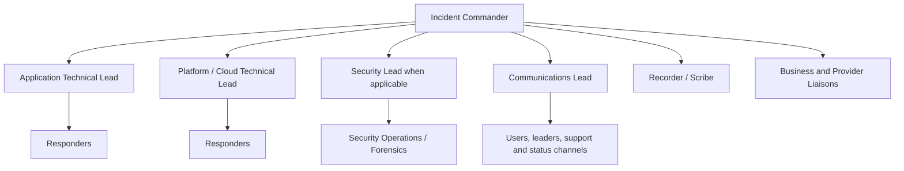

# 事件响应和故障排除

## 目的

该标准定义了云服务的通用操作事件管理和故障排除模型。它协调可靠性事件、提供商事件和网络安全升级，同时保留安全响应的专业权威和证据要求。目标是快速稳定、准确沟通、严格诊断、安全恢复和持久学习。

## 范围

该标准应用于生产中断、严重降级、数据处理故障、更改失败、容量事件、依赖性故障、提供商事件、可疑的数据完整性问题以及可能成为安全事件的操作事件。安全事件必须遵循安全事件响应流程和符合 NIST 的要求；行动团队不得通过不协调的恢复行动销毁证据。

## 事件原则

1. 在追求完美的根本原因之前先稳定客户和业务影响。
2、建立明确的指挥；并行技术工作而不分散决策。
3. 使用时间戳、证据和假设，而不是猜测。
4. 倾向于可逆遏制和缓解。
5. 传达已知的、未知的、变化的和下一步的内容。
6. 当怀疑存在泄露时保留法医证据。
7. 审查系统和决策时不要责怪个人。
8. 跟踪纠正措施以验证完成情况。

## 严重性模型

严重性基于实际或可信的潜在影响，而不是资历或噪音。

|严重性 |标准|初始响应目标|命令模型|
|---|---|---|---|
| SEV-1 严重 |大范围或关键任务中断、重大安全/监管/数据完整性影响或严重安全事件 |立即，24x7 |事件指挥官、技术领导、通信、执行和安全升级 |
| SEV-2 高 |性能严重下降、重要用户群受到影响、关键冗余丢失 |每个服务承诺立即或几分钟内完成 |事件指挥官和协调响应人员|
| SEV-3 中型 |有限的退化，可用的解决方法，没有直接的重大风险 |定义操作响应窗口 |由责任团队领导；需要事件日志记录|
| SEV-4 低 |当前影响可忽略不计的小缺陷或操作问题 |正常积压或服务请求 |标准团队工作流程|

随着证据的变化，严重性可能会上升或下降。事件指挥官在事件期间负责分级决策。

## 事件指挥结构

事件指挥官协调优先事项和决策，不应成为重大事件的主要调试者。技术领导自己的调查流程。记录器维护事实的时间线、决策、命令、链接和所有者。

## 事件生命周期

```mermaid
flowchart LR
    DET[Detect and verify] --> TRI[Triage and classify]
    TRI --> CMD[Establish command and communication]
    CMD --> CONT[Contain or mitigate impact]
    CONT --> DIAG[Diagnose with evidence and hypotheses]
    DIAG --> RECOV[Recover and validate]
    RECOV --> MON[Heightened monitoring]
    MON --> CLOSE[Close operational incident]
    CLOSE --> PIR[Post-incident review]
    PIR --> ACT[Corrective actions and verification]
```

### 检测并验证

响应者必须验证信号、受影响的服务、范围、开始时间、用户影响、最近的更改、提供程序运行状况和依赖关系状态。当遥测不可用时，请使用独立的综合测试、直接服务检查、支持报告和提供商状态渠道。

### 遏制和缓解

有效的缓解措施包括回滚、流量迁移、功能禁用、扩展、故障转移、依赖绕过、队列暂停、速率限制或降级模式操作。每个操作必须说明预期效果、风险、验证方法和回滚路径。

### 诊断

使用结构化假设日志：

|领域|描述 |
|---|---|
|监控|带有时间戳和来源的经过验证的证据 |
|假设|具体因果解释与证据一致|
|测试|最快的安全辨别测试 |
|结果 |支持、拒绝或不确定 |
|下一步行动|负责人和到期时间 |

不要在未记录的情况下更改多个变量。不受控制的同时更改会破坏诊断证据并可能造成其他故障。

## 标准故障排除顺序

1. 从用户或交易角度确认症状。
2. 按地区、租户、版本、依赖关系和操作确定爆炸半径。
3. 检查部署、配置、功能开关、策略、身份和提供程序事件。
4. 比较健康和不健康的路径。
5. 通过 DNS、网络、身份、入口、计算、依赖关系和持久性跟踪请求或数据流。
6. 检查硬限制：配额、证书、IP、连接、线程、存储、分区和速率限制。
7. 使用日志、指标、跟踪、变更记录和数据包/查询证据来测试假设。
8. 应用风险最低的缓解措施来恢复服务。
9. 验证端到端业务成果和数据完整性。
10. 关闭前继续监测复发情况。

## 通讯标准

事件更新必须使用固定结构：

- **影响：** 谁或什么受到影响以及业务后果。
- **状态：**当前的使用状况和严重程度。
- **行动：** 缓解措施和调查正在进行中。
- **已知/未知：** 已验证的事实和重大不确定性。
- **下次更新：**特定时间或事件触发。

请勿发布猜测的根本原因、未经验证的恢复时间、原始内部猜测或敏感的安全细节。外部通信必须遵守法律、隐私、监管和公司通信规则。

## 提供商升级

在打开提供商案例之前，请组装：

- 支持权利和正确的账户/订阅/项目/租户；
- 服务、区域、资源 ID、UTC 时间戳以及相关/请求 ID；
- 用户影响和严重性；
- 最小限度的复制和已知良好的比较；
- 已进行诊断；
- 相关日志、指标、跟踪、数据包采集、屏幕截图和配置；
- 明确的问题或要求提供商采取行动。

提供商案例编号、建议和时间戳必须包含在事件时间表中。提供商支持是一种依赖，不能替代内部命令。

## 安全联动
当怀疑存在未经授权的访问、恶意活动、凭证泄露、意外数据泄露或修改、破坏性行为、恶意软件、可疑特权更改或证据篡改时，立即升级为安全操作。操作响应人员必须保留日志、快照、可行的易失性证据以及监管链要求。恢复行动必须与安全主管协调。

## 事后回顾

对于 SEV-1 和 SEV-2 事件以及重复发生或高学习价值的 SEV-3 事件，必须进行事件后审查。它必须包括：

- 事实时间表和影响；
——检测和响应性能；
- 贡献技术、流程、组织和依赖性因素；
- 为什么保障措施未能防止或减少影响；
- 哪些有效且应该保留；
- 纠正措施的所有者、优先级、到期日和验证方法；
- 更新的运行手册、测试、架构、告警或连续性计划。

“人为错误”并不是充分的根本原因。审查必须解释为什么系统允许不安全的操作或未能检测到并从中恢复。

## 事件指标

至少跟踪：

- 客户影响持续时间和客户影响分钟数；
- MTTD、MTTA、缓解时间和恢复时间；
- 30/90天内复发；
- 与变化相关的事件发生率；
- 内部检测的检测来源和百分比；
- 沟通及时性；
- 事件后行动项的老化和闭环质量；
- 告警噪音和升级准确性。

单个平均 MTTR 可以掩盖严重的异常值。报告分布和特定严重性趋势。

## 多云诊断源

|领域 |Azure|AWS | GCP |OCI |
|---|---|---|---|---|
|提供商健康 |Service Health / Resource Health| AWS Health |Personalized Service Health |Service health communications / announcements|
|活动/审计 | Azure Activity Log |CloudTrail| Cloud Audit Logs| OCI Audit |
|指标/日志 | Azure Monitor/Log Analytics |CloudWatch|Cloud Monitoring/Cloud Logging| OCI Monitoring/Logging |
|网络诊断|Network Watcher 和流日志|VPC Flow Logs、Reachability Analyzer|VPC Flow Logs、Connectivity Tests|VCN Flow Logs、Network Path Analyzer|
|配置历史|活动日志、策略、Resource Graph 和变更工具 | AWS Config |Cloud Asset Inventory 和审计日志|Audit、Search、Cloud Guard 和配置日志记录 |

## 验证

- [ ] 日志记录严重性标准和响应目标。
- [ ] 重大事件使用指定的指挥、技术、通信和日志记录角色。
- [ ] 时间线、假设、行动和决策均以 UTC 格式采集。
- [ ] 在可行且经过端到端验证的情况下，恢复操作是可逆的。
- [ ] 安全联动标准和证据保存规则已知。
- [ ] 提供商升级包包含可重复的技术证据。
- [ ] SEV-1/2 事件得到无责的事件后复盘。
- [ ] 纠正措施是有责任的、有时限的且经过验证。

## 术语

|术语 |定义 |
|---|---|
| SLI |服务行为的定量度量，例如成功请求率或延迟。 |
| SLO |定义的测量窗口内 SLI 的目标值或范围。 |
|服务级别协议 |可能包括合同修复措施的正式承诺。它不能替代内部 SLO。 |
|错误预算| SLO 隐含的允许的不可靠性。对于 99.9% 的可用性目标，同一窗口内的错误预算为 0.1%。 |
| RTO |中断后恢复服务的最大目标恢复时间。 |
|恢复点目标 |从中断开始向后测量的最大目标数据丢失间隔。 |
| MTTD/MTTA/MTTR |检测、确认和恢复的平均时间。定义必须固定在度量目录中。 |
|重复劳动|重复的、手动的、自动化的操作工作不会带来持久的服务改进。 |

## 相关主题

- [云成本管理和 FinOps](cloud-cost-management-and-finops.md)
- [基础设施和应用健康状况监控](infrastructure-and-application-health-monitoring.md)
- [备份、恢复和业务连续性](backup-recovery-and-business-continuity.md)

## 参考文档

以下来源定义了本标准使用的外部基线。在实施过程中必须验证提供商功能、区域可用性、许可和产品名称。

1. [Microsoft Azure Well-Architected Framework](https://learn.microsoft.com/azure/well-architected/)
2. [AWS Well-Architected Framework](https://docs.aws.amazon.com/wellarchitected/latest/framework/welcome.html)
3.[GCP Well-Architected Framework](https://cloud.google.com/architecture/framework)
4.[Oracle Cloud Infrastructure Architecture Center](https://docs.oracle.com/solutions/)
5. [OpenTelemetry 文档](https://opentelemetry.io/docs/)
6. [Google 站点可靠性工程资源](https://sre.google/)
7.[FinOps Framework](https://www.finops.org/framework/)
8. [NIST SP 800-61 Rev. 3：网络安全风险管理的事件响应建议和注意事项](https://csrc.nist.gov/pubs/sp/800/61/r3/final)
