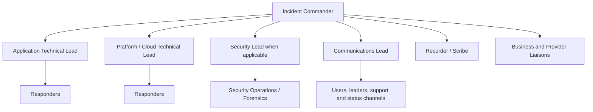

# Incident Response and Troubleshooting

## Purpose

This standard defines a common operational incident-management and troubleshooting model for cloud services. It aligns reliability incidents, provider incidents, and cybersecurity escalation while preserving the specialized authority and evidence requirements of security response. The objective is rapid stabilization, accurate communication, disciplined diagnosis, safe recovery, and durable learning.

## Scope

The standard applies to production outages, severe degradation, data-processing failures, failed changes, capacity events, dependency failures, provider incidents, suspected data integrity issues, and operational events that may become security incidents. Security incidents must follow the security incident-response process and NIST-aligned requirements; operational teams must not destroy evidence through uncoordinated recovery actions.

## Incident principles

1. Stabilize customer and business impact before pursuing a perfect root cause.
2. Establish clear command; parallelize technical work without fragmenting decisions.
3. Use timestamps, evidence, and hypotheses—not speculation.
4. Prefer reversible containment and mitigation.
5. Communicate what is known, unknown, changing, and next.
6. Preserve forensic evidence when compromise is suspected.
7. Review systems and decisions without personal blame.
8. Track corrective actions to verified completion.

## Severity model

Severity is based on actual or credible potential impact, not seniority or noise.

| Severity | Criteria | Initial response target | Command model |
|---|---|---|---|
| SEV-1 Critical | Widespread or mission-critical outage, material safety/regulatory/data-integrity impact, or severe security event | Immediate, 24x7 | Incident commander, technical leads, communications, executive and security escalation |
| SEV-2 High | Major degradation, significant user segment affected, critical redundancy lost | Immediate or within minutes per service commitment | Incident commander and coordinated responders |
| SEV-3 Medium | Limited degradation, workaround available, no immediate major risk | Defined operational response window | Owning team leads; incident record required |
| SEV-4 Low | Minor defect or operational issue with negligible current impact | Normal backlog or service request | Standard team workflow |

Severity may rise or fall as evidence changes. The incident commander owns classification during the event.

## Incident command structure

The incident commander coordinates priorities and decisions and should not be the primary debugger for a major incident. Technical leads own investigation streams. The recorder maintains a factual timeline, decisions, commands, links, and owners.

## Incident lifecycle

```mermaid
flowchart LR
    DET[Detect and verify] --> TRI[Triage and classify]
    TRI --> CMD[Establish command and communication]
    CMD --> CONT[Contain or mitigate impact]
    CONT --> DIAG[Diagnose with evidence and hypotheses]
    DIAG --> RECOV[Recover and validate]
    RECOV --> MON[Heightened monitoring]
    MON --> CLOSE[Close operational incident]
    CLOSE --> PIR[Post-incident review]
    PIR --> ACT[Corrective actions and verification]
```

### Detect and verify

The responder must validate the signal, affected service, scope, start time, user impact, recent changes, provider health, and dependency state. When telemetry is unavailable, use independent synthetic tests, direct service checks, support reports, and provider status channels.

### Contain and mitigate

Valid mitigations include rollback, traffic shift, feature disablement, scaling, failover, dependency bypass, queue pause, rate limiting, or degraded-mode operation. Each action must state expected effect, risk, validation method, and rollback path.

### Diagnose

Use a structured hypothesis log:

| Field | Description |
|---|---|
| Observation | Verified evidence with timestamp and source |
| Hypothesis | Specific causal explanation consistent with evidence |
| Test | Fastest safe discriminating test |
| Result | Supported, rejected, or inconclusive |
| Next action | Owner and due time |

Do not change multiple variables without recording them. Uncontrolled simultaneous changes destroy diagnostic evidence and can create additional failures.

## Standard troubleshooting sequence

1. Confirm the symptom from the user or transaction perspective.
2. Determine blast radius by region, tenant, version, dependency, and operation.
3. Review deployments, configuration, feature flags, policy, identity, and provider events.
4. Compare healthy and unhealthy paths.
5. Follow the request or data flow through DNS, network, identity, ingress, compute, dependencies, and persistence.
6. Check hard limits: quotas, certificates, IPs, connections, threads, storage, partitions, and rate limits.
7. Use logs, metrics, traces, change records, and packet/query evidence to test hypotheses.
8. Apply the lowest-risk mitigation that restores the service.
9. Validate end-to-end business outcomes and data integrity.
10. Continue monitoring for recurrence before closure.

## Communication standard

Incident updates must use a fixed structure:

- **Impact:** who or what is affected and business consequence.
- **Status:** current service condition and severity.
- **Actions:** mitigation and investigation in progress.
- **Known/unknown:** verified facts and material uncertainty.
- **Next update:** a specific time or event trigger.

Do not publish guessed root causes, unverified recovery times, raw internal speculation, or sensitive security details. External communication must follow legal, privacy, regulatory, and corporate communications rules.

## Provider escalation

Before opening a provider case, assemble:

- support entitlement and correct account/subscription/project/tenancy;
- service, region, resource IDs, timestamps in UTC, and correlation/request IDs;
- user impact and severity;
- minimal reproduction and known-good comparison;
- diagnostics already performed;
- relevant logs, metrics, traces, packet captures, screenshots, and configuration;
- explicit question or requested provider action.

Provider case numbers, recommendations, and timestamps must be included in the incident timeline. Provider support is a dependency, not a substitute for internal command.

## Security crossover

Escalate immediately to security operations when there is suspected unauthorized access, malicious activity, credential compromise, unexpected data exposure or modification, destructive behavior, malware, suspicious privileged changes, or evidence tampering. Operational responders must preserve logs, snapshots, volatile evidence where feasible, and chain-of-custody requirements. Recovery actions must be coordinated with the security lead.

## Post-incident review

A post-incident review is mandatory for SEV-1 and SEV-2 incidents and for recurring or high-learning-value SEV-3 events. It must include:

- factual timeline and impact;
- detection and response performance;
- contributing technical, process, organizational, and dependency factors;
- why safeguards did not prevent or reduce impact;
- what worked and should be retained;
- corrective actions with owner, priority, due date, and verification method;
- updated runbooks, tests, architecture, alerts, or continuity plans.

“Human error” is not an adequate root cause. The review must explain why the system permitted an unsafe action or failed to detect and recover from it.

## Incident metrics

Track at minimum:

- customer-impact duration and customer-impact minutes;
- MTTD, MTTA, time to mitigate, and time to recover;
- recurrence within 30/90 days;
- change-related incident rate;
- detection source and percentage detected internally;
- communication timeliness;
- post-incident action aging and closure quality;
- alert noise and escalation accuracy.

A single average MTTR can conceal severe outliers. Report distributions and severity-specific trends.

## Multi-cloud diagnostic sources

| Domain | Azure | AWS | GCP | OCI |
|---|---|---|---|---|
| Provider health | Service Health / Resource Health | AWS Health | Personalized Service Health | Service health communications / announcements |
| Activity/audit | Azure Activity Log | CloudTrail | Cloud Audit Logs | OCI Audit |
| Metrics/logs | Azure Monitor / Log Analytics | CloudWatch | Cloud Monitoring / Logging | OCI Monitoring / Logging |
| Network diagnosis | Network Watcher and flow logs | VPC Flow Logs, Reachability Analyzer | VPC Flow Logs, Connectivity Tests | VCN Flow Logs, Network Path Analyzer |
| Configuration history | Activity Log, Policy, Resource Graph and change tooling | AWS Config | Cloud Asset Inventory and audit logs | Audit, Search, Cloud Guard and configuration records |

## Validation

- [ ] Severity criteria and response targets are documented.
- [ ] Major incidents use named command, technical, communications, and recording roles.
- [ ] Timeline, hypotheses, actions, and decisions are captured in UTC.
- [ ] Recovery actions are reversible where feasible and validated end to end.
- [ ] Security crossover criteria and evidence-preservation rules are known.
- [ ] Provider escalation packages contain reproducible technical evidence.
- [ ] SEV-1/2 incidents receive blameless post-incident reviews.
- [ ] Corrective actions are owned, time-bound, and verified.

## Terminology

| Term | Definition |
|---|---|
| SLI | A quantitative measure of service behavior, such as successful request ratio or latency. |
| SLO | A target value or range for an SLI over a defined measurement window. |
| SLA | A formal commitment that may include contractual remedies. It is not a substitute for an internal SLO. |
| Error budget | The permitted unreliability implied by an SLO. For a 99.9% availability objective, the error budget is 0.1% over the same window. |
| RTO | Maximum targeted elapsed time to restore a service after disruption. |
| RPO | Maximum targeted data-loss interval measured backward from the disruption. |
| MTTD / MTTA / MTTR | Mean time to detect, acknowledge, and restore or recover. Definitions must be fixed in the metric catalog. |
| Toil | Repetitive, manual, automatable operational work that does not create durable service improvement. |

## Related topics

- [Cloud Cost Management and FinOps](cloud-cost-management-and-finops.md)
- [Infrastructure and Application Health Monitoring](infrastructure-and-application-health-monitoring.md)
- [Backup, Recovery, and Business Continuity](backup-recovery-and-business-continuity.md)

## References

The following sources define the external baseline used by this standard. Provider features, regional availability, licensing, and product names must be verified during implementation.

1. [Microsoft Azure Well-Architected Framework](https://learn.microsoft.com/azure/well-architected/)
2. [AWS Well-Architected Framework](https://docs.aws.amazon.com/wellarchitected/latest/framework/welcome.html)
3. [GCP Well-Architected Framework](https://cloud.google.com/architecture/framework)
4. [Oracle Cloud Infrastructure Architecture Center](https://docs.oracle.com/solutions/)
5. [OpenTelemetry documentation](https://opentelemetry.io/docs/)
6. [Google Site Reliability Engineering resources](https://sre.google/)
7. [FinOps Framework](https://www.finops.org/framework/)
8. [NIST SP 800-61 Rev. 3: Incident Response Recommendations and Considerations for Cybersecurity Risk Management](https://csrc.nist.gov/pubs/sp/800/61/r3/final)
