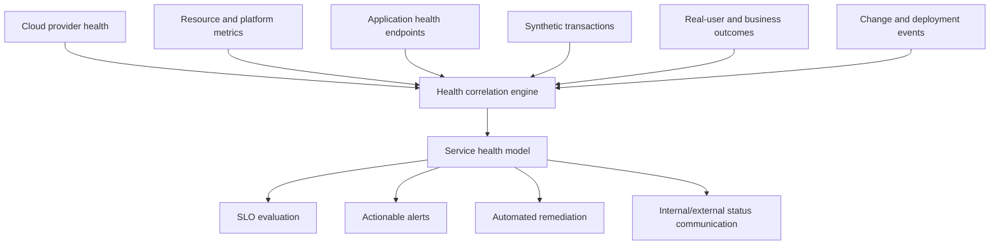
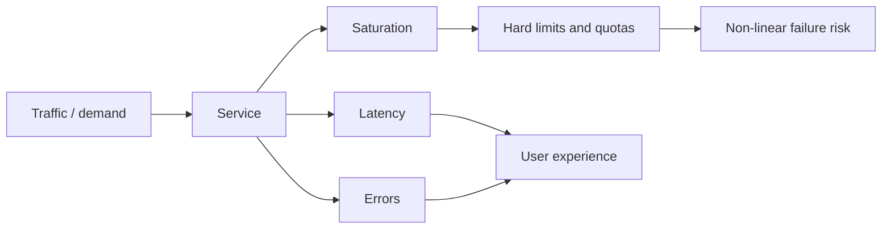

# 基础设施和应用运行状况监控

## 目的

该标准定义了团队如何监控云基础设施、平台、应用、托管服务、依赖项和关键用户旅程的运行状况。运行状况监控必须确定服务是否能够执行其预期功能，而不仅仅是虚拟机或容器进程是否正在运行。

## 范围

这些要求应用于跨 Azure、AWS、GCP 和 OCI 的计算、容器、Kubernetes、无服务器服务、数据库、存储、消息传递、集成平台、网络、DNS、身份、机密、证书、API、Web 应用、数据管道以及 AI 推理或检索服务。

## 健康模型

服务健康状况通过五个层面进行评估：

|层 |问题 |示例 |
|---|---|---|
|提供商|云服务或区域是否降级？ |提供商事件、维护、配额或容量限制 |
|资源 |所配置的资源是否可运行？ | VM 状态、节点准备情况、数据库可用性、存储错误 |
|平台|共享平台能否提供服务？ | DNS 解析、身份发布、入口、集群调度、机密检索 |
|应用 |工作负载能否正确执行？ | API 成功、依赖调用、作业完成、数据正确性 |
|用户历程 |用户能否完成商业交易？ |登录、搜索、结帐、文件上传、报告生成 |

绿色资源状态并不能证明应用或用户旅程的健康状况。因此，每个关键服务必须在多个层面实施健康信号。

## 参考架构

## 健康端点设计

应用和平台组件应该公开单独的端点语义：

|端点 |意义|使用|
|---|---|---|
|存活 |进程并非不可恢复地卡住|仅重新启动决定；不能依赖于每一个外部服务 |
|准备情况|实例可以安全接收流量 |负载均衡器或编排器路由 |
|启动|应用初始化仍在进行 |防止缓慢启动期间过早的活性失败 |
|深层健康 |关键的内部和外部依赖性是功能性的 |服务仪表板和诊断，不一定是重启逻辑 |

设计不当的探头可能会造成中断。由于下游数据库不可用而失败的存活探针可能会重新启动每个应用实例并导致恢复恶化。当无法提供流量时，就绪性可能会反映依赖关系故障，但探测行为必须防止级联故障并重新启动循环。

### 健康端点控制

- 端点 **MUST** 是轻量级的、确定性的、经过身份验证的或网络限制的，其中公开了详细的诊断信息。
- 公共健康检查端点 **MUST NOT** 公开版本、主机名、依赖关系拓扑、机密或堆栈跟踪。
- 就绪逻辑 **MUST** 考虑连接池耗尽、初始化和关键依赖状态。
- 运行状况检查 **MUST** 设置短于评估间隔的超时时间，并且不得产生重大负载。
- 探针设置 **MUST** 在启动延迟、依赖性故障、CPU 饱和和网络延迟下进行验证。

## 基础设施监控基线

### 计算和操作系统

监视可用性、CPU 饱和度、运行队列、内存压力、寻呼、磁盘延迟和容量、文件系统 inode、网络错误、时间同步、代理运行状况、证书到期、补丁状态和重新启动要求。仅静态阈值是不够的；需要基线和特定于工作负载的限制。

### Kubernetes 和容器平台

监控暴露的控制平面运行状况、节点准备情况、调度故障、pod 重启循环、不可用副本、挂起的工作负载、CPU 和内存限制、持久卷错误、入口故障、DNS、证书过期、Autoscaler 限制、镜像拉取故障、策略拒绝和集群/版本生命周期。

### 托管数据库和存储

监控连接饱和度、查询延迟、死锁、复制滞后、故障转移状态、备份状态、存储增长、事务日志压力、限制、IOPS/吞吐量限制、缓存命中率、错误率、数据新鲜度和维护事件。提供商指标必须辅以应用级查询和事务结果。

### 网络和身份

监控 DNS 解析、路由可达性、防火墙拒绝趋势、负载均衡器后端运行状况、数据包丢失、延迟、私有端点解析、VPN/互连运行状况、证书链、身份提供商可用性、令牌颁发延迟、联合故障和权限拒绝趋势。

## 应用监控基线

对于基于请求的系统，执行以下操作：

- 请求率和并发性。
- 成功请求率基于业务结果，而不仅仅是 HTTP 状态。
- 延迟百分位数，而不是单独的平均值。
- 依赖延迟和错误率。
- 队列深度、寿命和死信量。
- 缓存有效性和驱逐。
- 线程、连接、工作线程和速率限制饱和。
- 版本、功能开关和部署注释。
- 业务交易完成和对账。

对于批处理和数据工作负载，监视启动延迟、完成时间、新鲜度、完整性、架构有效性、重复或丢失日志、协调、重试行为和下游发布。

对于 AI 应用，监控推理可用性、延迟、令牌使用、模型/提供商限制、检索可用性、检索延迟、groundedness 或质量评估信号、安全控制激活、回退行为以及提示或模型版本。必须仔细定义质量指标；成功的 HTTP 响应并不能证明 AI 结果正确。

## 黄金信号和饱和度

运行状况监控必须包括硬限制，例如 IP 耗尽、子网容量、提供商配额、连接计数、API 速率限制、证书过期、分区限制、存储限制和令牌/请求配额。这些通常会突然失败；他们需要具有足够修复时间的预测告警。

## 依赖监控

每个第 0-2 层服务必须维护一个依赖项清单，用于标识：

- 负责团队和支持路径；
- 依赖性 SLO 或提供商承诺；
- 超时、重试、断路器、缓存和回退行为；
- 失效模式和爆炸半径；
- 可观测性来源；
- 恢复和通信路径。

重试必须在需要时使用有界尝试、指数退避、抖动和幂等性。无限制的同步重试会将部分降级转换为系统故障。

## 自动修复

在以下情况下，自动化可能会重新启动、重新安排、扩展、故障转移、清除已知的瞬态或切换到已记录在案的回退：

1. 条件明确；
2. 动作是可逆的或低风险的；
3. 存在速率限制和爆炸半径控制；
4. 记录操作并与事件相关联；
5. 重复修复逐步升级，而不是无限循环。

破坏性恢复、数据故障转移、凭证轮换和广泛的流量迁移需要更强大的授权和验证。

## 多云服务映射

|能力|Azure|AWS | GCP |OCI |
|---|---|---|---|---|
|提供商/资源健康状况 |Service Health、Resource Health| AWS Health、CloudWatch |Personalized Service Health、Cloud Monitoring|Service announcements、OCI Monitoring |
|综合检查| Application Insights 可用性测试/Azure Load Testing 模式 | CloudWatch Synthetics |Cloud Monitoring uptime checks| OCI Health Checks |
|虚拟机监控 | Azure Monitor Agent / VM Insights | CloudWatch Agent / Systems Manager | Ops Agent | Management Agent / OCI Monitoring |
|Kubernetes | Azure Monitor managed Prometheus and Container Insights | Container Insights / Managed Prometheus | GCP Managed Service for Prometheus / GKE observability | OCI Monitoring plus Prometheus/Grafana patterns for OKE |
|应用健康状况 |Application Insights | CloudWatch Application Signals/X-Ray |Cloud Trace、Error Reporting、自定义指标 | OCI APM |

## 验证

仅当满足以下条件时，服务才可在操作上进行监控：

- 仪表板显示用户旅程、应用、平台和提供商层；
- 告警识别业务影响、受影响的区域/版本以及可能的依赖性；
- 部署可以与健康变化相关联；
- 监控检测受控故障测试；
- 操作员可以区分资源故障与依赖性或应用故障；
- 预测硬性限制和生命周期期限；
- 在工作负载中断期间，健康信息仍然可用。

## 最低合规性清单

- [ ] 关键用户旅程具有综合或等效的结果监控。
- [ ] 活跃度、就绪度、启动和深度健康语义是分开的。
- [ ] 基础设施、平台、应用和提供商的运行状况是相关的。
- [ ] 依赖性和硬限制被盘点和监控。
- [ ] 批量、数据和 AI 工作负载使用特定于结果的健康指标。
- [ ] 自动修复具有护栏和循环预防。
- [ ] 仪表板和告警通过受控故障测试进行验证。

## 术语

|术语 |定义 |
|---|---|
| SLI |服务行为的定量度量，例如成功请求率或延迟。 |
| SLO |定义的测量窗口内 SLI 的目标值或范围。 |
|服务级别协议 |可能包括合同修复措施的正式承诺。它不能替代内部 SLO。 |
|错误预算| SLO 隐含的允许的不可靠性。对于 99.9% 的可用性目标，同一窗口内的错误预算为 0.1%。 |
| RTO |中断后恢复服务的最大目标恢复时间。 |
|恢复点目标 |从中断开始向后测量的最大目标数据丢失间隔。 |
| MTTD/MTTA/MTTR |检测、确认和恢复的平均时间。定义必须固定在度量目录中。 |
|重复劳动|重复的、手动的、自动化的操作工作不会带来持久的服务改进。 |

## 相关主题

- [事件响应和故障排除](incident-response-and-troubleshooting.md)
- [备份、恢复和业务连续性](backup-recovery-and-business-continuity.md)
- [云成本管理和 FinOps](cloud-cost-management-and-finops.md)

## 参考文档

以下来源定义了本标准使用的外部基线。在实施过程中必须验证提供商功能、区域可用性、许可和产品名称。

1. [Microsoft Azure Well-Architected Framework](https://learn.microsoft.com/azure/well-architected/)
2. [AWS Well-Architected Framework](https://docs.aws.amazon.com/wellarchitected/latest/framework/welcome.html)
3.[GCP Well-Architected Framework](https://cloud.google.com/architecture/framework)
4.[Oracle Cloud Infrastructure Architecture Center](https://docs.oracle.com/solutions/)
5. [OpenTelemetry 文档](https://opentelemetry.io/docs/)
6. [Google 站点可靠性工程资源](https://sre.google/)
7.[FinOps Framework](https://www.finops.org/framework/)
8. [NIST SP 800-61 Rev. 3：网络安全风险管理的事件响应建议和注意事项](https://csrc.nist.gov/pubs/sp/800/61/r3/final)
