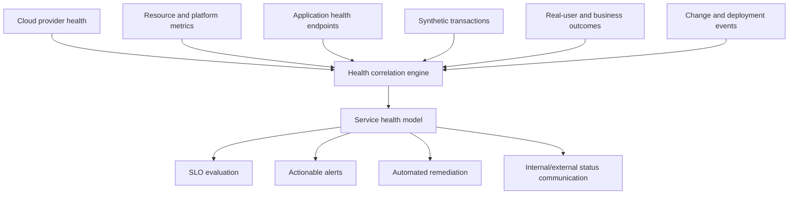
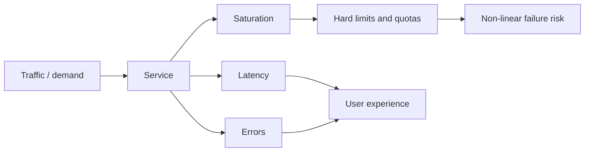

# Infrastructure and Application Health Monitoring

## Purpose

This standard defines how teams monitor the health of cloud infrastructure, platforms, applications, managed services, dependencies, and critical user journeys. Health monitoring must determine whether a service is capable of performing its intended function—not merely whether a virtual machine or container process is running.

## Scope

The requirements apply to compute, containers, Kubernetes, serverless services, databases, storage, messaging, integration platforms, networks, DNS, identity, secrets, certificates, APIs, web applications, data pipelines, and AI inference or retrieval services across Azure, AWS, GCP, and OCI.

## Health model

Service health is evaluated across five layers:

| Layer | Question | Examples |
|---|---|---|
| Provider | Is the cloud service or region degraded? | Provider incidents, maintenance, quota or capacity constraints |
| Resource | Is the provisioned resource operational? | VM state, node readiness, database availability, storage errors |
| Platform | Can the shared platform deliver its service? | DNS resolution, identity issuance, ingress, cluster scheduling, secrets retrieval |
| Application | Can the workload execute correctly? | API success, dependency calls, job completion, data correctness |
| User journey | Can a user complete the business transaction? | Login, search, checkout, file upload, report generation |

A green resource state does not prove application or user-journey health. Each critical service must therefore implement health signals at multiple layers.

## Reference architecture

## Health endpoint design

Applications and platform components should expose separate endpoint semantics:

| Endpoint | Meaning | Use |
|---|---|---|
| Liveness | Process is not irrecoverably stuck | Restart decision only; must not depend on every external service |
| Readiness | Instance can safely receive traffic | Load-balancer or orchestrator routing |
| Startup | Application initialization is still progressing | Prevent premature liveness failure during slow startup |
| Deep health | Key internal and external dependencies are functional | Service dashboard and diagnostics, not necessarily restart logic |

Poorly designed probes can create outages. A liveness probe that fails because a downstream database is unavailable can restart every application instance and worsen recovery. Readiness may reflect a dependency failure when traffic cannot be served, but probe behavior must prevent cascading failure and restart loops.

### Health endpoint controls

- Endpoints **MUST** be lightweight, deterministic, authenticated or network-restricted where detailed diagnostics are exposed.
- Public health endpoints **MUST NOT** disclose versions, hostnames, dependency topology, secrets, or stack traces.
- Readiness logic **MUST** account for connection-pool exhaustion, initialization, and critical dependency state.
- Health checks **MUST** have timeouts shorter than their evaluation interval and must not create material load.
- Probe settings **MUST** be validated under startup delay, dependency failure, CPU saturation, and network latency.

## Infrastructure monitoring baseline

### Compute and operating systems

Monitor availability, CPU saturation, run queue, memory pressure, paging, disk latency and capacity, filesystem inodes, network errors, time synchronization, agent health, certificate expiry, patch state, and reboot requirements. Static thresholds alone are insufficient; baselines and workload-specific limits are required.

### Kubernetes and container platforms

Monitor control-plane health where exposed, node readiness, scheduling failures, pod restart loops, unavailable replicas, pending workloads, CPU and memory throttling, persistent-volume errors, ingress failure, DNS, certificate expiry, autoscaler limits, image-pull failures, policy denial, and cluster/version lifecycle.

### Managed databases and storage

Monitor connection saturation, query latency, deadlocks, replication lag, failover state, backup status, storage growth, transaction log pressure, throttling, IOPS/throughput limits, cache hit rate, error rates, data freshness, and maintenance events. Provider metrics must be supplemented with application-level query and transaction outcomes.

### Networks and identity

Monitor DNS resolution, route reachability, firewall denial trends, load-balancer backend health, packet loss, latency, private endpoint resolution, VPN/interconnect health, certificate chains, identity-provider availability, token issuance latency, federation failures, and permission-denied trends.

## Application monitoring baseline

For request-based systems, implement the following:

- Request rate and concurrency.
- Successful request ratio based on business outcome, not only HTTP status.
- Latency percentiles, not averages alone.
- Dependency latency and error rate.
- Queue depth, age, and dead-letter volume.
- Cache effectiveness and eviction.
- Thread, connection, worker, and rate-limit saturation.
- Version, feature flag, and deployment annotations.
- Business transaction completion and reconciliation.

For batch and data workloads, monitor start delay, completion time, freshness, completeness, schema validity, duplicate or missing records, reconciliation, retry behavior, and downstream publication.

For AI applications, monitor inference availability, latency, token usage, model/provider throttling, retrieval availability, retrieval latency, groundedness or quality evaluation signals, safety-control activation, fallback behavior, and prompt or model version. Quality metrics must be defined carefully; a successful HTTP response is not proof of a correct AI outcome.

## Golden signals and saturation

Health monitoring must include hard limits such as IP exhaustion, subnet capacity, provider quotas, connection counts, API rate limits, certificate expiration, partition limits, storage limits, and token/request quotas. These often fail abruptly; they require predictive alerts with sufficient remediation time.

## Dependency monitoring

Every Tier 0–2 service must maintain a dependency inventory that identifies:

- owning team and support path;
- dependency SLO or provider commitment;
- timeout, retry, circuit-breaker, caching, and fallback behavior;
- failure mode and blast radius;
- observability source;
- recovery and communication path.

Retries must use bounded attempts, exponential backoff, jitter, and idempotency where needed. Unbounded synchronized retries convert partial degradation into systemic failure.

## Automated remediation

Automation may restart, reschedule, scale, fail over, clear known transient state, or switch to a documented fallback when:

1. the condition is unambiguous;
2. the action is reversible or low risk;
3. rate limits and blast-radius controls exist;
4. actions are logged and correlated to the incident;
5. repeated remediation escalates instead of looping indefinitely.

Destructive recovery, data failover, credential rotation, and broad traffic shifts require stronger authorization and validation.

## Multi-cloud service mapping

| Capability | Azure | AWS | GCP | OCI |
|---|---|---|---|---|
| Provider/resource health | Service Health, Resource Health | AWS Health, CloudWatch | Personalized Service Health, Cloud Monitoring | Service announcements, OCI Monitoring |
| Synthetic checks | Application Insights availability tests / Azure Load Testing patterns | CloudWatch Synthetics | Cloud Monitoring uptime checks | OCI Health Checks |
| VM monitoring | Azure Monitor Agent / VM Insights | CloudWatch Agent / Systems Manager | Ops Agent | Management Agent / OCI Monitoring |
| Kubernetes | Azure Monitor managed Prometheus and Container Insights | Container Insights / Managed Prometheus | GCP Managed Service for Prometheus / GKE observability | OCI Monitoring plus Prometheus/Grafana patterns for OKE |
| Application health | Application Insights | CloudWatch Application Signals / X-Ray | Cloud Trace, Error Reporting, custom metrics | OCI APM |

## Validation

A service is operationally monitorable only when:

- dashboards show user journey, application, platform, and provider layers;
- alerts identify business impact, affected region/version, and likely dependency;
- a deployment can be correlated with health changes;
- monitoring detects controlled failure tests;
- operators can distinguish resource failure from dependency or application failure;
- hard limits and lifecycle deadlines are forecast;
- health information remains available during a workload outage.

## Minimum compliance checklist

- [ ] Critical user journeys have synthetic or equivalent outcome monitoring.
- [ ] Liveness, readiness, startup, and deep-health semantics are separated.
- [ ] Infrastructure, platform, application, and provider health are correlated.
- [ ] Dependencies and hard limits are inventoried and monitored.
- [ ] Batch, data, and AI workloads use outcome-specific health measures.
- [ ] Automated remediation has guardrails and loop prevention.
- [ ] Dashboards and alerts are validated through controlled failure testing.

## Terminology

| Term | Definition |
|---|---|
| SLI | A quantitative measure of service behavior, such as successful request ratio or latency. |
| SLO | A target value or range for an SLI over a defined measurement window. |
| SLA | A formal commitment that may include contractual remedies. It is not a substitute for an internal SLO. |
| Error budget | The permitted unreliability implied by an SLO. For a 99.9% availability objective, the error budget is 0.1% over the same window. |
| RTO | Maximum targeted elapsed time to restore a service after disruption. |
| RPO | Maximum targeted data-loss interval measured backward from the disruption. |
| MTTD / MTTA / MTTR | Mean time to detect, acknowledge, and restore or recover. Definitions must be fixed in the metric catalog. |
| Toil | Repetitive, manual, automatable operational work that does not create durable service improvement. |

## Related topics

- [Incident Response and Troubleshooting](incident-response-and-troubleshooting.md)
- [Backup, Recovery, and Business Continuity](backup-recovery-and-business-continuity.md)
- [Cloud Cost Management and FinOps](cloud-cost-management-and-finops.md)

## References

The following sources define the external baseline used by this standard. Provider features, regional availability, licensing, and product names must be verified during implementation.

1. [Microsoft Azure Well-Architected Framework](https://learn.microsoft.com/azure/well-architected/)
2. [AWS Well-Architected Framework](https://docs.aws.amazon.com/wellarchitected/latest/framework/welcome.html)
3. [GCP Well-Architected Framework](https://cloud.google.com/architecture/framework)
4. [Oracle Cloud Infrastructure Architecture Center](https://docs.oracle.com/solutions/)
5. [OpenTelemetry documentation](https://opentelemetry.io/docs/)
6. [Google Site Reliability Engineering resources](https://sre.google/)
7. [FinOps Framework](https://www.finops.org/framework/)
8. [NIST SP 800-61 Rev. 3: Incident Response Recommendations and Considerations for Cybersecurity Risk Management](https://csrc.nist.gov/pubs/sp/800/61/r3/final)
