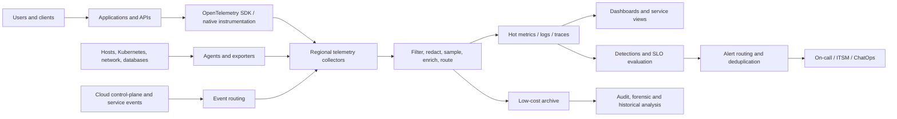
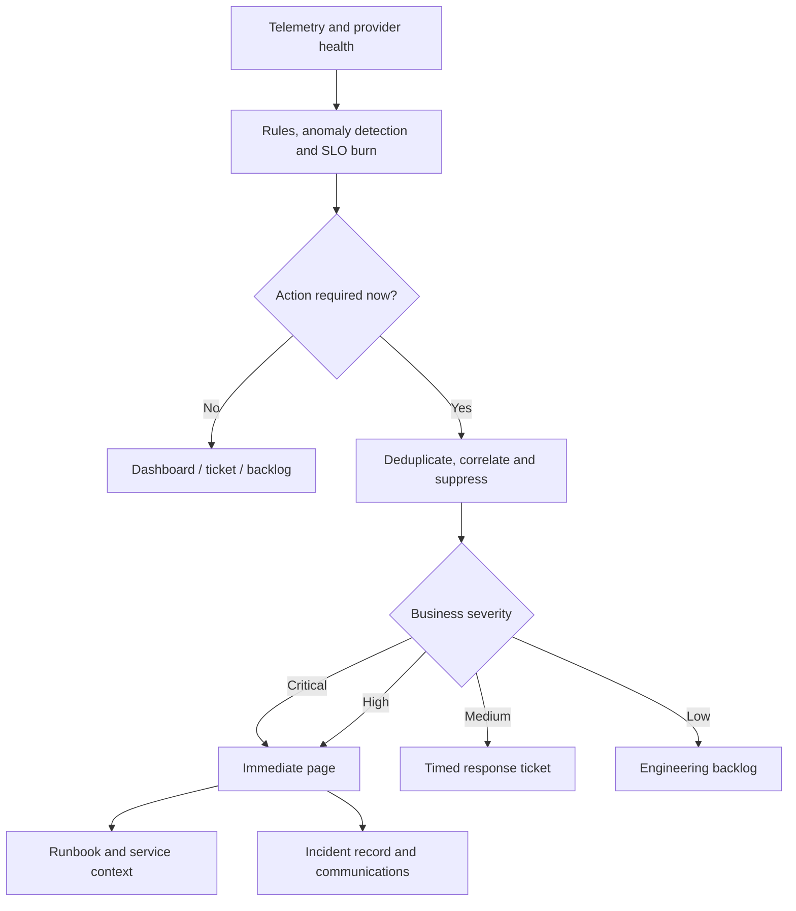

# 可观测性、日志记录和告警

## 目的

该标准定义了用于收集、处理、存储、关联、查询、可视化和操作遥测告警的企业架构。目标不是最大化遥测量。目标是提供充分、可信、成本可控的证据，以了解服务行为、检测重大退化、诊断故障、支持安全调查并验证服务级别目标。

## 范围

该标准应用于应用、API、基础设施、托管服务、数据平台、Kubernetes、无服务器函数、集成服务、网络路径、身份依赖项和 AI 工作负载。它涵盖指标、日志、跟踪、事件、配置文件、综合测试、用户体验信号和提供商健康数据。

安全日志记录要求仍然由安全架构控制，但当访问、保留、隔离和证据控制得到满足时，可以共享相同的遥测管道。

## 架构原则

1. **从用户旅程向内进行埋点。** 平台指标是必要的，但还不够。
2. **采用开放语义约定。** OpenTelemetry 应成为受支持时的默认应用检测模型。
3. **与分析后端分开收集。** 应用不应与一个可观测性提供商紧密耦合。
4. **关联所有信号。** 跟踪 ID、服务标识、环境、区域、部署版本和请求上下文必须支持跨信号导航。
5. **刻意控制基数和保留。** 无界维度和无限期保留是设计缺陷。
6. **对需要采取行动的症状发出告警。** 仪表板可能很宽泛；告警通知范围必须尽量小。
7. **将遥测数据作为企业数据进行保护。** 日志通常包含标识符、机密、有效负载和受监管的数据（除非受到阻止）。
8. **使遥测管道可监控。** 必须监视丢弃的信号、队列饱和、摄取延迟、解析器故障和导出器错误。

## 参考架构

### 集合层

|层 |目的|所需的控制|
|---|---|---|
|应用埋点|业务操作、请求路径、依赖关系、错误、模型调用 | OpenTelemetry 或同等产品；版本化模式；相关性；脱敏|
|平台代理/导出器|主机、容器、网络、数据库和运行时遥测 |托管部署；最低特权；缓冲交付；健康监测|
|提供商原生遥测 |托管服务指标、审计日志、资源运行状况和控制平面事件 |全组织范围内的支持；中央路由；需要时不可变/安全保留|
|综合和真实用户监控 |外部可用性、关键旅程、用户感知性能 |多个观测点；受控测试身份；不得暴露生产数据|
|遥测管道|标准化、采样、丰富、路由和保留 |容量规划；加密；背压；灾难恢复；成本控制|

## 遥测模式标准

每个日志或跨度应包含以下应用字段：

- `service.name`、`service.namespace`、`service.version`
- 环境、云提供商、账户/订阅/项目/租户、区域、可用区
- 工作负载所有者、成本中心、关键层
- UTC 时间戳和一致的时钟同步
- 跟踪 ID、跨度 ID、关联 ID、请求 ID
- 操作名称、结果、状态代码、延迟
- 部署标识符和源版本
- 资源身份和协调器元数据
- 数据分类标记和保留类别

用户 ID、会话 ID、无界 URL、提示文本或任意标签等高基数字段不得用作指标维度。只有在必要、合法、经过脱敏和访问受限的情况下，它们才可以保留在受控日志或跟踪中。

## 日志记录要求

- 应用 **MUST** 发出结构化日志。自由格式的纯文本日志记录对于生产系统来说是不够的。
- 日志级别 **MUST** 已定义语义。 `ERROR`表示操作失败或需要干预；不得将其用于预期的验证结果。
- 记录机密、凭证、令牌、私钥、授权标头以及完整的支付信息或身份载荷 **MUST NOT**。
- 根据分类策略最小化和屏蔽个人和监管数据**MUST**。
- 为特权和控制平面操作启用审计日志 **MUST** 并路由到受保护的中央目的地。
- 保留**MUST** 由用例定义：操作诊断、安全调查、监管证据或长期分析。
- 团队 **MUST** 在日志架构更改时测试解析器和仪表板。

## 指标和 SLO 设计

使用以下层次结构：

1. **业务和用户旅程指标：** 完成的订单、成功登录、处理的日志、模型响应成功。
2. **服务 SLI：** 可用性、延迟、正确性、新鲜度、持久性。
3. **依赖性信号：**数据库延迟、队列寿命、第三方错误率、身份失败。
4. **资源饱和度：** CPU、内存、I/O、连接、配额、线程池、令牌限制。
5. **部署和配置信号：**版本、功能开关、策略更改、扩展事件。

对于请求驱动的服务，从速率、错误、持续时间和饱和度开始。对于数据管道，添加完整性、新鲜度、积压、模式漂移和协调。对于 AI 应用，添加模型延迟、令牌消耗、安全过滤结果、检索质量代理指标、回退率和评估结果，默认情况下不记录敏感提示。

## 告警模型

### 寻呼标准

寻呼告警必须是：

- **可操作：** 收件人立即回复或升级。
- **紧急：** 推迟到营业时间会显著增加影响。
- **用户或风险相关：** 它代表有意义的服务或安全条件。
- **负责：** 定义团队和升级路由。
- **已测试：** 路由和 Runbook 链接已被使用。

对于用户可见的可靠性，SLO 错误预算消耗速率告警应该是首选，因为它们考虑了严重性和持续时间。预测告警应用于硬限制（例如配额、证书到期、容量耗尽或备份故障），在这些限制中等待用户影响将是疏忽的。

## 告警生命周期控制

- 每个告警 **MUST** 都有所有者、严重性、条件、阈值理由、评估窗口、运行手册、依赖关系上下文和预期响应。
- 告警 **MUST** 在重大事件发生后进行审查，对于第 0/1 层服务至少每季度审查一次。
- 来自多层 **SHOULD** 的重复告警关联到单个事件信号。
- 维护、部署和灾难恢复事件 **MUST** 支持受控抑制，无需全局禁用监控。
- 使用可操作率、误报率、重复率、自动解决率和每班寻呼次数来度量告警质量 **MUST**。
- 反复被确认却没有行动的寻呼告警必须被删除、降级或重新设计。

## 多云服务映射

|能力|Azure|AWS | GCP |OCI |
|---|---|---|---|---|
|指标和告警 | Azure Monitor 指标和告警 | Amazon CloudWatch 指标和告警 |Cloud Monitoring| OCI Monitoring 和告警 |
|日志|Log Analytics / Azure Monitor Logs | CloudWatch Logs |Cloud Logging| OCI Logging / Logging Analytics |
|应用性能|Application Insights | CloudWatch Application Signals/X-Ray |Cloud Trace、Error Reporting、Profiler | OCI Application Performance Monitoring |
|管理 Prometheus | Azure Monitor managed service for Prometheus | Amazon Managed Service for Prometheus | Managed Service for Prometheus |Deploy Prometheus or supported partner tooling; integrate with OCI Monitoring as needed |
|仪表板 | Azure Managed Grafana / Workbooks | Amazon Managed Grafana / CloudWatch dashboards |Cloud Monitoring dashboards / Managed Service for Grafana where available| OCI dashboards and partner tools |
|事件路由|Event Grid/Event Hubs | EventBridge/Kinesis | Eventarc / 发布/订阅 |Events/Service Connector Hub/Streaming|

集中式平台可以使用一个战略后端或一组联合的区域/提供商本地存储。该决策必须考虑数据主权、出口、延迟、操作技能、弹性、安全分析和成本。

## 保留和成本架构

定义遥测类别，而不是将一个保留期应用于所有数据。

|班级 |示例|典型治疗|
|---|---|---|
|热运营数据 |最近的生产指标、活动跟踪、错误日志 |快速查询，中短保留 |
|安全/审计 |特权活动、身份验证、策略更改 |根据法律/安全要求进行保护、限制、保留 |
|诊断档案 |详细的调试日志、原始链路追踪 |按需采样或激活；压缩对象存储|
|合规证据|控制证明和所需日志记录|需要时不可变或写保护；记录在案的监管链|
|发展|非生产遥测 |短期保留、积极过滤、成本上限 |

团队必须预测摄取、查询、保留、存档和数据传出成本。在可行的情况下，可观测性支出必须分配给服务。采样必须具有风险意识：始终保留错误和高价值跟踪，然后根据流量和诊断值对成功的流量进行采样。

## 验证

- [ ] 检测关键用户旅程和依赖关系。
- [ ] 实现结构化日志和通用语义字段。
- [ ] 指标、日志和跟踪可以关联。
- [ ] 敏感数据和机密被阻止或脱敏。
- [ ] 监控遥测管道的健康状况和数据丢失。
- [ ] 寻呼告警满足紧急性和可操作性标准。
- [ ] 针对关键服务存在 SLO 错误预算消耗速率告警。
- [ ] 记录保留、访问、抽样和成本策略。
- [ ] 审查告警质量并修复嘈杂的告警。

## 术语

|术语 |定义 |
|---|---|
| SLI |服务行为的定量度量，例如成功请求率或延迟。 |
| SLO |定义的测量窗口内 SLI 的目标值或范围。 |
|服务级别协议 |可能包括合同修复措施的正式承诺。它不能替代内部 SLO。 |
|错误预算| SLO 隐含的允许的不可靠性。对于 99.9% 的可用性目标，同一窗口内的错误预算为 0.1%。 |
| RTO |中断后恢复服务的最大目标恢复时间。 |
|恢复点目标 |从中断开始向后测量的最大目标数据丢失间隔。 |
| MTTD/MTTA/MTTR |检测、确认和恢复的平均时间。定义必须固定在度量目录中。 |
|重复劳动|重复的、手动的、自动化的操作工作不会带来持久的服务改进。 |

## 相关主题

- [备份、恢复和业务连续性](backup-recovery-and-business-continuity.md)
- [云成本管理和 FinOps](cloud-cost-management-and-finops.md)
- [事件响应和故障排除](incident-response-and-troubleshooting.md)

## 参考文档

以下来源定义了本标准使用的外部基线。在实施过程中必须验证提供商功能、区域可用性、许可和产品名称。

1. [Microsoft Azure Well-Architected Framework](https://learn.microsoft.com/azure/well-architected/)
2. [AWS Well-Architected Framework](https://docs.aws.amazon.com/wellarchitected/latest/framework/welcome.html)
3.[GCP Well-Architected Framework](https://cloud.google.com/architecture/framework)
4.[Oracle Cloud Infrastructure Architecture Center](https://docs.oracle.com/solutions/)
5. [OpenTelemetry 文档](https://opentelemetry.io/docs/)
6. [Google 站点可靠性工程资源](https://sre.google/)
7. [FinOps Framework](https://www.finops.org/framework/)
8. [NIST SP 800-61 Rev. 3：网络安全风险管理的事件响应建议和注意事项](https://csrc.nist.gov/pubs/sp/800/61/r3/final)
