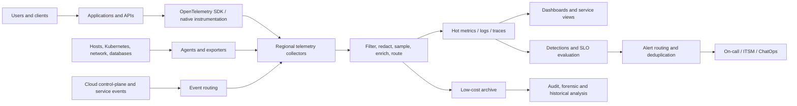
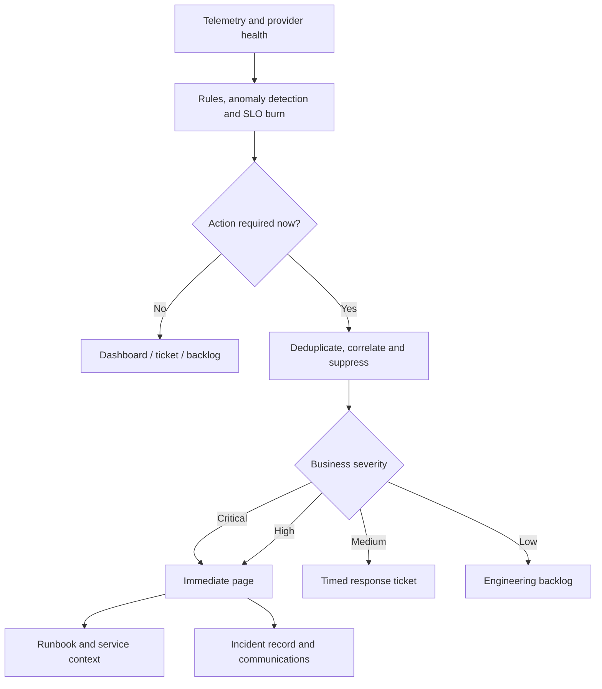

# Observability, Logging, and Alerting

## Purpose

This standard defines the enterprise architecture for collecting, processing, storing, correlating, querying, visualizing, and alerting on operational telemetry. The objective is not to maximize telemetry volume. The objective is to provide sufficient, trustworthy, cost-controlled evidence to understand service behavior, detect material degradation, diagnose failures, support security investigations, and validate service-level objectives.

## Scope

The standard applies to applications, APIs, infrastructure, managed services, data platforms, Kubernetes, serverless functions, integration services, network paths, identity dependencies, and AI workloads. It covers metrics, logs, traces, events, profiles, synthetic tests, user-experience signals, and provider health data.

Security logging requirements remain governed by the security architecture, but the same telemetry pipeline may be shared when access, retention, segregation, and evidentiary controls are satisfied.

## Architecture principles

1. **Instrument from the user journey inward.** Platform metrics are necessary but insufficient.
2. **Adopt open semantic conventions.** OpenTelemetry should be the default application instrumentation model when supported.
3. **Separate collection from analysis backends.** Applications should not be tightly coupled to one observability vendor.
4. **Correlate all signals.** Trace IDs, service identity, environment, region, deployment version, and request context must support cross-signal navigation.
5. **Control cardinality and retention deliberately.** Unbounded dimensions and indefinite retention are design defects.
6. **Alert on action-required symptoms.** Dashboards may be broad; paging must be narrow.
7. **Protect telemetry as enterprise data.** Logs commonly contain identifiers, secrets, payloads, and regulated data unless prevented.
8. **Make the telemetry pipeline observable.** Dropped signals, queue saturation, ingestion delay, parser failure, and exporter errors must be monitored.

## Reference architecture

### Collection layers

| Layer | Purpose | Required controls |
|---|---|---|
| Application instrumentation | Business operations, request path, dependencies, errors, model calls | OpenTelemetry or equivalent; versioned schema; correlation; redaction |
| Platform agents/exporters | Host, container, network, database and runtime telemetry | Managed deployment; least privilege; buffered delivery; health monitoring |
| Provider-native telemetry | Managed-service metrics, audit logs, resource health and control-plane events | Organization-wide enablement; central routing; immutable/security retention where required |
| Synthetic and real-user monitoring | External availability, critical journeys, user-perceived performance | Multiple vantage points; controlled test identities; no production data exposure |
| Telemetry pipeline | Normalize, sample, enrich, route and retain | Capacity planning; encryption; backpressure; disaster recovery; cost controls |

## Telemetry schema standard

Every record or span should include the following fields where applicable:

- `service.name`, `service.namespace`, `service.version`
- environment, cloud provider, account/subscription/project/tenancy, region, zone
- workload owner, cost center, criticality tier
- timestamp in UTC and consistent clock synchronization
- trace ID, span ID, correlation ID, request ID
- operation name, outcome, status code, latency
- deployment identifier and source revision
- resource identity and orchestrator metadata
- data classification marker and retention class

High-cardinality fields such as user IDs, session IDs, unbounded URLs, prompt text, or arbitrary labels must not be used as metric dimensions. They may be retained in controlled logs or traces only when necessary, lawful, redacted, and access-restricted.

## Logging requirements

- Applications **MUST** emit structured logs. Free-form text-only logging is insufficient for production systems.
- Log levels **MUST** have defined semantics. `ERROR` means the operation failed or requires intervention; it must not be used for expected validation outcomes.
- Secrets, credentials, tokens, private keys, authorization headers, and full payment or identity payloads **MUST NOT** be logged.
- Personal and regulated data **MUST** be minimized and masked according to classification policy.
- Audit logs **MUST** be enabled for privileged and control-plane operations and routed to a protected central destination.
- Retention **MUST** be defined by use case: operational diagnosis, security investigation, regulatory evidence, or long-term analytics.
- Teams **MUST** test parsers and dashboards when log schemas change.

## Metrics and SLO design

Use the following hierarchy:

1. **Business and user-journey metrics:** completed orders, successful logins, processed records, model-response success.
2. **Service SLIs:** availability, latency, correctness, freshness, durability.
3. **Dependency signals:** database latency, queue age, third-party error rate, identity failures.
4. **Resource saturation:** CPU, memory, I/O, connections, quotas, thread pools, token limits.
5. **Deployment and configuration signals:** version, feature flags, policy changes, scaling events.

For request-driven services, start with rate, errors, duration, and saturation. For data pipelines, add completeness, freshness, backlog, schema drift, and reconciliation. For AI applications, add model latency, token consumption, safety-filter outcomes, retrieval quality proxies, fallback rate, and evaluation results—without logging sensitive prompts by default.

## Alerting model

### Paging criteria

A paging alert must be:

- **Actionable:** the recipient has an immediate response or escalation.
- **Urgent:** delaying until business hours materially increases impact.
- **User or risk relevant:** it represents a meaningful service or security condition.
- **Owned:** a team and escalation route are defined.
- **Tested:** routing and runbook links have been exercised.

SLO burn-rate alerts should be preferred for user-visible reliability because they account for both severity and duration. Predictive alerts are justified for hard limits—such as quota, certificate expiry, capacity exhaustion, or backup failure—where waiting for user impact would be negligent.

## Alert lifecycle controls

- Every alert **MUST** have an owner, severity, condition, threshold rationale, evaluation window, runbook, dependency context, and expected response.
- Alerts **MUST** be reviewed after major incidents and at least quarterly for Tier 0/1 services.
- Duplicate alerts from multiple layers **SHOULD** be correlated into a single incident signal.
- Maintenance, deployment, and disaster-recovery events **MUST** support controlled suppression without globally disabling monitoring.
- Alert quality **MUST** be measured using actionable rate, false-positive rate, duplicate rate, auto-resolution rate, and pages per shift.
- A page that is repeatedly acknowledged without action must be deleted, downgraded, or redesigned.

## Multi-cloud service mapping

| Capability | Azure | AWS | GCP | OCI |
|---|---|---|---|---|
| Metrics and alerts | Azure Monitor metrics and alerts | Amazon CloudWatch metrics and alarms | Cloud Monitoring | OCI Monitoring and Alarms |
| Logs | Log Analytics / Azure Monitor Logs | CloudWatch Logs | Cloud Logging | OCI Logging / Logging Analytics |
| Application performance | Application Insights | CloudWatch Application Signals / X-Ray | Cloud Trace, Error Reporting, Profiler | OCI Application Performance Monitoring |
| Managed Prometheus | Azure Monitor managed service for Prometheus | Amazon Managed Service for Prometheus | Managed Service for Prometheus | Deploy Prometheus or supported partner tooling; integrate with OCI Monitoring as required |
| Dashboards | Azure Managed Grafana / Workbooks | Amazon Managed Grafana / CloudWatch dashboards | Cloud Monitoring dashboards / Managed Service for Grafana where available | OCI dashboards and partner tools |
| Event routing | Event Grid / Event Hubs | EventBridge / Kinesis | Eventarc / Pub/Sub | Events / Service Connector Hub / Streaming |

A centralized platform may use one strategic backend or a federated set of regional/provider-native stores. The decision must account for data sovereignty, egress, latency, operational skill, resilience, security analytics, and cost.

## Retention and cost architecture

Define telemetry classes rather than applying one retention period to all data.

| Class | Example | Typical treatment |
|---|---|---|
| Hot operational | Recent production metrics, active traces, error logs | Fast query, short-to-medium retention |
| Security/audit | Privileged activity, authentication, policy changes | Protected, restricted, retention per legal/security requirements |
| Diagnostic archive | Detailed debug logs, raw traces | Sampled or activated on demand; compressed object storage |
| Compliance evidence | Control attestations and required records | Immutable or write-protected where required; documented chain of custody |
| Development | Non-production telemetry | Short retention, aggressive filtering, cost caps |

Teams must forecast ingestion, query, retention, archive, and data-egress costs. Observability spend must be allocated to services where feasible. Sampling must be risk-aware: always retain errors and high-value traces, then sample successful traffic according to volume and diagnostic value.

## Validation

- [ ] Critical user journeys and dependencies are instrumented.
- [ ] Structured logs and common semantic fields are implemented.
- [ ] Metrics, logs, and traces can be correlated.
- [ ] Sensitive data and secrets are prevented or redacted.
- [ ] Telemetry pipeline health and loss are monitored.
- [ ] Paging alerts satisfy urgency and actionability criteria.
- [ ] SLO burn alerts exist for critical services.
- [ ] Retention, access, sampling, and cost policies are documented.
- [ ] Alert quality is reviewed and noisy alerts are remediated.

## Terminology

| Term | Definition |
|---|---|
| SLI | A quantitative measure of service behavior, such as successful request ratio or latency. |
| SLO | A target value or range for an SLI over a defined measurement window. |
| SLA | A formal commitment that may include contractual remedies. It is not a substitute for an internal SLO. |
| Error budget | The permitted unreliability implied by an SLO. For a 99.9% availability objective, the error budget is 0.1% over the same window. |
| RTO | Maximum targeted elapsed time to restore a service after disruption. |
| RPO | Maximum targeted data-loss interval measured backward from the disruption. |
| MTTD / MTTA / MTTR | Mean time to detect, acknowledge, and restore or recover. Definitions must be fixed in the metric catalog. |
| Toil | Repetitive, manual, automatable operational work that does not create durable service improvement. |

## Related topics

- [Backup, Recovery, and Business Continuity](backup-recovery-and-business-continuity.md)
- [Cloud Cost Management and FinOps](cloud-cost-management-and-finops.md)
- [Incident Response and Troubleshooting](incident-response-and-troubleshooting.md)

## References

The following sources define the external baseline used by this standard. Provider features, regional availability, licensing, and product names must be verified during implementation.

1. [Microsoft Azure Well-Architected Framework](https://learn.microsoft.com/azure/well-architected/)
2. [AWS Well-Architected Framework](https://docs.aws.amazon.com/wellarchitected/latest/framework/welcome.html)
3. [GCP Well-Architected Framework](https://cloud.google.com/architecture/framework)
4. [Oracle Cloud Infrastructure Architecture Center](https://docs.oracle.com/solutions/)
5. [OpenTelemetry documentation](https://opentelemetry.io/docs/)
6. [Google Site Reliability Engineering resources](https://sre.google/)
7. [FinOps Framework](https://www.finops.org/framework/)
8. [NIST SP 800-61 Rev. 3: Incident Response Recommendations and Considerations for Cybersecurity Risk Management](https://csrc.nist.gov/pubs/sp/800/61/r3/final)
