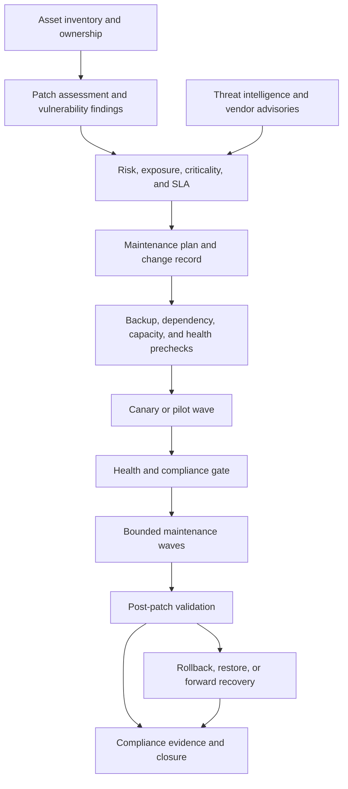

# 云平台补丁、漏洞及维护操作

## 目的

本指南定义了如何跨云资源、虚拟机、托管服务、Kubernetes 节点、支持 Azure Arc 的服务器和混合环境进行修补、漏洞修复、平台维护和配置更新。它将安全优先级与服务所有权、维护窗口、变更控制、恢复和证据结合起来。

修补并不是简单地安装每个可用的更新。安全操作首先了解暴露性、可利用性、服务关键性、依赖性行为、重新启动要求、恢复点以及停止或继续分批推进的能力。目标是降低风险，同时保持服务可用性和可靠的变更记录。

## 运营模式

## 角色和职责

|角色 |责任|
|---|---|
|安全|漏洞情报、严重性、可利用性、补偿控制和风险接受度 |
|平台运营|共享服务、维护工具、计划、节点池和平台恢复 |
|服务所有者 |业务关键性、SLO、依赖顺序、运行状况检查和批准 |
|系统所有者|主机或托管服务兼容性、备份、配置和验证 |
|变更经理 |变更记录、沟通、批准和审核完整性 |
|云卓越中心 |标准、模式、例外、指标和跨云一致性 |

没有所有者的资产无法安全地修补。清单发现和所有权修复是先决条件，而不是行政后续行动。

## 资产和暴露清单

维护当前清单：

- Azure 和其他云虚拟机；
- 支持 Azure Arc 的服务器和本地主机；
- 托管数据库、Kubernetes 节点、注册表和控制平面版本；
- 操作系统、镜像、扩展、代理和运行时版本；
- 互联网暴露、特权访问、数据分类和关键性；
- 备份、还原点、复制和恢复状态；
- 维护窗口、重启策略和补丁编排模式；和
- 所有者、服务、环境、区域和支持层。

使用中央清单来确定范围，但保留特定于提供商的证据。Azure Resource Graph、安全平台或 CMDB 记录不应被视为证明补丁是否实际应用的 update manager、操作系统或托管服务状态的替代品。

## 漏洞优先级

优先使用 CVSS 以外的内容。该决定应考虑：

- 正在被利用的漏洞或可信的利用路径；
- 互联网暴露和可到达的攻击面；
- 特权、身份、数据和横向移动影响；
- 资产重要性和回收目标；
- 可修补性和提供商支持状态；
- 补偿控制和监测；
- 变更风险、重启和依赖性影响；和
- 监管或合同期限。

使用包含修复目标、所有者、升级路径和异常流程的优先级矩阵。无法修补的发现需要补偿性控制和有时限的风险决策；它不能消失，因为扫描仪无法提供更新。

## 维护策略

使用与服务拓扑和故障域一致的维护波：

1. **试点：** 具有代表性的非生产或低风险目标。
2. **Canary：** 生产服务中的一个目标、节点、区域或副本集。
3. **Wave：** 保留可用性和恢复能力的有界组。
4. **完成：** 健康和合规性检查通过后剩余目标。

Wave 设计必须考虑集群仲裁、副本计数、可用区、负载均衡器耗尽、数据复制、连接耗尽、自动扩缩容和备份窗口。补丁可能在技术上是成功的，但如果操作一次删除太多容量，仍然会导致中断。
对于 Azure VM 和启用 Arc 的服务器，Azure Update Manager 可以提供评估和计划维护。对于其他云，请使用原生更新服务或批准的 Ansible 或配置管理工作流程。即使执行是特定于提供商的，也要规范变更记录和证据。

## 预检查

在生产波次之前，验证：

- 资产所有权、范围和维护授权；
- 当前评估和脆弱性状态；
- 备份、快照、恢复和复制运行状况；
- 可用容量和工作负载故障转移路径；
- 依赖关系、负载均衡器、集群和仲裁状态；
- 磁盘空间、包管理器、代理和网络连接；
- 重新启动和应用耗尽行为；
- 监控、综合检查和告警路由；
- 批准的补丁源和软件包白名单；和
- 回滚或前向恢复过程。

如果所需的预检查未知，请停止更改。过时的清单、不可用的备份或缺少运行状况信号是一种风险状况，而不是自动继续的理由。

## 补丁执行

执行人必须：

- 从批准的清单或动态范围中选择资源；
- 仅安装批准的分类或软件包版本；
- 实施维护窗口和最大并发性；
- 采集之前和之后的版本；
- 根据运行手册耗尽或重新启动服务；
- 仅重试安全且幂等的步骤；
- 在故障阈值或健康门违规时停止；和
- 发布机器可读的结果和证据。

当提供商原生计划修补提供所需的范围、控制和证据时，请使用它。对提供商服务无法安全表达的包或配置行为使用配置管理。不要让两个系统竞争修补同一主机或管理相同的软件包策略。

## Kubernetes 平台维护

Kubernetes 维护必须考虑控制平面兼容性、节点镜像、附加组件、PodDisruptionBudgets、拓扑分布、工作负载请求、存储、入口和可观测性。在节点发布波次之前：

1. 确认支持的版本差异和插件兼容性；
2. 检查可用的更换容量；
3. 验证 PDB 不会阻塞或过度限制驱逐；
4. 根据提供商流程排出一个节点或有界组；
5. 验证调度、准备情况、流量、存储和遥测；和
6. 只有在服务门通过后才能继续。

不要将绕过 PDB 或强制删除 Pod 作为正常的修补技术。如果 PDB 阻止安全维护，请在下一个窗口之前修复可用性合同。

## 漏洞修复工作流程

1. 按资产、包、CVE 和扫描仪提取结果并进行重复数据删除。
2. 确认受影响的版本以及资产是否可访问或可利用。
3. 将发现结果映射到所有者、服务、环境和维护时段。
4. 选择补丁、升级、隔离、配置缓解或风险接受。
5. 针对代表性工作负载测试修复。
6. 通过金丝雀和有界波次进行部署。
7. 重新扫描或验证有效版本。
8. 仅当证据显示漏洞已解决或存在已批准的例外情况时才结束调查结果。
不要因为包命令成功而关闭结果。确认正在运行的进程、镜像、内核、扩展或托管服务版本已按预期更改，并且满足重新引导或重新启动要求。

## 失败与恢复

当补丁失败时：

- 停止下一波；
- 确定主机或服务是否健康、降级或不可用；
- 保存补丁日志、版本、错误、目标和更改证据；
- 仅当 Runbook 和恢复点支持时才进行恢复或故障转移；
- 在回滚不安全或不受支持的情况下使用前向修复；
- 通知服务、安全和变更所有者；和
- 更新修复决策和客户沟通。

在未考虑回滚是否会重新引入被主动利用的漏洞的情况下，切勿自动回滚安全更新。恢复路径必须说明风险决策。

## 合规性和报告

至少跟踪：

- 评估覆盖范围和新鲜度；
- 按年龄和所有者划分的关键和高发现值；
- 环境和服务的补丁合规性；
- 重启待定和重启失败的资产；
- 不受支持的操作系统和代理；
- 失败、跳过和无法到达的目标；
- 例外计数、年龄、所有者和到期日；
- 按风险类别划分的平均修复时间；和
- 反复出现的故障模式。

仪表板应区分未评估、不应用、合规、不合规、无法访问和异常。丢失的信号不得报告为合规。

## 验证

- [ ] 每个范围内的资产都有所有者、重要性、暴露和维护元数据。
- [ ] 评估覆盖率和新鲜度是可度量的。
- [ ] 漏洞优先级使用暴露度、可利用性、严重性和恢复风险。
- [ ] 补丁窗口保留容量、仲裁、副本和恢复路径。
- [ ] 预检查涵盖备份、运行状况、连接性、依赖性和容量。
- [ ] 补丁通过每个设置或包域的一个权威系统执行。
- [ ] 金丝雀门和波门在运行状况或故障阈值时停止。
- [ ] 补丁后验证确认版本有效且服务运行状况正常。
- [ ] 例外情况已批准、补偿、确定范围并到期。
- [ ] 合规报告将未知和无法访问的资产与合规资产区分开来。

## 操作注意事项

补丁操作是连续的。在安全建议、提供商变更、新工作负载上线、事件回顾和服务拓扑更改后查看计划。保留单独的紧急补丁路径，并提供明确的批准、证据和协调；紧急通道不得成为正常的维护通道。

## 相关主题

- [云运营与可靠性模型](cloud-operations-and-reliability-model.md)
- [可观测性、日志记录和告警](observability-logging-and-alerting.md)
- [资源清单、报告和合规证据](resource-inventory-reporting-and-compliance-evidence.md)
- [Ansible 自动化工程标准](../standards-best-practices/ansible-automation-engineering-standard.md)
- [云变更、补丁和配置管理标准](../standards-best-practices/cloud-change-patch-and-configuration-management-standard.md)
- [如何运行多云事件响应](../how-to-guides/how-to-run-a-multicloud-incident-response.md)

## 参考文档

- [Azure Update Manager 概述](https://learn.microsoft.com/en-us/azure/update-manager/overview)
- [Azure Update Manager 文档](https://learn.microsoft.com/en-us/azure/update-manager/)
- [Azure Update Manager 中的更新和维护](https://learn.microsoft.com/en-us/azure/update-manager/updates-maintenance-schedules)
- [使用 Microsoft Defender for Cloud 修复机器漏洞](https://learn.microsoft.com/en-us/azure/defender-for-cloud/remediate-vulnerability-findings-vm)
- [使用 Azure Resource Graph 获取资源更改](https://learn.microsoft.com/en-us/azure/governance/resource-graph/changes/get-resource-changes)
