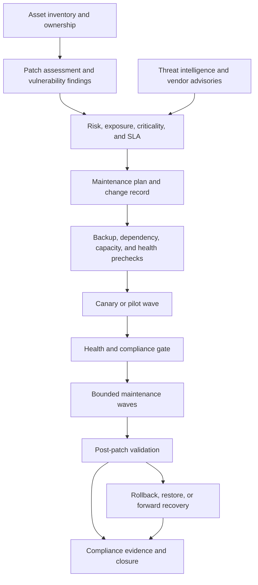

# Patch, Vulnerability, and Maintenance Operations for Cloud Platforms

## Purpose

This guide defines how to operate patching, vulnerability remediation, platform maintenance, and configuration updates across cloud resources, virtual machines, managed services, Kubernetes nodes, Azure Arc-enabled servers, and hybrid environments. It joins security prioritization with service ownership, maintenance windows, change control, recovery, and evidence.

Patching is not simply installing every available update. A safe operation first understands exposure, exploitability, service criticality, dependency behavior, reboot requirements, recovery points, and the ability to stop or continue in waves. The objective is to reduce risk while preserving service availability and a trustworthy record of what changed.

## Operating model

## Roles and responsibilities

| Role | Responsibility |
|---|---|
| Security | Vulnerability intelligence, severity, exploitability, compensating controls, and risk acceptance |
| Platform operations | Shared services, maintenance tooling, schedules, node pools, and platform recovery |
| Service owner | Business criticality, SLO, dependency order, health checks, and approval |
| System owner | Host or managed-service compatibility, backup, configuration, and validation |
| Change manager | Change record, communication, approval, and audit completeness |
| Cloud Center of Excellence | Standards, patterns, exceptions, metrics, and cross-cloud consistency |

An asset without an owner cannot be safely patched. Inventory discovery and ownership repair are prerequisites, not administrative follow-up.

## Asset and exposure inventory

Maintain a current inventory for:

- Azure and other cloud virtual machines;
- Azure Arc-enabled servers and on-premises hosts;
- managed databases, Kubernetes nodes, registries, and control-plane versions;
- operating-system, image, extension, agent, and runtime versions;
- internet exposure, privileged access, data classification, and criticality;
- backup, restore point, replication, and recovery status;
- maintenance window, reboot policy, and patch orchestration mode; and
- owner, service, environment, region, and support tier.

Use a central inventory to identify scope, but retain provider-specific evidence. A cloud resource graph, security platform, or CMDB record should not be treated as a replacement for the update manager, operating-system, or managed-service status that proves whether a patch actually applied.

## Vulnerability prioritization

Prioritize using more than CVSS. The decision should consider:

- active exploitation or credible exploitation path;
- internet exposure and reachable attack surface;
- privilege, identity, data, and lateral-movement impact;
- asset criticality and recovery objective;
- patchability and vendor support status;
- compensating controls and monitoring;
- change risk, reboot, and dependency impact; and
- regulatory or contractual deadlines.

Use a priority matrix with a remediation target, owner, escalation path, and exception process. An unpatchable finding requires a compensating control and a time-bound risk decision; it must not disappear because the scanner cannot provide an update.

## Maintenance strategy

Use maintenance waves aligned to service topology and failure domains:

1. **Pilot:** representative non-production or low-risk targets.
2. **Canary:** one target, node, zone, or replica set in the production service.
3. **Wave:** bounded group that preserves availability and recovery capacity.
4. **Completion:** remaining targets after health and compliance checks pass.

The wave design must account for cluster quorum, replica count, availability zones, load-balancer draining, data replication, connection draining, autoscaling, and backup windows. A patch may be technically successful and still cause an outage if the operation removes too much capacity at once.

For Azure VMs and Arc-enabled servers, Azure Update Manager can provide assessment and scheduled maintenance. For other clouds, use the native update service or an approved Ansible or configuration-management workflow. Normalize the change record and evidence even when execution is provider-specific.

## Prechecks

Before a production wave, verify:

- asset ownership, scope, and maintenance authorization;
- current assessment and vulnerability state;
- backup, snapshot, restore, and replication health;
- available capacity and a working failover path;
- dependency, load balancer, cluster, and quorum state;
- disk space, package manager, agent, and network connectivity;
- reboot and application-drain behavior;
- monitoring, synthetic checks, and alert routing;
- approved patch source and package allowlist; and
- rollback or forward-recovery procedure.

Stop the change if a required precheck is unknown. A stale inventory, unavailable backup, or missing health signal is a risk condition, not a reason to continue automatically.

## Patch execution

The executor must:

- select resources from the approved inventory or dynamic scope;
- install only approved classifications or package versions;
- enforce a maintenance window and maximum concurrency;
- capture before and after versions;
- drain or restart services according to the runbook;
- retry only safe and idempotent steps;
- stop on failure thresholds or health-gate breaches; and
- publish machine-readable result and evidence.

Use provider-native scheduled patching when it provides the required scope, control, and evidence. Use configuration management for package or configuration behavior that the provider service cannot safely express. Do not let two systems compete to patch the same host or manage the same package policy.

## Kubernetes platform maintenance

Kubernetes maintenance must consider control-plane compatibility, node image, add-ons, PodDisruptionBudgets, topology spread, workload requests, storage, ingress, and observability. Before a node wave:

1. confirm supported version skew and add-on compatibility;
2. check available replacement capacity;
3. verify PDBs are not blocking or over-constraining eviction;
4. drain one node or bounded group according to the provider process;
5. validate scheduling, readiness, traffic, storage, and telemetry; and
6. continue only after the service gate passes.

Do not bypass PDBs or force-delete Pods as a normal patching technique. If a PDB blocks safe maintenance, fix the availability contract before the next window.

## Vulnerability remediation workflow

1. Ingest findings and deduplicate by asset, package, CVE, and scanner.
2. Confirm affected version and whether the asset is reachable or exploitable.
3. Map the finding to owner, service, environment, and maintenance window.
4. Select patch, upgrade, isolation, configuration mitigation, or risk acceptance.
5. Test the fix against representative workloads.
6. Deploy through a canary and bounded waves.
7. Rescan or verify the effective version.
8. Close the finding only when evidence shows the vulnerability is resolved or an approved exception exists.

Do not close a finding because a package command succeeded. Confirm that the running process, image, kernel, extension, or managed-service version changed as intended and that a reboot or restart requirement was satisfied.

## Failure and recovery

When a patch fails:

- stop the next wave;
- determine whether the host or service is healthy, degraded, or unavailable;
- preserve patch logs, versions, error, target, and change evidence;
- restore or fail over only if the runbook and recovery point support it;
- use a forward fix where rollback is unsafe or unsupported;
- notify service, security, and change owners; and
- update the remediation decision and customer communication.

Never automatically roll back a security update without considering whether the rollback reintroduces an actively exploited vulnerability. The recovery path must state the risk decision.

## Compliance and reporting

Track at least:

- assessment coverage and freshness;
- critical and high findings by age and owner;
- patch compliance by environment and service;
- reboot-pending and restart-failed assets;
- unsupported operating systems and agents;
- failed, skipped, and unreachable targets;
- exception count, age, owner, and expiry;
- mean time to remediate by risk class; and
- recurring failure patterns.

Dashboards should distinguish not assessed, not applicable, compliant, noncompliant, unreachable, and exception. A missing signal must not be reported as compliant.

## Validation

- [ ] Every in-scope asset has owner, criticality, exposure, and maintenance metadata.
- [ ] Assessment coverage and freshness are measurable.
- [ ] Vulnerability priority uses exposure, exploitability, criticality, and recovery risk.
- [ ] Patch windows preserve capacity, quorum, replicas, and recovery paths.
- [ ] Prechecks cover backup, health, connectivity, dependencies, and capacity.
- [ ] Patches execute through one authoritative system per setting or package domain.
- [ ] Canary and wave gates stop on health or failure thresholds.
- [ ] Post-patch verification proves effective version and service health.
- [ ] Exceptions are approved, compensating, scoped, and expiring.
- [ ] Compliance reports distinguish unknown and unreachable assets from compliant assets.

## Operational considerations

Patch operations are continuous. Review schedules after security advisories, provider changes, new workload onboarding, incident retrospectives, and changes to service topology. Keep a separate emergency patch path with explicit approval, evidence, and reconciliation; emergency access must not become the normal maintenance path.

## Related topics

- [Cloud Operations and Reliability Model](cloud-operations-and-reliability-model.md)
- [Observability, Logging, and Alerting](observability-logging-and-alerting.md)
- [Resource Inventory, Reporting, and Compliance Evidence](resource-inventory-reporting-and-compliance-evidence.md)
- [Ansible Automation Engineering Standard](../standards-best-practices/ansible-automation-engineering-standard.md)
- [Cloud Change, Patch, and Configuration Management Standard](../standards-best-practices/cloud-change-patch-and-configuration-management-standard.md)
- [How to Run a Multi-Cloud Incident Response](../how-to-guides/how-to-run-a-multicloud-incident-response.md)

## References

- [Azure Update Manager overview](https://learn.microsoft.com/en-us/azure/update-manager/overview)
- [Azure Update Manager documentation](https://learn.microsoft.com/en-us/azure/update-manager/)
- [Updates and maintenance in Azure Update Manager](https://learn.microsoft.com/en-us/azure/update-manager/updates-maintenance-schedules)
- [Remediate machine vulnerabilities with Microsoft Defender for Cloud](https://learn.microsoft.com/en-us/azure/defender-for-cloud/remediate-vulnerability-findings-vm)
- [Get resource changes with Azure Resource Graph](https://learn.microsoft.com/en-us/azure/governance/resource-graph/changes/get-resource-changes)
