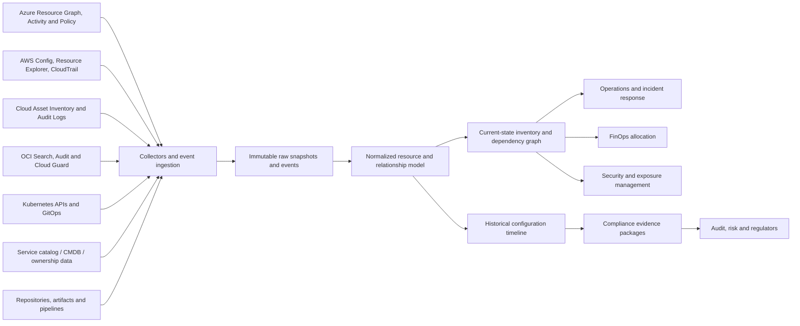
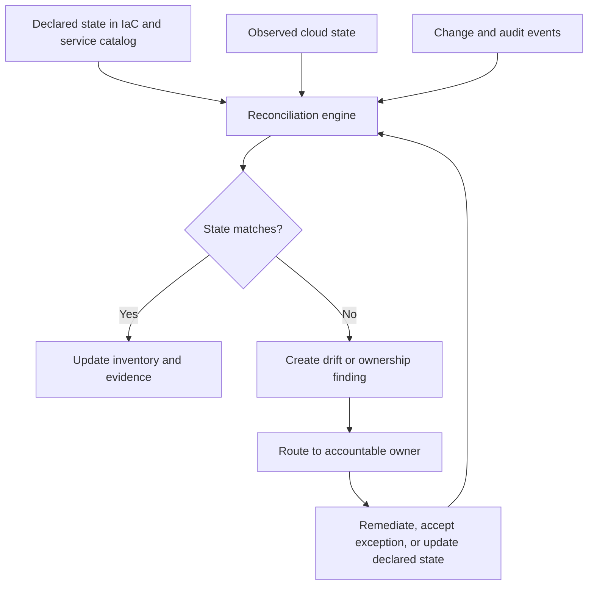

# 资源清单、报告和合规证据

## 目的

该标准定义了用于维护云资源、所有权、配置、关系、变更、生命周期和合规性证据的可信清单的企业架构。清单不是定期电子表格导出。它是一种持续协调的数据产品，支持运营、安全、财务、架构、审计和事件响应。

## 范围

该标准应用于云账户、订阅、项目、租户、隔间、文件夹、资源、托管服务、Kubernetes 资源、身份、策略、网络关系、数据存储、SaaS 依赖项、源仓库、部署流水线、证书、机密元数据和服务日志记录。

敏感机密值、私钥和完全受监管的有效负载被明确排除在一般清单之外。清单存储参考和元数据，而不是机密内容。

## 清单原则

1. 提供商 API 和事件流对于已部署的资源事实具有权威性。
2. 服务目录和配置管理系统对于业务所有权和服务上下文具有权威性。
3、清单数据必须具有时间感知性；仅当前状态无法解释事件或证明历史合规性。
4. 关系和资源一样重要。
5. 证据必须可追溯、可复制、受保护并根据策略保留。
6. 仅在自动证据不可行的情况下才使用手动证明。
7. 报告源自标准化数据，并非独立维护。

## 参考架构

## 最小资源模式

|领域 |必填字段 |
|---|---|
|身份 |提供商、资源 ID、资源类型、账户/订阅/项目/租户、区域/可用区 |
|所有权|服务/应用 ID、团队、技术所有者、业务所有者、成本中心 |
|分类|环境、关键性、数据分类、互联网暴露、监管范围 |
|生命周期 |创建时间、上次监控时间、部署源、版本、到期/停用日期 |
|配置| SKU/层、网络布局、加密、备份、日志、公共访问、策略状态 |
|关系 |父层次结构、网络、身份、数据、依赖项、流水线、仓库、证书 |
|成本|计费账户、分配标签/标签、共享成本组、集成的近期成本 |
|合规|应用的控制、评估结果、证据参考、例外和有效期 |

该模式必须支持特定于提供商的扩展字段，而不会对规范化核心造成碎片。

## 收集与对账

清单收集必须结合：

- 定期完整快照以检测遗漏事件并建立完整性；
- 近乎实时的变更事件，以保证操作的新鲜度；
- 参与者和操作上下文的提供商审计日志；
- 策略/合规性评估结果；
- 服务目录和所有权来源；
- 用于预期状态比较的 IaC 和 CI/CD 元数据；
- 提供商清单不足的 Kubernetes 和应用平台 API。

收集器故障不得默默地产生错误的合规状态。数据新鲜度和收集覆盖范围必须作为核心健康指标可见。

## 清单质量控制

- 全局资源标识符 **MUST** 被准确保留并映射到稳定的内部标识符。
- 删除的资源**MUST**根据保留要求保留在历史记录中。
- 所有权冲突**MUST** 浮出水面；系统不得任意选择一种来源。
- 未知的所有者、环境、关键性或成本中心 **MUST** 被视为治理缺陷。
- 清单时间戳 **MUST** 区分源事件时间、摄取时间和处理时间。
- 标准化转换 **MUST** 进行版本控制和测试。
- 数据质量指标**MUST**包括完整性、新鲜度、重复、孤儿率和协调方差。

## 合规证据模型

证据必须回答五个问题：

1. **评估了哪些控制？** 包括控制 ID、要求、范围和预期状态。
2. **范围内有哪些资源或服务？** 包括不可变标识符和所有权。
3. **何时评估？** 包括来源和评估时间戳。
4. **如何评估？** 包括规则/版本、查询、策略、测试或手动过程。
5. **结果和处理是什么？** 通过、失败、不应用、例外、修复和批准者。

### 证据类

|证据类|示例 |所需属性 |
|---|---|---|
|配置|启用加密、禁用公共访问、附加备份策略 |机器可读、带有时间戳、资源受限 |
|活动 |批准、部署、策略更改、特权操作 |行动者、时间、操作、目标、结果 |
|测试|恢复测试、故障转移测试、告警测试、漏洞扫描 |测试版本、环境、结果、缺陷 |
|流程|准入审核、风险接受、事件审核|批准人、范围、决定、到期 |
|外部|提供商证明、认证、合同 |有效期、服务范围、区域及责任界限 |

屏幕截图本身是薄弱的证据，因为它们难以复制、查询和验证。尽可能使用 API 输出、签名导出、策略结果、日志和版本化报告。当 API 不可用时，屏幕截图可以补充证据。

## 证据保护和保留

证据仓库必须强制执行最低权限、加密、保留、应用的合法保留、防篡改和审计日志。高价值证据应使用不可变或写保护的存储。哈希值或数字签名可用于证明完整性。即使工作负载或主要区域不可用，证据也必须保持可访问性。

保留必须遵循管理控制、合同、法律要求和数据最小化策略。永久保留所有证据会增加成本和隐私风险，并且如果没有要求，就站不住脚。

## 报告模型

报告必须从相同的标准化清单和证据来源生成。所需的报告系列包括：

- 执行风险和合规状况；
- 服务所有权和关键性覆盖范围；
- 公开暴露和高风险配置；
- 备份、日志、加密和策略覆盖范围；
- 资产增长、孤立和生命周期异常；
- 软件/平台版本和支持终止风险；
- 事件和变更证据；
- 成本分配和资源利用；
- 按范围和期限审核控制包。

每份报告都必须说明范围、来源新鲜度、排除、控制版本和已知的数据质量限制。没有分母和范围的百分比具有误导性。

## 多云服务映射

|能力|Azure|AWS | GCP |OCI |
|---|---|---|---|---|
|资源盘点/搜索 | Azure Resource Graph | AWS Resource Explorer / 资源 API |Cloud Asset Inventory| OCI Search |
|配置历史|Activity Log、变更分析能力、策略状态 | AWS Config |Cloud Asset Inventory 历史记录和审计日志 | OCI Audit plus snapshots/collection |
|策略/合规| Azure Policy，Defender for Cloud | AWS Config、Security Hub、Audit Manager |Organization Policy、Security Command Center、Assured Workloads 控制（如适用）|Cloud Guard、Security Zones、合规文档 |
|审计活动| Azure Activity Log 和 Entra 审计日志 |CloudTrail| Cloud Audit Logs| OCI Audit |
|证据导出|Resource Graph/策略导出和 API |配置快照、Audit Manager 证据、Security Hub 导出 |资产和 SCC 导出、BigQuery 或存储流水线 | Cloud Guard/审计/搜索导出和报告管道 |

提供商合规仪表板并不能证明组织完全合规。它们涵盖选定的技术配置，并且必须与流程、身份、应用、合同和人工证据相结合。

## 所有权和生命周期自动化

新的云账户和资源必须自动进入清单。部署流水线应拒绝或隔离缺乏强制所有权和生命周期元数据的资源。临时环境必须具有过期和自动清理功能。孤立资源必须路由到中央修复队列，当数据保留、取证或业务所有权不确定时，删除会被延迟。

服务所有权的变化必须将清单、待命路由、成本分配、仪表板、运行手册和合规责任更新为一个协调的工作流程。

## 标准报告和 KPI

|关键绩效指标|定义 |
|---|---|
|清单覆盖率|以标准化清单/总可观测资源表示的观测资源 |
|所有权覆盖范围|具有有效服务和负责任团队的资源/范围内资源 |
|新鲜度 |在定义的新鲜度 SLO/范围内资源内更新的资源 |
|策略覆盖范围 |通过应用的自动化控制评估的资源/合格的资源|
|证据完整性 |所需的控制证据存在和当前/所需的证据项目|
|孤儿率|没有有效所有者、服务或生命周期理由的资源/总资源 |
|异常时效|按期限、重要性和到期状态打开例外情况 |
|漂移率|与已批准的声明状态不同的资源/作为代码管理的资源 |

## 验证
- [ ] 提供商快照、事件、审计日志和服务目录数据得到协调。
- [ ] 清单具有标准化的身份、所有权、分类、生命周期和关系字段。
- [ ] 根据策略保留历史状态和已删除的资源。
- [ ] 监控收藏的新鲜度和完整性。
- [ ] 合规证据具有可追溯性、可复制性、受保护性和时间戳。
- [ ] 报告声明范围、分母、新鲜度和限制。
- [ ] 未知所有权和过期异常会触发修复。
- [ ] 提供商仪表板补充了组织和流程证据。

## 术语

|术语 |定义 |
|---|---|
| SLI |服务行为的定量度量，例如成功请求率或延迟。 |
| SLO |定义的测量窗口内 SLI 的目标值或范围。 |
|服务级别协议 |可能包括合同修复措施的正式承诺。它不能替代内部 SLO。 |
|错误预算| SLO 隐含的允许的不可靠性。对于 99.9% 的可用性目标，同一窗口内的错误预算为 0.1%。 |
| RTO |中断后恢复服务的最大目标恢复时间。 |
|恢复点目标 |从中断开始向后测量的最大目标数据丢失间隔。 |
| MTTD/MTTA/MTTR |检测、确认和恢复的平均时间。定义必须固定在度量目录中。 |
|重复劳动|重复的、手动的、自动化的操作工作不会带来持久的服务改进。 |

## 相关主题

- [云运营与可靠性模型](cloud-operations-and-reliability-model.md)
- [云成本管理和 FinOps](cloud-cost-management-and-finops.md)
- [事件响应和故障排除](incident-response-and-troubleshooting.md)

## 参考文档

以下来源定义了本标准使用的外部基线。在实施过程中必须验证提供商功能、区域可用性、许可和产品名称。

1. [Microsoft Azure Well-Architected Framework](https://learn.microsoft.com/azure/well-architected/)
2. [AWS Well-Architected Framework](https://docs.aws.amazon.com/wellarchitected/latest/framework/welcome.html)
3.[GCP Well-Architected Framework](https://cloud.google.com/architecture/framework)
4.[Oracle Cloud Infrastructure Architecture Center](https://docs.oracle.com/solutions/)
5. [OpenTelemetry 文档](https://opentelemetry.io/docs/)
6. [Google 站点可靠性工程资源](https://sre.google/)
7.[FinOps Framework](https://www.finops.org/framework/)
8. [NIST SP 800-61 Rev. 3：网络安全风险管理的事件响应建议和注意事项](https://csrc.nist.gov/pubs/sp/800/61/r3/final)
