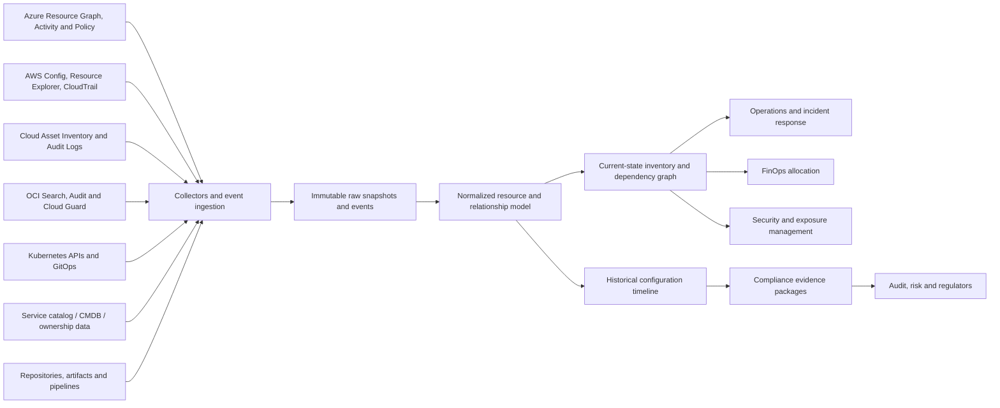
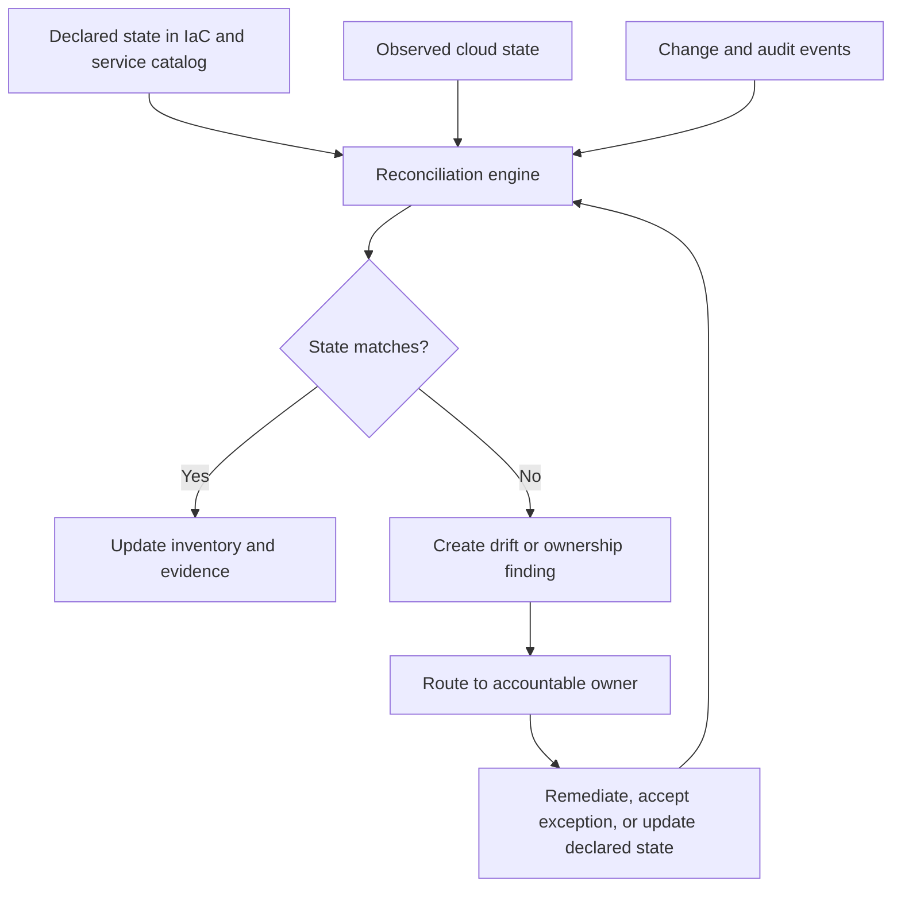

# Resource Inventory, Reporting, and Compliance Evidence

## Purpose

This standard defines the enterprise architecture for maintaining a trustworthy inventory of cloud resources, ownership, configuration, relationships, changes, lifecycle, and compliance evidence. Inventory is not a periodic spreadsheet export. It is a continuously reconciled data product that supports operations, security, finance, architecture, audit, and incident response.

## Scope

The standard applies to cloud accounts, subscriptions, projects, tenancies, compartments, folders, resources, managed services, Kubernetes resources, identities, policies, network relationships, data stores, SaaS dependencies, source repositories, deployment pipelines, certificates, secrets metadata, and service records.

Sensitive secret values, private keys, and full regulated payloads are explicitly excluded from general inventory. The inventory stores references and metadata, not confidential contents.

## Inventory principles

1. Provider APIs and event streams are authoritative for deployed-resource facts.
2. Service catalogs and configuration management systems are authoritative for business ownership and service context.
3. Inventory data must be time-aware; current state alone cannot explain incidents or prove historical compliance.
4. Relationships matter as much as resources.
5. Evidence must be attributable, reproducible, protected, and retained according to policy.
6. Manual attestation is used only where automated evidence is infeasible.
7. Reports are derived from normalized data, not maintained independently.

## Reference architecture

## Minimum resource schema

| Domain | Required fields |
|---|---|
| Identity | Provider, resource ID, resource type, account/subscription/project/tenancy, region/zone |
| Ownership | Service/application ID, team, technical owner, business owner, cost center |
| Classification | Environment, criticality, data classification, internet exposure, regulatory scope |
| Lifecycle | Creation time, last observed time, deployment source, version, expiration/retirement date |
| Configuration | SKU/tier, network placement, encryption, backup, logging, public access, policy state |
| Relationships | Parent hierarchy, network, identity, data, dependency, pipeline, repository, certificate |
| Cost | Billing account, allocation tags/labels, shared-cost group, recent cost where integrated |
| Compliance | Applicable controls, evaluation result, evidence reference, exception and expiry |

The schema must support provider-specific extension fields without fragmenting the normalized core.

## Collection and reconciliation

Inventory collection must combine:

- periodic full snapshots to detect missed events and establish completeness;
- near-real-time change events for operational freshness;
- provider audit logs for actor and operation context;
- policy/compliance evaluation results;
- service catalog and ownership sources;
- IaC and CI/CD metadata for intended-state comparison;
- Kubernetes and application-platform APIs where provider inventory is insufficient.

A collector failure must not silently produce a false compliant state. Data freshness and collection coverage must be visible as first-class health indicators.

## Inventory quality controls

- Global resource identifiers **MUST** be preserved exactly and mapped to stable internal identifiers.
- Deleted resources **MUST** remain in historical records according to retention requirements.
- Ownership conflicts **MUST** be surfaced; the system must not arbitrarily choose one source.
- Unknown owner, environment, criticality, or cost center **MUST** be treated as a governance defect.
- Inventory timestamps **MUST** distinguish source event time, ingestion time, and processing time.
- Normalization transformations **MUST** be versioned and tested.
- Data-quality metrics **MUST** include completeness, freshness, duplication, orphan rate, and reconciliation variance.

## Compliance evidence model

Evidence must answer five questions:

1. **What control was evaluated?** Include control ID, requirement, scope, and expected state.
2. **What resource or service was in scope?** Include immutable identifiers and ownership.
3. **When was it evaluated?** Include source and evaluation timestamps.
4. **How was it evaluated?** Include rule/version, query, policy, test, or manual procedure.
5. **What was the result and disposition?** Pass, fail, not applicable, exception, remediation, and approver.

### Evidence classes

| Evidence class | Examples | Required properties |
|---|---|---|
| Configuration | Encryption enabled, public access disabled, backup policy attached | Machine-readable, time-stamped, resource-bound |
| Activity | Approval, deployment, policy change, privileged action | Actor, time, operation, target, outcome |
| Test | Restore test, failover test, alert test, vulnerability scan | Test version, environment, result, defects |
| Process | Access review, risk acceptance, incident review | Approver, scope, decision, expiry |
| External | Provider attestations, certifications, contracts | Validity period, service scope, region and responsibility boundaries |

Screenshots alone are weak evidence because they are difficult to reproduce, query, and validate. Use API output, signed exports, policy results, logs, and versioned reports where possible. Screenshots may supplement evidence when an API is unavailable.

## Evidence protection and retention

Evidence repositories must enforce least privilege, encryption, retention, legal hold where applicable, tamper resistance, and audit logging. High-value evidence should use immutable or write-protected storage. Hashes or digital signatures may be used to demonstrate integrity. Evidence must remain accessible even if the workload or primary region is unavailable.

Retention must follow the governing control, contract, legal requirement, and data-minimization policy. Keeping all evidence forever increases cost and privacy risk and is not defensible without a requirement.

## Reporting model

Reports must be generated from the same normalized inventory and evidence sources. Required report families include:

- executive risk and compliance posture;
- service ownership and criticality coverage;
- public exposure and high-risk configuration;
- backup, logging, encryption, and policy coverage;
- asset growth, orphaning, and lifecycle exceptions;
- software/platform version and end-of-support risk;
- incident and change evidence;
- cost allocation and resource utilization;
- audit control packages by scope and period.

Every report must state scope, source freshness, exclusions, control versions, and known data-quality limitations. A percentage without denominator and scope is misleading.

## Multi-cloud service mapping

| Capability | Azure | AWS | GCP | OCI |
|---|---|---|---|---|
| Resource inventory/search | Azure Resource Graph | AWS Resource Explorer / resource APIs | Cloud Asset Inventory | OCI Search |
| Configuration history | Activity Log, change analysis capabilities, Policy state | AWS Config | Cloud Asset Inventory history and Audit Logs | OCI Audit plus snapshots/collection |
| Policy/compliance | Azure Policy, Defender for Cloud regulatory compliance | AWS Config, Security Hub, Audit Manager | Organization Policy, Security Command Center, Assured Workloads controls as applicable | Cloud Guard, Security Zones, Compliance Documents |
| Audit activity | Azure Activity Log and Entra audit logs | CloudTrail | Cloud Audit Logs | OCI Audit |
| Evidence export | Resource Graph/Policy exports and APIs | Config snapshots, Audit Manager evidence, Security Hub exports | Asset and SCC exports, BigQuery or storage pipelines | Cloud Guard/Audit/Search exports and reporting pipelines |

Provider compliance dashboards do not prove full organizational compliance. They cover selected technical configurations and must be combined with process, identity, application, contractual, and human evidence.

## Ownership and lifecycle automation

New cloud accounts and resources must enter inventory automatically. Deployment pipelines should reject or quarantine resources lacking mandatory ownership and lifecycle metadata. Temporary environments must have expiration and automated cleanup. Orphaned resources must be routed to a central remediation queue, with deletion delayed when data retention, forensics, or business ownership is uncertain.

Changes in service ownership must update inventory, on-call routing, cost allocation, dashboards, runbooks, and compliance responsibility as one coordinated workflow.

## Standard reports and KPIs

| KPI | Definition |
|---|---|
| Inventory coverage | Observed resources represented in normalized inventory / total observable resources |
| Ownership coverage | Resources with valid service and accountable team / in-scope resources |
| Freshness attainment | Resources updated within defined freshness SLO / in-scope resources |
| Policy coverage | Resources evaluated by applicable automated controls / eligible resources |
| Evidence completeness | Required control evidence present and current / required evidence items |
| Orphan rate | Resources with no valid owner, service, or lifecycle justification / total resources |
| Exception aging | Open exceptions by age, criticality, and expiry status |
| Drift rate | Resources differing from approved declared state / resources managed as code |

## Validation

- [ ] Provider snapshots, events, audit logs, and service catalog data are reconciled.
- [ ] Inventory has normalized identity, ownership, classification, lifecycle, and relationship fields.
- [ ] Historical state and deleted resources are retained according to policy.
- [ ] Collection freshness and completeness are monitored.
- [ ] Compliance evidence is attributable, reproducible, protected, and time-stamped.
- [ ] Reports declare scope, denominator, freshness, and limitations.
- [ ] Unknown ownership and expired exceptions trigger remediation.
- [ ] Provider dashboards are supplemented with organizational and process evidence.

## Terminology

| Term | Definition |
|---|---|
| SLI | A quantitative measure of service behavior, such as successful request ratio or latency. |
| SLO | A target value or range for an SLI over a defined measurement window. |
| SLA | A formal commitment that may include contractual remedies. It is not a substitute for an internal SLO. |
| Error budget | The permitted unreliability implied by an SLO. For a 99.9% availability objective, the error budget is 0.1% over the same window. |
| RTO | Maximum targeted elapsed time to restore a service after disruption. |
| RPO | Maximum targeted data-loss interval measured backward from the disruption. |
| MTTD / MTTA / MTTR | Mean time to detect, acknowledge, and restore or recover. Definitions must be fixed in the metric catalog. |
| Toil | Repetitive, manual, automatable operational work that does not create durable service improvement. |

## Related topics

- [Cloud Operations and Reliability Model](cloud-operations-and-reliability-model.md)
- [Cloud Cost Management and FinOps](cloud-cost-management-and-finops.md)
- [Incident Response and Troubleshooting](incident-response-and-troubleshooting.md)

## References

The following sources define the external baseline used by this standard. Provider features, regional availability, licensing, and product names must be verified during implementation.

1. [Microsoft Azure Well-Architected Framework](https://learn.microsoft.com/azure/well-architected/)
2. [AWS Well-Architected Framework](https://docs.aws.amazon.com/wellarchitected/latest/framework/welcome.html)
3. [GCP Well-Architected Framework](https://cloud.google.com/architecture/framework)
4. [Oracle Cloud Infrastructure Architecture Center](https://docs.oracle.com/solutions/)
5. [OpenTelemetry documentation](https://opentelemetry.io/docs/)
6. [Google Site Reliability Engineering resources](https://sre.google/)
7. [FinOps Framework](https://www.finops.org/framework/)
8. [NIST SP 800-61 Rev. 3: Incident Response Recommendations and Considerations for Cybersecurity Risk Management](https://csrc.nist.gov/pubs/sp/800/61/r3/final)
