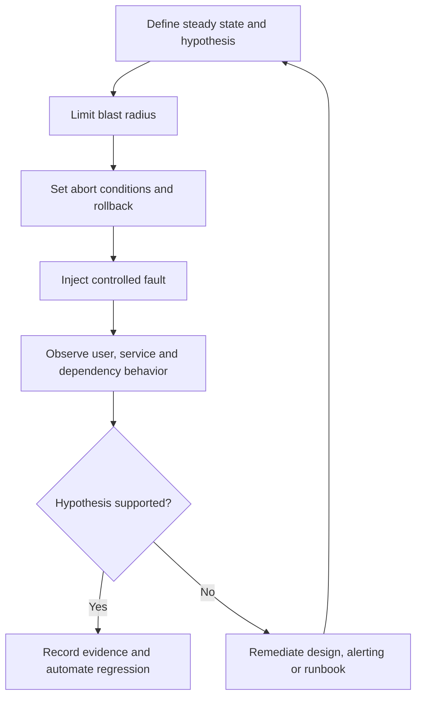

# 验证、测试和运营就绪

## 目的

该标准定义了云服务投入生产之前所需的证据以及之后所需的持续验证。设计审查、成功部署或完成的清单并不能证明运营就绪。准备就绪需要在预期负载、更改、依赖项故障、恢复和操作干预下测试服务行为。

## 范围

该标准应用于新服务、主要版本、平台升级、迁移、区域扩展、重大依赖关系更改、灾难恢复更改以及数据分类或关键性的重大更改。它涵盖基础设施、应用、安全性、可靠性、恢复、可观测性、成本和支持验证。

## 验证

失败的强制门必须阻止发布，除非授权的、有时限的例外情况记录了风险、补偿控制和修复措施。

## 测试组合

|测试类别|目标|示例 |
|---|---|---|
|静态与策略 |部署前检测缺陷 | IaC 验证、策略即代码、模式检查、机密扫描、镜像扫描 |
|单元和组件 |验证隔离逻辑 |应用单元测试、Terraform 模块测试、功能测试 |
|集成与契约|验证依赖关系和接口兼容性 | API 契约、身份流、数据库模式兼容性、事件模式 |
|端到端|验证关键用户旅程 |登录、交易、报表、数据发布 |
|性能与容量|验证需求下的响应和饱和度 |负载、压力、长稳、突发、队列积压、配额检查 |
|韧性|验证故障期间的预期行为 |依赖延迟、实例丢失、区域丢失、DNS 故障、速率限制 |
|恢复|证明数据和服务恢复|时间点恢复、区域故障转移、洁净室恢复 |
|安全|验证预防性和检测性控制 |根据需要进行访问测试、配置评估、渗透测试 |
|运营|验证人员、流程、工具和操作手册 |告警路由、随叫随到、提供商升级、手动解决方法 |
|成本|验证财务护栏和单位经济效益|预算告警、规模成本测试、标记/分配、出口场景 |

## 环境策略

测试保真度必须与风险相匹配。类似生产的测试需要具有代表性的拓扑、策略、身份、数据形状、规模行为和提供商限制，但不得在未经授权和保护的情况下复制受监管的生产数据。

推荐环境：

- **临时集成环境**，用于隔离功能和基础设施验证。
- **用于跨服务、身份、策略和操作测试的共享预生产**。
- **性能环境**，负载可能会干扰其他测试。
- **恢复环境**与生产隔离，以证明恢复和重建。
- **生产金丝雀**用于有限的真实流量验证和快速回滚。

必须测量环境漂移。忽略关键网络、身份、策略或托管服务约束的预生产环境会带来错误的信心。

## 运营就绪审查

运营就绪审查 (ORR) 是基于风险的验收决定，而不是文档仪式。

### 所需证据

1. 指定的业务和技术所有者。
2. 关键级别、数据分类、支持时间和依赖关系图。
3. 批准的架构和威胁/风险审查。
4. SLI/SLO、RTO/RPO、容量假设和成本预测。
5. 生产仪表板、告警、操作手册、升级和提供商支持详细信息。
6. 备份成功和恢复测试证据。
7. 部署、回滚和功能禁用证据。
8. 性能、弹性、安全性和故障模式测试结果。
9. 已知缺陷、可接受的风险和运营债务。
10. 服务日志、清单元数据和合规证据链接。

### ORR 决策状态
|决定|意义|
|---|---|
|已批准 |满足强制性控制要求；授权负责人接受的剩余风险|
|有条件批准|允许有限生产，并有明确的范围、期限、监控和修复措施 |
|被拒绝 |重大风险或证据缺失阻碍了生产验收 |
|需要重新审核 |重大变化使先前的证据无效|

## 弹性和混沌测试

故障测试必须从已知的故障模式和有限的爆炸半径开始。示例包括实例终止、区域丢失、依赖项超时、DNS 故障、测试中证书过期、队列积压、存储限制、身份不可用和提供商 API 速率限制。没有假设、安全控制和学习目标的随机干扰是不负责任的。

## 性能和容量验证

测试必须确定：

- 预期和峰值需求模型；
- 延迟和吞吐量目标；
- 饱和点和非线性故障行为；
- 自动扩缩容延迟和最大扩缩容比例；
- 连接、线程、IP、分区、队列、存储、令牌和提供商配额限制；
- 依赖性限制和背压行为；
- 基线、峰值和故障模式规模的成本；
- 负载消退后的恢复。

在饱和之前停止的测试不会建立容量。压力测试必须包括安全终止标准，并且不得违反提供商或第三方条款。

## 部署验证

第 0/1 层部署必须使用以下一项或多项：金丝雀部署、蓝绿部署、基于环的部署、功能开关、流量阴影或分阶段区域部署。验证必须将关键服务和业务指标与稳定的基线进行比较。只有在信号可靠且回滚安全的情况下才应使用自动回滚；数据库和不可逆的更改需要明确的兼容性规划。

每个版本都必须可追溯到源修订、流水线、制品摘要、批准、配置和部署目标。

## 持续验证

运营就绪状态会下降。必须按照定义的节奏重新验证以下内容：

- 告警和寻呼路由；
- 备份和恢复；
- 证书、机密和紧急访问；
- 操作手册和特权程序；
- 配额和容量空间；
- 依赖契约；
- 灾难恢复计划；
- 提供商支持和升级联系人；
- 成本预算和分配元数据；
- 清单和合规证据。

关键的综合交易和策略检查应持续运行。恢复和高爆炸半径测试按受控时间表进行。

## 多云验证工具示例

|能力|Azure|AWS | GCP |OCI |
|---|---|---|---|---|
|策略验证 | Azure Policy、部署假设、IaC 测试 | AWS Config 规则、CloudFormation 更改集、IaC 测试 |Organization Policy、策略验证、IaC 测试 | Cloud Guard、Security Zones、Resource Manager 计划和 IaC 测试 |
|负载测试| Azure Load Testing 和外部工具 | AWS 上的分布式负载测试/外部工具 |基于云或外部的负载测试工具|基于 OCI 或外部的负载测试工具 |
|部署策略| Azure DevOps/GitHub Actions、App Service/AKS/Front Door 模式 | CodeDeploy、ECS/EKS/Lambda 部署控制 | Cloud Deploy、GKE 和无服务器部署控制 | OCI DevOps 部署策略 |
|恢复验证| Azure Backup 还原、Site Recovery 测试故障转移 | AWS Backup 恢复测试、Elastic Disaster Recovery 演练 |备份和灾难恢复测试工作流程 |Full Stack Disaster Recovery drills 和服务原生恢复 |
|架构审查 | Azure Well-Architected 审查 | AWS Well-Architected 工具 | GCP Well-Architected 审核 | OCI Architecture Center guidance |

工具并不决定验收。证据必须表明特定于工作负载的要求已经过测试。

## 准备记分卡

|领域 |最低接受问题|
|---|---|
|所有权|响应人员可以随时识别责任所有者并升级吗？ |
|可靠性 |是否定义了面向用户的 SLO、故障模式和错误预算操作？ |
|可观测性|受控故障会产生预期的信号和路由吗？ |
|恢复|团队能否在度量目标内恢复数据和服务？ |
|改变 |可以停止、回滚或安全禁用该版本吗？ |
|安全|访问、日志、数据保护和事件交叉检查是否经过验证？ |
|容量 |峰值需求、限制、扩展延迟和依赖性约束是否已知？ |
|成本|是否了解基线、峰值、遥测、数据传输和恢复成本？ |
|运营|待命团队在实际条件下是否可以使用操作手册？ |
|合规|证据是否持久、可归因、最新且可检索？ |

## 最低合规性清单

- [ ] 根据服务等级和风险选择所需的测试。
- [ ] 记录生产前与生产的差异。
- [ ] ORR 证据是关联的、最新的且可独立审查的。
- [ ] 负载测试可识别饱和度、恢复率和成本行为。
- [ ] 弹性测试使用假设、中止条件和有限的爆炸半径。
- [ ] 部署回滚或禁用已得到证实。
- [ ] 恢复测试验证应用和业务成果。
- [ ] 连续验证节奏分配给所有者。

## 术语

|术语 |定义 |
|---|---|
| SLI |服务行为的定量度量，例如成功请求率或延迟。 |
| SLO |定义的测量窗口内 SLI 的目标值或范围。 |
|服务级别协议 |可能包括合同修复措施的正式承诺。它不能替代内部 SLO。 |
|错误预算| SLO 隐含的允许的不可靠性。对于 99.9% 的可用性目标，同一窗口内的错误预算为 0.1%。 |
| RTO |中断后恢复服务的最大目标恢复时间。 |
|恢复点目标 |从中断开始向后测量的最大目标数据丢失间隔。 |
| MTTD/MTTA/MTTR |检测、确认和恢复的平均时间。定义必须固定在度量目录中。 |
|重复劳动|重复的、手动的、自动化的操作工作不会带来持久的服务改进。 |

## 相关主题

- [备份、恢复和业务连续性](backup-recovery-and-business-continuity.md)
- [云成本管理和 FinOps](cloud-cost-management-and-finops.md)
- [事件响应和故障排除](incident-response-and-troubleshooting.md)

## 参考文档

以下来源定义了本标准使用的外部基线。在实施过程中必须验证提供商功能、区域可用性、许可和产品名称。
1. [Microsoft Azure Well-Architected Framework](https://learn.microsoft.com/azure/well-architected/)
2. [AWS Well-Architected Framework](https://docs.aws.amazon.com/wellarchitected/latest/framework/welcome.html)
3.[GCP Well-Architected Framework](https://cloud.google.com/architecture/framework)
4.[Oracle Cloud Infrastructure Architecture Center](https://docs.oracle.com/solutions/)
5. [OpenTelemetry 文档](https://opentelemetry.io/docs/)
6. [Google 站点可靠性工程资源](https://sre.google/)
7.[FinOps Framework](https://www.finops.org/framework/)
8. [NIST SP 800-61 Rev. 3：网络安全风险管理的事件响应建议和注意事项](https://csrc.nist.gov/pubs/sp/800/61/r3/final)
