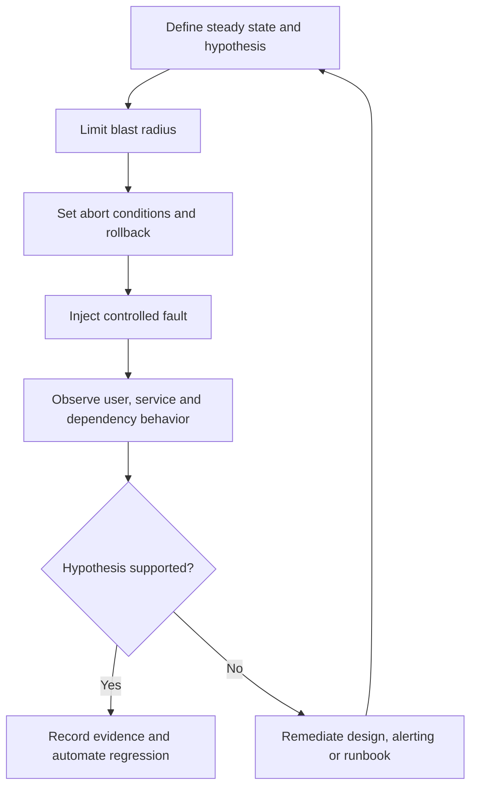

# Validation, Testing, and Operational Readiness

## Purpose

This standard defines the evidence required before a cloud service is accepted into production and the recurring validation required afterward. A design review, successful deployment, or completed checklist is not proof of operational readiness. Readiness requires tested service behavior under expected load, change, dependency failure, recovery, and operational intervention.

## Scope

The standard applies to new services, major releases, platform upgrades, migrations, regional expansion, significant dependency changes, disaster-recovery changes, and material changes to data classification or criticality. It covers infrastructure, application, security, reliability, recovery, observability, cost, and support validation.

## Validation

```mermaid
flowchart LR
    DES[Architecture and threat review] --> BUILD[Build and static validation]
    BUILD --> TEST[Functional, integration and policy tests]
    TEST --> PERF[Performance, capacity and resilience tests]
    PERF --> REC[Backup and recovery validation]
    REC --> ORR[Operational Readiness Review]
    ORR --> PILOT[Controlled production / canary]
    PILOT --> ACC[Production acceptance]
    ACC --> CONT[Continuous validation]
```

A failed mandatory gate must block release unless an authorized, time-bound exception documents risk, compensating controls, and remediation.

## Test portfolio

| Test category | Objective | Examples |
|---|---|---|
| Static and policy | Detect defects before deployment | IaC validation, policy-as-code, schema checks, secret scanning, image scanning |
| Unit and component | Validate isolated logic | Application unit tests, Terraform module tests, function tests |
| Integration and contract | Validate dependencies and interface compatibility | API contracts, identity flows, database schema compatibility, event schemas |
| End-to-end | Validate critical user journeys | Login, transaction, reporting, data publication |
| Performance and capacity | Validate response and saturation under demand | Load, stress, soak, burst, queue backlog, quota checks |
| Resilience | Validate expected behavior during faults | Dependency latency, instance loss, zone loss, DNS failure, rate limiting |
| Recovery | Prove data and service restoration | Point-in-time restore, regional failover, clean-room recovery |
| Security | Validate preventive and detective controls | Access tests, configuration assessment, penetration testing as required |
| Operational | Validate people, process, tools, and runbooks | Alert routing, on-call, provider escalation, manual workaround |
| Cost | Validate financial guardrails and unit economics | Budget alerts, scale-cost tests, tagging/allocation, egress scenarios |

## Environment strategy

Test fidelity must match risk. Production-like testing requires representative topology, policy, identity, data shape, scale behavior, and provider limits, but it must not copy regulated production data without authorization and protection.

Recommended environments:

- **Ephemeral integration environments** for isolated feature and infrastructure validation.
- **Shared pre-production** for cross-service, identity, policy, and operational tests.
- **Performance environment** where load could disrupt other testing.
- **Recovery environment** isolated from production to prove restore and rebuild.
- **Production canary** for limited real-traffic validation with fast rollback.

Environment drift must be measured. A pre-production environment that omits critical networking, identity, policy, or managed-service constraints provides false confidence.

## Operational readiness review

The Operational Readiness Review (ORR) is a risk-based acceptance decision, not a documentation ceremony.

### Required evidence

1. Named business and technical owners.
2. Criticality tier, data classification, support hours, and dependency map.
3. Approved architecture and threat/risk review.
4. SLI/SLO, RTO/RPO, capacity assumptions, and cost forecast.
5. Production dashboards, alerts, runbooks, escalation, and provider support details.
6. Backup success and restore-test evidence.
7. Deployment, rollback, and feature-disablement evidence.
8. Performance, resilience, security, and failure-mode test results.
9. Known defects, accepted risks, and operational debt.
10. Service record, inventory metadata, and compliance evidence links.

### ORR decision states

| Decision | Meaning |
|---|---|
| Approved | Mandatory controls satisfied; residual risks accepted by authorized owners |
| Approved with conditions | Limited production allowed with explicit scope, deadline, monitoring, and remediation |
| Rejected | Material risk or missing evidence prevents production acceptance |
| Re-review required | Significant change invalidates prior evidence |

## Resilience and chaos testing

Fault tests must begin with known failure modes and bounded blast radius. Examples include instance termination, zone loss, dependency timeout, DNS failure, expired certificate in test, queue backlog, storage throttling, identity unavailability, and provider API rate limiting. Random disruption without a hypothesis, safety controls, and learning objective is irresponsible.

## Performance and capacity validation

Tests must identify:

- expected and peak demand model;
- latency and throughput objectives;
- saturation points and non-linear failure behavior;
- autoscaling delay and maximum scale;
- connection, thread, IP, partition, queue, storage, token, and provider quota limits;
- dependency limits and backpressure behavior;
- cost at baseline, peak, and failure-mode scale;
- recovery after load subsides.

A test that stops before saturation does not establish capacity. A stress test must include safe termination criteria and must not violate provider or third-party terms.

## Deployment validation

Tier 0/1 deployments must use one or more of the following: canary, blue-green, ring-based rollout, feature flags, traffic shadowing, or phased regional deployment. Validation must compare key service and business metrics to a stable baseline. Automatic rollback should be used only when signals are reliable and rollback is safe; database and irreversible changes require explicit compatibility planning.

Every release must be traceable to source revision, pipeline, artifact digest, approvals, configuration, and deployment target.

## Continuous validation

Operational readiness decays. The following must be revalidated on a defined cadence:

- alerts and paging routes;
- backup and restore;
- certificates, secrets, and emergency access;
- runbooks and privileged procedures;
- quotas and capacity headroom;
- dependency contracts;
- disaster-recovery plans;
- provider support and escalation contacts;
- cost budgets and allocation metadata;
- inventory and compliance evidence.

Critical synthetic transactions and policy checks should run continuously. Recovery and high-blast-radius tests run on a controlled schedule.

## Multi-cloud validation tooling examples

| Capability | Azure | AWS | GCP | OCI |
|---|---|---|---|---|
| Policy validation | Azure Policy, deployment what-if, IaC tests | AWS Config rules, CloudFormation change sets, IaC tests | Organization Policy, policy validation, IaC tests | Cloud Guard, Security Zones, Resource Manager plan and IaC tests |
| Load testing | Azure Load Testing and external tools | Distributed Load Testing on AWS / external tools | Cloud-based or external load tools | OCI-based or external load tools |
| Deployment strategies | Azure DevOps/GitHub Actions, App Service/AKS/Front Door patterns | CodeDeploy, ECS/EKS/Lambda deployment controls | Cloud Deploy, GKE and serverless rollout controls | OCI DevOps deployment strategies |
| Recovery validation | Azure Backup restore, Site Recovery test failover | AWS Backup restore testing, Elastic Disaster Recovery drills | Backup and DR test workflows | Full Stack DR drills and service-native restores |
| Architecture review | Azure Well-Architected Review | AWS Well-Architected Tool | GCP Well-Architected review | OCI Architecture Center guidance |

Tooling does not determine acceptance. The evidence must show that workload-specific requirements were tested.

## Readiness scorecard

| Domain | Minimum acceptance question |
|---|---|
| Ownership | Can responders identify accountable owners and escalation at any time? |
| Reliability | Are user-facing SLOs, failure modes, and error-budget actions defined? |
| Observability | Will controlled failures generate the expected signals and routes? |
| Recovery | Can the team restore data and service within measured objectives? |
| Change | Can the release be stopped, rolled back, or safely disabled? |
| Security | Are access, logging, data protection, and incident crossover validated? |
| Capacity | Are peak demand, limits, scaling delay, and dependency constraints known? |
| Cost | Are baseline, peak, telemetry, data-transfer, and recovery costs understood? |
| Operations | Are runbooks usable by the on-call team under realistic conditions? |
| Compliance | Is evidence durable, attributable, current, and retrievable? |

## Minimum compliance checklist

- [ ] Required tests are selected according to service tier and risk.
- [ ] Pre-production differences from production are documented.
- [ ] ORR evidence is linked, current, and independently reviewable.
- [ ] Load tests identify saturation, recovery, and cost behavior.
- [ ] Resilience tests use hypotheses, abort conditions, and bounded blast radius.
- [ ] Deployment rollback or disablement has been demonstrated.
- [ ] Recovery tests validate application and business outcomes.
- [ ] Continuous validation cadence is assigned to owners.

## Terminology

| Term | Definition |
|---|---|
| SLI | A quantitative measure of service behavior, such as successful request ratio or latency. |
| SLO | A target value or range for an SLI over a defined measurement window. |
| SLA | A formal commitment that may include contractual remedies. It is not a substitute for an internal SLO. |
| Error budget | The permitted unreliability implied by an SLO. For a 99.9% availability objective, the error budget is 0.1% over the same window. |
| RTO | Maximum targeted elapsed time to restore a service after disruption. |
| RPO | Maximum targeted data-loss interval measured backward from the disruption. |
| MTTD / MTTA / MTTR | Mean time to detect, acknowledge, and restore or recover. Definitions must be fixed in the metric catalog. |
| Toil | Repetitive, manual, automatable operational work that does not create durable service improvement. |

## Related topics

- [Backup, Recovery, and Business Continuity](backup-recovery-and-business-continuity.md)
- [Cloud Cost Management and FinOps](cloud-cost-management-and-finops.md)
- [Incident Response and Troubleshooting](incident-response-and-troubleshooting.md)

## References

The following sources define the external baseline used by this standard. Provider features, regional availability, licensing, and product names must be verified during implementation.

1. [Microsoft Azure Well-Architected Framework](https://learn.microsoft.com/azure/well-architected/)
2. [AWS Well-Architected Framework](https://docs.aws.amazon.com/wellarchitected/latest/framework/welcome.html)
3. [GCP Well-Architected Framework](https://cloud.google.com/architecture/framework)
4. [Oracle Cloud Infrastructure Architecture Center](https://docs.oracle.com/solutions/)
5. [OpenTelemetry documentation](https://opentelemetry.io/docs/)
6. [Google Site Reliability Engineering resources](https://sre.google/)
7. [FinOps Framework](https://www.finops.org/framework/)
8. [NIST SP 800-61 Rev. 3: Incident Response Recommendations and Considerations for Cybersecurity Risk Management](https://csrc.nist.gov/pubs/sp/800/61/r3/final)
