# Ansible Automation Engineering Standard

## Purpose

This standard defines the minimum engineering, security, testing, delivery, and operational controls for Ansible playbooks, roles, collections, inventories, execution environments, and controller objects. It applies to automation that configures systems, orchestrates application changes, calls cloud APIs, performs compliance remediation, or executes operational runbooks.

The objective is to make automation safe to reuse and easy to prove. Ansible code must be treated as production software: it requires a clear interface, version control, peer review, automated validation, controlled identity, bounded target scope, observable outcomes, and a recovery path.

This standard complements the [Infrastructure as Code Engineering Standard](infrastructure-as-code-engineering-standard.md). That standard governs infrastructure definitions and state-management controls. This document governs Ansible behavior and execution. Where both tools participate in one lifecycle, the architecture decision must identify which tool is authoritative for each resource or configuration domain.

## Normative language

The key words **MUST**, **MUST NOT**, **REQUIRED**, **SHOULD**, **SHOULD NOT**, and **MAY** are normative:

- **MUST / MUST NOT**: mandatory for in-scope automation.
- **SHOULD / SHOULD NOT**: expected unless a documented risk-based exception is approved.
- **MAY**: optional and selected according to workload requirements.

Where a target platform or Ansible distribution cannot implement a requirement directly, the implementation MUST provide an equivalent control and record the equivalence in an architecture decision record (ADR).

## Engineering principles

1. **Use modules before commands.** Prefer an idempotent, platform-aware module over `shell`, `command`, or an ad hoc script.
2. **Make desired state and operational intent clear.** A role or playbook must explain what it manages, what it does not manage, and what success means.
3. **Keep interfaces narrow.** Variables, tags, inventories, credentials, and controller inputs are public interfaces and must be documented and validated.
4. **Fail before mutation.** Prechecks must detect unsupported platforms, missing dependencies, unsafe scope, conflicting maintenance, and insufficient capacity before changing targets.
5. **Limit blast radius.** Use explicit inventories, `--limit` restrictions controlled by the platform, serial waves, failure thresholds, and approval boundaries.
6. **Pin what executes.** Pin collections, execution environments, operating-system dependencies, and external content to supported versions.
7. **Do not hide secrets.** Secret values must come from an approved provider and must never be stored in Git, inventory, logs, artifacts, or task output.
8. **Test behavior, not only syntax.** Tests must prove idempotency, secure defaults, failure handling, and meaningful postconditions.
9. **Evidence is part of delivery.** Every production run must be attributable, reproducible, and correlated to its request or change.

## Mandatory requirements

| Requirement | Control statement | Minimum evidence |
|---|---|---|
| `SBP-13-REQ-001` | All production Ansible content MUST be stored in a version-controlled repository with an accountable owner and support contact. | Repository, ownership metadata, and support document |
| `SBP-13-REQ-002` | Production changes MUST originate from an approved pull request or an approved emergency change record. | PR history or emergency record |
| `SBP-13-REQ-003` | Repositories MUST declare supported Ansible, Python, collection, and target-platform versions. | Compatibility matrix and dependency files |
| `SBP-13-REQ-004` | Collections and external content MUST be pinned to compatible versions and reviewed for provenance, licensing, vulnerabilities, and maintenance. | Requirements file, scan, and review record |
| `SBP-13-REQ-005` | Execution environments MUST be built from versioned definitions and referenced by immutable version or digest in production. | Build definition, digest, and deployment record |
| `SBP-13-REQ-006` | Every deployable playbook MUST declare or document target scope, required privileges, supported platforms, inputs, exclusions, and success criteria. | README, playbook metadata, or runbook |
| `SBP-13-REQ-007` | Tasks MUST use fully qualified collection names and MUST prefer idempotent modules over shell or command execution. | Lint results and code review |
| `SBP-13-REQ-008` | Any `shell`, `command`, raw script, or custom module MUST document why a supported module is insufficient and how idempotency is ensured. | Inline rationale and test evidence |
| `SBP-13-REQ-009` | Roles MUST use safe defaults, typed variables where supported, explicit validation, and documented input/output contracts. | Role README, defaults, and validation tests |
| `SBP-13-REQ-010` | Secrets MUST NOT be committed to repositories, inventory, variable files, execution artifacts, or logs. | Secret scan and secret-provider configuration |
| `SBP-13-REQ-011` | Credentials MUST use least privilege and SHOULD use short-lived federation, managed identity, or an approved secret broker. | Role policy, identity configuration, and access review |
| `SBP-13-REQ-012` | Production inventories and credentials MUST be isolated from non-production execution through controller RBAC and pipeline controls. | RBAC matrix and access test |
| `SBP-13-REQ-013` | Dynamic inventory MUST fail safely when its source is unavailable or returns an ambiguous empty result. | Failure test and inventory configuration |
| `SBP-13-REQ-014` | CI MUST run YAML parsing, formatting, linting, dependency validation, secret scanning, and security checks before merge. | Required check results |
| `SBP-13-REQ-015` | Reusable roles and collections MUST have unit or integration tests covering successful, invalid, unchanged, and failure scenarios. | Test suite and execution results |
| `SBP-13-REQ-016` | Production automation MUST prove idempotency by running a compliant scenario twice and recording that the second run makes no unintended changes. | Test output or job evidence |
| `SBP-13-REQ-017` | Jobs that can affect more than one target MUST define bounded concurrency, failure thresholds, and a stop condition. | Playbook settings and job template |
| `SBP-13-REQ-018` | High-risk changes MUST use prechecks, canary or serial waves, post-change health validation, and rollback or forward-recovery instructions. | Workflow, validation, and runbook |
| `SBP-13-REQ-019` | Production execution MUST use an approved job template or workflow; unrestricted ad hoc playbook execution is prohibited. | Controller policy and job records |
| `SBP-13-REQ-020` | User-supplied extra variables, survey inputs, webhook payloads, and event data MUST be typed, range-checked, and allowlisted before use. | Schema, validation task, and negative tests |
| `SBP-13-REQ-021` | Tasks that process sensitive values MUST use narrow `no_log` protection and MUST preserve non-sensitive diagnostic context. | Code review and log inspection |
| `SBP-13-REQ-022` | Production jobs MUST record initiator, approval, source revision, execution-environment digest, inventory, target limit, credential identity, result, and timestamps. | Job record or deployment manifest |
| `SBP-13-REQ-023` | Scheduled and event-driven jobs MUST include authentication, deduplication, replay protection, rate limits, and an explicit action allowlist. | Trigger configuration and test evidence |
| `SBP-13-REQ-024` | Manual changes made during an incident MUST be reconciled into code or reverted within the approved follow-up window. | Incident record and reconciliation commit |
| `SBP-13-REQ-025` | Production automation MUST have an owner, runbook, escalation path, support window, and recovery test appropriate to its criticality. | Operational readiness review |

## Authoring and code design controls

### Playbooks and roles

Playbooks should orchestrate roles and expose a business or operational workflow. Roles should implement one coherent capability with one owner and a manageable lifecycle. A role MUST NOT silently modify unrelated services, create broad cloud resources, or change system security settings without declaring that behavior.

Use task files to separate phases such as preflight, install, configure, migrate, and validate. Use handlers for service restarts and other notifications that should occur once after related changes. Avoid a role that always restarts a service even when no configuration changed.

Every role README should document:

- purpose, supported platforms, non-goals, and owner;
- required Ansible and collection versions;
- variables, types, defaults, allowed values, and sensitivity;
- files, templates, services, ports, packages, users, and permissions managed;
- privileges and network access required;
- tags and supported execution modes;
- idempotency and check-mode limitations;
- upgrade, rollback, and migration behavior;
- examples for development and production-like use; and
- tests, known limitations, and support process.

### Fully qualified names and module selection

Tasks MUST use fully qualified collection names, for example `ansible.builtin.package`, `ansible.builtin.service`, `ansible.builtin.template`, and `ansible.builtin.assert`. This makes dependency ownership visible and prevents behavior from changing because a collection introduces a same-named module.

Use a module that represents the target system’s state. A task that installs a package should use the package module; a task that manages a service should use the service or systemd module; a task that manages a file should use file, copy, or template. `command` and `shell` are permitted only when no suitable module or API exists, and the task must define `creates`, `removes`, an explicit changed condition, or another reliable convergence check where applicable.

Do not use shell pipelines as a substitute for data handling, embed secrets in command strings, or use a command whose output is the only evidence of success. If a custom module is required, treat it as software with its own code review, tests, packaging, dependency scan, and support owner.

### Idempotency and convergence

An automation run is idempotent when applying the same desired input to an already compliant target produces no unintended change. Idempotency must cover the whole workflow, not only individual tasks.

Implement convergence by:

- comparing desired and observed state before mutation;
- using stable templates and deterministic ordering;
- notifying handlers only when a managed input changed;
- avoiding timestamps, random values, or generated identifiers unless they are intentionally stable;
- making API retries safe and bounded;
- handling eventual consistency with bounded polling; and
- documenting external side effects that cannot be reversed or repeated.

Some operations, such as password rotation, database migrations, package upgrades, and certificate replacement, have intentional one-time effects. They must use an explicit state marker, version, migration ID, or other guard and must document how a retry behaves after partial completion.

### Variables and input validation

Variables must be named consistently, described, and validated. Prefer role defaults for safe optional behavior and require values that have no safe universal default. Do not use an undefined variable as an implicit feature flag when a boolean with a documented default would be clearer.

Validation should cover:

- type and shape;
- allowed enum values;
- minimum and maximum values;
- path and hostname format;
- cloud scope and target ownership;
- mutual exclusions and required combinations;
- maintenance window and concurrency constraints; and
- whether the value is sensitive or changes privilege.

The following pattern fails before configuration changes when an input is outside the role contract:

```yaml
---
- name: Validate baseline inputs
  ansible.builtin.assert:
    that:
      - baseline_ntp_servers is sequence
      - baseline_ntp_servers | length > 0
      - baseline_ssh_port is number
      - baseline_ssh_port >= 1
      - baseline_ssh_port <= 65535
      - baseline_allowed_admin_groups is sequence
    fail_msg: "The baseline input does not satisfy the documented contract."
```

Extra variables from a controller survey or webhook MUST be mapped into a typed input object rather than passed directly into a command, path, inventory name, or credential selector.

### Inventory standards

Inventory must distinguish environment, ownership, service, platform, region, and lifecycle state. Use stable group names and avoid encoding mutable facts into hostnames where an inventory variable or plugin attribute is available.

Inventory files should contain connection metadata and non-sensitive configuration only. Passwords, private keys, bearer tokens, cloud access keys, and certificate private material belong in an approved secret provider. An inventory plugin must have documented caching, refresh, authentication, and error behavior.

The following inventory attributes are recommended for every managed target or service group:

```yaml
all:
  children:
    service_orders:
      vars:
        service_owner: platform-orders
        service_criticality: high
        maintenance_window: "Sun 02:00-04:00 America/New_York"
        target_environment: production
      hosts:
        orders-01:
          ansible_host: 10.20.4.21
          target_region: eastus
          target_lifecycle: active
```

Inventory data must be reviewed when ownership, environment, network reachability, or lifecycle changes. A decommissioned target must not remain eligible for a broad production job because the record was never removed.

## Security and identity controls

### Credential handling

Credentials MUST be retrieved through the controller’s credential integration, a secret manager lookup, or an equivalent approved broker. Do not put secret values in:

- `group_vars`, `host_vars`, `defaults`, `vars`, or inventory files;
- Git history, issue comments, pull requests, or sample files;
- command-line arguments, shell history, or unencrypted environment files;
- job artifacts, fact caches, callback output, or debug messages; or
- test fixtures that can be published outside the protected test system.

Use `no_log: true` only on the smallest task block that could expose a secret. Before enabling it, ensure the task has a safe failure message and an external correlation ID so operations can diagnose the result.

### Least privilege and separation of duties

Target connection identities should be limited by host group, operating-system capability, command or service scope, and time where possible. Cloud identities should be limited by account, subscription, project, compartment, resource group, tag condition, and API action.

Separate read-only discovery, assessment, configuration, remediation, and destructive operations into different roles or job templates. A read-only inventory refresh should not require the same credential as a patch or firewall-change workflow.

Production execution must be protected by controller RBAC and, for high-risk jobs, an approval node or equivalent change gate. A user may be allowed to request a job without being allowed to approve or execute it.

### Supply-chain security

Collections, roles, execution images, Python packages, system packages, and custom plugins are dependencies. Pin versions, verify source and checksums where supported, scan for vulnerabilities and secrets, and retain the dependency manifest used for each release.

Do not download unreviewed content during a production job. Production execution environments should be built in a trusted pipeline, scanned, approved, and promoted by digest. If an emergency requires temporary content, the emergency record must identify the source, hash, reviewer, expiry, and cleanup action.

## Validation

### Validation pipeline

The minimum CI pipeline is:

```mermaid
flowchart LR
    A[Pull request] --> B[YAML and syntax validation]
    B --> C[ansible-lint and style checks]
    C --> D[Dependency and secret scan]
    D --> E[Unit and Molecule tests]
    E --> F[Policy and security checks]
    F --> G[Ephemeral integration test]
    G --> H[Build signed or attested execution environment]
    H --> I[Publish immutable release]
```



The pipeline may omit an ephemeral integration test for a low-risk documentation-only change, but the reason should be visible in the change record. High-risk changes to identity, network, patching, backup, encryption, package repositories, or organization-level cloud configuration require an integration or equivalent controlled test.

### Test levels

| Test level | Purpose | Examples |
|---|---|---|
| Parse and syntax | Detect malformed YAML and unsupported playbook syntax | `ansible-playbook --syntax-check`, YAML parser |
| Style and static analysis | Detect unsafe patterns and maintainability defects | `ansible-lint`, yamllint, custom rules |
| Unit or mocked tests | Verify task branching and variable contracts | Molecule converge, mocked modules, role tests |
| Integration tests | Verify real target behavior | Ephemeral VM, container, network device sandbox, cloud test account |
| Idempotency tests | Verify second run converges without unintended changes | Two consecutive converges with change comparison |
| Security tests | Verify privilege, secret, transport, and secure defaults | Policy checks, secret scanners, access tests |
| Post-deployment validation | Verify business or service health | Endpoint, process, cluster, API, or synthetic transaction check |

Tests must include negative cases. A role is not sufficiently tested if it only proves that a valid input changes a clean target. Test unsupported operating systems, missing packages, unavailable secret services, denied API calls, partial waves, invalid survey values, and interrupted execution where the risk warrants it.

### Check mode and diff mode

Roles SHOULD support `--check` and `--diff` where the modules and target permit it. Limitations must be documented. A successful check-mode run does not replace a real test because external APIs, handlers, permissions, and eventual consistency may behave differently during mutation.

Do not expose sensitive rendered content through diff output. Templates containing secrets or private keys must disable diff for the relevant task and retain a safe validation signal.

## Delivery and execution controls

### Release and promotion

Use semantic versioning for reusable collections and roles when they have a published interface. A breaking change to variables, defaults, supported platforms, privilege, managed files, or side effects requires a major version or an explicitly approved migration path.

Production should consume an immutable release or commit and an immutable execution-environment digest. Promote the same artifact from test through staging and production; do not rebuild it with floating dependencies between environments.

Each release should include:

- source revision and release version;
- dependency and execution-environment manifest;
- compatibility matrix;
- change summary and migration notes;
- test and scan evidence;
- owner and support contact; and
- known rollback or forward-recovery limitations.

### Job template and workflow design

Production controller objects should define a fixed project, playbook, inventory, execution environment, credential set, and allowed input schema. Job templates should not permit arbitrary credential selection, arbitrary inventory selection, unrestricted extra vars, or arbitrary playbook paths.

High-risk workflows should have separate nodes for:

- target and version discovery;
- backup, snapshot, or pre-change evidence;
- approval or change-window verification;
- canary execution;
- health validation;
- expanded execution; and
- rollback, forward recovery, notification, and closure.

Schedules must include an owner, timezone, expected duration, concurrency behavior, missed-run behavior, and disablement procedure. Event-driven triggers must be authenticated and must not directly execute unbounded user input.

### Concurrency and blast radius

Every multi-target job must define a safe change wave. Use `serial`, `throttle`, controller forks, job concurrency, cluster quorum rules, and failure thresholds. A broad `all` target must be an intentional choice, not the result of an omitted host pattern.

The job design must answer:

- what is the maximum number of targets changed at one time;
- which target is the canary and how it is selected;
- how a failed target affects the next wave;
- which service health signals gate progression;
- whether the workflow can be safely resumed; and
- how a human stops the job quickly.

### Production and emergency execution

Ad hoc commands may be used in development and during approved incidents, but production emergency execution must still use a controlled identity, target restriction, logging, and change record. After the incident, the change must be reconciled into the repository or explicitly reverted.

Emergency procedures must not become a permanent bypass. Each emergency job should have an expiration, restricted credential, named operator, reason, target scope, result, and post-use review.

## Operational controls

### Observability and evidence

Production job evidence must include:

- request, incident, or change identifier;
- initiator, approver, and executing service identity;
- repository, branch or release, commit, and execution-environment digest;
- inventory source, environment, target limit, and target count;
- start and end timestamps, duration, task result summary, and failure details;
- changed resources or configuration paths where safely available;
- post-change validation result;
- rollback or forward-recovery result when invoked; and
- links to logs, dashboards, tickets, and follow-up work.

Do not treat a green controller status as proof of service health. The workflow must publish meaningful validation results, and operations must be able to distinguish unreachable targets, skipped targets, unchanged targets, changed targets, and failed targets.

### Failure handling and recovery

Tasks must fail with actionable messages and should identify the target, expected state, observed state, and suggested next action without exposing secrets. Avoid `ignore_errors: true` for material changes. If a failure is intentionally non-blocking, use a registered result, explicit condition, warning, and evidence path.

Before a high-risk change, define whether recovery means restoring a backup, applying a previous configuration, completing a forward migration, or disabling a feature. A role must not claim rollback if the changed operation is irreversible. For database migrations, package upgrades, and certificate rotation, document the one-way boundary and the recovery alternative.

### Drift and compliance

Ansible should be used for scheduled assessment and remediation only where the desired state, source of truth, and ownership are explicit. A remediation job must not overwrite an intentional exception or a newer approved change simply because a role default is older.

Drift handling must distinguish:

- unauthorized drift that should be reverted;
- approved variation represented by inventory or policy;
- target state that has moved ahead of the role and requires adoption; and
- source or inventory failure that makes the observed result untrustworthy.

Reports should include first detection, owner, severity, affected target, remediation job, exception reference, and age.

### Performance and scale

Use facts selectively. Disable or limit fact gathering when it is not needed, cache facts only with a documented sensitivity and freshness policy, and avoid repeated API calls inside per-host loops when a controller-side query can be reused safely.

At scale, measure controller queue time, execution-node CPU and memory, network throughput, target connection limits, API throttling, secret-provider latency, and log volume. Increasing forks without validating target and API capacity can make an automation service less reliable.

## Adoption checklist

- [ ] Register each production repository, role, collection, schedule, credential, and job with an owner.
- [ ] Define supported Ansible, Python, collection, operating-system, and cloud-provider versions.
- [ ] Pin dependencies and build an approved execution environment.
- [ ] Protect branches and require the appropriate platform, security, or workload reviewers.
- [ ] Add syntax, lint, dependency, secret, and security checks to CI.
- [ ] Add valid, invalid, unchanged, failure, and idempotency tests.
- [ ] Remove secrets from code, inventory, variables, logs, and artifacts.
- [ ] Configure least-privilege target and cloud identities with production separation.
- [ ] Bind production jobs to approved inventories, credentials, playbooks, and input schemas.
- [ ] Set bounded concurrency, canary behavior, stop conditions, and operator cancellation.
- [ ] Add prechecks, post-change validation, rollback or forward-recovery guidance.
- [ ] Publish job evidence and correlate it with change, incident, or request records.
- [ ] Test inventory-source failure, credential failure, partial execution, and recovery.
- [ ] Schedule drift assessment and assign remediation ownership.

## Governance, exceptions, and enforcement

The Cloud Center of Excellence owns this standard. Platform engineering operates shared automation services. Workload, security, network, database, application, reliability, and IT operations teams are accountable for controls within their scope.

Exceptions MUST:

1. identify the unmet requirement ID;
2. describe the business justification and quantified risk;
3. define compensating controls and additional monitoring;
4. name an accountable owner and technical approver;
5. include an expiry date not exceeding 180 days; and
6. define the migration or remediation plan where the exception is temporary.

Expired exceptions are non-compliant. Automated checks SHOULD block new non-compliant releases, and existing gaps MUST be tracked in a remediation backlog with severity, owner, due date, and evidence.

The platform team should enforce repository checks, approved execution environments, controller RBAC, inventory and credential separation, and evidence retention centrally. Workload teams remain accountable for the correctness of target-specific configuration and service validation.

## Review cycle

Review this standard at least annually and after material changes to Ansible, controller capabilities, identity, security requirements, regulation, or the automation operating model. Preserve requirement identifiers when control intent is unchanged.

## Related topics

- [Ansible Automation Architecture Reference Model](../infra-architecture/ansible-automation-architecture-reference-model.md)
- [Infrastructure as Code Engineering Standard](infrastructure-as-code-engineering-standard.md)
- [Pipeline as Code Standards and Reusable Templates](../ci-cd-automation/pipeline-as-code-standards-and-reusable-templates.md)
- [Pipeline Identity and Secret Handling](../ci-cd-automation/pipeline-identity-and-secret-handling.md)
- [Shared Runner Security and Hygiene](../ci-cd-automation/shared-runner-security-and-hygiene.md)
- [Identity, Secrets, and Workload Federation Standard](identity-secrets-and-workload-federation-standard.md)
- [Logging, Monitoring, and Observability Standard](logging-monitoring-and-observability-standard.md)
- [How to Validate Infrastructure Before Release](../how-to-guides/how-to-validate-infrastructure-before-release.md)

## References

- [Ansible documentation](https://docs.ansible.com/)
- [Ansible best practices guide](https://docs.ansible.com/ansible/latest/tips_tricks/ansible_tips_tricks.html)
- [Ansible module development and fully qualified collection names](https://docs.ansible.com/ansible/latest/dev_guide/developing_modules_general.html)
- [Ansible lint documentation](https://ansible.readthedocs.io/projects/lint/)
- [Ansible Molecule documentation](https://ansible.readthedocs.io/projects/molecule/)
- [Ansible content collections](https://docs.ansible.com/ansible/latest/collections_guide/index.html)
- [Ansible execution environments](https://docs.ansible.com/ansible/latest/getting_started_ee/index.html)
- [Ansible Vault documentation](https://docs.ansible.com/ansible/latest/vault_guide/index.html)
- [NIST Secure Software Development Framework, SP 800-218](https://csrc.nist.gov/pubs/sp/800/218/final)
- [Microsoft Azure Well-Architected Framework](https://learn.microsoft.com/azure/well-architected/)
- [AWS Well-Architected Framework](https://docs.aws.amazon.com/wellarchitected/latest/framework/welcome.html)
- [GCP Well-Architected Framework](https://cloud.google.com/architecture/framework)
- [OCI Cloud Adoption Framework](https://docs.oracle.com/en-us/iaas/Content/cloud-adoption-framework/home.htm)
