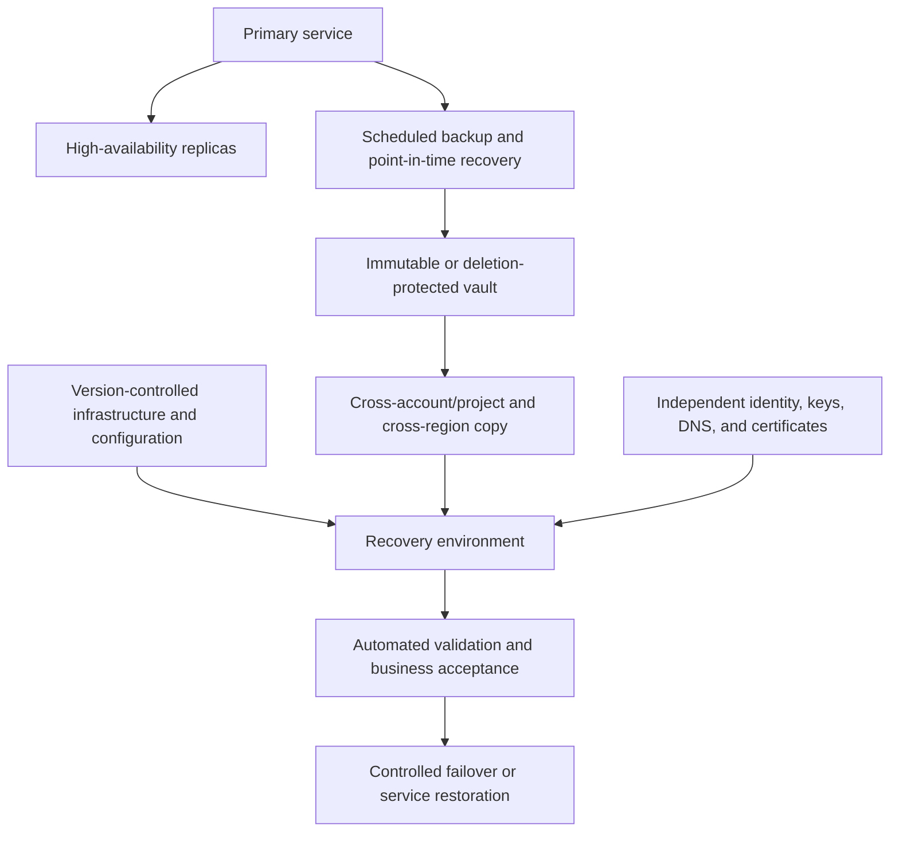

# 备份、恢复和弹性标准

## 目的

该标准定义了在意外删除、损坏、基础设施故障、区域中断、身份泄露、勒索软件或恶意管理操作后保护数据和恢复云服务的最低控制。

高可用性、备份和灾难恢复是不同的控制。复制可以快速重现腐败；备份可以保留数据，但不能恢复完整的服务；如果身份、DNS、密钥或部署系统不可用，多区域架构可能会失败。弹性 MUST 解决完整的依赖链。

## 规范语言

关键字 **MUST**、**MUST NOT**、**REQUIRED**、**SHOULD**、**SHOULD NOT** 和 **MAY** 是规范性的：

- **MUST / MUST NOT**：对于范围内的平台和工作负载是强制性的。
- **SHOULD / SHOULD NOT**：预期，除非基于风险的例外情况得到批准。
- **MAY**：可选，根据工作负载需求选择。

当云提供商功能无法直接实现需求时，实现 MUST 提供等效控制并在架构决策记录（ADR）中记录等效性。

## 弹性原则

1. **业务目标驱动设计。** 恢复时间目标 (RTO)、恢复点目标 (RPO) 和最大可容忍中断 MUST 得到服务和数据所有者的批准。
2. **恢复是一项经过测试的功能。** 没有成功恢复测试的备份未经证实。
3. **独立的故障域。** 恢复副本和管理 MUST 可防止主环境受到损害。
4. **自动化可重复恢复。** 基础设施、配置、身份、DNS、密钥和应用部署 MUST 可通过受控自动化进行恢复。
5. **设计优雅的降级。** 并非每个依赖项都需要完整的主动-主动架构。
6. **练习现实场景。** MUST 测试包括相关的数据损坏、凭证丢失、区域损坏和恶意删除。

## 强制性要求

|要求 |控制语句|最低限度的证据|
|---|---|---|
| `SBP-11-REQ-001` |每项生产服务 MUST 有经过批准的业务影响分析或同等关键性评估。 | BIA 日志记录|
| `SBP-11-REQ-002` |服务和数据所有者 MUST 为每个关键数据集和服务层定义 RTO、RPO、保留和恢复范围。 |恢复要求|
| `SBP-11-REQ-003` |备份 MUST 通过最低权限访问实现自动化、监控、加密和保护。 |备份策略和作业结果|
| `SBP-11-REQ-004` |关键备份 MUST 与主要管理凭据隔离，SHOULD 使用不变性或删除保护。 |访问模型和不变性配置 |
| `SBP-11-REQ-005` |备份副本 MUST 根据风险跨越适当的账户/项目/订阅/隔间、区域、地区和提供商故障域。 |备份拓扑|
| `SBP-11-REQ-006` | 备份成功 MUST 受到监控；丢失或部分备份 MUST 生成可运维的告警。 |告警和工作历史记录 |
| `SBP-11-REQ-007` |恢复测试 MUST 根据关键性进行频率，MUST 验证数据完整性和应用可用性。 |恢复报告|
| `SBP-11-REQ-008` |恢复操作手册 MUST 包括身份、密钥、机密、网络、DNS、证书、数据、应用、可观测性和验证步骤。 |操作手册审查|
| `SBP-11-REQ-009` |恢复所需的基础设施和平台配置 MUST 存储在版本控制中并可重复部署。 | IaC 仓库和测试 |
| `SBP-11-REQ-010` |区域或可用区级弹性 MUST 根据服务目标和已记录在案的故障模式分析选择。 |架构决策 |
| `SBP-11-REQ-011` |数据复制和故障转移机制 MUST 定义一致性、滞后、脑裂预防和故障恢复行为。 |设计及测试报告 |
| `SBP-11-REQ-012` |记录恢复依赖项和排序 MUST，包括外部 SaaS 和本地依赖项。 |依赖关系图|
| `SBP-11-REQ-013` |备份保留和合法保留 MUST 符合数据分类、日志记录要求和删除义务。 |保留策略 |
| `SBP-11-REQ-014` |恢复练习 MUST 记录实际 RTO/RPO 绩效、缺陷、所有者和修复日期。 |演练报告|
| `SBP-11-REQ-015` |网络恢复计划 MUST 解决身份泄露、密钥泄露、恶意删除和受污染的备份问题。 |网络恢复演习|
| `SBP-11-REQ-016` |停用 MUST 删除过时的备份计划并应用批准的数据保留和销毁程序。 |退役日志记录|

## 弹性和恢复模型

## 详细执行标准

### 服务等级

企业 MUST 定义弹性层。一个典型的模型是：

|等级 |业务影响 |设计期望|
|---|---|---|
| 0 级 |企业控制平面或安全关键|独立恢复管理、频繁演练、多故障域设计 |
| 1 级 |重大客户或收入影响|自动备份、经过测试的区域恢复或合理的替代方案、严格监控 |
| 2 级 |重要的内部服务|在支持的情况下测试备份/恢复和区域恢复能力 |
|第 3 级 |低影响或可更换 |从代码重建；仅在数据价值需要时才备份|

确切的 RTO 和 RPO 值 MUST 经过业务批准，而不是笼统地照搬本标准。

### 备份设计

备份范围 MUST 涵盖数据库、对象/文件数据、所需磁盘、配置、允许导出的证书、应用状态以及重建所需的元数据。如果提供商快照与生产共享相同的账户和删除权限，则仅使用提供商快照 MAY 不足。

稳健的策略 SHOULD 在不同的故障域上维护多个副本，其中至少一个副本受到保护，不会被例行修改或删除。设计 MUST 验证备份完整性和可恢复性，而不仅仅是作业完成情况。

### 恢复测试

恢复测试 MUST 使用隔离环境并 MUST 验证：

- 备份选择和授权；
- 解密和密钥可用性；
- 数据的一致性和完整性；
- 应用启动；
- 身份与机密集成；
- DNS 和网络访问；
- 可观测性和告警；和
- 业务验收标准。

测试 MAY 使用非常大的系统的代表性子集，但全面恢复能力 MUST 以与风险成比例的间隔进行演示。

### 区域复原力

当提供商服务支持时，多区域部署 SHOULD 成为需要高可用性的服务的基准。多区域架构 MUST 因业务目标而合理，因为它增加了成本、数据一致性复杂性、部署复杂性和操作故障模式。

### 故障回切和恢复后

在权限、数据方向、DNS、队列、计划作业、可观测性和支持所有权明确之前，故障转移才完成。故障恢复 MUST 进行规划和测试；即席反向复制可以覆盖幸存的数据集。

## 多云实施映射

|能力|Azure|AWS | GCP |OCI |
|---|---|---|---|---|
|备份服务| Azure Backup/Recovery Services vault/service-native PITR | AWS Backup/service-native PITR |Backup and DR Service/service-native backups| OCI Backup services/Recovery Service/service-native backups|
|跨境副本 |跨区域恢复/复制和单独的订阅控制 |跨账户、跨地域备份副本 |跨项目、跨区域策略|跨区域复制和单独的隔间/租户控制|
|不变性 |不可变 Vault/软删除/资源锁| Vault 锁/对象锁 |备份库控制/桶锁（如应用）|保留规则/对象不变性/受保护的恢复服务|
|区域流量故障转移 |Traffic Manager/Front Door| Route 53/Global Accelerator |Cloud DNS/Global Load Balancing|Traffic Management Steering Policies|
|恢复编排|Site Recovery、自动化、IaC |Elastic Disaster Recovery、Step Functions、IaC |备份和灾难恢复、编排、IaC |Full Stack Disaster Recovery，Resource Manager|

提供商产品是实施示例，而不是规范要求的豁免。当满足相同的控制目标时，MAY 使用等效服务。

## 验证

|测量 |目标或解释 |
|---|---|
|备份成功率|在所需的窗口内成功保护对象。 |
|恢复成功率|已完成的恢复测试符合完整性和可用性标准。 |
|测量的 RTO/RPO |演练结果与批准的目标进行比较。 |
|未受保护的关键资产| Tier 0/1 数据没有合规的备份或恢复路径；目标为零。 |
|恢复缺陷年龄|打开修复日期之后的练习结果。 |

## 采用清单

- [ ] 对服务进行分类并批准 RTO/RPO。
- [ ] 自动加密监控备份。
- [ ] 分离并保护恢复管理。
- [ ] 对关键副本使用不变性或删除保护。
- [ ] 将恢复基础架构和配置存储为代码。
- [ ] 记录所有恢复依赖项和顺序。
- [ ] 测试恢复、区域恢复和网络恢复场景。
- [ ] 度量实际目标并修复缺陷。
- [ ] 计划故障恢复和数据权限转换。

## 保障性证据

证据 MUST 可根据企业日志保留计划进行复制和保留。可接受的证据包括：

- 版本控制的配置和策略；
- 流水线日志和批准记录；
- 策略评估结果；
- 配置快照或清单导出；
- 测试和恢复报告；
- 带有查询定义的仪表板；和
- 批准的 ADR 和例外日志记录。

当机器可读证据可用时，仅 SHOULD NOT 屏幕截图可被视为主要证据。

## 治理、例外和执行

云卓越中心负责该标准。平台工程、安全性、可靠性、应用、数据和 FinOps 团队负责在其范围内实施控制。

例外情况 MUST 满足以下条件：

1. 识别未满足的需求 ID；
2. 描述业务合理性和量化风险；
3. 定义补偿性控制；
4. 指定一名负责任的所有者；
5. 包含不超过180天的有效期；和
6. 经控制所有者和相关风险主管部门批准。

过期的例外是不合规的。自动策略检查 SHOULD 阻止新的不合规部署。现有不合规项 MUST 通过修复积压、负责人和截止日期进行跟踪。

## 审核周期
本文件 MUST 至少每年审查一次，并且在云提供商能力、监管义务、企业风险承受能力或运营模式发生重大变化后进行审查。更改 MUST 保留需求标识符，而底层控制意图保持不变。

## 相关主题

- [CI/CD 流水线与发布控制标准](ci-cd-pipeline-and-release-control-standard.md)
- [云安全和零信任标准](cloud-security-and-zero-trust-standard.md)
- [数据平台弹性、备份和灾难恢复标准](../data-ai-integration/dai-data-platform-resilience-backup-and-disaster-recovery.md)

## 参考文档

- [NIST SP 800-34 Rev. 1：应急计划指南](https://csrc.nist.gov/pubs/sp/800/34/r1/upd1/final)
- [Azure Well-Architected Framework：可靠性](https://learn.microsoft.com/azure/well-architected/reliability/)
- [AWS Well-Architected Framework：可靠性](https://docs.aws.amazon.com/wellarchitected/latest/reliability-pillar/welcome.html)
- [GCP Well-Architected Framework：可靠性](https://cloud.google.com/architecture/framework/reliability)
- [OCI Full Stack Disaster Recovery](https://docs.oracle.com/en-us/iaas/disaster-recovery/index.html)
- [Microsoft Azure Well-Architected Framework](https://learn.microsoft.com/azure/well-architected/)
- [AWS Well-Architected Framework](https://docs.aws.amazon.com/wellarchitected/latest/framework/welcome.html)
- [GCP Well-Architected Framework](https://cloud.google.com/architecture/framework)
- [OCI Cloud Adoption Framework](https://docs.oracle.com/en-us/iaas/Content/cloud-adoption-framework/home.htm)
