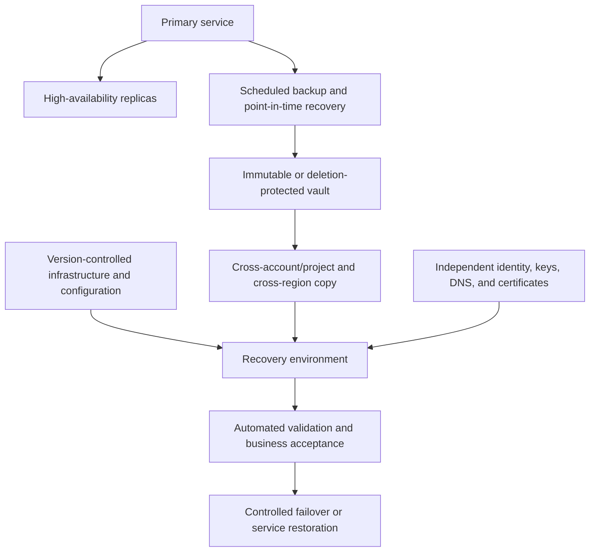

# Backup, Recovery, and Resilience Standard

## Purpose

This standard defines the minimum controls for protecting data and restoring cloud services after accidental deletion, corruption, infrastructure failure, regional disruption, identity compromise, ransomware, or malicious administrative action.

High availability, backup, and disaster recovery are different controls. Replication can rapidly reproduce corruption; backup can preserve data but not restore a complete service; multi-region architecture can fail if identity, DNS, keys, or deployment systems are unavailable. Resilience MUST address the complete dependency chain.

## Normative language

The key words **MUST**, **MUST NOT**, **REQUIRED**, **SHOULD**, **SHOULD NOT**, and **MAY** are normative:

- **MUST / MUST NOT**: mandatory for in-scope platforms and workloads.
- **SHOULD / SHOULD NOT**: expected unless a documented risk-based exception is approved.
- **MAY**: optional and selected according to workload requirements.

Where a cloud-provider feature cannot implement a requirement directly, the implementation MUST provide an equivalent control and record the equivalence in the architecture decision record (ADR).

## Resilience principles

1. **Business objectives drive design.** Recovery time objective (RTO), recovery point objective (RPO), and maximum tolerable outage MUST be approved by service and data owners.
2. **Recovery is a tested capability.** A backup without a successful restore test is unproven.
3. **Separate failure domains.** Recovery copies and administration MUST resist compromise of the primary environment.
4. **Automate repeatable recovery.** Infrastructure, configuration, identity, DNS, keys, and application deployment MUST be recoverable through controlled automation.
5. **Design graceful degradation.** Not every dependency requires full active-active architecture.
6. **Exercise realistic scenarios.** Tests MUST include data corruption, credential loss, regional impairment, and malicious deletion as relevant.

## Mandatory requirements

| Requirement | Control statement | Minimum evidence |
|---|---|---|
| `SBP-11-REQ-001` | Every production service MUST have an approved business impact analysis or equivalent criticality assessment. | BIA record |
| `SBP-11-REQ-002` | Service and data owners MUST define RTO, RPO, retention, and recovery scope for each critical data set and service tier. | Recovery requirements |
| `SBP-11-REQ-003` | Backups MUST be automated, monitored, encrypted, and protected by least-privilege access. | Backup policy and job results |
| `SBP-11-REQ-004` | Critical backups MUST be isolated from primary administrative credentials and SHOULD use immutability or deletion protection. | Access model and immutability configuration |
| `SBP-11-REQ-005` | Backup copies MUST span appropriate account/project/subscription/compartment, zone, region, and provider failure domains according to risk. | Backup topology |
| `SBP-11-REQ-006` | Backup success MUST be monitored; missed or partial backups MUST generate actionable alerts. | Alert and job history |
| `SBP-11-REQ-007` | Restore tests MUST occur at a frequency based on criticality and MUST validate data integrity and application usability. | Restore report |
| `SBP-11-REQ-008` | Recovery runbooks MUST include identity, keys, secrets, network, DNS, certificates, data, application, observability, and validation steps. | Runbook review |
| `SBP-11-REQ-009` | Infrastructure and platform configuration required for recovery MUST be stored in version control and reproducibly deployable. | IaC repository and test |
| `SBP-11-REQ-010` | Regional or zonal resilience MUST be selected from service objectives and documented failure-mode analysis. | Architecture decision |
| `SBP-11-REQ-011` | Data replication and failover mechanisms MUST define consistency, lag, split-brain prevention, and failback behavior. | Design and test report |
| `SBP-11-REQ-012` | Recovery dependencies and sequencing MUST be documented, including external SaaS and on-premises dependencies. | Dependency map |
| `SBP-11-REQ-013` | Backup retention and legal hold MUST align with data classification, records requirements, and deletion obligations. | Retention policy |
| `SBP-11-REQ-014` | Recovery exercises MUST record actual RTO/RPO performance, defects, owners, and remediation dates. | Exercise report |
| `SBP-11-REQ-015` | Cyber-recovery plans MUST address identity compromise, key compromise, malicious deletion, and contaminated backups. | Cyber-recovery exercise |
| `SBP-11-REQ-016` | Decommissioning MUST remove obsolete backup schedules and apply approved data-retention and destruction procedures. | Decommission record |

## Resilience and recovery model

## Detailed implementation standard

### Service tiers

The enterprise MUST define resilience tiers. A typical model is:

| Tier | Business impact | Design expectation |
|---|---|---|
| Tier 0 | Enterprise control plane or safety-critical | Independent recovery administration, frequent exercises, multi-failure-domain design |
| Tier 1 | Material customer or revenue impact | Automated backups, tested regional recovery or justified alternative, strict monitoring |
| Tier 2 | Important internal service | Tested backup/restore and zonal resilience where supported |
| Tier 3 | Low-impact or replaceable | Rebuild from code; backup only when data value requires it |

Exact RTO and RPO values MUST be business-approved rather than copied generically from this standard.

### Backup design

Backup scope MUST cover databases, object/file data, disks where needed, configuration, certificates where export is permitted, application state, and metadata required to rebuild. Provider snapshots alone MAY be insufficient if they share the same account and deletion authority as production.

A robust strategy SHOULD maintain multiple copies on different failure domains, with at least one copy protected from routine modification or deletion. The design MUST verify backup integrity and recoverability, not merely job completion.

### Restore testing

Restore tests MUST use isolated environments and MUST verify:

- backup selection and authorization;
- decryption and key availability;
- data consistency and integrity;
- application startup;
- identity and secret integration;
- DNS and network access;
- observability and alerting; and
- business acceptance criteria.

Tests MAY use representative subsets for very large systems, but full-scale recovery capability MUST be demonstrated at an interval proportionate to risk.

### Regional resilience

Multi-zone deployment SHOULD be the baseline for services requiring high availability when the provider service supports it. Multi-region architecture MUST be justified by business objectives because it increases cost, data consistency complexity, deployment complexity, and operational failure modes.

### Failback and post-recovery

Failover is not complete until authority, data direction, DNS, queues, scheduled jobs, observability, and support ownership are clear. Failback MUST be planned and tested; ad hoc reverse replication can overwrite the surviving data set.

## Multi-cloud implementation mapping

| Capability | Azure | AWS | GCP | OCI |
|---|---|---|---|---|
| Backup service | Azure Backup / Recovery Services vault / service-native PITR | AWS Backup / service-native PITR | Backup and DR Service / service-native backups | OCI Backup services / Recovery Service / service-native backups |
| Cross-boundary copy | Cross-region restore/copy and separate subscription controls | Cross-account and cross-region backup copies | Cross-project and cross-region strategies | Cross-region copy and separate compartment/tenancy controls |
| Immutability | Immutable vaults / soft delete / resource locks | Vault Lock / Object Lock | Backup vault controls / Bucket Lock where applicable | Retention rules / object immutability / protected recovery services |
| Regional traffic failover | Traffic Manager / Front Door | Route 53 / Global Accelerator | Cloud DNS / global load balancing | Traffic Management Steering Policies |
| Recovery orchestration | Site Recovery, Automation, IaC | Elastic Disaster Recovery, Step Functions, IaC | Backup and DR, orchestration, IaC | Full Stack Disaster Recovery, Resource Manager |

Provider products are implementation examples, not exemptions from the normative requirements. Equivalent services MAY be used when they satisfy the same control objective.

## Validation

| Measure | Target or interpretation |
|---|---|
| Backup success rate | Successful protected objects within required window. |
| Restore success rate | Completed restore tests meeting integrity and usability criteria. |
| Measured RTO/RPO | Exercise results compared with approved objectives. |
| Unprotected critical assets | Tier 0/1 data without compliant backup or recovery path; target zero. |
| Recovery defect age | Open exercise findings past remediation date. |

## Adoption checklist

- [ ] Classify services and approve RTO/RPO.
- [ ] Automate encrypted monitored backups.
- [ ] Separate and protect recovery administration.
- [ ] Use immutability or deletion protection for critical copies.
- [ ] Store recovery infrastructure and configuration as code.
- [ ] Document all recovery dependencies and sequence.
- [ ] Test restores, regional recovery, and cyber-recovery scenarios.
- [ ] Measure actual objectives and remediate defects.
- [ ] Plan failback and data-authority transitions.

## Assurance evidence

Evidence MUST be reproducible and retained according to the enterprise records schedule. Acceptable evidence includes:

- version-controlled configuration and policy;
- pipeline logs and approval records;
- policy evaluation results;
- configuration snapshots or inventory exports;
- test and recovery reports;
- dashboards with query definitions; and
- approved ADRs and exception records.

Screenshots alone SHOULD NOT be treated as primary evidence when machine-readable evidence is available.

## Governance, exceptions, and enforcement

The Cloud Center of Excellence owns this standard. Platform engineering, security, reliability, application, data, and FinOps teams are accountable for implementing controls within their scope.

Exceptions MUST:

1. identify the unmet requirement ID;
2. describe business justification and quantified risk;
3. define compensating controls;
4. name an accountable owner;
5. include an expiry date not exceeding 180 days; and
6. be approved by the control owner and the relevant risk authority.

Expired exceptions are non-compliant. Automated policy checks SHOULD block new non-compliant deployments. Existing non-compliance MUST be tracked through a remediation backlog with owners and due dates.

## Review cycle

This document MUST be reviewed at least annually and after a material change to cloud-provider capabilities, regulatory obligations, enterprise risk tolerance, or the operating model. Changes MUST preserve requirement identifiers where the underlying control intent remains unchanged.

## Related topics

- [CI/CD Pipeline and Release-Control Standard](ci-cd-pipeline-and-release-control-standard.md)
- [Cloud Security and Zero-Trust Standard](cloud-security-and-zero-trust-standard.md)
- [Data Platform Resilience, Backup, and Disaster Recovery Standard](../data-ai-integration/dai-data-platform-resilience-backup-and-disaster-recovery.md)

## References

- [NIST SP 800-34 Rev. 1: Contingency Planning Guide](https://csrc.nist.gov/pubs/sp/800/34/r1/upd1/final)
- [Azure Well-Architected Framework: Reliability](https://learn.microsoft.com/azure/well-architected/reliability/)
- [AWS Well-Architected Framework: Reliability](https://docs.aws.amazon.com/wellarchitected/latest/reliability-pillar/welcome.html)
- [GCP Well-Architected Framework: Reliability](https://cloud.google.com/architecture/framework/reliability)
- [OCI Full Stack Disaster Recovery](https://docs.oracle.com/en-us/iaas/disaster-recovery/index.html)
- [Microsoft Azure Well-Architected Framework](https://learn.microsoft.com/azure/well-architected/)
- [AWS Well-Architected Framework](https://docs.aws.amazon.com/wellarchitected/latest/framework/welcome.html)
- [GCP Well-Architected Framework](https://cloud.google.com/architecture/framework)
- [OCI Cloud Adoption Framework](https://docs.oracle.com/en-us/iaas/Content/cloud-adoption-framework/home.htm)
