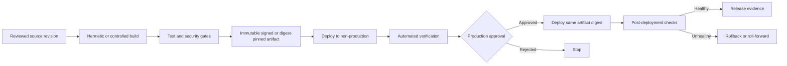

# CI/CD 流水线与发布控制标准

## 目的

该标准定义了持续集成、持续交付和发布晋级的强制控制。当发布改变生产行为时，它应用于应用代码、基础设施即代码、策略、数据平台配置、机器学习资产、容器镜像、包和文档。

流水线是一种特权生产系统。它的身份、运行器、配置、依赖项和制品 MUST 与其部署的工作负载具有相同的严格性。

## 规范语言

关键字 **MUST**、**MUST NOT**、**REQUIRED**、**SHOULD**、**SHOULD NOT** 和 **MAY** 是规范性的：

- **MUST / MUST NOT**：对于范围内的平台和工作负载是强制性的。
- **SHOULD / SHOULD NOT**：预期，除非基于风险的例外情况得到批准。
- **MAY**：可选，根据工作负载需求选择。

当云提供商功能无法直接实现需求时，实现 MUST 提供等效控制并在架构决策记录（ADR）中记录等效性。

## 交付原则

1. **构建一次，升级相同的制品。** 环境 MUST NOT 收到同一版本的独立重建的二进制文件。
2. **不受信任的输入无法控制受信任的部署。** 来自不受信任上下文的拉取请求代码 MUST NOT 访问生产机密或身份。
3. **每个版本都有归属。** 源代码、构建、测试、批准、制品摘要、部署身份和结果 MUST 记录。
4. **策略和安全是流水线阶段。** 它们不是手动的事后想法。
5. **生产权限分离。** 仅凭代码作者身份 MUST NOT 授予高风险系统单方面生产部署能力。
6. **回滚是经过设计和测试的。** 没有可行的恢复路径的发布过程是不完整的。

## 强制性要求

|要求 |控制语句|最低限度的证据|
|---|---|---|
| `SBP-08-REQ-001` |默认分支和发布标签 MUST 受到保护，免受未经授权的修改。 |仓库保护设置 |
| `SBP-08-REQ-002` |流水线 MUST 使用经过审查的、版本控制的定义；生产逻辑 MUST NOT 依赖于未经审查的仅 UI 脚本。 |流水线源文件|
| `SBP-08-REQ-003` |第三方流水线 Action、任务和镜像 MUST 固定到不可变版本或摘要并获取批准。 |依赖清单 |
| `SBP-08-REQ-004` | CI MUST 在发布前运行所需的测试、安全扫描、依赖性检查、机密扫描和策略检查。 |所需检查结果 |
| `SBP-08-REQ-005` |制品 MUST 是不可变的、内容可寻址或摘要可验证的，并存储在批准的制品仓库中。 |制品仓库元数据 |
| `SBP-08-REQ-006` |同一制品摘要 MUST 跨环境晋级；禁止按环境重建。 |晋级清单 |
| `SBP-08-REQ-007` |生产部署 MUST 使用短期工作负载身份和最低权限。 |联合与角色策略 |
| `SBP-08-REQ-008` |不受信任的拉取请求工作流程 MUST NOT 接收生产凭证或对受保护制品仓库的写入访问权限。 |工作流权限测试|
| `SBP-08-REQ-009` |生产版本 MUST 强制实施与风险成比例的环境保护和批准。 |环境设置及审批日志记录|
| `SBP-08-REQ-010` |高风险版本 MUST 实现作者和审批者之间的职责分离。 |PR 及发布参与者日志记录|
| `SBP-08-REQ-011` |基础设施部署 MUST 保留经过审查的计划或变更集并识别破坏性操作。 |计划制品和批准|
| `SBP-08-REQ-012` |发布日志 MUST 包括源修订、制品摘要、测试结果、批准、目标、开始/结束时间和结果。 |部署清单 |
| `SBP-08-REQ-013` |回滚、前滚和数据库/数据迁移策略 MUST 记录并在生产服务中测试。 |运行手册和练习结果|
| `SBP-08-REQ-014` |紧急部署 MUST 设置时间限制、记录并在事件发生后进行审查。 |紧急变更记录|
| `SBP-08-REQ-015` |改变信任、凭证、批准、签名或生产目标的流水线变更 MUST 接受安全或平台所有者审查。 |代码所有者/审查记录 |
| `SBP-08-REQ-016` |生产部署 SHOULD 生成制品来源证明和软件物料清单。 |认证和 SBOM |

## 受控释放流程

## 详细执行标准

### 触发和信任模型

每个流水线 MUST 记录可信触发器。来自分叉、外部贡献者、拉取请求、评论或用户提供参数的事件 MUST 被视为不受信任。执行未经审查代码的工作流程 MUST NOT 有权访问受保护的机密、生产身份或可写入的仓库令牌。

支持手动调度 MAY，但 MUST 验证目标、制品、参与者授权和变更记录。应避免自由格式的生产目标输入。

### 构建和依赖控制

构建环境 SHOULD 是短暂的。依赖项 MUST 被固定和扫描。在支持的情况下，包管理器锁定文件 MUST 被提交。下载的工具和制品 SHOULD 进行校验和验证。当关键安全或策略检查无法运行时，流水线 MUST 故障安全关闭，除非记录了紧急异常。

### 制品管理

制品 MUST 在发布后是不可变的。为了方便起见，提供诸如 `latest` MAY 之类的可变标签，但 MUST NOT 作为部署依据。部署 MUST 使用摘要或不可变版本。

晋级元数据 MUST 将制品绑定到源修订、构建工作流程、测试和批准。制品保留 MUST 支持回滚和审计要求。

###环境晋级

开发和测试环境 MAY 在检查成功后自动部署。生产发布控制 MUST 反映服务的关键性和合规性。批准者 MUST 有足够的上下文：变更摘要、风险、测试结果、安全结果、计划/变更集、迁移影响和回滚限制。

### 部署安全

渐进式交付 SHOULD 用于面向客户或高风险系统：金丝雀发布、环形发布、蓝/绿发布、流量分割或功能开关。健康门 MUST 使用服务级别指标而不仅仅是流程状态。当回滚可能损坏数据时，自动回滚 MUST 被禁用；在这些情况下，需要明确的前滚策略。

## 多云实施映射

|能力|Azure|AWS | GCP |OCI |
|---|---|---|---|---|
|流水线平台| Azure Pipelines / GitHub Actions | CodePipeline/CodeBuild/GitHub Actions |Cloud Build/Cloud Deploy/GitHub Actions | OCI DevOps / GitHub Actions |
|制品仓库 | Azure Artifacts / ACR |CodeArtifact / ECR / S3 |Artifact Registry |制品/容器注册表/对象存储|
|工作负载身份联合|内部工作负载身份联合| IAM OIDC 联盟和 STS |工作负载身份联合| OCI principals 或批准的 OIDC 模式 |
|环境保护 | Azure DevOps 批准/检查或 GitHub 环境 | CodePipeline 批准/GitHub 环境 |Cloud Deploy 批准 | OCI DevOps 审批阶段 |
|策略与安全| Defender for DevOps、Azure Policy、批准的扫描仪 | CodeGuru、Inspector、Config、批准的扫描仪 |Binary Authorization、SCC、策略工具 |漏洞扫描、Cloud Guard、策略工具|

提供商产品是实施示例，而不是规范要求的豁免。满足相同控制目标时 MAY 使用等效服务。

## 验证
|测量 |目标或解释 |
|---|---|
|部署频率|按服务和环境进行跟踪；不以牺牲安全为代价进行优化。 |
|变更准备时间|投入生产所用的时间。 |
|变更失败率|导致回滚、热修复或事件的部署。 |
|平均恢复时间|从失败发布中恢复所需的时间。 |
|未经验证的制品部署 |没有不可变摘要或来源证明的生产部署；目标为零。 |

## 采用清单

- [ ] 保护默认分支、标签和流水线定义。
- [ ] 对可信和不可信触发器进行建模。
- [ ] 固定第三方 Action、任务、镜像和依赖项。
- [ ] 使用临时构建和无凭据云身份验证。
- [ ] 使用摘要存储不可变的制品。
- [ ] 跨环境晋级相同的制品。
- [ ] 要求基于风险的生产批准和职责分离。
- [ ] 采集发布证据、SBOM 和来源（如果适用）。
- [ ] 测试回滚、前滚和渐进式交付。

## 保障性证据

证据 MUST 可根据企业日志保留计划进行复制和保留。可接受的证据包括：

- 版本控制的配置和策略；
- 流水线日志和批准记录；
- 策略评估结果；
- 配置快照或清单导出；
- 测试和恢复报告；
- 带有查询定义的仪表板；和
- 批准的 ADR 和例外日志记录。

当机器可读证据可用时，仅 SHOULD NOT 屏幕截图可被视为主要证据。

## 治理、例外和执行

云卓越中心负责该标准。平台工程、安全性、可靠性、应用、数据和 FinOps 团队负责在其范围内实施控制。

例外情况 MUST 满足以下条件：

1. 识别未满足的需求 ID；
2. 描述业务合理性和量化风险；
3. 定义补偿性控制；
4. 指定一名负责任的所有者；
5. 包含不超过180天的有效期；和
6. 经控制所有者和相关风险主管部门批准。

过期的例外是不合规的。自动策略检查 SHOULD 阻止新的不合规部署。现有不合规项 MUST 通过修复积压、负责人和截止日期进行跟踪。

## 审核周期

本文件 MUST 至少每年审查一次，并且在云提供商能力、监管义务、企业风险承受能力或运营模式发生重大变化后进行审查。更改 MUST 保留需求标识符，而底层控制意图保持不变。

## 相关主题

- [共享运行器安全与清理标准](shared-runner-security-and-hygiene-standard.md)
- [云安全和零信任标准](cloud-security-and-zero-trust-standard.md)
- [基础设施作为代码工程标准](infrastructure-as-code-engineering-standard.md)

## 参考文档

- [NIST 安全软件开发框架，SP 800-218](https://csrc.nist.gov/pubs/sp/800/218/final)
- [SLSA 软件制品的供应链级别](https://slsa.dev/)
- [GitHub Actions 安全强化](https://docs.github.com/actions/security-guides/security-hardening-for-github-actions)
- [OpenSSF 记分卡](https://securityscorecards.dev/)
- [Microsoft Azure Well-Architected Framework](https://learn.microsoft.com/azure/well-architected/)
- [AWS Well-Architected Framework](https://docs.aws.amazon.com/wellarchitected/latest/framework/welcome.html)
- [GCP Well-Architected Framework](https://cloud.google.com/architecture/framework)
- [OCI Cloud Adoption Framework](https://docs.oracle.com/en-us/iaas/Content/cloud-adoption-framework/home.htm)
