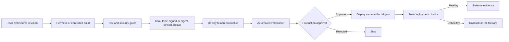

# CI/CD Pipeline and Release-Control Standard

## Purpose

This standard defines mandatory controls for continuous integration, continuous delivery, and release promotion. It applies to application code, infrastructure as code, policy, data-platform configuration, machine-learning assets, container images, packages, and documentation when publication changes production behavior.

A pipeline is a privileged production system. Its identities, runners, configuration, dependencies, and artifacts MUST receive the same rigor as the workload it deploys.

## Normative language

The key words **MUST**, **MUST NOT**, **REQUIRED**, **SHOULD**, **SHOULD NOT**, and **MAY** are normative:

- **MUST / MUST NOT**: mandatory for in-scope platforms and workloads.
- **SHOULD / SHOULD NOT**: expected unless a documented risk-based exception is approved.
- **MAY**: optional and selected according to workload requirements.

Where a cloud-provider feature cannot implement a requirement directly, the implementation MUST provide an equivalent control and record the equivalence in the architecture decision record (ADR).

## Delivery principles

1. **Build once, promote the same artifact.** Environments MUST not receive independently rebuilt binaries for the same release.
2. **Untrusted input cannot control trusted deployment.** Pull-request code from untrusted contexts MUST not access production secrets or identities.
3. **Every release is attributable.** Source, build, tests, approvals, artifact digests, deployment identity, and result MUST be recorded.
4. **Policy and security are pipeline stages.** They are not manual afterthoughts.
5. **Production authority is separated.** Code authorship alone MUST NOT grant unilateral production deployment capability for high-risk systems.
6. **Rollback is designed and tested.** A release process without a viable recovery path is incomplete.

## Mandatory requirements

| Requirement | Control statement | Minimum evidence |
|---|---|---|
| `SBP-08-REQ-001` | Default branches and release tags MUST be protected against unauthorized modification. | Repository protection settings |
| `SBP-08-REQ-002` | Pipelines MUST use reviewed, version-controlled definitions; production logic MUST NOT depend on unreviewed UI-only scripts. | Pipeline source file |
| `SBP-08-REQ-003` | Third-party pipeline actions, tasks, and images MUST be pinned to immutable versions or digests and approved. | Dependency inventory |
| `SBP-08-REQ-004` | CI MUST run required tests, security scans, dependency checks, secret scanning, and policy checks before release. | Required check results |
| `SBP-08-REQ-005` | Artifacts MUST be immutable, content-addressable or digest-verifiable, and stored in an approved artifact repository. | Artifact repository metadata |
| `SBP-08-REQ-006` | The same artifact digest MUST be promoted across environments; rebuilding per environment is prohibited. | Promotion manifest |
| `SBP-08-REQ-007` | Production deployments MUST use short-lived workload identity and least-privilege permissions. | Federation and role policy |
| `SBP-08-REQ-008` | Untrusted pull-request workflows MUST NOT receive production credentials or write access to protected artifact repositories. | Workflow permission test |
| `SBP-08-REQ-009` | Production releases MUST enforce environment protection and approvals proportional to risk. | Environment settings and approval record |
| `SBP-08-REQ-010` | High-risk releases MUST implement separation of duties between author and approver. | PR and release actor records |
| `SBP-08-REQ-011` | Infrastructure deployments MUST retain reviewed plans or change sets and identify destructive operations. | Plan artifact and approval |
| `SBP-08-REQ-012` | Release records MUST include source revision, artifact digest, test results, approvals, target, start/end time, and outcome. | Deployment manifest |
| `SBP-08-REQ-013` | Rollback, roll-forward, and database/data migration strategies MUST be documented and tested for production services. | Runbook and exercise result |
| `SBP-08-REQ-014` | Emergency deployments MUST be time-bounded, logged, and reviewed after the event. | Emergency change record |
| `SBP-08-REQ-015` | Pipeline changes that alter trust, credentials, approvals, signing, or production targets MUST receive security or platform-owner review. | CODEOWNERS/review record |
| `SBP-08-REQ-016` | Production deployments SHOULD generate provenance attestations and software bills of materials for material artifacts. | Attestation and SBOM |

## Controlled release flow

## Detailed implementation standard

### Trigger and trust model

Each pipeline MUST document trusted triggers. Events from forks, external contributors, pull requests, comments, or user-supplied parameters MUST be treated as untrusted. A workflow that executes unreviewed code MUST not have access to protected secrets, production identities, or write-capable repository tokens.

Manual dispatch MAY be supported but MUST validate target, artifact, actor authorization, and change record. Free-form production target input SHOULD be avoided.

### Build and dependency controls

Build environments SHOULD be ephemeral. Dependencies MUST be pinned and scanned. Package-manager lock files MUST be committed where supported. Downloaded tools and artifacts SHOULD be checksum-verified. Pipelines MUST fail closed when critical security or policy checks cannot run, unless an emergency exception is recorded.

### Artifact management

Artifacts MUST be immutable after publication. Mutable tags such as `latest` MAY be provided for convenience but MUST NOT be the deployment authority. Deployment MUST use a digest or immutable version.

Promotion metadata MUST bind the artifact to source revision, build workflow, tests, and approvals. Artifact retention MUST support rollback and audit requirements.

### Environment promotion

Development and test environments MAY deploy automatically after successful checks. Production release controls MUST reflect service criticality and compliance. Approvers MUST have sufficient context: change summary, risk, test results, security findings, plan/change set, migration effects, and rollback limits.

### Deployment safety

Progressive delivery SHOULD be used for customer-facing or high-risk systems: canary, ring, blue/green, traffic splitting, or feature flags. Health gates MUST use service-level indicators rather than only process status. Automatic rollback MUST be disabled when rollback could corrupt data; in those cases, an explicit roll-forward strategy is required.

## Multi-cloud implementation mapping

| Capability | Azure | AWS | GCP | OCI |
|---|---|---|---|---|
| Pipeline platform | Azure Pipelines / GitHub Actions | CodePipeline/CodeBuild / GitHub Actions | Cloud Build/Deploy / GitHub Actions | OCI DevOps / GitHub Actions |
| Artifact repository | Azure Artifacts / ACR | CodeArtifact / ECR / S3 | Artifact Registry | Artifacts / Container Registry / Object Storage |
| Workload federation | Entra workload identity federation | IAM OIDC federation and STS | Workload Identity Federation | OCI principals or approved OIDC pattern |
| Environment protection | Azure DevOps approvals/checks or GitHub environments | CodePipeline approvals / GitHub environments | Cloud Deploy approvals | OCI DevOps approval stages |
| Policy and security | Defender for DevOps, Azure Policy, approved scanners | CodeGuru, Inspector, Config, approved scanners | Binary Authorization, SCC, policy tools | Vulnerability Scanning, Cloud Guard, policy tools |

Provider products are implementation examples, not exemptions from the normative requirements. Equivalent services MAY be used when they satisfy the same control objective.

## Validation

| Measure | Target or interpretation |
|---|---|
| Deployment frequency | Tracked by service and environment; not optimized at the expense of safety. |
| Lead time for change | Commit-to-production elapsed time. |
| Change failure rate | Deployments causing rollback, hotfix, or incident. |
| Mean time to restore | Time to recover from a failed release. |
| Unverified artifact deployments | Production deployments without an immutable digest or provenance; target zero. |

## Adoption checklist

- [ ] Protect default branches, tags, and pipeline definitions.
- [ ] Model trusted and untrusted triggers.
- [ ] Pin third-party actions, tasks, images, and dependencies.
- [ ] Use ephemeral builds and secretless cloud authentication.
- [ ] Store immutable artifacts with digests.
- [ ] Promote the same artifact across environments.
- [ ] Require risk-based production approvals and separation of duties.
- [ ] Capture release evidence, SBOM, and provenance where applicable.
- [ ] Test rollback, roll-forward, and progressive delivery.

## Assurance evidence

Evidence MUST be reproducible and retained according to the enterprise records schedule. Acceptable evidence includes:

- version-controlled configuration and policy;
- pipeline logs and approval records;
- policy evaluation results;
- configuration snapshots or inventory exports;
- test and recovery reports;
- dashboards with query definitions; and
- approved ADRs and exception records.

Screenshots alone SHOULD NOT be treated as primary evidence when machine-readable evidence is available.

## Governance, exceptions, and enforcement

The Cloud Center of Excellence owns this standard. Platform engineering, security, reliability, application, data, and FinOps teams are accountable for implementing controls within their scope.

Exceptions MUST:

1. identify the unmet requirement ID;
2. describe business justification and quantified risk;
3. define compensating controls;
4. name an accountable owner;
5. include an expiry date not exceeding 180 days; and
6. be approved by the control owner and the relevant risk authority.

Expired exceptions are non-compliant. Automated policy checks SHOULD block new non-compliant deployments. Existing non-compliance MUST be tracked through a remediation backlog with owners and due dates.

## Review cycle

This document MUST be reviewed at least annually and after a material change to cloud-provider capabilities, regulatory obligations, enterprise risk tolerance, or the operating model. Changes MUST preserve requirement identifiers where the underlying control intent remains unchanged.

## Related topics

- [Shared Runner Security and Hygiene Standard](shared-runner-security-and-hygiene-standard.md)
- [Cloud Security and Zero-Trust Standard](cloud-security-and-zero-trust-standard.md)
- [Infrastructure as Code Engineering Standard](infrastructure-as-code-engineering-standard.md)

## References

- [NIST Secure Software Development Framework, SP 800-218](https://csrc.nist.gov/pubs/sp/800/218/final)
- [SLSA Supply-chain Levels for Software Artifacts](https://slsa.dev/)
- [GitHub Actions security hardening](https://docs.github.com/actions/security-guides/security-hardening-for-github-actions)
- [OpenSSF Scorecard](https://securityscorecards.dev/)
- [Microsoft Azure Well-Architected Framework](https://learn.microsoft.com/azure/well-architected/)
- [AWS Well-Architected Framework](https://docs.aws.amazon.com/wellarchitected/latest/framework/welcome.html)
- [GCP Well-Architected Framework](https://cloud.google.com/architecture/framework)
- [OCI Cloud Adoption Framework](https://docs.oracle.com/en-us/iaas/Content/cloud-adoption-framework/home.htm)
