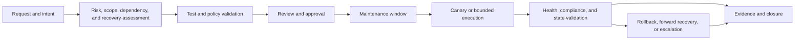

# 云变更、补丁和配置管理标准

## 目的

该标准定义了更改云资源、操作系统和应用配置、平台版本、安全设置和维护状态的最低控制。它应用于人为变更、基础设施即代码、CI/CD、Ansible、提供商原生自动化、计划修补、紧急操作和配置漂移修复。

目标是通过可靠的恢复来控制变更，而不是行政延迟。合规变更是可归因的、授权的、有界的、经过测试的、可监控的、可逆的或可恢复的，并且与权威的事实来源一致。

## 规范语言

关键字 **MUST**、**MUST NOT**、**REQUIRED**、**SHOULD**、**SHOULD NOT** 和 **MAY** 是规范性的：

- **MUST / MUST NOT**：对于范围内的平台和工作负载是强制性的。
- **SHOULD / SHOULD NOT**：预期，除非基于风险的例外情况得到批准。
- **MAY**：当适合服务和环境时可选。

如果提供商无法直接实施要求，则 MUST 记录等效控制及其所有者、证据和剩余风险。

## 范围和控制目标

该标准涵盖：

- 云资源和策略变化；
- Terraform、OpenTofu、Bicep、CloudFormation 和等效 IaC；
- Ansible 和其他配置管理系统；
- 操作系统、代理、镜像、扩展和包修补；
- Kubernetes 节点、插件和平台升级；
- 漏洞修复和安全配置更改；
- 定期维护和紧急更换；和
- 漂移检测、协调、导入和状态修复。

控制目标是：

1. 每项变更都有负责人和预期结果。
2. 生产变更使用经批准的身份和路径。
3. 在执行之前了解范围、依赖性、爆炸半径和恢复情况。
4. 通过适当的界限来测试和晋级变革。
5. 执行后验证健康和合规性。
6. 证据支持审计、事件响应和未来的协调。
7. 紧急变更是正常路径的临时例外，而不是并行操作模式。

## 强制性要求

|要求 |控制语句|最低限度的证据|
|---|---|---|
| `SBP-14-REQ-001` |每个生产变更 MUST 有明确的责任人、受影响的服务、环境、风险分类和预期结果。 |变更记录或发布元数据 |
| `SBP-14-REQ-002` | 生产变更 MUST 源自版本控制、经过审查的配置或批准的紧急变更。 |拉取请求、发布或紧急日志记录 |
| `SBP-14-REQ-003` |每个资源和管理字段的权威所有者 MUST 记录下来。 |所有权地图或架构记录|
| `SBP-14-REQ-004` |两个自动化系统 MUST NOT 管理相同的资源字段，无需明确的、经过测试的所有权契约。 |工具边界和测试证据|
| `SBP-14-REQ-005` |更改 MUST 使用具有 MFA、联合、托管身份或短期凭据（如果支持）的最低权限人类和自动化身份。 |角色映射和访问审查|
| `SBP-14-REQ-006` |机密 MUST NOT 存储在源代码、计划、日志、清单、票据或广泛可读的制品中。 |机密扫描和提供商配置 |
| `SBP-14-REQ-007` | 变更 MUST 定义目标范围、并发性、故障阈值、维护窗口以及多个资源可能受到影响时的停止条件。 |计划、工作流程或操作手册 |
| `SBP-14-REQ-008` |高风险变更 MUST 使用预检查、金丝雀或串行波、变更后运行状况门以及回滚或前向恢复路径。 |工作流程和验证输出 |
| `SBP-14-REQ-009` |基础设施变更 MUST 在应用前进行规划和审查；批准的计划制品 MUST 用于应用变更的依据。 |保存计划并应用证据 |
| `SBP-14-REQ-010` |配置更改 MUST 使用幂等、经过测试的模块或任务，MUST 记录基于命令的异常。 |代码、测试和审查 |
| `SBP-14-REQ-011` |补丁和漏洞操作 MUST 优先考虑暴露性、可利用性、关键性和恢复风险，而不仅仅是严重性。 |风险决策和修复SLA |
| `SBP-14-REQ-012` |评估和补丁覆盖范围 MUST 区分合规、不合规、未评估、无法访问、不应用和例外资产。 |合规报告|
| `SBP-14-REQ-013` |维护 MUST 保留所需的服务容量、仲裁、副本、备份和恢复路径。 |预检查和拓扑证据 |
| `SBP-14-REQ-014` | 变更执行后 MUST 验证有效状态和服务健康状况；仅仅指挥成功是不够的。 |事后检查和监测证据|
| `SBP-14-REQ-015` |失败或超时的突变 MUST 在重试确定完成范围和当前状态之前进行协调。 |工作状态及恢复日志记录 |
| `SBP-14-REQ-016` |漂移检测 MUST 默认情况下是非变异的，MUST 在修复之前对接受、恢复、所有权冲突或调查进行分类。 |漂移报告和决定|
| `SBP-14-REQ-017` |资源导入、状态移动、状态移除和所有权迁移 MUST 使用备份、审查和操作后计划验证。 |陈述证据和计划|
| `SBP-14-REQ-018` |紧急变更 MUST 记录发起人、原因、范围、行动、证据以及编纂或恢复变更的后续行动。 |事件和紧急情况日志记录|
| `SBP-14-REQ-019` |例外情况 范围 MUST 窄，由风险负责人批准，尽可能进行补偿，并有到期日和审查日期。 |异常日志记录|
| `SBP-14-REQ-020` |变更、补丁、配置、漏洞及漂移证据 MUST 根据服务和监管要求保留。 |保留策略和审计日志|
| `SBP-14-REQ-021` |生产变更路径 MUST 生成针对故障、健康门违规、逾期修复和过期异常的通知和告警。 |告警和通知测试|
| `SBP-14-REQ-022` |平台和服务所有者 MUST 审查重复出现的故障、重复漂移、补丁异常和紧急更改，以采取预防措施。 |回顾会议纪要和行动项目|

## 更改分类

使用影响、可逆性、爆炸半径、数据或身份效果以及操作时间对变更进行分类：

|班级 |示例|最小控制|
|---|---|---|
|低风险 |非生产标签或仪表板更改 |审查代码、自动验证、所有者 |
|标准|使用经过测试的运行手册进行常规补丁或模块升级 |批准窗口、预检查、有限执行、证据 |
|高风险|身份、网络、加密、公开曝光、数据库、集群或平台升级 |架构/变更审查、金丝雀、批准、健康门、恢复 |
|紧急|立即采取行动减少主动中断或安全风险|事件授权、有限行动、证据、后续行动 |

不得使用分类来绕过控制。当范围扩大或共享平台受到影响时，低风险变更可能会变成高风险。

## 改变生命周期

每次过渡都应该有明确的所有者和进行所需证据的日志记录。当证据不完整或健康门未知时，可以暂停更改。

## 配置管理控制

配置管理 MUST 满足以下要求：

- 定义期望的状态和非目标；
- 使用支持的模块、API 或幂等任务；
- 验证输入、目标所有权、平台和维护窗口；
- 在经批准的提供商处保守机密；
- 使用有界目标范围和并发性；
- 保留之前和之后的值而不暴露敏感数据；
- 证明幂等性或日志记录有意的一次性行为；
- 处理部分故障并安全重启；和
- 将紧急或手动更改协调到代码中。

不禁止命令、shell、门户和手动更改，但它们需要记录原因、成功条件和后续路径。由 IaC 或配置管理管理的生产基础设施的手动更改将被视为漂移，直到被接受和编码。

## 补丁和漏洞控制

补丁管理必须包括评估、优先级排序、测试、调度、执行、验证和报告。服务所有者必须定义维护影响和恢复路径。安全必须提供威胁和可利用性背景；操作必须提供安全的实施路径。

不要因为安装程序返回成功而关闭漏洞。验证有效运行版本、重新启动要求、服务运行状况以及重新扫描或等效证据。无法修补的漏洞需要补偿性控制、负责任的风险所有者、到期和监控。

## 基础设施即代码和漂移控制

IaC 流水线 MUST 将计划与应用分开，保护状态，防止并发突变，并保留已批准的计划制品。仅刷新操作是提供程序漂移的默认调查方法。

导入和状态更改需要：

- 确认资源身份和所有权；
- 目的地配置和模块地址；
- 备份和状态锁定控制；
- 审查不相关的变更和替换；
- 操作后的无操作计划或明确变更计划；和
- 最终所有者的证据和真相来源。

仅允许对经过测试的回滚或前向恢复的低风险、有界、幂等更改进行自动漂移修复。

## 紧急变更

当延迟造成更大的中断、安全或数据风险时，允许紧急更改。发起人必须记录：

- 事件或安全参考；
- 无法正常批准的原因；
- 准确的目标范围和身份；
- 使用的命令、自动化或配置；
- 预检查和监控结果；
- 健康和客户影响验证；和
- 编纂、回滚或审查行动。

紧急访问必须有时间限制并受到监控。后续人员必须将更改合并到权威的事实来源中，安全地恢复它，或者批准记录在案的异常。

## 证据和指标

生产证据 MUST 包括：

- 请求、发布、事件或更改 ID；
- 源版本、计划或配置版本以及运行时间；
- 发起者、批准者、自动化身份和目标范围；
- 开始、结束、结果和变更资源；
- 预检查、健康门、后检查和恢复输出；
- 漏洞、补丁、策略或漂移状态（如果适用）；和
- 例外和后续参考。

曲目：

- 变更提前期和变更失败率；
- 失败、回滚和紧急变更；
- 补丁合规性和漏洞年龄；
- 漂移持续时间和按负责人统计的重复漂移；
- 未知或无法达到的评估范围；
- 维护成功和重启失败；
- 例外年龄和有效期合规性；和
- 从变革引发的事件中恢复的平均时间。

## 验证

- [ ] 该标准映射到平台、服务和提供商程序。
- [ ] 生产变更路径保留计划、身份、范围、运行状况和恢复证据。
- [ ] 补丁、漏洞、配置和漂移报告区分未知状态和合规性。
- [ ] 已执行高风险和紧急工作流程。
- [ ] 导入和状态修复程序包括备份、批准和计划后验证。
- [ ] 例外范围狭窄，具有补偿控制，由明确负责人负责，并设有到期时间。
- [ ] 反复出现的故障和紧急变更会导致采取预防措施。
- [ ] 访问审查确认普通操作员无法绕过批准的变更路径。

## 相关主题

- [基础设施即代码工程标准](../infrastructure-as-code/iac-infrastructure-as-code-engineering-standards.md)
- [Ansible 自动化工程标准](ansible-automation-engineering-standard.md)
- [日志、监控和可观测性标准](logging-monitoring-and-observability-standard.md)
- [云平台补丁、漏洞及维护操作](../operations-reliability-finops/patch-vulnerability-and-maintenance-operations-for-cloud-platforms.md)
- [如何检测和修复基础设施和配置漂移](../how-to-guides/how-to-detect-and-remediate-infrastructure-and-configuration-drift.md)
- [如何实现策略即代码](../how-to-guides/how-to-implement-policy-as-code.md)

## 参考文档

- [Azure Update Manager 概述](https://learn.microsoft.com/en-us/azure/update-manager/overview)
- [使用 Terraform 管理资源漂移](https://developer.hashicorp.com/terraform/tutorials/state/resource-drift)
- [Azure Resource Graph 变化分析](https://learn.microsoft.com/en-us/azure/governance/resource-graph/changes/get-resource-changes)
- [Microsoft Cloud Adoption Framework Landing Zone](https://learn.microsoft.com/en-us/azure/cloud-adoption-framework/ready/landing-zone/)
