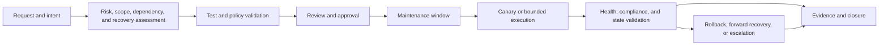

# Cloud Change, Patch, and Configuration Management Standard

## Purpose

This standard defines the minimum controls for changing cloud resources, operating-system and application configuration, platform versions, security settings, and maintenance state. It applies to human changes, infrastructure as code, CI/CD, Ansible, provider-native automation, scheduled patching, emergency operations, and configuration drift remediation.

The objective is controlled change with reliable recovery, not administrative delay. A compliant change is attributable, authorized, bounded, tested, observable, reversible or recoverable, and reconciled into the authoritative source of truth.

## Normative language

The key words **MUST**, **MUST NOT**, **REQUIRED**, **SHOULD**, **SHOULD NOT**, and **MAY** are normative:

- **MUST / MUST NOT**: mandatory for in-scope platforms and workloads.
- **SHOULD / SHOULD NOT**: expected unless a documented risk-based exception is approved.
- **MAY**: optional when appropriate to the service and environment.

Where a provider cannot implement a requirement directly, an equivalent control MUST be documented with its owner, evidence, and residual risk.

## Scope and control objectives

This standard covers:

- cloud resource and policy changes;
- Terraform, OpenTofu, Bicep, CloudFormation, and equivalent IaC;
- Ansible and other configuration-management systems;
- operating-system, agent, image, extension, and package patching;
- Kubernetes node, add-on, and platform upgrades;
- vulnerability remediation and security configuration changes;
- scheduled maintenance and emergency change; and
- drift detection, reconciliation, import, and state repair.

The control objectives are:

1. Every change has an accountable owner and an intended outcome.
2. Production mutation uses an approved identity and path.
3. Scope, dependencies, blast radius, and recovery are known before execution.
4. Changes are tested and promoted through appropriate boundaries.
5. Health and compliance are validated after execution.
6. Evidence supports audit, incident response, and future reconciliation.
7. Emergency changes are temporary exceptions to the normal path, not a parallel operating model.

## Mandatory requirements

| Requirement | Control statement | Minimum evidence |
|---|---|---|
| `SBP-14-REQ-001` | Every production change MUST have an accountable owner, affected service, environment, risk classification, and intended outcome. | Change record or release metadata |
| `SBP-14-REQ-002` | Production changes MUST originate from version-controlled, reviewed configuration or an approved emergency change. | Pull request, release, or emergency record |
| `SBP-14-REQ-003` | The authoritative owner for each resource and managed field MUST be documented. | Ownership map or architecture record |
| `SBP-14-REQ-004` | Two automation systems MUST NOT manage the same resource field without an explicit, tested ownership contract. | Tool boundary and test evidence |
| `SBP-14-REQ-005` | Changes MUST use least-privilege human and automation identities with MFA, federation, managed identity, or short-lived credentials where supported. | Role mapping and access review |
| `SBP-14-REQ-006` | Secrets MUST NOT be stored in source code, plans, logs, inventories, tickets, or broadly readable artifacts. | Secret scan and provider configuration |
| `SBP-14-REQ-007` | A change MUST define target scope, concurrency, failure threshold, maintenance window, and stop condition when multiple resources may be affected. | Plan, workflow, or runbook |
| `SBP-14-REQ-008` | High-risk changes MUST use prechecks, canary or serial waves, post-change health gates, and a rollback or forward-recovery path. | Workflow and validation output |
| `SBP-14-REQ-009` | Infrastructure changes MUST be planned and reviewed before apply; the approved plan artifact MUST be the one applied. | Saved plan and apply evidence |
| `SBP-14-REQ-010` | Configuration changes MUST use idempotent, tested modules or tasks and MUST document command-based exceptions. | Code, tests, and review |
| `SBP-14-REQ-011` | Patch and vulnerability operations MUST prioritize exposure, exploitability, criticality, and recovery risk, not severity alone. | Risk decision and remediation SLA |
| `SBP-14-REQ-012` | Assessment and patch coverage MUST distinguish compliant, noncompliant, not assessed, unreachable, not applicable, and excepted assets. | Compliance report |
| `SBP-14-REQ-013` | Maintenance MUST preserve required service capacity, quorum, replicas, backup, and recovery paths. | Precheck and topology evidence |
| `SBP-14-REQ-014` | A change MUST validate effective state and service health after execution; command success alone is insufficient. | Postcheck and monitoring evidence |
| `SBP-14-REQ-015` | Failed or timed-out mutation MUST be reconciled before retry to determine completed scope and current state. | Job status and recovery record |
| `SBP-14-REQ-016` | Drift detection MUST be non-mutating by default and MUST classify acceptance, reversion, ownership conflict, or investigation before remediation. | Drift report and decision |
| `SBP-14-REQ-017` | Resource import, state move, state removal, and ownership transfer MUST use backup, review, and post-operation plan validation. | State evidence and plan |
| `SBP-14-REQ-018` | Emergency changes MUST record initiator, reason, scope, actions, evidence, and a follow-up to codify or revert the change. | Incident and emergency record |
| `SBP-14-REQ-019` | Exceptions MUST be narrow, approved by the risk owner, compensating where possible, and have an expiry and review date. | Exception record |
| `SBP-14-REQ-020` | Change, patch, configuration, vulnerability, and drift evidence MUST be retained according to service and regulatory requirements. | Retention policy and audit record |
| `SBP-14-REQ-021` | Production change paths MUST generate notifications and alerts for failure, health-gate breach, overdue remediation, and expired exception. | Alert and notification test |
| `SBP-14-REQ-022` | Platform and service owners MUST review recurring failures, repeated drift, patch exceptions, and emergency changes for preventive action. | Review minutes and action items |

## Change classification

Classify a change using impact, reversibility, blast radius, data or identity effect, and operational timing:

| Class | Example | Minimum control |
|---|---|---|
| Low risk | Non-production tag or dashboard change | Reviewed code, automated validation, owner |
| Standard | Routine patch or module upgrade with tested runbook | Approved window, prechecks, bounded execution, evidence |
| High risk | Identity, network, encryption, public exposure, database, cluster, or platform upgrade | Architecture/change review, canary, approval, health gate, recovery |
| Emergency | Immediate action to reduce active outage or security exposure | Incident authorization, bounded action, evidence, follow-up |

Classification must not be used to bypass controls. A low-risk change can become high risk when its scope expands or when a shared platform is affected.

## Change lifecycle

Every transition should have a clear owner and a record of the evidence needed to proceed. A change can be paused when evidence is incomplete or a health gate is unknown.

## Configuration management controls

Configuration management MUST:

- define the desired state and non-goals;
- use supported modules, APIs, or idempotent tasks;
- validate inputs, target ownership, platform, and maintenance window;
- keep secrets in an approved provider;
- use bounded target scope and concurrency;
- preserve before and after values without exposing sensitive data;
- prove idempotency or document intentional one-time behavior;
- handle partial failure and restart safely; and
- reconcile emergency or manual changes into code.

Command, shell, portal, and manual changes are not prohibited, but they require a documented reason, a success condition, and a follow-up path. Manual changes to production infrastructure that is managed by IaC or configuration management MUST be treated as drift until accepted and codified.

## Patch and vulnerability controls

Patch management must include assessment, prioritization, testing, scheduling, execution, validation, and reporting. The service owner must define the maintenance impact and recovery path. Security must provide threat and exploitability context; operations must provide a safe implementation path.

Do not close a vulnerability because an installer returned success. Verify the effective running version, restart requirement, service health, and rescan or equivalent evidence. An unpatchable vulnerability requires a compensating control, accountable risk owner, expiry, and monitoring.

## Infrastructure as code and drift controls

IaC pipelines MUST separate plan from apply, protect state, prevent concurrent mutation, and preserve the approved plan artifact. Refresh-only operations are the default investigation method for provider drift.

Import and state changes require:

- confirmed resource identity and ownership;
- destination configuration and module address;
- backup and state-locking controls;
- review of unrelated changes and replacements;
- post-operation no-op or intentional-change plan; and
- evidence of the final owner and source of truth.

Automatic drift remediation is permitted only for low-risk, bounded, idempotent changes with tested rollback or forward recovery.

## Emergency change

Emergency change is allowed when delay creates greater outage, security, safety, or data risk. The initiator must record:

- incident or security reference;
- reason normal approval was not possible;
- exact target scope and identity;
- commands, automation, or configuration used;
- prechecks and observed result;
- health and customer-impact validation; and
- codification, rollback, or review action.

Emergency access must be time-bound and monitored. The follow-up must either merge the change into the authoritative source of truth, revert it safely, or approve a documented exception.

## Evidence and metrics

Production evidence MUST include:

- request, release, incident, or change ID;
- source revision, plan or configuration version, and runtime;
- initiator, approver, automation identity, and target scope;
- start, end, result, and changed resources;
- precheck, health-gate, postcheck, and recovery output;
- vulnerability, patch, policy, or drift status where applicable; and
- exception and follow-up references.

Track:

- change lead time and change-failure rate;
- failed, rolled-back, and emergency changes;
- patch compliance and vulnerability age;
- drift age and repeated drift by owner;
- unknown or unreachable assessment coverage;
- maintenance success and restart failure;
- exception age and expiry compliance; and
- mean time to recover from change-induced incidents.

## Validation

- [ ] The standard is mapped to platform, service, and provider procedures.
- [ ] Production change paths preserve plan, identity, scope, health, and recovery evidence.
- [ ] Patch, vulnerability, configuration, and drift reports distinguish unknown state from compliance.
- [ ] High-risk and emergency workflows have been exercised.
- [ ] Import and state-repair procedures include backup, approval, and post-plan validation.
- [ ] Exceptions are narrow, compensating, owned, and expiring.
- [ ] Recurring failures and emergency changes result in preventive action.
- [ ] Access reviews confirm that normal operators cannot bypass the approved change path.

## Related topics

- [Infrastructure as Code Engineering Standards](../infrastructure-as-code/iac-infrastructure-as-code-engineering-standards.md)
- [Ansible Automation Engineering Standard](ansible-automation-engineering-standard.md)
- [Logging, Monitoring, and Observability Standard](logging-monitoring-and-observability-standard.md)
- [Patch, Vulnerability, and Maintenance Operations for Cloud Platforms](../operations-reliability-finops/patch-vulnerability-and-maintenance-operations-for-cloud-platforms.md)
- [How to Detect and Remediate Infrastructure and Configuration Drift](../how-to-guides/how-to-detect-and-remediate-infrastructure-and-configuration-drift.md)
- [How to Implement policy-as-code](../how-to-guides/how-to-implement-policy-as-code.md)

## References

- [Azure Update Manager overview](https://learn.microsoft.com/en-us/azure/update-manager/overview)
- [Manage resource drift with Terraform](https://developer.hashicorp.com/terraform/tutorials/state/resource-drift)
- [Azure Resource Graph change analysis](https://learn.microsoft.com/en-us/azure/governance/resource-graph/changes/get-resource-changes)
- [Microsoft Cloud Adoption Framework landing zones](https://learn.microsoft.com/en-us/azure/cloud-adoption-framework/ready/landing-zone/)
