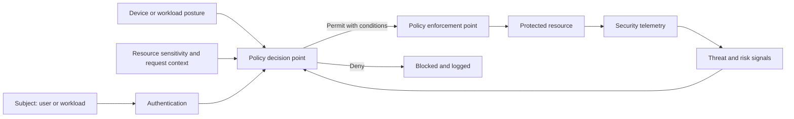

# 云安全和零信任标准

## 目的

该标准定义了云组织、账户、订阅、项目、隔间、平台和工作负载的强制性安全基线。它将零信任原则应用于人员访问、工作负载访问、网络通信、数据、软件供应链和运营。

零信任并不意味着“没有网络”。这意味着仅靠网络位置并不能建立信任。访问决策 MUST 评估身份、设备或工作负载上下文、请求的资源、策略和风险，并且 MUST 在所需的最短持续时间内授予所需的最低访问权限。

## 规范语言

关键字 **MUST**、**MUST NOT**、**REQUIRED**、**SHOULD**、**SHOULD NOT** 和 **MAY** 是规范性的：

- **MUST / MUST NOT**：对于范围内的平台和工作负载是强制性的。
- **SHOULD / SHOULD NOT**：预期，除非基于风险的例外情况得到批准。
- **MAY**：可选，根据工作负载需求选择。

当云提供商功能无法直接实现需求时，实现 MUST 提供等效控制并在架构决策记录（ADR）中记录等效性。

## 零信任原则

1. **显式验证。** 使用当前上下文对每个访问路径进行身份验证和授权。
2. **使用最低权限。** 限制身份、网络、数据和管理权限。
3. **假设违规。** 分段系统、保护恢复路径、收集证据并减少横向移动。
4. **通过分类保护数据。** 加密、访问、保留和监控 MUST 遵循数据敏感性。
5. **自动化护栏。** 高置信度控制首选预防策略；检测控制需要修复所有权。
6. **保护软件供应链。** 构建、依赖关系、制品和部署完整性是云安全的一部分。

## 强制性要求

|要求 |控制语句|最低限度的证据|
|---|---|---|
| `SBP-05-REQ-001` |云环境 MUST 使用集中式身份联合进行员工访问，并 MUST 使用强大的多因素身份验证。 |身份提供商和条件访问配置 |
| `SBP-05-REQ-002` | 常设特权访问 MUST 被最小化；管理访问 SHOULD 使用带有批准和记录在案的即时提升。 |特权访问报告|
| `SBP-05-REQ-003` |根、所有者或租户管理员身份 MUST 受到严格限制、监控并排除在日常操作之外。 |特权账户清单和告警|
| `SBP-05-REQ-004` |工作负载 MUST 使用托管或联邦身份和最低权限角色，而不是嵌入式凭据。 |工作负载身份清单 |
| `SBP-05-REQ-005` |使用批准的协议和密钥管理控制对数据 MUST 在传输过程中和静态时进行加密。 |配置及关键策略|
| `SBP-05-REQ-006` |互联网暴露 MUST 得到明确的合理性、清单、保护和持续测试。 |暴露清单、WAF/防火墙配置、扫描结果 |
| `SBP-05-REQ-007` |网络分段和私有访问 MUST 限制横向移动并隔离管理、生产和敏感数据路径。 |架构和有效规则|
| `SBP-05-REQ-008` |组织级策略 MUST 在可行的情况下强制执行区域、公共访问、加密、日志、身份和批准服务的基线。 |策略分配和合规报告|
| `SBP-05-REQ-009` |安全相关日志 MUST 得到集中处理、防止未经授权的修改并受到监控。 |日志路由和保留策略|
| `SBP-05-REQ-010` |漏洞和配置扫描 MUST 根据风险覆盖镜像、主机、依赖、IaC、云配置和暴露的服务。 |扫描覆盖范围和修复日志记录 |
| `SBP-05-REQ-011` |严重漏洞和主动利用的问题 MUST 遵循企业快速修复流程。 | SLA 报告和例外情况 |
| `SBP-05-REQ-012` |生产制品 MUST 源自批准的构建系统，并 SHOULD 经过签名或以其他方式进行完整性验证。 |制品来源证明和摘要 |
| `SBP-05-REQ-013` |机密和加密密钥 MUST 存储在经过批准的托管服务中，并具有轮换、访问日志记录和职责分离功能。 |Vault 清单和访问策略 |
| `SBP-05-REQ-014` |备份和恢复系统 MUST 受到与主系统相同的身份和勒索软件故障域的保护。 |恢复架构和访问分离|
| `SBP-05-REQ-015` |安全事件 MUST 测试针对身份泄露、数据泄露、恶意部署和云控制平面滥用的响应手册。 |演练报告和行动手册|
| `SBP-05-REQ-016` |减少安全控制的例外情况 MUST 定义补偿控制和明确的风险接受。 |批准的例外日志记录|

## 零信任访问模型

## 详细执行标准

### 组织和控制平面安全

云层次结构 MUST 将生产与实验分开，MUST 支持策略继承、计费责任和爆炸半径缩减。管理平面活动 MUST 记录。禁用日志、更改组织策略、修改身份联合、删除密钥或更改备份不可变性等高风险操作 MUST 生成告警。

区域和服务 MAY 根据数据驻留、可支持性、风险和批准的架构进行限制。拒绝策略 SHOULD 用于误报风险较低的控制。

### 数据保护

数据所有者 MUST 分配数据分类。加密密钥 SHOULD 对标准工作负载使用提供商管理的密钥；仅在监管、职责分离、撤销或外部密钥控制等要求证明增加的操作负担合理时，才使用客户管理的密钥。密钥删除保护和恢复控制 MUST 与数据关键性保持一致。

TLS 检查 MUST 进行风险评估。它 MUST NOT 默默破坏证书验证、双向 TLS、证书固定或提供商服务信任。异常和旁路 MUST 是明确的并受到监控。

### 曝光管理

每个公共端点 MUST 有所有者、业务目的、数据分类、批准的身份验证模型、保护控制集和预期寿命。管理接口 MUST NOT 公开，除非不存在可行的私有或代理访问模式并且例外情况得到批准。

公共应用 SHOULD 使用托管 DDoS 保护、Web 应用防火墙控制、速率限制、机器人程序或相关滥用保护以及持续的外部攻击面监控。

### 安全态势和漏洞管理

云安全态势管理结果 MUST 按严重性、可利用性、资产关键性和暴露程度进行标准化。没有风险优先级的大量发现并不是有效的控制。修复 SLA MUST 按风险定义并跟踪直至结束。

基础镜像和容器 MUST 来自批准的来源，定期接收补丁，并在可行的情况下进行重建而不是手动修复。除非明确接受风险，否则禁止在生产中使用不受支持的软件。

### 检测和响应

身份、控制平面、网络、数据访问、密钥管理和工作负载日志 MUST 提供集中检测。检测规则 MUST 有所有者、测试方法、操作手册、严重性和预期响应。没有可操作阈值的大容量告警 MUST 调整或删除。

## 多云实施映射

|能力|Azure|AWS | GCP |OCI |
|---|---|---|---|---|
|组织策略|Management Groups and Azure Policy |Organizations、SCPs、Config |Organization Policy、folders、projects |Compartments、Security Zones、Cloud Guard |
|员工身份| Microsoft Entra ID 和 Conditional Access | IAM Identity Center 和 external IdP |Cloud Identity / external IdP | OCI IAM Identity Domains / federation |
|安全态势|Cloud Guard |Security Hub 和 GuardDuty |Security Command Center|Cloud Guard|
|密钥管理| Key Vault / 托管 HSM | KMS / Cloud HSM |Cloud KMS/Cloud HSM |Vault/外部 KMS |
|网络保护 |Front Door 或 Application Gateway WAF； DDoS 防护 | CloudFront/ALB 与 WAF 和 Shield |Cloud Armor 和 Cloud Load Balancing| OCI WAF 和 DDoS 防护 |

提供商产品是实施示例，而不是规范要求的豁免。当满足相同的控制目标时，MAY 使用等效服务。

## 验证

|测量 |目标或解释 |
|---|---|
|特权常设访问 |持久性高特权任务的数量；目标最小值并不断减少。 |
|公开曝光盘点|具有所有者、用途和批准控制的公共端点的百分比；目标100%。 |
|关键发现年龄|是时候修复关键的可利用发现了。 |
|安全日志覆盖率|关键服务转发所需日志；目标100%。 |
|工作负载保密|使用托管/联邦身份而不是静态凭据的工作负载百分比。 |

## 采用清单

- [ ] 联合员工身份并要求 MFA。
- [ ] 实施即时特权访问。
- [ ] 执行组织级基线策略。
- [ ] 盘点并批准每个公共端点。
- [ ] 加密传输中和静态的数据。
- [ ] 集中安全日志和高风险告警。
- [ ] 扫描基础架构、镜像、依赖项和云状态。
- [ ] 保护密钥、机密、备份和恢复管理。
- [ ] 练习特定于云的事件 Playbook。

## 保障性证据

证据 MUST 可根据企业日志保留计划进行复制和保留。可接受的证据包括：

- 版本控制的配置和策略；
- 流水线日志和批准记录；
- 策略评估结果；
- 配置快照或清单导出；
- 测试和恢复报告；
- 带有查询定义的仪表板；和
- 批准的 ADR 和例外日志记录。

当机器可读证据可用时，仅 SHOULD NOT 屏幕截图可被视为主要证据。

## 治理、例外和执行

云卓越中心负责该标准。平台工程、安全性、可靠性、应用、数据和 FinOps 团队负责在其范围内实施控制。

例外情况 MUST 满足以下条件：

1. 识别未满足的需求 ID；
2. 描述业务合理性和量化风险；
3. 定义补偿性控制；
4. 指定一名负责任的所有者；
5. 包含不超过180天的有效期；和
6. 经控制所有者和相关风险主管部门批准。

过期的例外是不合规的。自动策略检查 SHOULD 阻止新的不合规部署。现有不合规项 MUST 通过修复积压、负责人和截止日期进行跟踪。

## 审核周期

本文件 MUST 至少每年审查一次，并且在云提供商能力、监管义务、企业风险承受能力或运营模式发生重大变化之后进行审查。更改 MUST 保留需求标识符，而底层控制意图保持不变。

## 相关主题
- [网络和私有连接标准](network-and-private-connectivity-standard.md)
- [CI/CD 流水线与发布控制标准](ci-cd-pipeline-and-release-control-standard.md)
- [仓库结构和文档标准](repository-structure-and-documentation-standard.md)

## 参考文档

- [NIST SP 800-207：零信任架构](https://csrc.nist.gov/pubs/sp/800/207/final)
- [NIST SP 800-207A：多云环境中云原生应用的零信任](https://csrc.nist.gov/pubs/sp/800/207/a/final)
- [NIST 网络安全框架 2.0](https://www.nist.gov/cyberframework)
- [NIST 安全软件开发框架，SP 800-218](https://csrc.nist.gov/pubs/sp/800/218/final)
- [Microsoft Azure Well-Architected Framework](https://learn.microsoft.com/azure/well-architected/)
- [AWS Well-Architected Framework](https://docs.aws.amazon.com/wellarchitected/latest/framework/welcome.html)
- [GCP Well-Architected Framework](https://cloud.google.com/architecture/framework)
- [OCI Cloud Adoption Framework](https://docs.oracle.com/en-us/iaas/Content/cloud-adoption-framework/home.htm)
