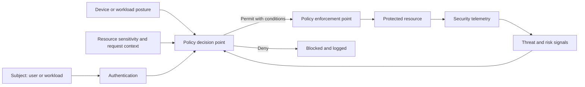

# Cloud Security and Zero-Trust Standard

## Purpose

This standard defines the mandatory security baseline for cloud organizations, accounts, subscriptions, projects, compartments, platforms, and workloads. It applies zero-trust principles to human access, workload access, network communication, data, software supply chains, and operations.

Zero trust does not mean “no network.” It means that network location alone does not establish trust. Access decisions MUST evaluate identity, device or workload context, requested resource, policy, and risk, and MUST grant the minimum required access for the minimum required duration.

## Normative language

The key words **MUST**, **MUST NOT**, **REQUIRED**, **SHOULD**, **SHOULD NOT**, and **MAY** are normative:

- **MUST / MUST NOT**: mandatory for in-scope platforms and workloads.
- **SHOULD / SHOULD NOT**: expected unless a documented risk-based exception is approved.
- **MAY**: optional and selected according to workload requirements.

Where a cloud-provider feature cannot implement a requirement directly, the implementation MUST provide an equivalent control and record the equivalence in the architecture decision record (ADR).

## Zero-trust principles

1. **Verify explicitly.** Authenticate and authorize every access path using current context.
2. **Use least privilege.** Limit identity, network, data, and administrative permissions.
3. **Assume breach.** Segment systems, protect recovery paths, collect evidence, and reduce lateral movement.
4. **Protect data by classification.** Encryption, access, retention, and monitoring MUST follow data sensitivity.
5. **Automate guardrails.** Preventive policy is preferred for high-confidence controls; detective controls require remediation ownership.
6. **Secure the software supply chain.** Build, dependency, artifact, and deployment integrity are part of cloud security.

## Mandatory requirements

| Requirement | Control statement | Minimum evidence |
|---|---|---|
| `SBP-05-REQ-001` | Cloud environments MUST use centralized identity federation for workforce access and MUST require strong multi-factor authentication. | Identity-provider and conditional-access configuration |
| `SBP-05-REQ-002` | Standing privileged access MUST be minimized; administrative access SHOULD use just-in-time elevation with approval and logging. | Privileged-access reports |
| `SBP-05-REQ-003` | Root, owner, or tenancy-administrator identities MUST be tightly restricted, monitored, and excluded from routine operations. | Privileged account inventory and alerts |
| `SBP-05-REQ-004` | Workloads MUST use managed or federated identities and least-privilege roles instead of embedded credentials. | Workload identity inventory |
| `SBP-05-REQ-005` | Data MUST be encrypted in transit and at rest using approved protocols and key-management controls. | Configuration and key policy |
| `SBP-05-REQ-006` | Internet exposure MUST be explicitly justified, inventoried, protected, and continuously tested. | Exposure inventory, WAF/firewall configuration, scan result |
| `SBP-05-REQ-007` | Network segmentation and private access MUST limit lateral movement and isolate management, production, and sensitive data paths. | Architecture and effective rules |
| `SBP-05-REQ-008` | Organization-level policy MUST enforce the baseline for regions, public access, encryption, logging, identity, and approved services where feasible. | Policy assignments and compliance report |
| `SBP-05-REQ-009` | Security-relevant logs MUST be centralized, protected against unauthorized modification, and monitored. | Log routing and retention policy |
| `SBP-05-REQ-010` | Vulnerability and configuration scanning MUST cover images, hosts, dependencies, IaC, cloud configuration, and exposed services according to risk. | Scan coverage and remediation records |
| `SBP-05-REQ-011` | Critical vulnerabilities and actively exploited issues MUST follow the enterprise expedited remediation process. | SLA report and exceptions |
| `SBP-05-REQ-012` | Production artifacts MUST originate from approved build systems and SHOULD be signed or otherwise integrity-verifiable. | Artifact provenance and digest |
| `SBP-05-REQ-013` | Secrets and cryptographic keys MUST be stored in approved managed services with rotation, access logging, and separation of duties. | Vault inventory and access policy |
| `SBP-05-REQ-014` | Backups and recovery systems MUST be protected from the same identity and ransomware failure domains as primary systems. | Recovery architecture and access separation |
| `SBP-05-REQ-015` | Security incidents MUST have tested response playbooks for identity compromise, data exposure, malicious deployment, and cloud control-plane abuse. | Exercise reports and playbooks |
| `SBP-05-REQ-016` | Exceptions that reduce security controls MUST define compensating controls and explicit risk acceptance. | Approved exception record |

## Zero-trust access model

## Detailed implementation standard

### Organization and control-plane security

Cloud hierarchy MUST separate production from experimentation and MUST support policy inheritance, billing accountability, and blast-radius reduction. Management-plane activity MUST be logged. High-risk actions such as disabling logging, changing organization policy, modifying identity federation, deleting keys, or changing backup immutability MUST generate alerts.

Regions and services MAY be restricted based on data residency, supportability, risk, and approved architecture. Deny policies SHOULD be used for controls with low false-positive risk.

### Data protection

Data owners MUST assign classification. Encryption keys SHOULD use provider-managed keys for standard workloads and customer-managed keys when regulatory, separation-of-duties, revocation, or external key-control requirements justify the added operational burden. Key deletion protection and recovery controls MUST align to data criticality.

TLS inspection MUST be risk-assessed. It MUST NOT silently break certificate validation, mutual TLS, certificate pinning, or provider service trust. Exceptions and bypasses MUST be explicit and monitored.

### Exposure management

Every public endpoint MUST have an owner, business purpose, data classification, approved authentication model, protective control set, and expected lifetime. Administrative interfaces MUST NOT be publicly exposed unless no viable private or brokered access pattern exists and an exception is approved.

Public applications SHOULD use managed DDoS protection, web application firewall controls, rate limiting, bot or abuse protection where relevant, and continuous external attack-surface monitoring.

### Security posture and vulnerability management

Cloud security posture management findings MUST be normalized by severity, exploitability, asset criticality, and exposure. A large finding count without risk prioritization is not an effective control. Remediation SLAs MUST be defined by risk and tracked to closure.

Base images and containers MUST come from approved sources, receive regular patches, and be rebuilt rather than manually repaired where practical. Unsupported software is prohibited in production unless explicitly risk-accepted.

### Detection and response

Identity, control-plane, network, data-access, key-management, and workload logs MUST feed centralized detection. Detection rules MUST have an owner, test method, runbook, severity, and expected response. High-volume alerts without actionable thresholds MUST be tuned or removed.

## Multi-cloud implementation mapping

| Capability | Azure | AWS | GCP | OCI |
|---|---|---|---|---|
| Organization policy | Management Groups and Azure Policy | Organizations, SCPs, Config | Organization Policy, folders, projects | Compartments, Security Zones, Cloud Guard |
| Workforce identity | Microsoft Entra ID and Conditional Access | IAM Identity Center and external IdP | Cloud Identity / external IdP | OCI IAM Identity Domains / federation |
| Security posture | Defender for Cloud | Security Hub and GuardDuty | Security Command Center | Cloud Guard |
| Key management | Key Vault / Managed HSM | KMS / CloudHSM | Cloud KMS / Cloud HSM | Vault / External KMS |
| Web protection | Front Door or Application Gateway WAF; DDoS Protection | CloudFront/ALB with WAF and Shield | Cloud Armor and Cloud Load Balancing | OCI WAF and DDoS protections |

Provider products are implementation examples, not exemptions from the normative requirements. Equivalent services MAY be used when they satisfy the same control objective.

## Validation

| Measure | Target or interpretation |
|---|---|
| Privileged standing access | Number of persistent highly privileged assignments; target minimum and decreasing. |
| Public exposure inventory | Percentage of public endpoints with owner, purpose, and approved controls; target 100%. |
| Critical finding age | Time to remediate critical exploitable findings. |
| Security log coverage | Critical services forwarding required logs; target 100%. |
| Workload secretlessness | Percentage of workloads using managed/federated identity instead of static credentials. |

## Adoption checklist

- [ ] Federate workforce identity and require MFA.
- [ ] Implement just-in-time privileged access.
- [ ] Enforce organization-level baseline policies.
- [ ] Inventory and approve every public endpoint.
- [ ] Encrypt data in transit and at rest.
- [ ] Centralize security logs and high-risk alerts.
- [ ] Scan infrastructure, images, dependencies, and cloud posture.
- [ ] Protect keys, secrets, backups, and recovery administration.
- [ ] Exercise cloud-specific incident playbooks.

## Assurance evidence

Evidence MUST be reproducible and retained according to the enterprise records schedule. Acceptable evidence includes:

- version-controlled configuration and policy;
- pipeline logs and approval records;
- policy evaluation results;
- configuration snapshots or inventory exports;
- test and recovery reports;
- dashboards with query definitions; and
- approved ADRs and exception records.

Screenshots alone SHOULD NOT be treated as primary evidence when machine-readable evidence is available.

## Governance, exceptions, and enforcement

The Cloud Center of Excellence owns this standard. Platform engineering, security, reliability, application, data, and FinOps teams are accountable for implementing controls within their scope.

Exceptions MUST:

1. identify the unmet requirement ID;
2. describe business justification and quantified risk;
3. define compensating controls;
4. name an accountable owner;
5. include an expiry date not exceeding 180 days; and
6. be approved by the control owner and the relevant risk authority.

Expired exceptions are non-compliant. Automated policy checks SHOULD block new non-compliant deployments. Existing non-compliance MUST be tracked through a remediation backlog with owners and due dates.

## Review cycle

This document MUST be reviewed at least annually and after a material change to cloud-provider capabilities, regulatory obligations, enterprise risk tolerance, or the operating model. Changes MUST preserve requirement identifiers where the underlying control intent remains unchanged.

## Related topics

- [Network and Private-Connectivity Standard](network-and-private-connectivity-standard.md)
- [CI/CD Pipeline and Release-Control Standard](ci-cd-pipeline-and-release-control-standard.md)
- [Repository Structure and Documentation Standard](repository-structure-and-documentation-standard.md)

## References

- [NIST SP 800-207: Zero Trust Architecture](https://csrc.nist.gov/pubs/sp/800/207/final)
- [NIST SP 800-207A: Zero Trust for Cloud-Native Applications in Multi-Cloud Environments](https://csrc.nist.gov/pubs/sp/800/207/a/final)
- [NIST Cybersecurity Framework 2.0](https://www.nist.gov/cyberframework)
- [NIST Secure Software Development Framework, SP 800-218](https://csrc.nist.gov/pubs/sp/800/218/final)
- [Microsoft Azure Well-Architected Framework](https://learn.microsoft.com/azure/well-architected/)
- [AWS Well-Architected Framework](https://docs.aws.amazon.com/wellarchitected/latest/framework/welcome.html)
- [GCP Well-Architected Framework](https://cloud.google.com/architecture/framework)
- [OCI Cloud Adoption Framework](https://docs.oracle.com/en-us/iaas/Content/cloud-adoption-framework/home.htm)
